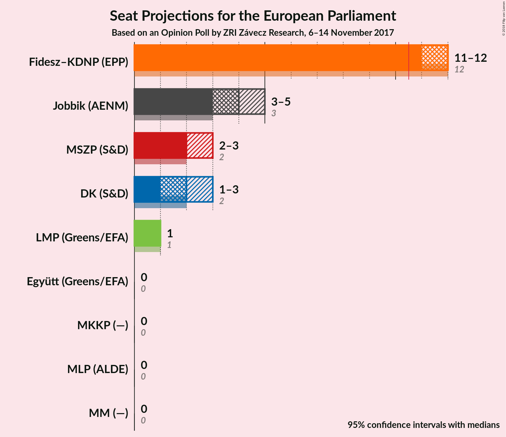

# Opinion Poll by ZRI Závecz Research, 6–14 November 2017

<a href="#voting-intentions">Voting Intentions</a> | <a href="#seats">Seats</a> | <a href="#coalitions">Coalitions</a> | <a href="#technical-information">Technical Information</a>

## Voting Intentions

### Confidence Intervals

| Party | Last Result | Poll Result | 80% Confidence Interval | 90% Confidence Interval | 95% Confidence Interval | 99% Confidence Interval |
|:-----:|:-----------:|:-----------:|:-----------------------:|:-----------------------:|:-----------------------:|:-----------------------:|
| Fidesz–KDNP (EPP) | 51.5% | 49.0% | 47.0–51.0% |46.4–51.6% |45.9–52.1% |44.9–53.1% |
| Jobbik (—) | N/A | 18.0% | N/A |N/A |N/A |N/A |
| MSZP (S&D) | 10.9% | 12.0% | 10.8–13.4% |10.4–13.8% |10.1–14.2% |9.6–14.9% |
| DK (S&D) | 9.8% | 10.0% | 8.9–11.3% |8.6–11.7% |8.3–12.0% |7.8–12.7% |
| LMP (Greens/EFA) | 5.0% | 6.0% | 5.1–7.1% |4.9–7.4% |4.7–7.7% |4.3–8.2% |
| MM (—) | 0.0% | 2.0% | 1.5–2.7% |1.4–2.9% |1.3–3.1% |1.1–3.4% |
| Együtt (Greens/EFA) | 7.2% | 1.0% | 0.7–1.5% |0.6–1.7% |0.5–1.8% |0.4–2.1% |
| MLP (ALDE) | 0.0% | 1.0% | 0.7–1.5% |0.6–1.7% |0.5–1.8% |0.4–2.1% |
| MKKP (—) | 0.0% | 1.0% | 0.7–1.5% |0.6–1.7% |0.5–1.8% |0.4–2.1% |

*Note:* The poll result column reflects the actual value used in the calculations. Published results may vary slightly, and in addition be rounded to fewer digits.

## Seats

### Confidence Intervals

| Party | Last Result | Median | 80% Confidence Interval | 90% Confidence Interval | 95% Confidence Interval | 99% Confidence Interval |
|:-----:|:-----------:|:------:|:-----------------------:|:-----------------------:|:-----------------------:|:-----------------------:|
| <a href="#fidesz–kdnp-(epp)">Fidesz–KDNP (EPP)</a> | 12 | 11 | 11–12 |11–12 |11–13 |11–13 |
| <a href="#jobbik-(—)">Jobbik (—)</a> | N/A | N/A | N/A |N/A |N/A |N/A |
| <a href="#mszp-(s&d)">MSZP (S&D)</a> | 2 | 3 | 2–3 |2–3 |2–3 |2–3 |
| <a href="#dk-(s&d)">DK (S&D)</a> | 2 | 2 | 2 |2 |2 |1–3 |
| <a href="#lmp-(greens/efa)">LMP (Greens/EFA)</a> | 1 | 1 | 1 |1 |1 |1 |
| <a href="#mm-(—)">MM (—)</a> | 0 | 0 | 0 |0 |0 |0 |
| <a href="#együtt-(greens/efa)">Együtt (Greens/EFA)</a> | 0 | 0 | 0 |0 |0 |0 |
| <a href="#mlp-(alde)">MLP (ALDE)</a> | 0 | 0 | 0 |0 |0 |0 |
| <a href="#mkkp-(—)">MKKP (—)</a> | 0 | 0 | 0 |0 |0 |0 |

