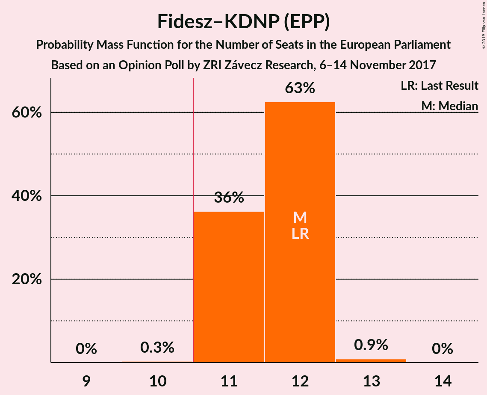

# Opinion Poll by ZRI Závecz Research, 6–14 November 2017

<a href="#voting-intentions">Voting Intentions</a> | <a href="#seats">Seats</a> | <a href="#coalitions">Coalitions</a> | <a href="#technical-information">Technical Information</a>

## Voting Intentions

### Confidence Intervals

| Party | Last Result | Poll Result | 80% Confidence Interval | 90% Confidence Interval | 95% Confidence Interval | 99% Confidence Interval |
|:-----:|:-----------:|:-----------:|:-----------------------:|:-----------------------:|:-----------------------:|:-----------------------:|
| Fidesz–KDNP (EPP) | 51.5% | 49.0% | 47.0–51.0% |46.4–51.6% |45.9–52.1% |44.9–53.1% |
| Jobbik (AENM) | 14.7% | 18.0% | 16.5–19.6% |16.1–20.1% |15.7–20.5% |15.0–21.3% |
| MSZP (S&D) | 10.9% | 12.0% | 10.8–13.4% |10.4–13.8% |10.1–14.2% |9.6–14.9% |
| DK (S&D) | 9.8% | 10.0% | 8.9–11.3% |8.6–11.7% |8.3–12.0% |7.8–12.7% |
| LMP (Greens/EFA) | 5.0% | 6.0% | 5.1–7.1% |4.9–7.4% |4.7–7.7% |4.3–8.2% |
| MM (—) | 0.0% | 2.0% | 1.5–2.7% |1.4–2.9% |1.3–3.1% |1.1–3.4% |
| Együtt (Greens/EFA) | 7.2% | 1.0% | 0.7–1.5% |0.6–1.7% |0.5–1.8% |0.4–2.1% |
| MLP (ALDE) | 0.0% | 1.0% | 0.7–1.5% |0.6–1.7% |0.5–1.8% |0.4–2.1% |
| MKKP (—) | 0.0% | 1.0% | 0.7–1.5% |0.6–1.7% |0.5–1.8% |0.4–2.1% |

*Note:* The poll result column reflects the actual value used in the calculations. Published results may vary slightly, and in addition be rounded to fewer digits.

## Seats

### Confidence Intervals

| Party | Last Result | Median | 80% Confidence Interval | 90% Confidence Interval | 95% Confidence Interval | 99% Confidence Interval |
|:-----:|:-----------:|:------:|:-----------------------:|:-----------------------:|:-----------------------:|:-----------------------:|
| <a href="#fidesz–kdnp-(epp)">Fidesz–KDNP (EPP)</a> | 12 | 12 | 11–12 |11–12 |11–12 |11–13 |
| <a href="#jobbik-(aenm)">Jobbik (AENM)</a> | 3 | 4 | 4 |4–5 |3–5 |3–5 |
| <a href="#mszp-(s&d)">MSZP (S&D)</a> | 2 | 2 | 2–3 |2–3 |2–3 |2–3 |
| <a href="#dk-(s&d)">DK (S&D)</a> | 2 | 2 | 2 |2–3 |2–3 |1–3 |
| <a href="#lmp-(greens/efa)">LMP (Greens/EFA)</a> | 1 | 1 | 1 |1 |1 |1–2 |
| <a href="#mm-(—)">MM (—)</a> | 0 | 0 | 0 |0 |0 |0 |
| <a href="#együtt-(greens/efa)">Együtt (Greens/EFA)</a> | 0 | 0 | 0 |0 |0 |0 |
| <a href="#mlp-(alde)">MLP (ALDE)</a> | 0 | 0 | 0 |0 |0 |0 |
| <a href="#mkkp-(—)">MKKP (—)</a> | 0 | 0 | 0 |0 |0 |0 |

### Fidesz–KDNP (EPP)

*For a full overview of the results for this party, see the [Fidesz–KDNP (EPP)](party-fidesz–kdnpepp.html) page.*

| Number of Seats | Probability | Accumulated | Special Marks |
|:---------------:|:-----------:|:-----------:|:-------------:|
| 10 | 0.5% | 100% |  |
| 11 | 21% | 99.5% | Majority |
| 12 | 77% | 78% | Last Result, Median |
| 13 | 1.0% | 1.0% |  |
| 14 | 0% | 0% |  |

### Jobbik (AENM)

*For a full overview of the results for this party, see the [Jobbik (AENM)](party-jobbikaenm.html) page.*

| Number of Seats | Probability | Accumulated | Special Marks |
|:---------------:|:-----------:|:-----------:|:-------------:|
| 3 | 5% | 100% | Last Result |
| 4 | 88% | 95% | Median |
| 5 | 8% | 8% |  |
| 6 | 0% | 0% |  |

### MSZP (S&D)

*For a full overview of the results for this party, see the [MSZP (S&D)](party-mszpsd.html) page.*

| Number of Seats | Probability | Accumulated | Special Marks |
|:---------------:|:-----------:|:-----------:|:-------------:|
| 2 | 88% | 100% | Last Result, Median |
| 3 | 12% | 12% |  |
| 4 | 0% | 0% |  |

### DK (S&D)

*For a full overview of the results for this party, see the [DK (S&D)](party-dksd.html) page.*

| Number of Seats | Probability | Accumulated | Special Marks |
|:---------------:|:-----------:|:-----------:|:-------------:|
| 1 | 1.1% | 100% |  |
| 2 | 93% | 98.9% | Last Result, Median |
| 3 | 6% | 6% |  |
| 4 | 0% | 0% |  |

### LMP (Greens/EFA)

*For a full overview of the results for this party, see the [LMP (Greens/EFA)](party-lmpgreensefa.html) page.*

| Number of Seats | Probability | Accumulated | Special Marks |
|:---------------:|:-----------:|:-----------:|:-------------:|
| 0 | 0.2% | 100% |  |
| 1 | 98% | 99.8% | Last Result, Median |
| 2 | 1.3% | 1.3% |  |
| 3 | 0% | 0% |  |

### MM (—)

*For a full overview of the results for this party, see the [MM (—)](party-mm—.html) page.*

| Number of Seats | Probability | Accumulated | Special Marks |
|:---------------:|:-----------:|:-----------:|:-------------:|
| 0 | 99.8% | 100% | Last Result, Median |
| 1 | 0.2% | 0.2% |  |
| 2 | 0% | 0% |  |

### Együtt (Greens/EFA)

*For a full overview of the results for this party, see the [Együtt (Greens/EFA)](party-együttgreensefa.html) page.*

| Number of Seats | Probability | Accumulated | Special Marks |
|:---------------:|:-----------:|:-----------:|:-------------:|
| 0 | 100% | 100% | Last Result, Median |

### MLP (ALDE)

*For a full overview of the results for this party, see the [MLP (ALDE)](party-mlpalde.html) page.*

| Number of Seats | Probability | Accumulated | Special Marks |
|:---------------:|:-----------:|:-----------:|:-------------:|
| 0 | 100% | 100% | Last Result, Median |

### MKKP (—)

*For a full overview of the results for this party, see the [MKKP (—)](party-mkkp—.html) page.*

| Number of Seats | Probability | Accumulated | Special Marks |
|:---------------:|:-----------:|:-----------:|:-------------:|
| 0 | 100% | 100% | Last Result, Median |

## Coalitions

### Confidence Intervals

| Coalition | Last Result | Median | Majority? | 80% Confidence Interval | 90% Confidence Interval | 95% Confidence Interval | 99% Confidence Interval |
|:---------:|:-----------:|:------:|:---------:|:-----------------------:|:-----------------------:|:-----------------------:|:-----------------------:|
| Fidesz–KDNP (EPP) | 12 | 12 | 99.5% | 11–12 | 11–12 | 11–12 | 11–13 |
| MSZP (S&D) – DK (S&D) | 4 | 4 | 0% | 4–5 | 4–5 | 4–5 | 3–5 |
| Jobbik (AENM) | 3 | 4 | 0% | 4 | 4–5 | 3–5 | 3–5 |
| MLP (ALDE) | 0 | 0 | 0% | 0 | 0 | 0 | 0 |

### Fidesz–KDNP (EPP)

| Number of Seats | Probability | Accumulated | Special Marks |
|:---------------:|:-----------:|:-----------:|:-------------:|
| 10 | 0.5% | 100% |  |
| 11 | 21% | 99.5% | Majority |
| 12 | 77% | 78% | Last Result, Median |
| 13 | 1.0% | 1.0% |  |
| 14 | 0% | 0% |  |

### MSZP (S&D) – DK (S&D)

| Number of Seats | Probability | Accumulated | Special Marks |
|:---------------:|:-----------:|:-----------:|:-------------:|
| 3 | 0.7% | 100% |  |
| 4 | 82% | 99.3% | Last Result, Median |
| 5 | 17% | 17% |  |
| 6 | 0.2% | 0.2% |  |
| 7 | 0% | 0% |  |

### Jobbik (AENM)

| Number of Seats | Probability | Accumulated | Special Marks |
|:---------------:|:-----------:|:-----------:|:-------------:|
| 3 | 5% | 100% | Last Result |
| 4 | 88% | 95% | Median |
| 5 | 8% | 8% |  |
| 6 | 0% | 0% |  |

### MLP (ALDE)

| Number of Seats | Probability | Accumulated | Special Marks |
|:---------------:|:-----------:|:-----------:|:-------------:|
| 0 | 100% | 100% | Last Result, Median |

## Technical Information

### Opinion Poll

+ **Polling firm:** ZRI Závecz Research
+ **Commissioner(s):** —
+ **Fieldwork period:** 6–14 November 2017

### Calculations

+ **Sample size:** 1000
+ **Simulations done:** 524,288
+ **Error estimate:** 3.34%

