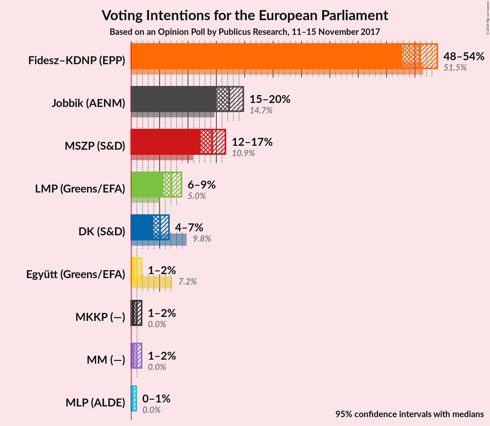
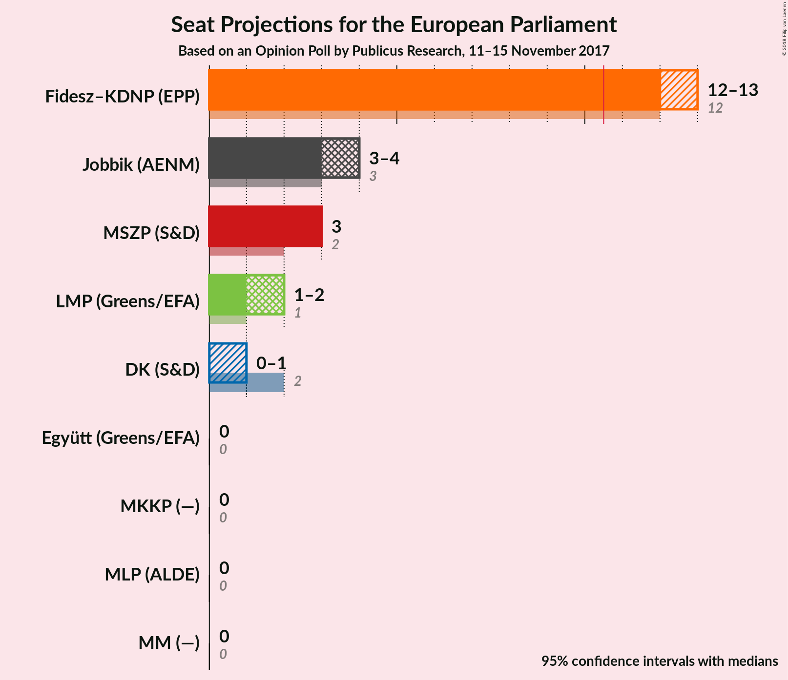

# Opinion Poll by Publicus Research, 11–15 November 2017

<a href="#voting-intentions">Voting Intentions</a> | <a href="#seats">Seats</a> | <a href="#coalitions">Coalitions</a> | <a href="#technical-information">Technical Information</a>

## Voting Intentions

### Confidence Intervals

| Party | Last Result | Poll Result | 80% Confidence Interval | 90% Confidence Interval | 95% Confidence Interval | 99% Confidence Interval |
|:-----:|:-----------:|:-----------:|:-----------------------:|:-----------------------:|:-----------------------:|:-----------------------:|
| Fidesz–KDNP (EPP) | 51.5% | 50.8% | 48.8–52.9% |48.2–53.5% |47.8–53.9% |46.8–54.9% |
| Jobbik (NI) | 14.7% | 17.3% | N/A |N/A |N/A |N/A |
| MSZP (S&D) | 10.9% | 14.3% | 12.9–15.8% |12.6–16.2% |12.3–16.6% |11.6–17.3% |
| LMP (Greens/EFA) | 5.0% | 7.1% | 6.1–8.2% |5.9–8.6% |5.7–8.9% |5.2–9.4% |
| DK (S&D) | 9.8% | 5.1% | 4.3–6.1% |4.1–6.4% |3.9–6.6% |3.6–7.2% |
| Együtt (Greens/EFA) | 7.2% | 1.0% | 0.7–1.5% |0.6–1.7% |0.5–1.8% |0.4–2.1% |
| MKKP (*) | N/A | 1.0% | N/A |N/A |N/A |N/A |
| MM (ALDE) | 0.0% | 1.0% | N/A |N/A |N/A |N/A |
| MLP (ALDE) | 0.0% | 0.3% | 0.2–0.7% |0.1–0.8% |0.1–0.9% |0.1–1.1% |

*Note:* The poll result column reflects the actual value used in the calculations. Published results may vary slightly, and in addition be rounded to fewer digits.

## Seats

### Confidence Intervals

| Party | Last Result | Median | 80% Confidence Interval | 90% Confidence Interval | 95% Confidence Interval | 99% Confidence Interval |
|:-----:|:-----------:|:------:|:-----------------------:|:-----------------------:|:-----------------------:|:-----------------------:|
| <a href="#fidesz–kdnp-(epp)">Fidesz–KDNP (EPP)</a> | 12 | 12 | 12–13 |11–13 |11–13 |11–13 |
| <a href="#jobbik-(ni)">Jobbik (NI)</a> | 3 | N/A | N/A |N/A |N/A |N/A |
| <a href="#mszp-(s&d)">MSZP (S&D)</a> | 2 | 3 | 3 |3 |3–4 |2–4 |
| <a href="#lmp-(greens/efa)">LMP (Greens/EFA)</a> | 1 | 1 | 1–2 |1–2 |1–2 |1–2 |
| <a href="#dk-(s&d)">DK (S&D)</a> | 2 | 1 | 1 |1 |0–1 |0–1 |
| <a href="#együtt-(greens/efa)">Együtt (Greens/EFA)</a> | 0 | 0 | 0 |0 |0 |0 |
| <a href="#mkkp-(*)">MKKP (*)</a> | N/A | N/A | N/A |N/A |N/A |N/A |
| <a href="#mm-(alde)">MM (ALDE)</a> | 0 | N/A | N/A |N/A |N/A |N/A |
| <a href="#mlp-(alde)">MLP (ALDE)</a> | 0 | 0 | 0 |0 |0 |0 |

