# Opinion Poll by Nézőpont Intézet, 1–19 November 2017

<a href="#voting-intentions">Voting Intentions</a> | <a href="#seats">Seats</a> | <a href="#coalitions">Coalitions</a> | <a href="#technical-information">Technical Information</a>

## Voting Intentions

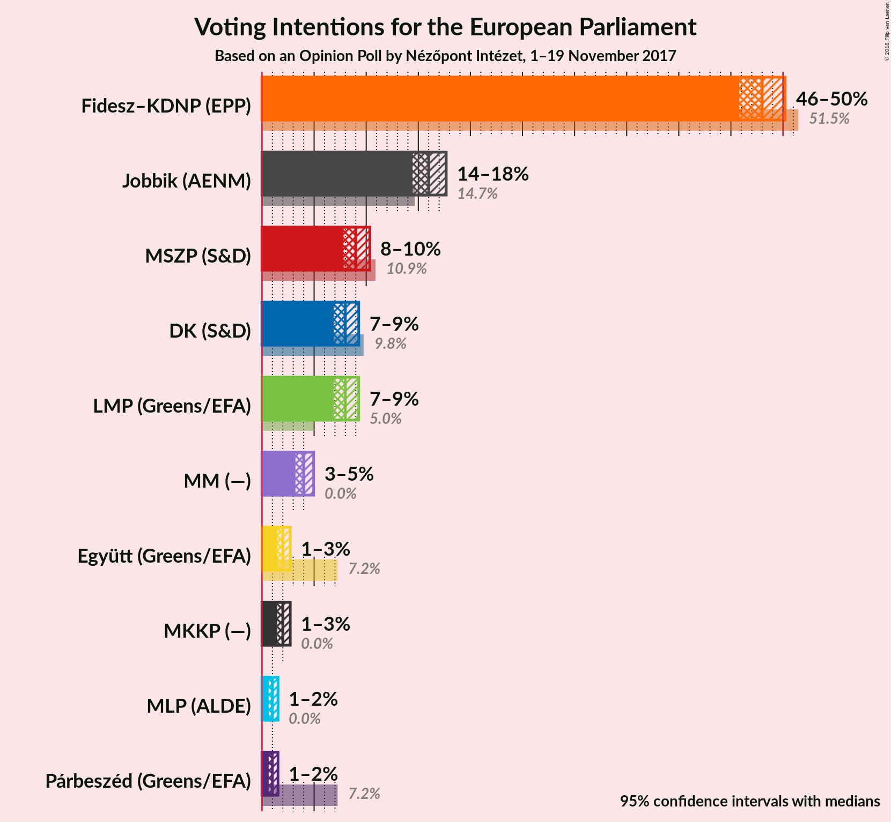

### Confidence Intervals

| Party | Last Result | Poll Result | 80% Confidence Interval | 90% Confidence Interval | 95% Confidence Interval | 99% Confidence Interval |
|:-----:|:-----------:|:-----------:|:-----------------------:|:-----------------------:|:-----------------------:|:-----------------------:|
| Fidesz–KDNP (EPP) | 51.5% | 48.0% | 46.6–49.4% |46.2–49.8% |45.8–50.2% |45.1–50.9% |
| Jobbik (AENM) | 14.7% | 16.0% | 15.0–17.1% |14.7–17.4% |14.4–17.7% |14.0–18.2% |
| MSZP (S&D) | 10.9% | 9.0% | 8.2–9.9% |8.0–10.1% |7.8–10.3% |7.5–10.8% |
| LMP (Greens/EFA) | 5.0% | 8.0% | 7.3–8.8% |7.1–9.1% |6.9–9.3% |6.6–9.7% |
| DK (S&D) | 9.8% | 8.0% | 7.3–8.8% |7.1–9.1% |6.9–9.3% |6.6–9.7% |
| MM (—) | 0.0% | 4.0% | 3.5–4.6% |3.3–4.8% |3.2–5.0% |3.0–5.3% |
| Együtt (Greens/EFA) | 7.2% | 2.0% | 1.6–2.5% |1.6–2.6% |1.5–2.7% |1.3–3.0% |
| MKKP (—) | 0.0% | 2.0% | 1.6–2.5% |1.6–2.6% |1.5–2.7% |1.3–3.0% |
| Párbeszéd (Greens/EFA) | 7.2% | 1.0% | 0.8–1.4% |0.7–1.5% |0.6–1.5% |0.5–1.7% |
| MLP (ALDE) | 0.0% | 1.0% | 0.8–1.4% |0.7–1.5% |0.6–1.5% |0.5–1.7% |

*Note:* The poll result column reflects the actual value used in the calculations. Published results may vary slightly, and in addition be rounded to fewer digits.

## Seats

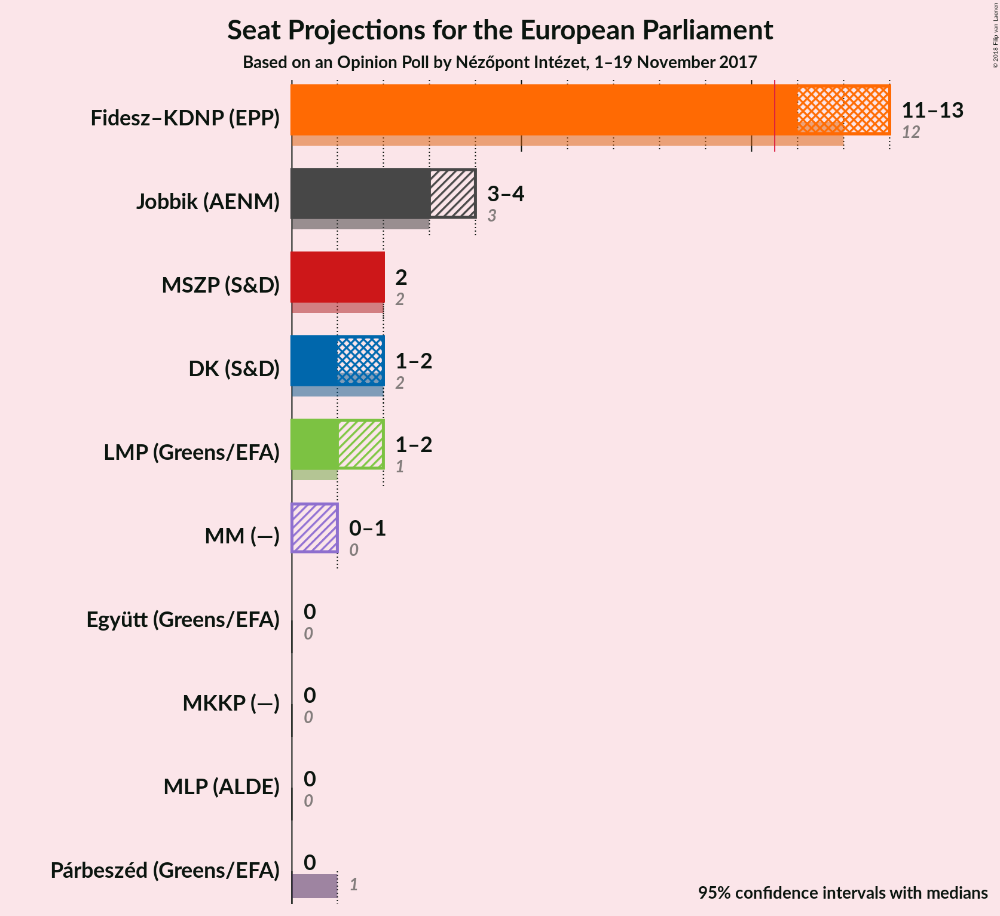

### Confidence Intervals

| Party | Last Result | Median | 80% Confidence Interval | 90% Confidence Interval | 95% Confidence Interval | 99% Confidence Interval |
|:-----:|:-----------:|:------:|:-----------------------:|:-----------------------:|:-----------------------:|:-----------------------:|
| <a href="#fidesz–kdnp-(epp)">Fidesz–KDNP (EPP)</a> | 12 | 13 | 11–13 |11–13 |11–13 |11–13 |
| <a href="#jobbik-(aenm)">Jobbik (AENM)</a> | 3 | 3 | 3–4 |3–4 |3–4 |3–4 |
| <a href="#mszp-(s&d)">MSZP (S&D)</a> | 2 | 2 | 2 |2 |2 |1–2 |
| <a href="#lmp-(greens/efa)">LMP (Greens/EFA)</a> | 1 | 1 | 1–2 |1–2 |1–2 |1–2 |
| <a href="#dk-(s&d)">DK (S&D)</a> | 2 | 2 | 1–2 |1–2 |1–2 |1–2 |
| <a href="#mm-(—)">MM (—)</a> | 0 | 0 | 0–1 |0–1 |0–1 |0–1 |
| <a href="#együtt-(greens/efa)">Együtt (Greens/EFA)</a> | 0 | 0 | 0 |0 |0 |0 |
| <a href="#mkkp-(—)">MKKP (—)</a> | 0 | 0 | 0 |0 |0 |0 |
| <a href="#párbeszéd-(greens/efa)">Párbeszéd (Greens/EFA)</a> | 1 | 0 | 0 |0 |0 |0 |
| <a href="#mlp-(alde)">MLP (ALDE)</a> | 0 | 0 | 0 |0 |0 |0 |

### Fidesz–KDNP (EPP)

*For a full overview of the results for this party, see the [Fidesz–KDNP (EPP)](party-fidesz–kdnpepp.html) page.*

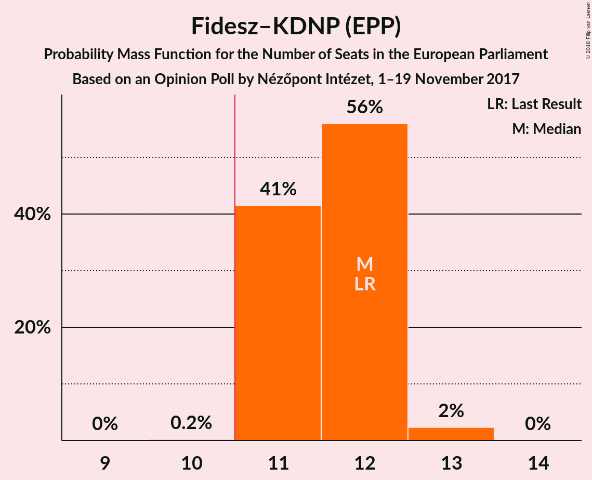

| Number of Seats | Probability | Accumulated | Special Marks |
|:---------------:|:-----------:|:-----------:|:-------------:|
| 11 | 23% | 100% | Majority |
| 12 | 6% | 77% | Last Result |
| 13 | 71% | 71% | Median |
| 14 | 0% | 0% |  |

### Jobbik (AENM)

*For a full overview of the results for this party, see the [Jobbik (AENM)](party-jobbikaenm.html) page.*

| Number of Seats | Probability | Accumulated | Special Marks |
|:---------------:|:-----------:|:-----------:|:-------------:|
| 3 | 77% | 100% | Last Result, Median |
| 4 | 23% | 23% |  |
| 5 | 0% | 0% |  |

### MSZP (S&D)

*For a full overview of the results for this party, see the [MSZP (S&D)](party-mszpsd.html) page.*

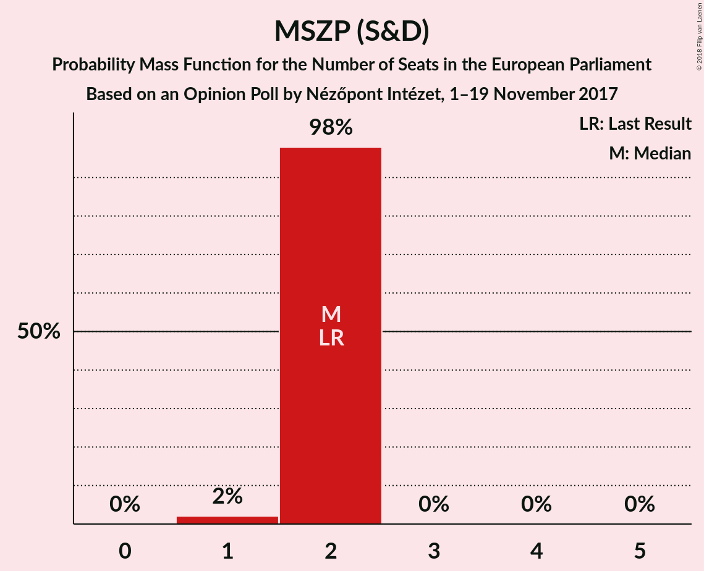

| Number of Seats | Probability | Accumulated | Special Marks |
|:---------------:|:-----------:|:-----------:|:-------------:|
| 1 | 2% | 100% |  |
| 2 | 98% | 98% | Last Result, Median |
| 3 | 0% | 0% |  |

### LMP (Greens/EFA)

*For a full overview of the results for this party, see the [LMP (Greens/EFA)](party-lmpgreensefa.html) page.*

| Number of Seats | Probability | Accumulated | Special Marks |
|:---------------:|:-----------:|:-----------:|:-------------:|
| 1 | 70% | 100% | Last Result, Median |
| 2 | 30% | 30% |  |
| 3 | 0% | 0% |  |

### DK (S&D)

*For a full overview of the results for this party, see the [DK (S&D)](party-dksd.html) page.*

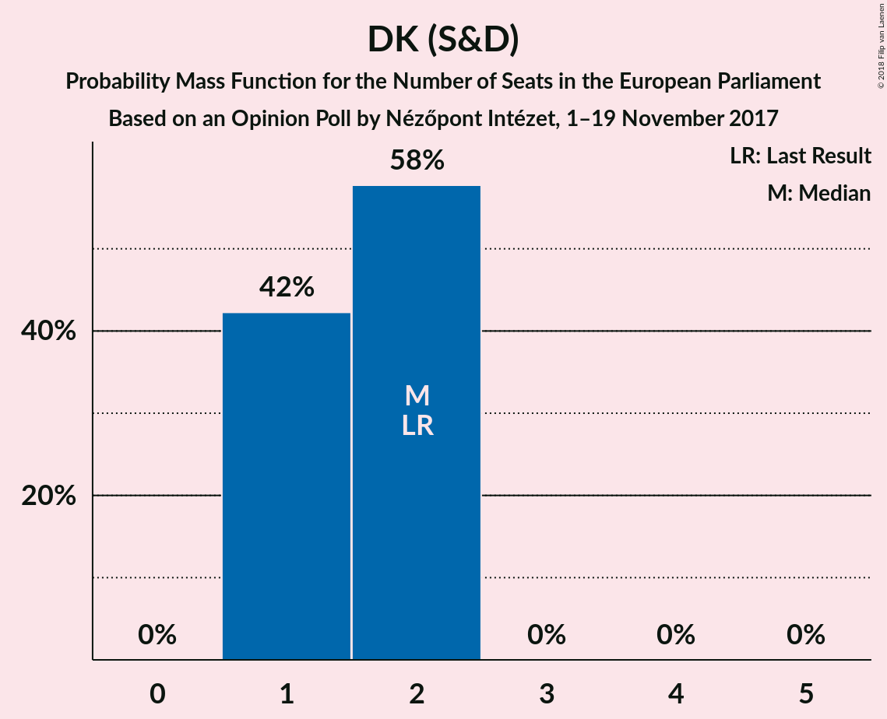

| Number of Seats | Probability | Accumulated | Special Marks |
|:---------------:|:-----------:|:-----------:|:-------------:|
| 1 | 25% | 100% |  |
| 2 | 75% | 75% | Last Result, Median |
| 3 | 0% | 0% |  |

### MM (—)

*For a full overview of the results for this party, see the [MM (—)](party-mm—.html) page.*

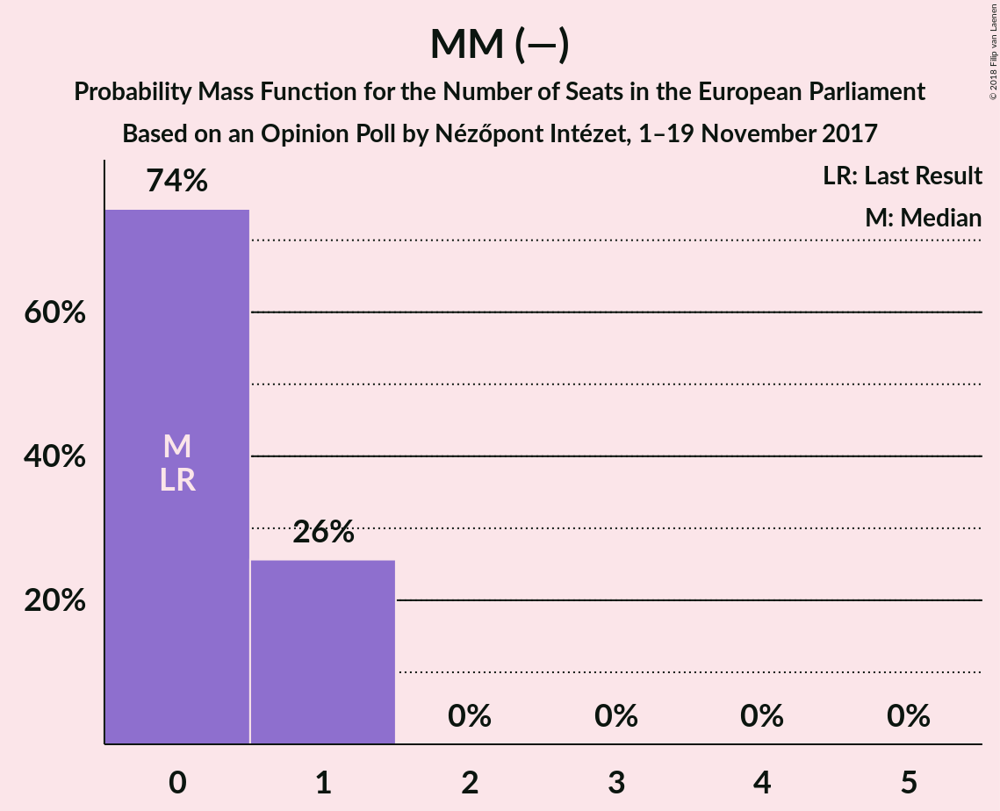

| Number of Seats | Probability | Accumulated | Special Marks |
|:---------------:|:-----------:|:-----------:|:-------------:|
| 0 | 74% | 100% | Last Result, Median |
| 1 | 26% | 26% |  |
| 2 | 0% | 0% |  |

### Együtt (Greens/EFA)

*For a full overview of the results for this party, see the [Együtt (Greens/EFA)](party-együttgreensefa.html) page.*

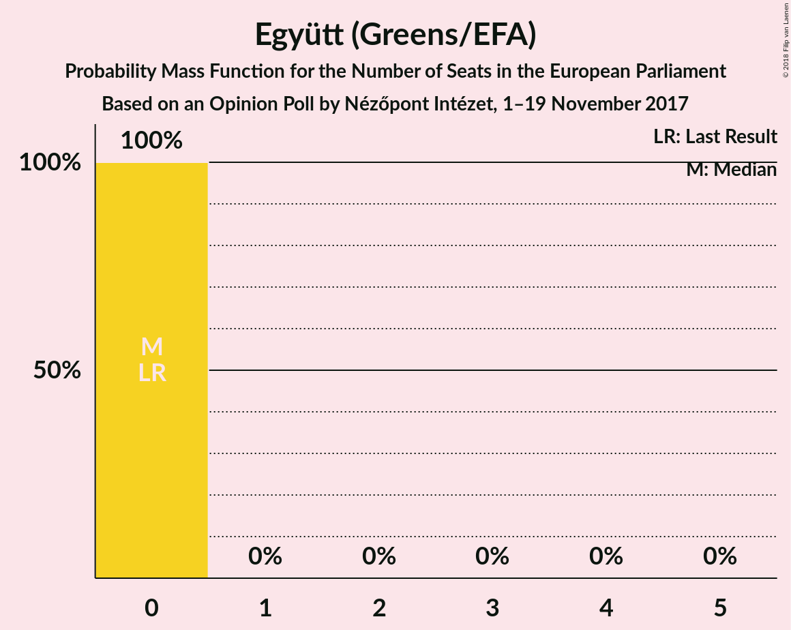

| Number of Seats | Probability | Accumulated | Special Marks |
|:---------------:|:-----------:|:-----------:|:-------------:|
| 0 | 100% | 100% | Last Result, Median |

### MKKP (—)

*For a full overview of the results for this party, see the [MKKP (—)](party-mkkp—.html) page.*

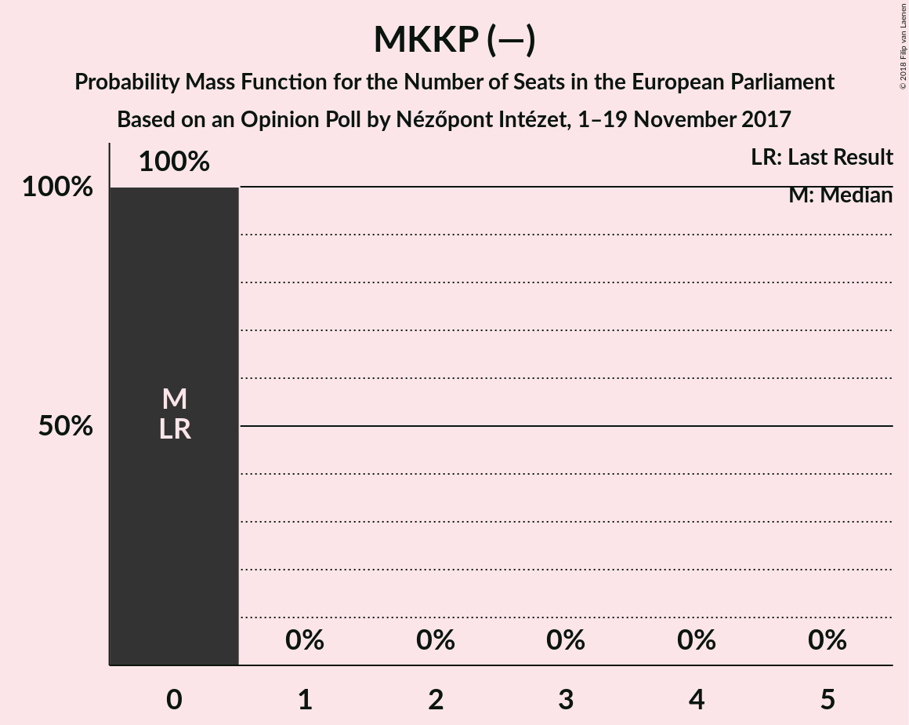

| Number of Seats | Probability | Accumulated | Special Marks |
|:---------------:|:-----------:|:-----------:|:-------------:|
| 0 | 100% | 100% | Last Result, Median |

### Párbeszéd (Greens/EFA)

*For a full overview of the results for this party, see the [Párbeszéd (Greens/EFA)](party-párbeszédgreensefa.html) page.*

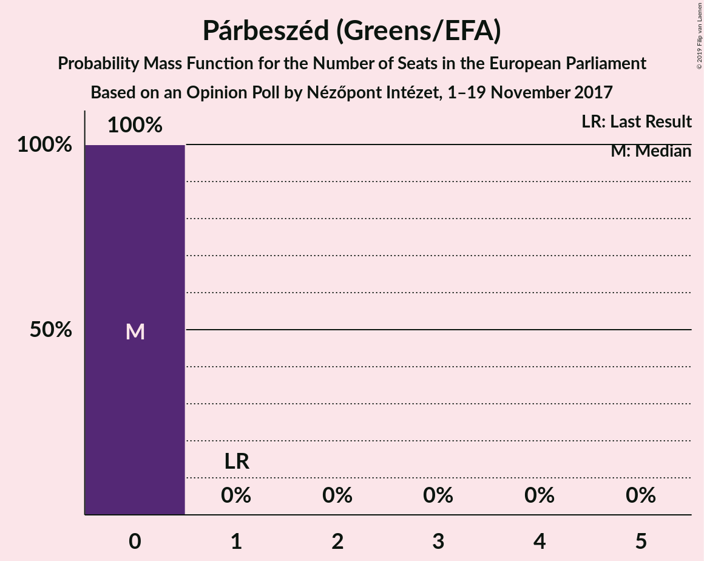

| Number of Seats | Probability | Accumulated | Special Marks |
|:---------------:|:-----------:|:-----------:|:-------------:|
| 0 | 100% | 100% | Median |
| 1 | 0% | 0% | Last Result |

### MLP (ALDE)

*For a full overview of the results for this party, see the [MLP (ALDE)](party-mlpalde.html) page.*

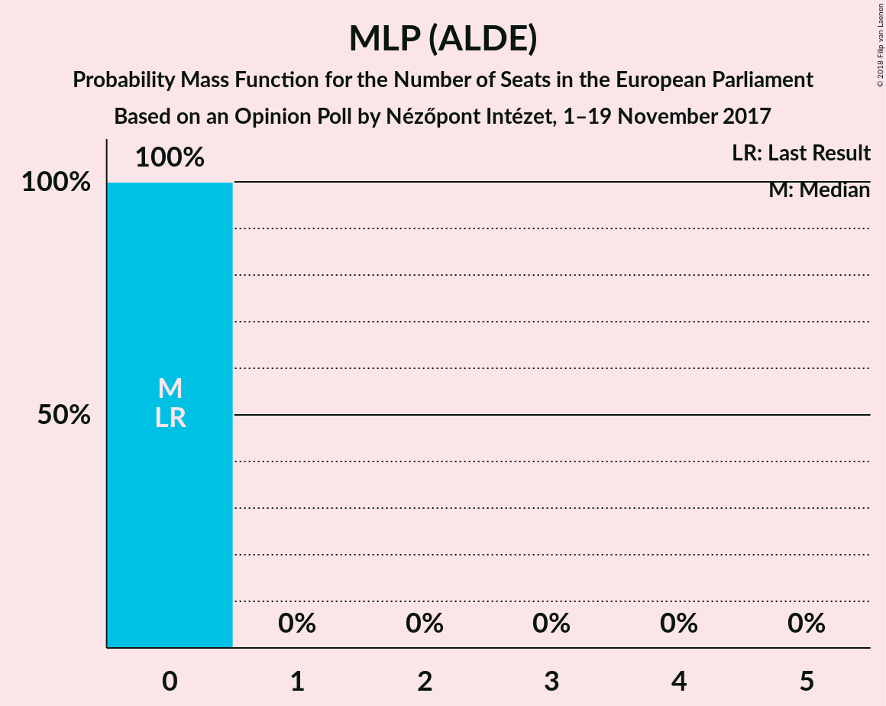

| Number of Seats | Probability | Accumulated | Special Marks |
|:---------------:|:-----------:|:-----------:|:-------------:|
| 0 | 100% | 100% | Last Result, Median |

## Coalitions

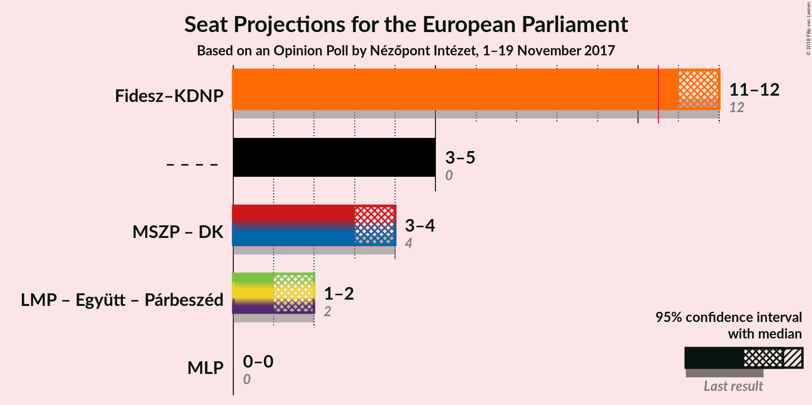

### Confidence Intervals

| Coalition | Last Result | Median | Majority? | 80% Confidence Interval | 90% Confidence Interval | 95% Confidence Interval | 99% Confidence Interval |
|:---------:|:-----------:|:------:|:---------:|:-----------------------:|:-----------------------:|:-----------------------:|:-----------------------:|
| Fidesz–KDNP (EPP) | 12 | 13 | 100% | 11–13 | 11–13 | 11–13 | 11–13 |
| MSZP (S&D) – DK (S&D) | 4 | 4 | 0% | 3–4 | 3–4 | 3–4 | 2–4 |
| Jobbik (AENM) | 3 | 3 | 0% | 3–4 | 3–4 | 3–4 | 3–4 |
| LMP (Greens/EFA) – Együtt (Greens/EFA) – Párbeszéd (Greens/EFA) | 2 | 1 | 0% | 1–2 | 1–2 | 1–2 | 1–2 |
| MLP (ALDE) | 0 | 0 | 0% | 0 | 0 | 0 | 0 |

### Fidesz–KDNP (EPP)

| Number of Seats | Probability | Accumulated | Special Marks |
|:---------------:|:-----------:|:-----------:|:-------------:|
| 11 | 23% | 100% | Majority |
| 12 | 6% | 77% | Last Result |
| 13 | 71% | 71% | Median |
| 14 | 0% | 0% |  |

### MSZP (S&D) – DK (S&D)

| Number of Seats | Probability | Accumulated | Special Marks |
|:---------------:|:-----------:|:-----------:|:-------------:|
| 2 | 2% | 100% |  |
| 3 | 23% | 98% |  |
| 4 | 75% | 75% | Last Result, Median |
| 5 | 0% | 0% |  |

### Jobbik (AENM)

| Number of Seats | Probability | Accumulated | Special Marks |
|:---------------:|:-----------:|:-----------:|:-------------:|
| 3 | 77% | 100% | Last Result, Median |
| 4 | 23% | 23% |  |
| 5 | 0% | 0% |  |

### LMP (Greens/EFA) – Együtt (Greens/EFA) – Párbeszéd (Greens/EFA)

| Number of Seats | Probability | Accumulated | Special Marks |
|:---------------:|:-----------:|:-----------:|:-------------:|
| 1 | 70% | 100% | Median |
| 2 | 30% | 30% | Last Result |
| 3 | 0% | 0% |  |

### MLP (ALDE)

| Number of Seats | Probability | Accumulated | Special Marks |
|:---------------:|:-----------:|:-----------:|:-------------:|
| 0 | 100% | 100% | Last Result, Median |

## Technical Information

### Opinion Poll

+ **Polling firm:** Nézőpont Intézet
+ **Commissioner(s):** —
+ **Fieldwork period:** 1–19 November 2017

### Calculations

+ **Sample size:** 2000
+ **Simulations done:** 1,024
+ **Error estimate:** 3.69%

