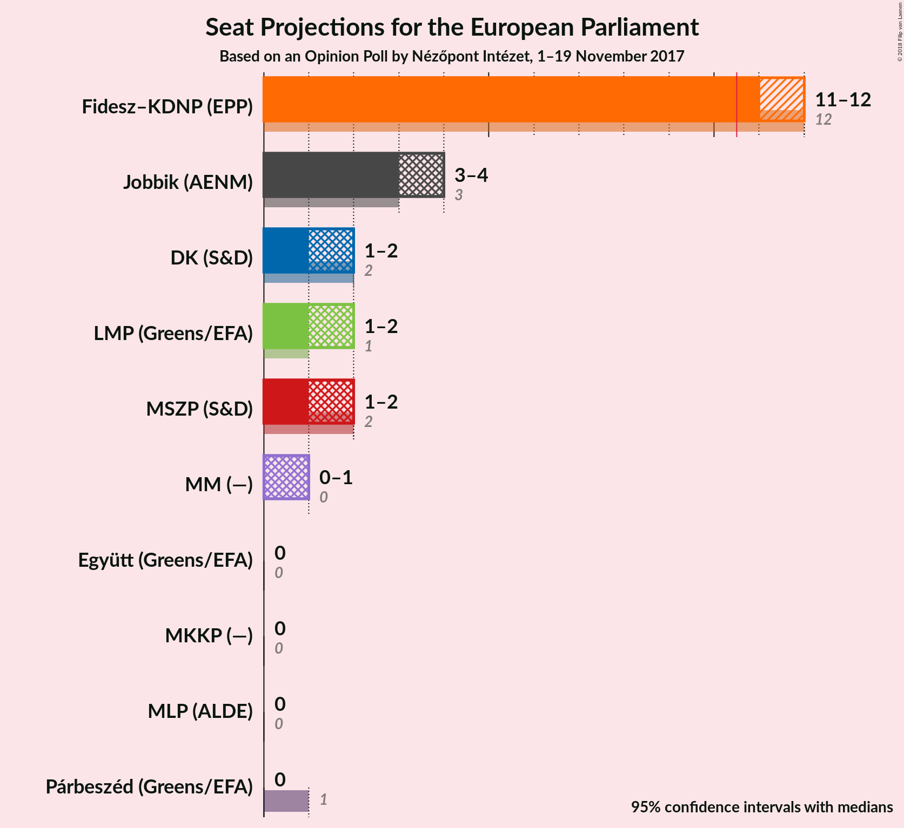
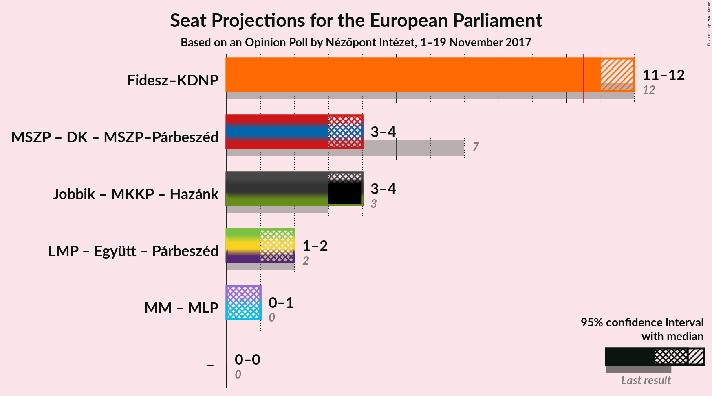

# Opinion Poll by Nézőpont Intézet, 1–19 November 2017

<a href="#voting-intentions">Voting Intentions</a> | <a href="#seats">Seats</a> | <a href="#coalitions">Coalitions</a> | <a href="#technical-information">Technical Information</a>

## Voting Intentions

### Confidence Intervals

| Party | Last Result | Poll Result | 80% Confidence Interval | 90% Confidence Interval | 95% Confidence Interval | 99% Confidence Interval |
|:-----:|:-----------:|:-----------:|:-----------------------:|:-----------------------:|:-----------------------:|:-----------------------:|
| Fidesz–KDNP (EPP) | 44.9% | 48.0% | N/A |N/A |N/A |N/A |
| Jobbik (AENM) | 20.2% | 16.0% | N/A |N/A |N/A |N/A |
| MSZP (S&D) | 25.6% | 9.0% | N/A |N/A |N/A |N/A |
| LMP (Greens/EFA) | 5.3% | 8.0% | N/A |N/A |N/A |N/A |
| DK (S&D) | 25.6% | 8.0% | N/A |N/A |N/A |N/A |
| MM (—) | 0.0% | 4.0% | N/A |N/A |N/A |N/A |
| Együtt (Greens/EFA) | 25.6% | 2.0% | N/A |N/A |N/A |N/A |
| MKKP (—) | 0.0% | 2.0% | N/A |N/A |N/A |N/A |
| Párbeszéd (Greens/EFA) | 25.6% | 1.0% | N/A |N/A |N/A |N/A |
| MLP (ALDE) | 25.6% | 1.0% | N/A |N/A |N/A |N/A |

*Note:* The poll result column reflects the actual value used in the calculations. Published results may vary slightly, and in addition be rounded to fewer digits.

## Seats

### Confidence Intervals

| Party | Last Result | Median | 80% Confidence Interval | 90% Confidence Interval | 95% Confidence Interval | 99% Confidence Interval |
|:-----:|:-----------:|:------:|:-----------------------:|:-----------------------:|:-----------------------:|:-----------------------:|
| <a href="#fidesz–kdnp-(epp)">Fidesz–KDNP (EPP)</a> | 133 | N/A | N/A |N/A |N/A |N/A |
| <a href="#jobbik-(aenm)">Jobbik (AENM)</a> | 23 | N/A | N/A |N/A |N/A |N/A |
| <a href="#mszp-(s&d)">MSZP (S&D)</a> | 29 | N/A | N/A |N/A |N/A |N/A |
| <a href="#lmp-(greens/efa)">LMP (Greens/EFA)</a> | 5 | N/A | N/A |N/A |N/A |N/A |
| <a href="#dk-(s&d)">DK (S&D)</a> | 4 | N/A | N/A |N/A |N/A |N/A |
| <a href="#mm-(—)">MM (—)</a> | 0 | N/A | N/A |N/A |N/A |N/A |
| <a href="#együtt-(greens/efa)">Együtt (Greens/EFA)</a> | 3 | N/A | N/A |N/A |N/A |N/A |
| <a href="#mkkp-(—)">MKKP (—)</a> | 0 | N/A | N/A |N/A |N/A |N/A |
| <a href="#párbeszéd-(greens/efa)">Párbeszéd (Greens/EFA)</a> | 1 | N/A | N/A |N/A |N/A |N/A |
| <a href="#mlp-(alde)">MLP (ALDE)</a> | 1 | N/A | N/A |N/A |N/A |N/A |

## Coalitions

## Technical Information

### Opinion Poll

+ **Polling firm:** Nézőpont Intézet
+ **Commissioner(s):** —
+ **Fieldwork period:** 1–19 November 2017

### Calculations

+ **Sample size:** 2000
+ **Simulations done:** 0
+ **Error estimate:** 100.00%

