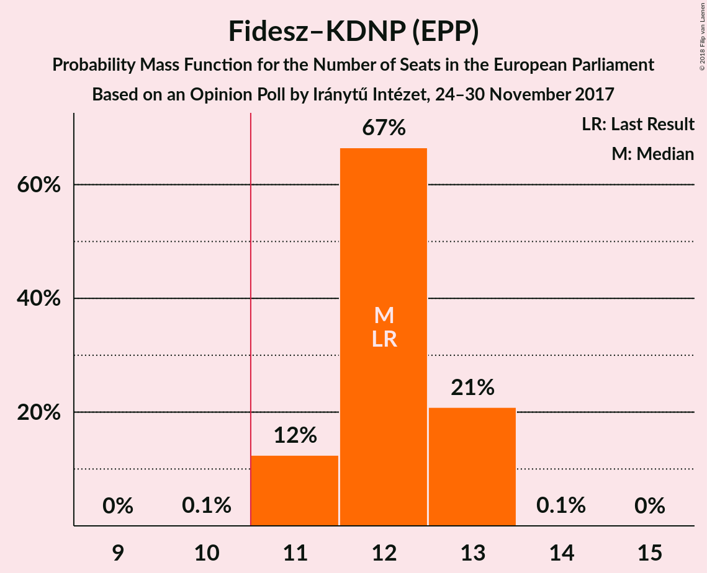
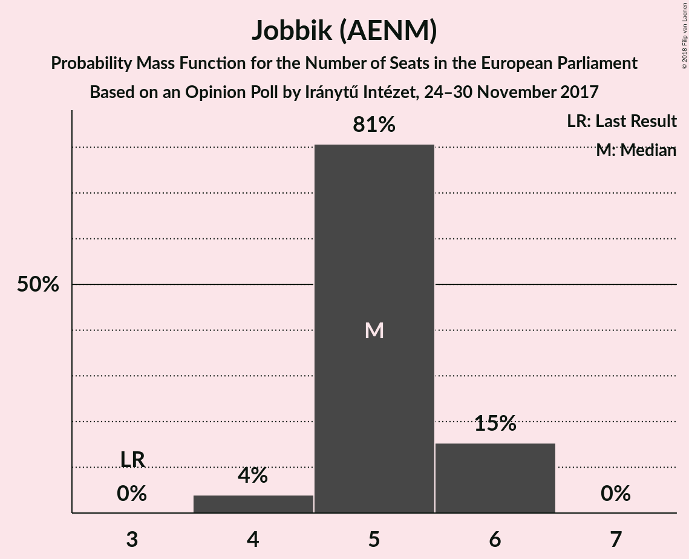
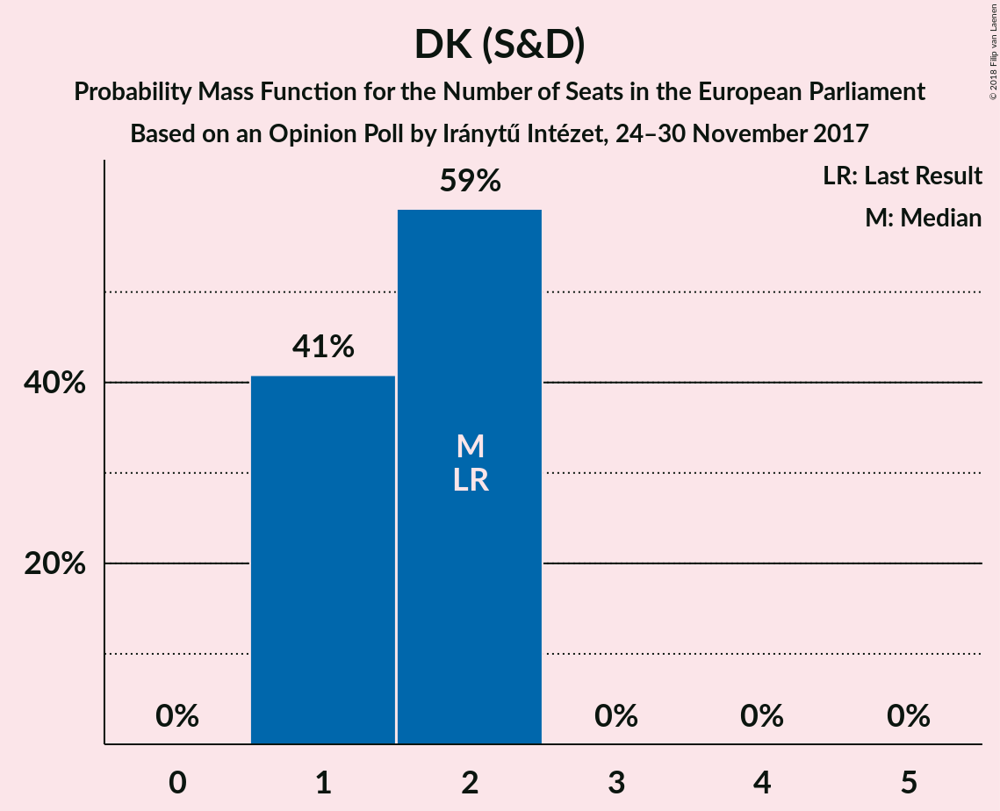
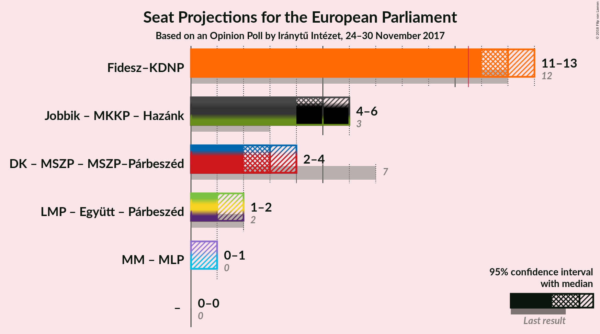

# Opinion Poll by Iránytű Intézet, 24–30 November 2017

<a href="#voting-intentions">Voting Intentions</a> | <a href="#seats">Seats</a> | <a href="#coalitions">Coalitions</a> | <a href="#technical-information">Technical Information</a>

## Voting Intentions

### Confidence Intervals

| Party | Last Result | Poll Result | 80% Confidence Interval | 90% Confidence Interval | 95% Confidence Interval | 99% Confidence Interval |
|:-----:|:-----------:|:-----------:|:-----------------------:|:-----------------------:|:-----------------------:|:-----------------------:|
| Fidesz–KDNP (EPP) | 51.5% | 49.4% | 47.4–51.4% |46.8–52.0% |46.3–52.5% |45.3–53.5% |
| Jobbik (AENM) | 14.7% | 21.7% | 20.1–23.4% |19.6–23.9% |19.3–24.4% |18.5–25.2% |
| DK (S&D) | 9.8% | 7.9% | 6.9–9.1% |6.6–9.4% |6.4–9.7% |5.9–10.3% |
| MSZP (S&D) | 10.9% | 6.9% | 6.0–8.0% |5.7–8.4% |5.5–8.7% |5.1–9.2% |
| LMP (Greens/EFA) | 5.0% | 6.9% | 6.0–8.0% |5.7–8.4% |5.5–8.7% |5.1–9.2% |
| MM (—) | 0.0% | 3.0% | 2.4–3.8% |2.2–4.1% |2.1–4.3% |1.9–4.7% |
| Együtt (Greens/EFA) | 7.2% | 1.0% | 0.7–1.5% |0.6–1.7% |0.5–1.8% |0.4–2.1% |
| Párbeszéd (Greens/EFA) | 7.2% | 1.0% | 0.7–1.5% |0.6–1.7% |0.5–1.8% |0.4–2.1% |
| MKKP (—) | 0.0% | 1.0% | 0.7–1.5% |0.6–1.7% |0.5–1.8% |0.4–2.1% |
| MLP (ALDE) | 0.0% | 0.2% | 0.1–0.5% |0.1–0.6% |0.1–0.7% |0.0–0.9% |

*Note:* The poll result column reflects the actual value used in the calculations. Published results may vary slightly, and in addition be rounded to fewer digits.

## Seats

### Confidence Intervals

| Party | Last Result | Median | 80% Confidence Interval | 90% Confidence Interval | 95% Confidence Interval | 99% Confidence Interval |
|:-----:|:-----------:|:------:|:-----------------------:|:-----------------------:|:-----------------------:|:-----------------------:|
| <a href="#fidesz–kdnp-(epp)">Fidesz–KDNP (EPP)</a> | 12 | 12 | 11–13 |11–13 |11–13 |11–13 |
| <a href="#jobbik-(aenm)">Jobbik (AENM)</a> | 3 | 5 | 5–6 |5–6 |4–6 |4–6 |
| <a href="#dk-(s&d)">DK (S&D)</a> | 2 | 2 | 1–2 |1–2 |1–2 |1–2 |
| <a href="#mszp-(s&d)">MSZP (S&D)</a> | 2 | 1 | 1–2 |1–2 |1–2 |1–2 |
| <a href="#lmp-(greens/efa)">LMP (Greens/EFA)</a> | 1 | 1 | 1 |1–2 |1–2 |1–2 |
| <a href="#mm-(—)">MM (—)</a> | 0 | 0 | 0 |0–1 |0–1 |0–1 |
| <a href="#együtt-(greens/efa)">Együtt (Greens/EFA)</a> | 0 | 0 | 0 |0 |0 |0 |
| <a href="#párbeszéd-(greens/efa)">Párbeszéd (Greens/EFA)</a> | 1 | 0 | 0 |0 |0 |0 |
| <a href="#mkkp-(—)">MKKP (—)</a> | 0 | 0 | 0 |0 |0 |0 |
| <a href="#mlp-(alde)">MLP (ALDE)</a> | 0 | 0 | 0 |0 |0 |0 |

### Fidesz–KDNP (EPP)

*For a full overview of the results for this party, see the [Fidesz–KDNP (EPP)](party-fidesz–kdnpepp.html) page.*

| Number of Seats | Probability | Accumulated | Special Marks |
|:---------------:|:-----------:|:-----------:|:-------------:|
| 10 | 0.1% | 100% |  |
| 11 | 12% | 99.9% | Majority |
| 12 | 67% | 87% | Last Result, Median |
| 13 | 21% | 21% |  |
| 14 | 0.1% | 0.1% |  |
| 15 | 0% | 0% |  |

### Jobbik (AENM)

*For a full overview of the results for this party, see the [Jobbik (AENM)](party-jobbikaenm.html) page.*

| Number of Seats | Probability | Accumulated | Special Marks |
|:---------------:|:-----------:|:-----------:|:-------------:|
| 3 | 0% | 100% | Last Result |
| 4 | 5% | 100% |  |
| 5 | 82% | 95% | Median |
| 6 | 13% | 13% |  |
| 7 | 0% | 0% |  |

### DK (S&D)

*For a full overview of the results for this party, see the [DK (S&D)](party-dksd.html) page.*

| Number of Seats | Probability | Accumulated | Special Marks |
|:---------------:|:-----------:|:-----------:|:-------------:|
| 1 | 41% | 100% |  |
| 2 | 59% | 59% | Last Result, Median |
| 3 | 0% | 0% |  |

### MSZP (S&D)

*For a full overview of the results for this party, see the [MSZP (S&D)](party-mszpsd.html) page.*

| Number of Seats | Probability | Accumulated | Special Marks |
|:---------------:|:-----------:|:-----------:|:-------------:|
| 1 | 90% | 100% | Median |
| 2 | 10% | 10% | Last Result |
| 3 | 0% | 0% |  |

### LMP (Greens/EFA)

*For a full overview of the results for this party, see the [LMP (Greens/EFA)](party-lmpgreensefa.html) page.*

| Number of Seats | Probability | Accumulated | Special Marks |
|:---------------:|:-----------:|:-----------:|:-------------:|
| 1 | 92% | 100% | Last Result, Median |
| 2 | 8% | 8% |  |
| 3 | 0% | 0% |  |

### MM (—)

*For a full overview of the results for this party, see the [MM (—)](party-mm—.html) page.*

| Number of Seats | Probability | Accumulated | Special Marks |
|:---------------:|:-----------:|:-----------:|:-------------:|
| 0 | 95% | 100% | Last Result, Median |
| 1 | 5% | 5% |  |
| 2 | 0% | 0% |  |

### Együtt (Greens/EFA)

*For a full overview of the results for this party, see the [Együtt (Greens/EFA)](party-együttgreensefa.html) page.*

| Number of Seats | Probability | Accumulated | Special Marks |
|:---------------:|:-----------:|:-----------:|:-------------:|
| 0 | 100% | 100% | Last Result, Median |

### Párbeszéd (Greens/EFA)

*For a full overview of the results for this party, see the [Párbeszéd (Greens/EFA)](party-párbeszédgreensefa.html) page.*

| Number of Seats | Probability | Accumulated | Special Marks |
|:---------------:|:-----------:|:-----------:|:-------------:|
| 0 | 100% | 100% | Median |
| 1 | 0% | 0% | Last Result |

### MKKP (—)

*For a full overview of the results for this party, see the [MKKP (—)](party-mkkp—.html) page.*

| Number of Seats | Probability | Accumulated | Special Marks |
|:---------------:|:-----------:|:-----------:|:-------------:|
| 0 | 100% | 100% | Last Result, Median |

### MLP (ALDE)

*For a full overview of the results for this party, see the [MLP (ALDE)](party-mlpalde.html) page.*

| Number of Seats | Probability | Accumulated | Special Marks |
|:---------------:|:-----------:|:-----------:|:-------------:|
| 0 | 100% | 100% | Last Result, Median |

## Coalitions

### Confidence Intervals

| Coalition | Last Result | Median | Majority? | 80% Confidence Interval | 90% Confidence Interval | 95% Confidence Interval | 99% Confidence Interval |
|:---------:|:-----------:|:------:|:---------:|:-----------------------:|:-----------------------:|:-----------------------:|:-----------------------:|
| Fidesz–KDNP (EPP) | 12 | 12 | 99.9% | 11–13 | 11–13 | 11–13 | 11–13 |
| Jobbik (AENM) | 3 | 5 | 0% | 5–6 | 5–6 | 4–6 | 4–6 |
| DK (S&D) – MSZP (S&D) | 4 | 3 | 0% | 2–3 | 2–3 | 2–4 | 2–4 |
| LMP (Greens/EFA) – Együtt (Greens/EFA) – Párbeszéd (Greens/EFA) | 2 | 1 | 0% | 1 | 1–2 | 1–2 | 1–2 |
| MLP (ALDE) | 0 | 0 | 0% | 0 | 0 | 0 | 0 |

### Fidesz–KDNP (EPP)

| Number of Seats | Probability | Accumulated | Special Marks |
|:---------------:|:-----------:|:-----------:|:-------------:|
| 10 | 0.1% | 100% |  |
| 11 | 12% | 99.9% | Majority |
| 12 | 67% | 87% | Last Result, Median |
| 13 | 21% | 21% |  |
| 14 | 0.1% | 0.1% |  |
| 15 | 0% | 0% |  |

### Jobbik (AENM)

| Number of Seats | Probability | Accumulated | Special Marks |
|:---------------:|:-----------:|:-----------:|:-------------:|
| 3 | 0% | 100% | Last Result |
| 4 | 5% | 100% |  |
| 5 | 82% | 95% | Median |
| 6 | 13% | 13% |  |
| 7 | 0% | 0% |  |

### DK (S&D) – MSZP (S&D)

| Number of Seats | Probability | Accumulated | Special Marks |
|:---------------:|:-----------:|:-----------:|:-------------:|
| 2 | 33% | 100% |  |
| 3 | 64% | 67% | Median |
| 4 | 3% | 3% | Last Result |
| 5 | 0% | 0% |  |

### LMP (Greens/EFA) – Együtt (Greens/EFA) – Párbeszéd (Greens/EFA)

| Number of Seats | Probability | Accumulated | Special Marks |
|:---------------:|:-----------:|:-----------:|:-------------:|
| 1 | 92% | 100% | Median |
| 2 | 8% | 8% | Last Result |
| 3 | 0% | 0% |  |

### MLP (ALDE)

| Number of Seats | Probability | Accumulated | Special Marks |
|:---------------:|:-----------:|:-----------:|:-------------:|
| 0 | 100% | 100% | Last Result, Median |

## Technical Information

### Opinion Poll

+ **Polling firm:** Iránytű Intézet
+ **Commissioner(s):** —
+ **Fieldwork period:** 24–30 November 2017

### Calculations

+ **Sample size:** 1000
+ **Simulations done:** 1,048,576
+ **Error estimate:** 2.74%

