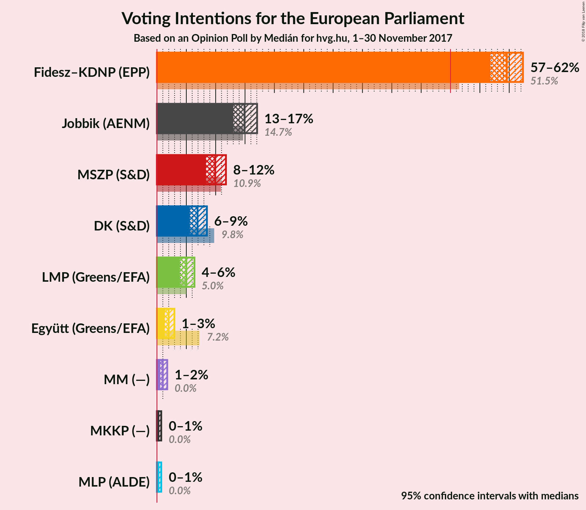
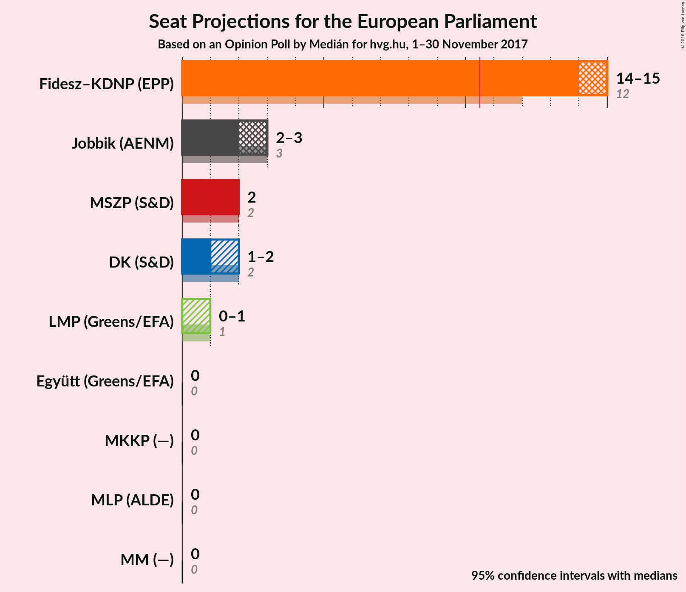

# Opinion Poll by Medián for hvg.hu, 1–30 November 2017

<a href="#voting-intentions">Voting Intentions</a> | <a href="#seats">Seats</a> | <a href="#coalitions">Coalitions</a> | <a href="#technical-information">Technical Information</a>

## Voting Intentions

### Confidence Intervals

| Party | Last Result | Poll Result | 80% Confidence Interval | 90% Confidence Interval | 95% Confidence Interval | 99% Confidence Interval |
|:-----:|:-----------:|:-----------:|:-----------------------:|:-----------------------:|:-----------------------:|:-----------------------:|
| Fidesz–KDNP (EPP) | 51.5% | 59.6% | 57.8–61.4% |57.2–61.9% |56.8–62.3% |55.9–63.2% |
| Jobbik (—) | N/A | 14.9% | 13.7–16.3% |13.3–16.7% |13.0–17.1% |12.4–17.7% |
| MSZP (S&D) | 10.9% | 9.9% | 8.9–11.1% |8.6–11.4% |8.4–11.8% |7.9–12.3% |
| DK (S&D) | 9.8% | 6.9% | 6.1–8.0% |5.8–8.2% |5.6–8.5% |5.2–9.0% |
| LMP (Greens/EFA) | 5.0% | 5.0% | 4.3–5.9% |4.1–6.2% |3.9–6.4% |3.6–6.8% |
| Együtt (Greens/EFA) | 7.2% | 2.0% | 1.6–2.6% |1.4–2.8% |1.3–3.0% |1.2–3.3% |
| MM (—) | 0.0% | 1.0% | 0.7–1.5% |0.6–1.6% |0.6–1.8% |0.5–2.0% |
| MLP (ALDE) | 0.0% | 0.2% | 0.1–0.6% |0.1–0.7% |0.1–0.7% |0.0–0.9% |
| MKKP (—) | 0.0% | 0.2% | 0.1–0.6% |0.1–0.7% |0.1–0.7% |0.0–0.9% |

*Note:* The poll result column reflects the actual value used in the calculations. Published results may vary slightly, and in addition be rounded to fewer digits.

## Seats

### Confidence Intervals

| Party | Last Result | Median | 80% Confidence Interval | 90% Confidence Interval | 95% Confidence Interval | 99% Confidence Interval |
|:-----:|:-----------:|:------:|:-----------------------:|:-----------------------:|:-----------------------:|:-----------------------:|
| <a href="#fidesz–kdnp-(epp)">Fidesz–KDNP (EPP)</a> | 12 | 14 | 13–14 |13–15 |13–15 |13–15 |
| <a href="#jobbik-(—)">Jobbik (—)</a> | N/A | 3 | 3–4 |3–4 |3–4 |2–4 |
| <a href="#mszp-(s&d)">MSZP (S&D)</a> | 2 | 2 | 2 |2 |2 |1–2 |
| <a href="#dk-(s&d)">DK (S&D)</a> | 2 | 1 | 1 |1–2 |1–2 |1–2 |
| <a href="#lmp-(greens/efa)">LMP (Greens/EFA)</a> | 1 | 1 | 1 |0–1 |0–1 |0–1 |
| <a href="#együtt-(greens/efa)">Együtt (Greens/EFA)</a> | 0 | 0 | 0 |0 |0 |0 |
| <a href="#mm-(—)">MM (—)</a> | 0 | 0 | 0 |0 |0 |0 |
| <a href="#mlp-(alde)">MLP (ALDE)</a> | 0 | 0 | 0 |0 |0 |0 |
| <a href="#mkkp-(—)">MKKP (—)</a> | 0 | 0 | 0 |0 |0 |0 |

