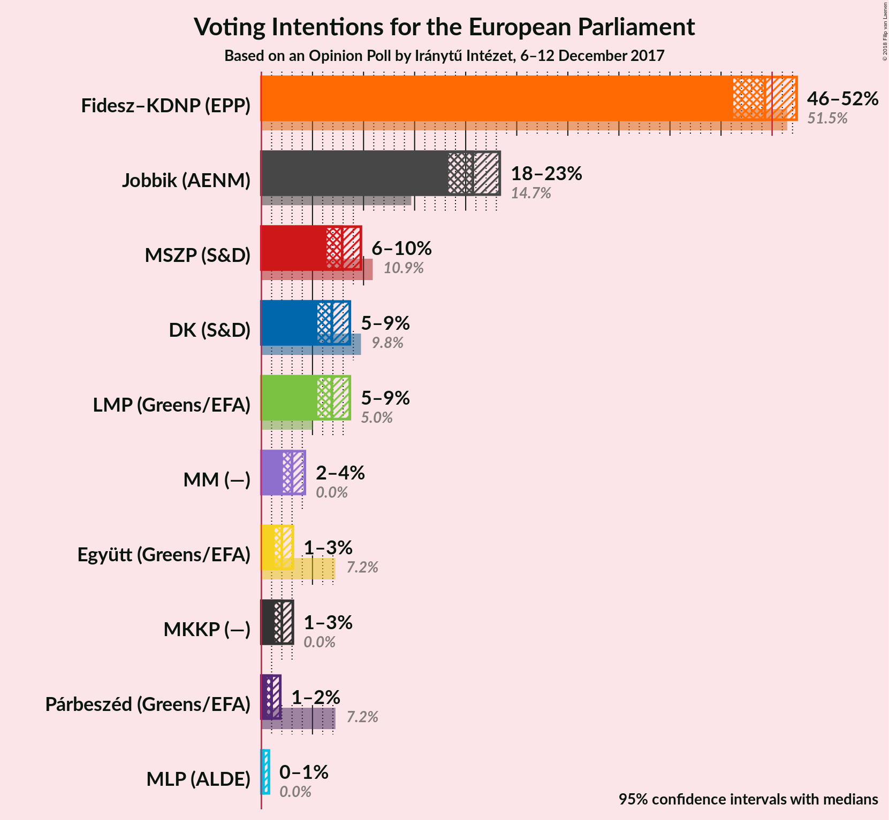
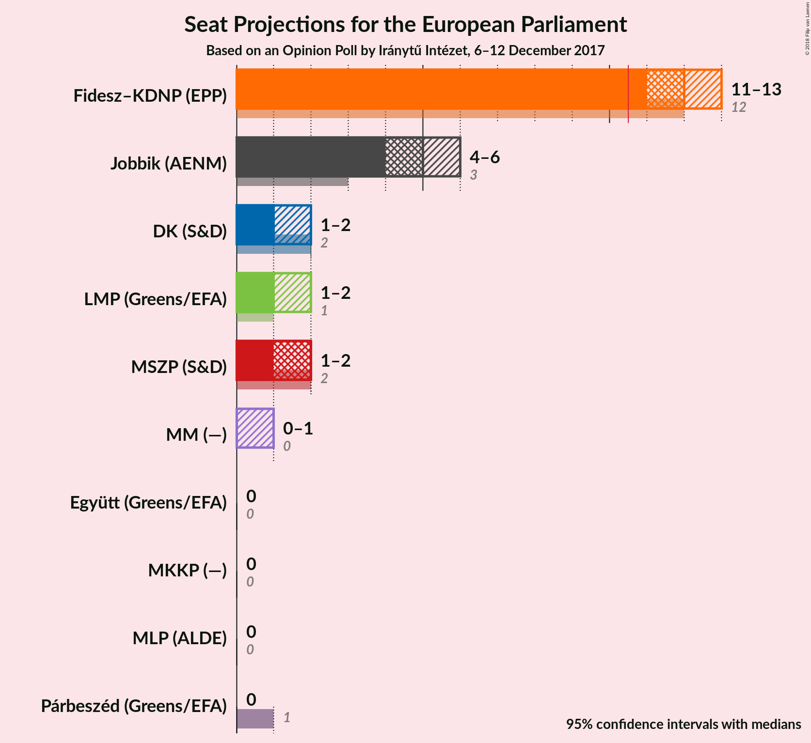

# Opinion Poll by Iránytű Intézet, 6–12 December 2017

<a href="#voting-intentions">Voting Intentions</a> | <a href="#seats">Seats</a> | <a href="#coalitions">Coalitions</a> | <a href="#technical-information">Technical Information</a>

## Voting Intentions

### Confidence Intervals

| Party | Last Result | Poll Result | 80% Confidence Interval | 90% Confidence Interval | 95% Confidence Interval | 99% Confidence Interval |
|:-----:|:-----------:|:-----------:|:-----------------------:|:-----------------------:|:-----------------------:|:-----------------------:|
| Fidesz–KDNP (EPP) | 51.5% | 49.3% | 47.3–51.3% |46.7–51.9% |46.2–52.4% |45.2–53.4% |
| Jobbik (NI) | 14.7% | 20.7% | N/A |N/A |N/A |N/A |
| MSZP (S&D) | 10.9% | 7.9% | 6.9–9.1% |6.6–9.4% |6.4–9.7% |5.9–10.3% |
| LMP (Greens/EFA) | 5.0% | 6.9% | 6.0–8.0% |5.7–8.4% |5.5–8.7% |5.1–9.2% |
| DK (S&D) | 9.8% | 6.9% | 6.0–8.0% |5.7–8.4% |5.5–8.7% |5.1–9.2% |
| MM (ALDE) | 0.0% | 3.0% | N/A |N/A |N/A |N/A |
| Együtt (Greens/EFA) | 7.2% | 2.0% | 1.5–2.7% |1.4–2.9% |1.3–3.1% |1.1–3.4% |
| MKKP (*) | N/A | 2.0% | N/A |N/A |N/A |N/A |
| Párbeszéd (Greens/EFA) | 7.2% | 1.0% | 0.7–1.5% |0.6–1.7% |0.5–1.8% |0.4–2.1% |
| MLP (ALDE) | 0.0% | 0.2% | 0.1–0.5% |0.1–0.6% |0.1–0.7% |0.0–0.9% |

*Note:* The poll result column reflects the actual value used in the calculations. Published results may vary slightly, and in addition be rounded to fewer digits.

## Seats

### Confidence Intervals

| Party | Last Result | Median | 80% Confidence Interval | 90% Confidence Interval | 95% Confidence Interval | 99% Confidence Interval |
|:-----:|:-----------:|:------:|:-----------------------:|:-----------------------:|:-----------------------:|:-----------------------:|
| <a href="#fidesz–kdnp-(epp)">Fidesz–KDNP (EPP)</a> | 12 | 12 | 12–13 |12–13 |11–13 |11–13 |
| <a href="#jobbik-(ni)">Jobbik (NI)</a> | 3 | N/A | N/A |N/A |N/A |N/A |
| <a href="#mszp-(s&d)">MSZP (S&D)</a> | 2 | 2 | 1–2 |1–2 |1–2 |1–2 |
| <a href="#lmp-(greens/efa)">LMP (Greens/EFA)</a> | 1 | 1 | 1–2 |1–2 |1–2 |1–2 |
| <a href="#dk-(s&d)">DK (S&D)</a> | 2 | 1 | 1–2 |1–2 |1–2 |1–2 |
| <a href="#mm-(alde)">MM (ALDE)</a> | 0 | N/A | N/A |N/A |N/A |N/A |
| <a href="#együtt-(greens/efa)">Együtt (Greens/EFA)</a> | 0 | 0 | 0 |0 |0 |0 |
| <a href="#mkkp-(*)">MKKP (*)</a> | N/A | N/A | N/A |N/A |N/A |N/A |
| <a href="#párbeszéd-(greens/efa)">Párbeszéd (Greens/EFA)</a> | 1 | 0 | 0 |0 |0 |0 |
| <a href="#mlp-(alde)">MLP (ALDE)</a> | 0 | 0 | 0 |0 |0 |0 |

