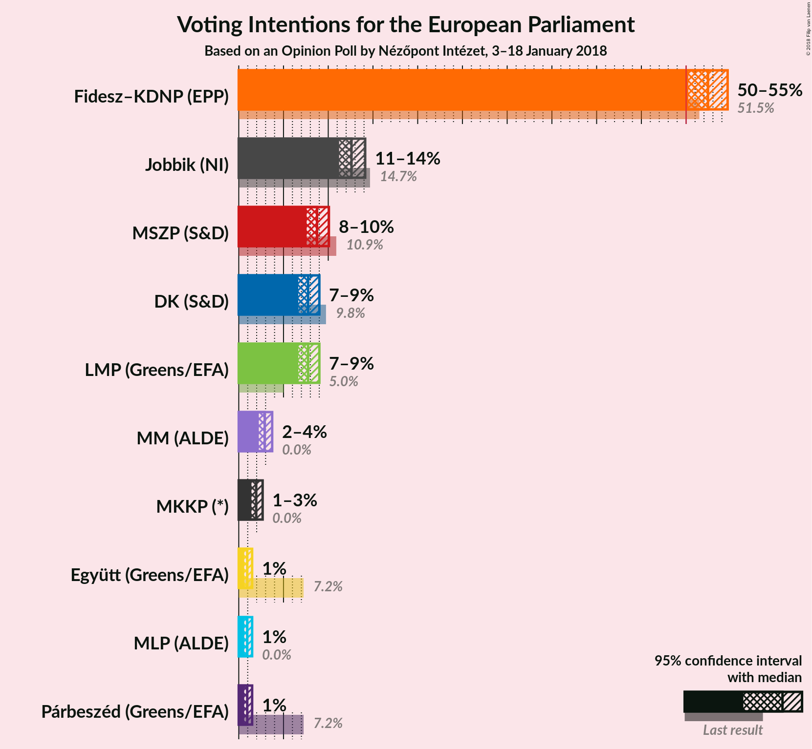

# Opinion Poll by Nézőpont Intézet, 3–18 January 2018

<a href="#voting-intentions">Voting Intentions</a> | <a href="#seats">Seats</a> | <a href="#coalitions">Coalitions</a> | <a href="#technical-information">Technical Information</a>

## Voting Intentions

### Confidence Intervals

| Party | Last Result | Poll Result | 80% Confidence Interval | 90% Confidence Interval | 95% Confidence Interval | 99% Confidence Interval |
|:-----:|:-----------:|:-----------:|:-----------------------:|:-----------------------:|:-----------------------:|:-----------------------:|
| Fidesz–KDNP (EPP) | 51.5% | 52.4% | 51.0–53.9% |50.6–54.3% |50.3–54.6% |49.6–55.3% |
| Jobbik (NI) | 14.7% | 12.6% | 11.7–13.6% |11.4–13.9% |11.2–14.1% |10.8–14.6% |
| MSZP (S&D) | 10.9% | 8.8% | 8.0–9.6% |7.8–9.9% |7.6–10.1% |7.2–10.5% |
| LMP (Greens/EFA) | 5.0% | 7.8% | 7.0–8.6% |6.8–8.8% |6.6–9.0% |6.3–9.4% |
| DK (S&D) | 9.8% | 7.8% | 7.0–8.6% |6.8–8.8% |6.6–9.0% |6.3–9.4% |
| MM (ALDE) | 0.0% | 2.9% | 2.5–3.4% |2.3–3.6% |2.2–3.7% |2.1–4.0% |
| MKKP (*) | N/A | 2.0% | 1.6–2.4% |1.5–2.5% |1.4–2.7% |1.3–2.9% |
| Együtt (Greens/EFA) | 7.2% | 1.0% | 0.7–1.3% |0.7–1.4% |0.6–1.5% |0.5–1.7% |
| Párbeszéd (Greens/EFA) | 7.2% | 1.0% | 0.7–1.3% |0.7–1.4% |0.6–1.5% |0.5–1.7% |
| MLP (ALDE) | 0.0% | 1.0% | 0.7–1.3% |0.7–1.4% |0.6–1.5% |0.5–1.7% |

*Note:* The poll result column reflects the actual value used in the calculations. Published results may vary slightly, and in addition be rounded to fewer digits.

## Seats

### Confidence Intervals

| Party | Last Result | Median | 80% Confidence Interval | 90% Confidence Interval | 95% Confidence Interval | 99% Confidence Interval |
|:-----:|:-----------:|:------:|:-----------------------:|:-----------------------:|:-----------------------:|:-----------------------:|
| <a href="#fidesz–kdnp-(epp)">Fidesz–KDNP (EPP)</a> | 12 | 13 | 13–14 |12–14 |12–14 |12–14 |
| <a href="#jobbik-(ni)">Jobbik (NI)</a> | 3 | 3 | 3 |2–3 |2–3 |2–3 |
| <a href="#mszp-(s&d)">MSZP (S&D)</a> | 2 | 2 | 2 |2 |2 |1–2 |
| <a href="#lmp-(greens/efa)">LMP (Greens/EFA)</a> | 1 | 2 | 1–2 |1–2 |1–2 |1–2 |
| <a href="#dk-(s&d)">DK (S&D)</a> | 2 | 1 | 1–2 |1–2 |1–2 |1–2 |
| <a href="#mm-(alde)">MM (ALDE)</a> | 0 | 0 | 0 |0 |0 |0–1 |
| <a href="#mkkp-(*)">MKKP (*)</a> | N/A | 0 | 0 |0 |0 |0 |
| <a href="#együtt-(greens/efa)">Együtt (Greens/EFA)</a> | 0 | 0 | 0 |0 |0 |0 |
| <a href="#párbeszéd-(greens/efa)">Párbeszéd (Greens/EFA)</a> | 1 | 0 | 0 |0 |0 |0 |
| <a href="#mlp-(alde)">MLP (ALDE)</a> | 0 | 0 | 0 |0 |0 |0 |

