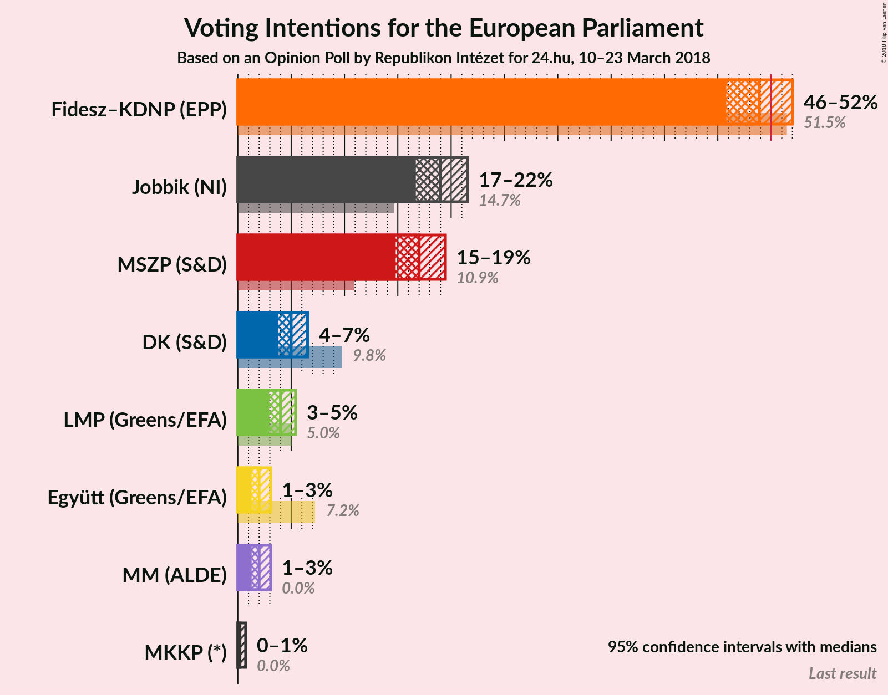
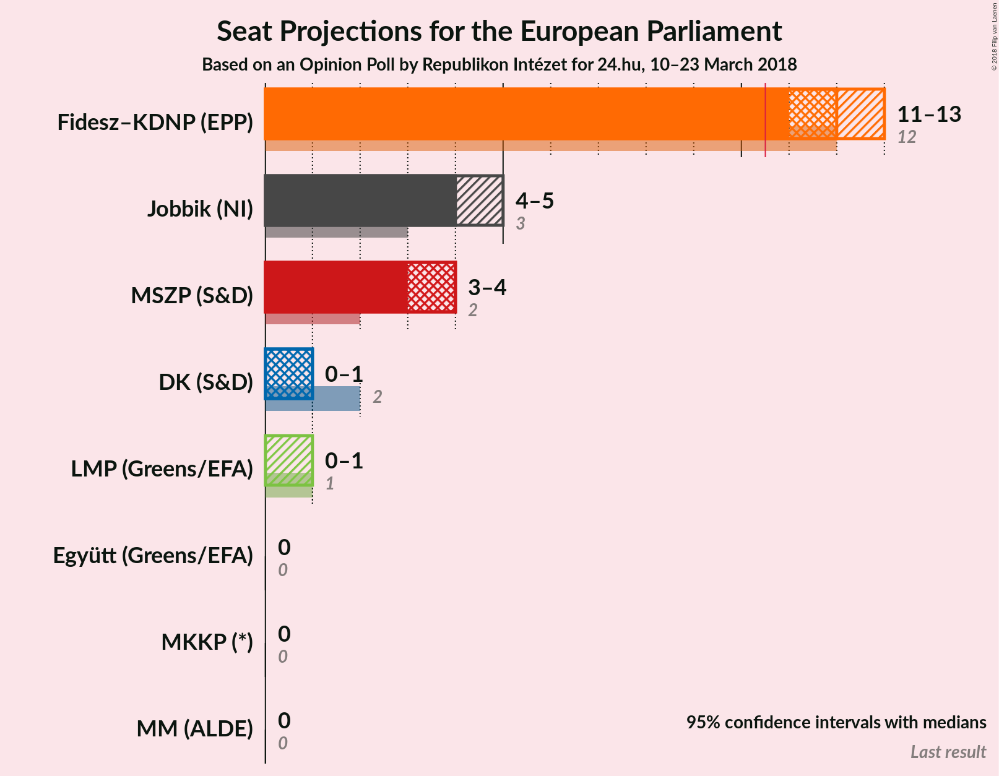

# Opinion Poll by Republikon Intézet for 24.hu, 10–23 March 2018

<a href="#voting-intentions">Voting Intentions</a> | <a href="#seats">Seats</a> | <a href="#coalitions">Coalitions</a> | <a href="#technical-information">Technical Information</a>

## Voting Intentions

### Confidence Intervals

| Party | Last Result | Poll Result | 80% Confidence Interval | 90% Confidence Interval | 95% Confidence Interval | 99% Confidence Interval |
|:-----:|:-----------:|:-----------:|:-----------------------:|:-----------------------:|:-----------------------:|:-----------------------:|
| Fidesz–KDNP (EPP) | 51.5% | 48.9% | 46.9–50.9% |46.3–51.5% |45.8–52.0% |44.8–53.0% |
| Jobbik (NI) | 14.7% | 19.0% | 17.5–20.7% |17.1–21.1% |16.7–21.6% |16.0–22.4% |
| MSZP–Párbeszéd (S&D) | 18.2% | 17.0% | N/A |N/A |N/A |N/A |
| DK (S&D) | 9.8% | 5.0% | 4.2–6.0% |4.0–6.3% |3.8–6.5% |3.5–7.1% |
| LMP (Greens/EFA) | 5.0% | 4.0% | 3.3–4.9% |3.1–5.2% |2.9–5.4% |2.7–5.9% |
| MM (ALDE) | 0.0% | 2.0% | 1.5–2.7% |1.4–2.9% |1.3–3.1% |1.1–3.4% |
| Együtt (Greens/EFA) | 7.2% | 2.0% | 1.5–2.7% |1.4–2.9% |1.3–3.1% |1.1–3.4% |
| MKKP (NI) | 0.0% | 0.2% | N/A |N/A |N/A |N/A |

*Note:* The poll result column reflects the actual value used in the calculations. Published results may vary slightly, and in addition be rounded to fewer digits.

## Seats

### Confidence Intervals

| Party | Last Result | Median | 80% Confidence Interval | 90% Confidence Interval | 95% Confidence Interval | 99% Confidence Interval |
|:-----:|:-----------:|:------:|:-----------------------:|:-----------------------:|:-----------------------:|:-----------------------:|
| <a href="#fidesz–kdnp-(epp)">Fidesz–KDNP (EPP)</a> | 12 | 12 | 11–12 |11–12 |11–13 |10–13 |
| <a href="#jobbik-(ni)">Jobbik (NI)</a> | 3 | 4 | 4–5 |4–5 |4–5 |3–5 |
| <a href="#mszp–párbeszéd-(s&d)">MSZP–Párbeszéd (S&D)</a> | 3 | N/A | N/A |N/A |N/A |N/A |
| <a href="#dk-(s&d)">DK (S&D)</a> | 2 | 1 | 1 |0–1 |0–1 |0–1 |
| <a href="#lmp-(greens/efa)">LMP (Greens/EFA)</a> | 1 | 0 | 0–1 |0–1 |0–1 |0–1 |
| <a href="#mm-(alde)">MM (ALDE)</a> | 0 | 0 | 0 |0 |0 |0 |
| <a href="#együtt-(greens/efa)">Együtt (Greens/EFA)</a> | 0 | 0 | 0 |0 |0 |0 |
| <a href="#mkkp-(ni)">MKKP (NI)</a> | 0 | N/A | N/A |N/A |N/A |N/A |

