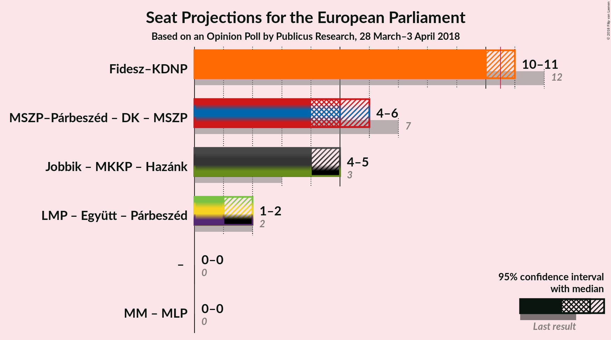

# Opinion Poll by Publicus Research, 28 March–3 April 2018

<a href="#voting-intentions">Voting Intentions</a> | <a href="#seats">Seats</a> | <a href="#coalitions">Coalitions</a> | <a href="#technical-information">Technical Information</a>

## Voting Intentions

### Confidence Intervals

| Party | Last Result | Poll Result | 80% Confidence Interval | 90% Confidence Interval | 95% Confidence Interval | 99% Confidence Interval |
|:-----:|:-----------:|:-----------:|:-----------------------:|:-----------------------:|:-----------------------:|:-----------------------:|
| Fidesz–KDNP (EPP) | 51.5% | 44.6% | N/A |N/A |N/A |N/A |
| Jobbik (NI) | 14.7% | 19.9% | N/A |N/A |N/A |N/A |
| MSZP (S&D) | 10.9% | 18.9% | N/A |N/A |N/A |N/A |
| LMP (Greens/EFA) | 5.0% | 7.0% | N/A |N/A |N/A |N/A |
| DK (S&D) | 9.8% | 5.0% | N/A |N/A |N/A |N/A |
| MM (ALDE) | 0.0% | 2.0% | N/A |N/A |N/A |N/A |
| Együtt (Greens/EFA) | 7.2% | 0.2% | N/A |N/A |N/A |N/A |
| MLP (ALDE) | 0.0% | 0.2% | N/A |N/A |N/A |N/A |
| MKKP (*) | 0.0% | 0.2% | N/A |N/A |N/A |N/A |

*Note:* The poll result column reflects the actual value used in the calculations. Published results may vary slightly, and in addition be rounded to fewer digits.

## Seats

### Confidence Intervals

| Party | Last Result | Median | 80% Confidence Interval | 90% Confidence Interval | 95% Confidence Interval | 99% Confidence Interval |
|:-----:|:-----------:|:------:|:-----------------------:|:-----------------------:|:-----------------------:|:-----------------------:|
| <a href="#fidesz–kdnp-(epp)">Fidesz–KDNP (EPP)</a> | 12 | N/A | N/A |N/A |N/A |N/A |
| <a href="#jobbik-(ni)">Jobbik (NI)</a> | 3 | N/A | N/A |N/A |N/A |N/A |
| <a href="#mszp-(s&d)">MSZP (S&D)</a> | 2 | N/A | N/A |N/A |N/A |N/A |
| <a href="#lmp-(greens/efa)">LMP (Greens/EFA)</a> | 1 | N/A | N/A |N/A |N/A |N/A |
| <a href="#dk-(s&d)">DK (S&D)</a> | 2 | N/A | N/A |N/A |N/A |N/A |
| <a href="#mm-(alde)">MM (ALDE)</a> | 0 | N/A | N/A |N/A |N/A |N/A |
| <a href="#együtt-(greens/efa)">Együtt (Greens/EFA)</a> | 0 | N/A | N/A |N/A |N/A |N/A |
| <a href="#mlp-(alde)">MLP (ALDE)</a> | 0 | N/A | N/A |N/A |N/A |N/A |
| <a href="#mkkp-(*)">MKKP (*)</a> | 0 | N/A | N/A |N/A |N/A |N/A |

## Coalitions

## Technical Information

### Opinion Poll

+ **Polling firm:** Publicus Research
+ **Commissioner(s):** —
+ **Fieldwork period:** 28 March–3 April 2018

### Calculations

+ **Sample size:** 1006
+ **Simulations done:** 0
+ **Error estimate:** 100.00%

