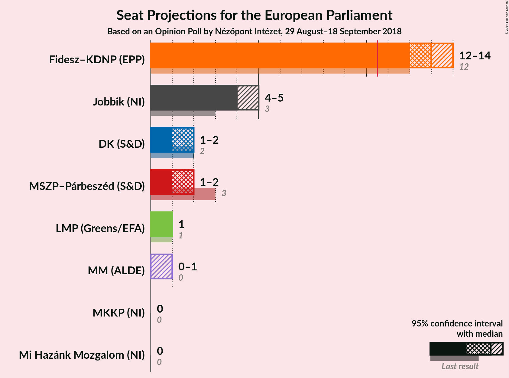

# Opinion Poll by Nézőpont Intézet, 29 August–18 September 2018

<a href="#voting-intentions">Voting Intentions</a> | <a href="#seats">Seats</a> | <a href="#coalitions">Coalitions</a> | <a href="#technical-information">Technical Information</a>

## Voting Intentions

### Confidence Intervals

| Party | Last Result | Poll Result | 80% Confidence Interval | 90% Confidence Interval | 95% Confidence Interval | 99% Confidence Interval |
|:-----:|:-----------:|:-----------:|:-----------------------:|:-----------------------:|:-----------------------:|:-----------------------:|
| Fidesz–KDNP (EPP) | 51.5% | 52.0% | 51.1–54.0% |50.7–54.4% |50.4–54.7% |49.7–55.4% |
| Jobbik (NI) | 14.7% | 18.0% | 17.1–19.4% |16.8–19.7% |16.6–20.0% |16.1–20.5% |
| MSZP–Párbeszéd (S&D) | 18.2% | 8.0% | N/A |N/A |N/A |N/A |
| DK (S&D) | 9.8% | 8.0% | 7.4–8.9% |7.1–9.2% |7.0–9.4% |6.6–9.8% |
| LMP (Greens/EFA) | 5.0% | 5.0% | 4.5–5.7% |4.3–5.9% |4.2–6.1% |3.9–6.4% |
| MM (ALDE) | 0.0% | 3.0% | 2.6–3.6% |2.5–3.8% |2.4–3.9% |2.2–4.2% |
| MKKP (NI) | 0.0% | 3.0% | N/A |N/A |N/A |N/A |
| Mi Hazánk Mozgalom (NI) | 0.0% | 1.0% | N/A |N/A |N/A |N/A |

*Note:* The poll result column reflects the actual value used in the calculations. Published results may vary slightly, and in addition be rounded to fewer digits.

## Seats

### Confidence Intervals

| Party | Last Result | Median | 80% Confidence Interval | 90% Confidence Interval | 95% Confidence Interval | 99% Confidence Interval |
|:-----:|:-----------:|:------:|:-----------------------:|:-----------------------:|:-----------------------:|:-----------------------:|
| <a href="#fidesz–kdnp-(epp)">Fidesz–KDNP (EPP)</a> | 12 | 13 | 12–13 |12–13 |12–14 |12–14 |
| <a href="#jobbik-(ni)">Jobbik (NI)</a> | 3 | 4 | 4 |4 |4–5 |3–5 |
| <a href="#mszp–párbeszéd-(s&d)">MSZP–Párbeszéd (S&D)</a> | 3 | N/A | N/A |N/A |N/A |N/A |
| <a href="#dk-(s&d)">DK (S&D)</a> | 2 | 2 | 1–2 |1–2 |1–2 |1–2 |
| <a href="#lmp-(greens/efa)">LMP (Greens/EFA)</a> | 1 | 1 | 1 |1 |1 |0–1 |
| <a href="#mm-(alde)">MM (ALDE)</a> | 0 | 0 | 0 |0 |0 |0–1 |
| <a href="#mkkp-(ni)">MKKP (NI)</a> | 0 | N/A | N/A |N/A |N/A |N/A |
| <a href="#mi-hazánk-mozgalom-(ni)">Mi Hazánk Mozgalom (NI)</a> | 0 | N/A | N/A |N/A |N/A |N/A |

