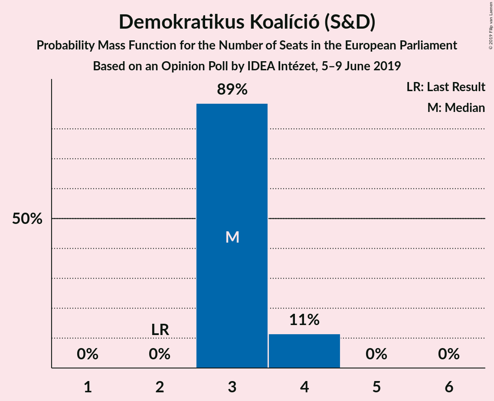
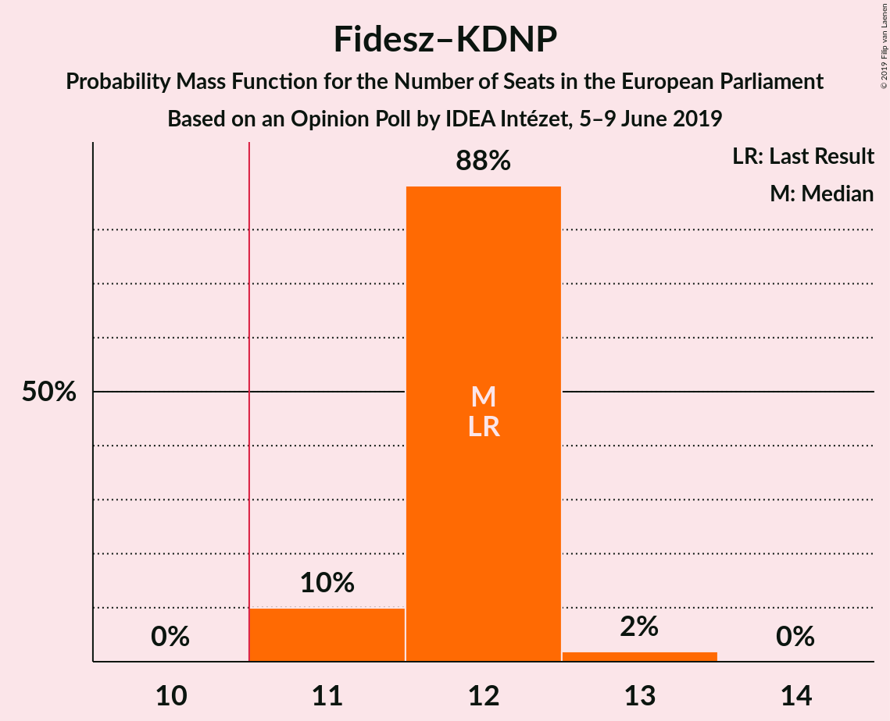
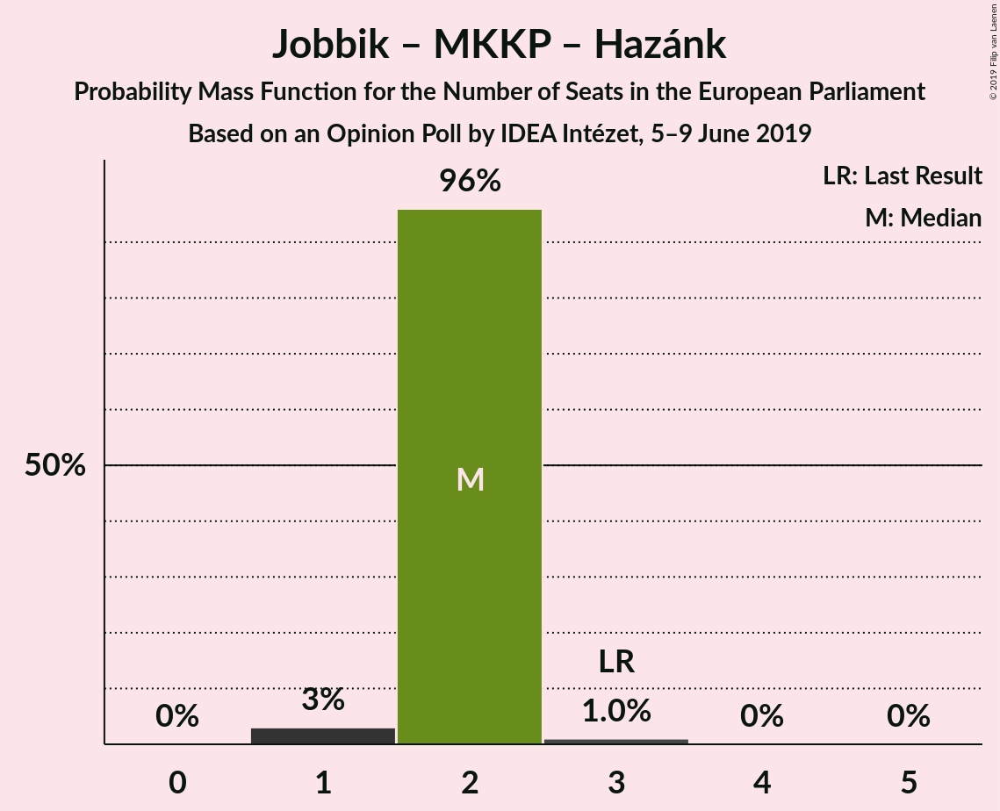

# Opinion Poll by IDEA Intézet, 5–9 June 2019

<a href="#voting-intentions">Voting Intentions</a> | <a href="#seats">Seats</a> | <a href="#coalitions">Coalitions</a> | <a href="#technical-information">Technical Information</a>

## Voting Intentions

### Confidence Intervals

| Party | Last Result | Poll Result | 80% Confidence Interval | 90% Confidence Interval | 95% Confidence Interval | 99% Confidence Interval |
|:-----:|:-----------:|:-----------:|:-----------------------:|:-----------------------:|:-----------------------:|:-----------------------:|
| Fidesz–Kereszténydemokrata Néppárt (EPP) | 51.5% | 48.0% | 46.6–49.5% |46.2–49.9% |45.9–50.3% |45.2–50.9% |
| Demokratikus Koalíció (S&D) | 9.8% | 14.7% | 13.7–15.8% |13.4–16.1% |13.2–16.3% |12.8–16.8% |
| Magyar Szocialista Párt–Párbeszéd (S&D) | 18.2% | 9.8% | 9.0–10.7% |8.8–11.0% |8.6–11.2% |8.2–11.6% |
| Jobbik (NI) | 14.7% | 8.8% | 8.0–9.7% |7.8–9.9% |7.6–10.1% |7.3–10.6% |
| Momentum Mozgalom (ALDE) | 0.0% | 8.8% | 8.0–9.7% |7.8–9.9% |7.6–10.1% |7.3–10.6% |
| Magyar Kétfarkú Kutya Párt (NI) | 0.0% | 3.0% | 2.5–3.5% |2.4–3.7% |2.3–3.8% |2.1–4.1% |
| Lehet Más a Politika (Greens/EFA) | 5.0% | 2.0% | 1.6–2.4% |1.5–2.5% |1.4–2.7% |1.3–2.9% |
| Mi Hazánk Mozgalom (NI) | 0.0% | 2.0% | 1.6–2.4% |1.5–2.5% |1.4–2.7% |1.3–2.9% |

*Note:* The poll result column reflects the actual value used in the calculations. Published results may vary slightly, and in addition be rounded to fewer digits.

## Seats

### Confidence Intervals

| Party | Last Result | Median | 80% Confidence Interval | 90% Confidence Interval | 95% Confidence Interval | 99% Confidence Interval |
|:-----:|:-----------:|:------:|:-----------------------:|:-----------------------:|:-----------------------:|:-----------------------:|
| <a href="#fidesz–kereszténydemokrata-néppárt-(epp)">Fidesz–Kereszténydemokrata Néppárt (EPP)</a> | 12 | 12 | 11–12 |11–12 |11–12 |11–13 |
| <a href="#demokratikus-koalíció-(s&d)">Demokratikus Koalíció (S&D)</a> | 2 | 3 | 3–4 |3–4 |3–4 |3–4 |
| <a href="#magyar-szocialista-párt–párbeszéd-(s&d)">Magyar Szocialista Párt–Párbeszéd (S&D)</a> | 3 | 2 | 2 |2 |2 |2 |
| <a href="#jobbik-(ni)">Jobbik (NI)</a> | 3 | 2 | 2 |2 |2 |1–2 |
| <a href="#momentum-mozgalom-(alde)">Momentum Mozgalom (ALDE)</a> | 0 | 2 | 2 |2 |1–2 |1–2 |
| <a href="#magyar-kétfarkú-kutya-párt-(ni)">Magyar Kétfarkú Kutya Párt (NI)</a> | 0 | 0 | 0 |0 |0 |0–1 |
| <a href="#lehet-más-a-politika-(greens/efa)">Lehet Más a Politika (Greens/EFA)</a> | 1 | 0 | 0 |0 |0 |0 |
| <a href="#mi-hazánk-mozgalom-(ni)">Mi Hazánk Mozgalom (NI)</a> | 0 | 0 | 0 |0 |0 |0 |

### Fidesz–Kereszténydemokrata Néppárt (EPP)

*For a full overview of the results for this party, see the [Fidesz–Kereszténydemokrata Néppárt (EPP)](party-fidesz–kereszténydemokratanéppártepp.html) page.*

| Number of Seats | Probability | Accumulated | Special Marks |
|:---------------:|:-----------:|:-----------:|:-------------:|
| 11 | 10% | 100% | Majority |
| 12 | 88% | 90% | Last Result, Median |
| 13 | 2% | 2% |  |
| 14 | 0% | 0% |  |

### Demokratikus Koalíció (S&D)

*For a full overview of the results for this party, see the [Demokratikus Koalíció (S&D)](party-demokratikuskoalíciósd.html) page.*

| Number of Seats | Probability | Accumulated | Special Marks |
|:---------------:|:-----------:|:-----------:|:-------------:|
| 2 | 0% | 100% | Last Result |
| 3 | 89% | 100% | Median |
| 4 | 11% | 11% |  |
| 5 | 0% | 0% |  |

### Magyar Szocialista Párt–Párbeszéd (S&D)

*For a full overview of the results for this party, see the [Magyar Szocialista Párt–Párbeszéd (S&D)](party-magyarszocialistapárt–párbeszédsd.html) page.*

| Number of Seats | Probability | Accumulated | Special Marks |
|:---------------:|:-----------:|:-----------:|:-------------:|
| 1 | 0.1% | 100% |  |
| 2 | 99.7% | 99.9% | Median |
| 3 | 0.2% | 0.2% | Last Result |
| 4 | 0% | 0% |  |

### Jobbik (NI)

*For a full overview of the results for this party, see the [Jobbik (NI)](party-jobbikni.html) page.*

| Number of Seats | Probability | Accumulated | Special Marks |
|:---------------:|:-----------:|:-----------:|:-------------:|
| 1 | 2% | 100% |  |
| 2 | 98% | 98% | Median |
| 3 | 0% | 0% | Last Result |

### Momentum Mozgalom (ALDE)

*For a full overview of the results for this party, see the [Momentum Mozgalom (ALDE)](party-momentummozgalomalde.html) page.*

| Number of Seats | Probability | Accumulated | Special Marks |
|:---------------:|:-----------:|:-----------:|:-------------:|
| 0 | 0% | 100% | Last Result |
| 1 | 3% | 100% |  |
| 2 | 97% | 97% | Median |
| 3 | 0% | 0% |  |

### Magyar Kétfarkú Kutya Párt (NI)

*For a full overview of the results for this party, see the [Magyar Kétfarkú Kutya Párt (NI)](party-magyarkétfarkúkutyapártni.html) page.*

| Number of Seats | Probability | Accumulated | Special Marks |
|:---------------:|:-----------:|:-----------:|:-------------:|
| 0 | 98.5% | 100% | Last Result, Median |
| 1 | 1.5% | 1.5% |  |
| 2 | 0% | 0% |  |

### Lehet Más a Politika (Greens/EFA)

*For a full overview of the results for this party, see the [Lehet Más a Politika (Greens/EFA)](party-lehetmásapolitikagreensefa.html) page.*

| Number of Seats | Probability | Accumulated | Special Marks |
|:---------------:|:-----------:|:-----------:|:-------------:|
| 0 | 100% | 100% | Median |
| 1 | 0% | 0% | Last Result |

### Mi Hazánk Mozgalom (NI)

*For a full overview of the results for this party, see the [Mi Hazánk Mozgalom (NI)](party-mihazánkmozgalomni.html) page.*

| Number of Seats | Probability | Accumulated | Special Marks |
|:---------------:|:-----------:|:-----------:|:-------------:|
| 0 | 100% | 100% | Last Result, Median |

## Coalitions

### Confidence Intervals

| Coalition | Last Result | Median | Majority? | 80% Confidence Interval | 90% Confidence Interval | 95% Confidence Interval | 99% Confidence Interval |
|:---------:|:-----------:|:------:|:---------:|:-----------------------:|:-----------------------:|:-----------------------:|:-----------------------:|
| Fidesz–Kereszténydemokrata Néppárt (EPP) | 12 | 12 | 100% | 11–12 | 11–12 | 11–12 | 11–13 |
| Jobbik (NI) – Magyar Kétfarkú Kutya Párt (NI) – Mi Hazánk Mozgalom (NI) | 3 | 2 | 0% | 2 | 2 | 2 | 1–3 |

### Fidesz–Kereszténydemokrata Néppárt (EPP)

| Number of Seats | Probability | Accumulated | Special Marks |
|:---------------:|:-----------:|:-----------:|:-------------:|
| 11 | 10% | 100% | Majority |
| 12 | 88% | 90% | Last Result, Median |
| 13 | 2% | 2% |  |
| 14 | 0% | 0% |  |

### Jobbik (NI) – Magyar Kétfarkú Kutya Párt (NI) – Mi Hazánk Mozgalom (NI)

| Number of Seats | Probability | Accumulated | Special Marks |
|:---------------:|:-----------:|:-----------:|:-------------:|
| 1 | 2% | 100% |  |
| 2 | 97% | 98% | Median |
| 3 | 1.3% | 1.3% | Last Result |
| 4 | 0% | 0% |  |

## Technical Information

### Opinion Poll

+ **Polling firm:** IDEA Intézet
+ **Commissioner(s):** —
+ **Fieldwork period:** 5–9 June 2019

### Calculations

+ **Sample size:** 2000
+ **Simulations done:** 131,072
+ **Error estimate:** 2.33%

