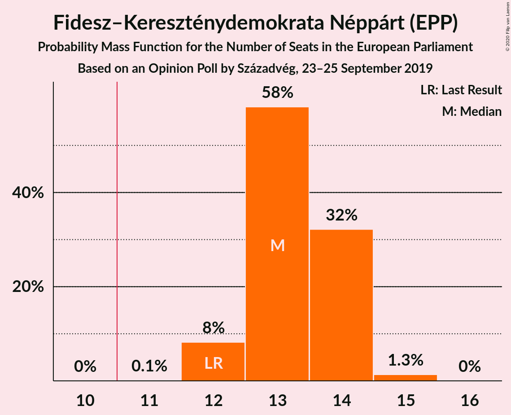
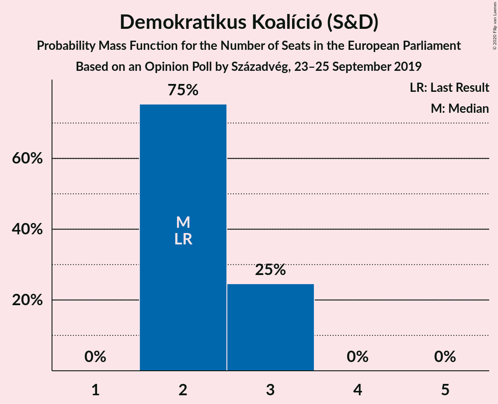
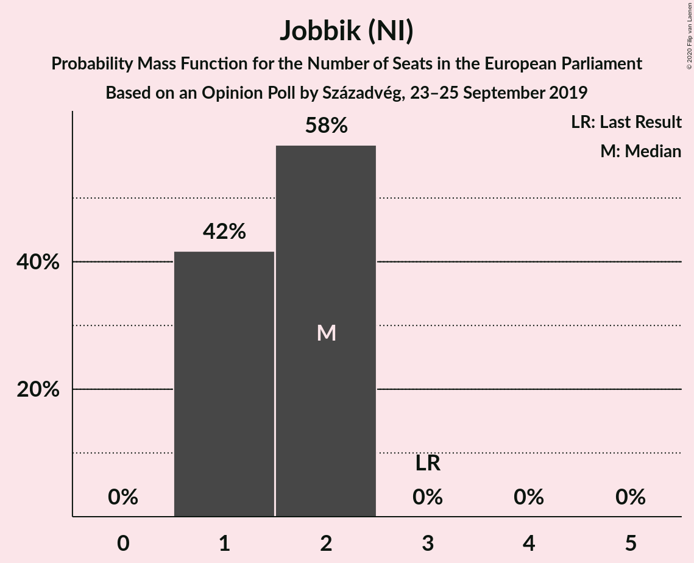
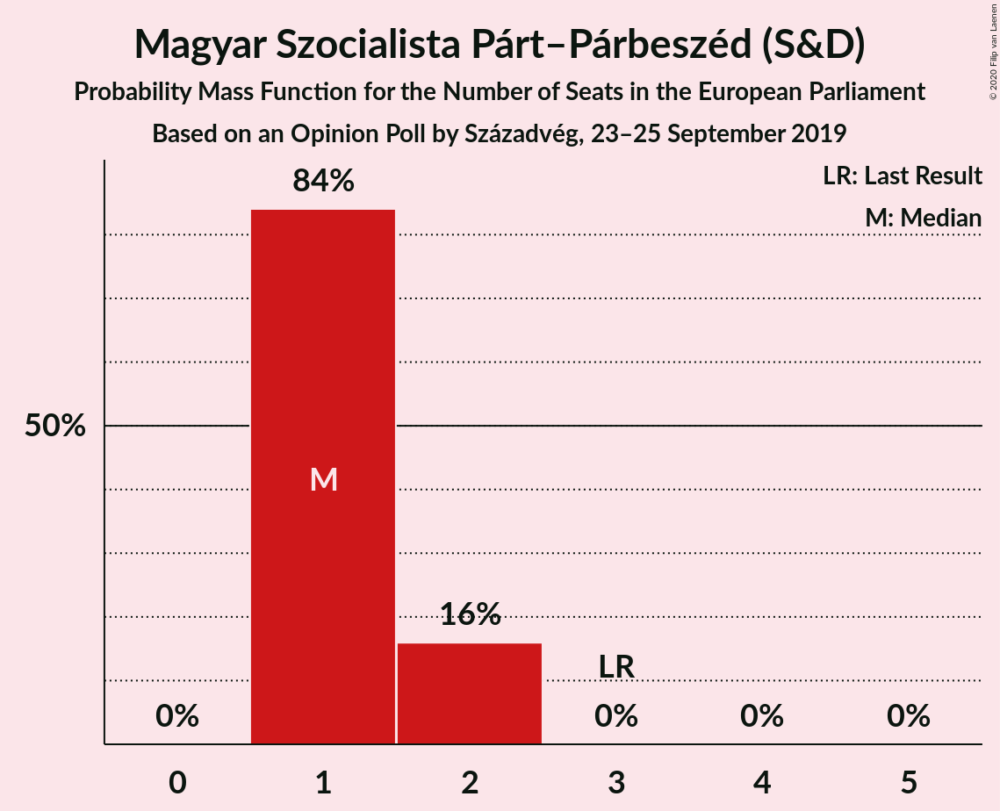
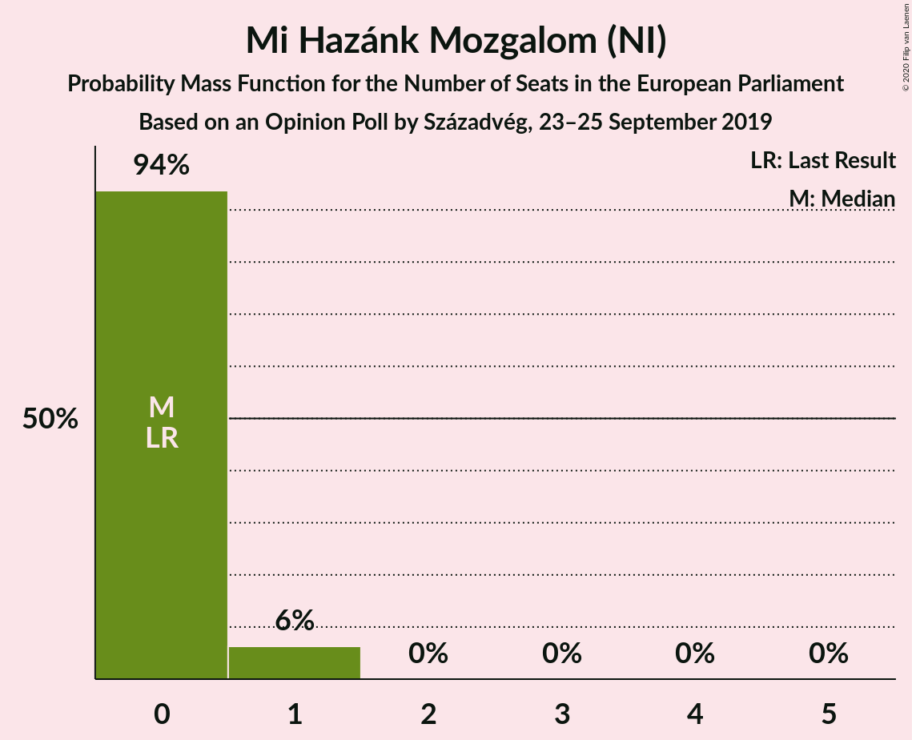
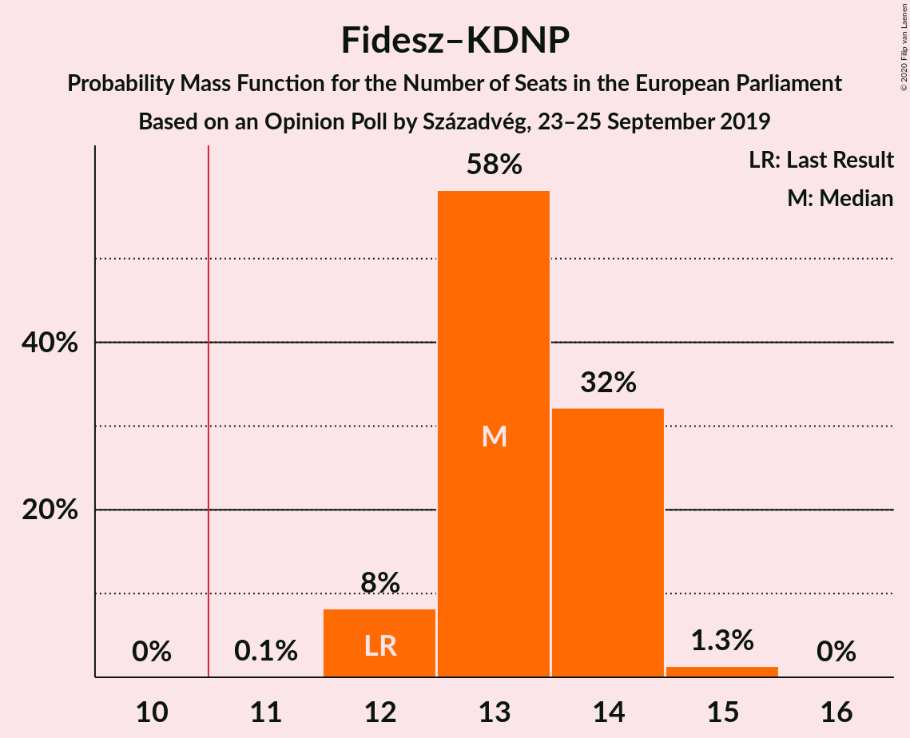

# Opinion Poll by Századvég, 23–25 September 2019

<a href="#voting-intentions">Voting Intentions</a> | <a href="#seats">Seats</a> | <a href="#coalitions">Coalitions</a> | <a href="#technical-information">Technical Information</a>

## Voting Intentions

### Confidence Intervals

| Party | Last Result | Poll Result | 80% Confidence Interval | 90% Confidence Interval | 95% Confidence Interval | 99% Confidence Interval |
|:-----:|:-----------:|:-----------:|:-----------------------:|:-----------------------:|:-----------------------:|:-----------------------:|
| Fidesz–Kereszténydemokrata Néppárt (EPP) | 51.5% | 54.0% | 52.0–56.0% |51.4–56.6% |50.9–57.1% |49.9–58.0% |
| Demokratikus Koalíció (S&D) | 9.8% | 11.0% | 9.8–12.4% |9.5–12.8% |9.2–13.1% |8.7–13.8% |
| Momentum Mozgalom (RE) | 0.0% | 10.0% | 8.9–11.3% |8.6–11.7% |8.3–12.0% |7.8–12.7% |
| Jobbik (NI) | 14.7% | 8.0% | 7.0–9.2% |6.7–9.6% |6.5–9.9% |6.0–10.5% |
| Magyar Szocialista Párt–Párbeszéd (S&D) | 18.2% | 7.0% | 6.1–8.2% |5.8–8.5% |5.6–8.8% |5.2–9.3% |
| Lehet Más a Politika (Greens/EFA) | 5.0% | 3.0% | 2.4–3.8% |2.2–4.1% |2.1–4.3% |1.9–4.7% |
| Mi Hazánk Mozgalom (NI) | 0.0% | 3.0% | 2.4–3.8% |2.2–4.1% |2.1–4.3% |1.9–4.7% |

*Note:* The poll result column reflects the actual value used in the calculations. Published results may vary slightly, and in addition be rounded to fewer digits.

## Seats

### Confidence Intervals

| Party | Last Result | Median | 80% Confidence Interval | 90% Confidence Interval | 95% Confidence Interval | 99% Confidence Interval |
|:-----:|:-----------:|:------:|:-----------------------:|:-----------------------:|:-----------------------:|:-----------------------:|
| <a href="#fidesz–kereszténydemokrata-néppárt-(epp)">Fidesz–Kereszténydemokrata Néppárt (EPP)</a> | 12 | 13 | 13–14 |12–14 |12–14 |12–15 |
| <a href="#demokratikus-koalíció-(s&d)">Demokratikus Koalíció (S&D)</a> | 2 | 2 | 2–3 |2–3 |2–3 |2–3 |
| <a href="#momentum-mozgalom-(re)">Momentum Mozgalom (RE)</a> | 0 | 2 | 2 |2 |2–3 |1–3 |
| <a href="#jobbik-(ni)">Jobbik (NI)</a> | 3 | 2 | 1–2 |1–2 |1–2 |1–2 |
| <a href="#magyar-szocialista-párt–párbeszéd-(s&d)">Magyar Szocialista Párt–Párbeszéd (S&D)</a> | 3 | 1 | 1–2 |1–2 |1–2 |1–2 |
| <a href="#lehet-más-a-politika-(greens/efa)">Lehet Más a Politika (Greens/EFA)</a> | 1 | 0 | 0 |0 |0–1 |0–1 |
| <a href="#mi-hazánk-mozgalom-(ni)">Mi Hazánk Mozgalom (NI)</a> | 0 | 0 | 0 |0–1 |0–1 |0–1 |

### Fidesz–Kereszténydemokrata Néppárt (EPP)

*For a full overview of the results for this party, see the [Fidesz–Kereszténydemokrata Néppárt (EPP)](party-fidesz–kereszténydemokratanéppártepp.html) page.*

| Number of Seats | Probability | Accumulated | Special Marks |
|:---------------:|:-----------:|:-----------:|:-------------:|
| 11 | 0.1% | 100% | Majority |
| 12 | 8% | 99.9% | Last Result |
| 13 | 55% | 92% | Median |
| 14 | 36% | 37% |  |
| 15 | 0.6% | 0.6% |  |
| 16 | 0% | 0% |  |

### Demokratikus Koalíció (S&D)

*For a full overview of the results for this party, see the [Demokratikus Koalíció (S&D)](party-demokratikuskoalíciósd.html) page.*

| Number of Seats | Probability | Accumulated | Special Marks |
|:---------------:|:-----------:|:-----------:|:-------------:|
| 2 | 74% | 100% | Last Result, Median |
| 3 | 26% | 26% |  |
| 4 | 0% | 0% |  |

### Momentum Mozgalom (RE)

*For a full overview of the results for this party, see the [Momentum Mozgalom (RE)](party-momentummozgalomre.html) page.*

| Number of Seats | Probability | Accumulated | Special Marks |
|:---------------:|:-----------:|:-----------:|:-------------:|
| 0 | 0% | 100% | Last Result |
| 1 | 0.7% | 100% |  |
| 2 | 96% | 99.3% | Median |
| 3 | 4% | 4% |  |
| 4 | 0% | 0% |  |

### Jobbik (NI)

*For a full overview of the results for this party, see the [Jobbik (NI)](party-jobbikni.html) page.*

| Number of Seats | Probability | Accumulated | Special Marks |
|:---------------:|:-----------:|:-----------:|:-------------:|
| 1 | 43% | 100% |  |
| 2 | 57% | 57% | Median |
| 3 | 0% | 0% | Last Result |

### Magyar Szocialista Párt–Párbeszéd (S&D)

*For a full overview of the results for this party, see the [Magyar Szocialista Párt–Párbeszéd (S&D)](party-magyarszocialistapárt–párbeszédsd.html) page.*

| Number of Seats | Probability | Accumulated | Special Marks |
|:---------------:|:-----------:|:-----------:|:-------------:|
| 1 | 86% | 100% | Median |
| 2 | 14% | 14% |  |
| 3 | 0% | 0% | Last Result |

### Lehet Más a Politika (Greens/EFA)

*For a full overview of the results for this party, see the [Lehet Más a Politika (Greens/EFA)](party-lehetmásapolitikagreensefa.html) page.*

| Number of Seats | Probability | Accumulated | Special Marks |
|:---------------:|:-----------:|:-----------:|:-------------:|
| 0 | 95% | 100% | Median |
| 1 | 5% | 5% | Last Result |
| 2 | 0% | 0% |  |

### Mi Hazánk Mozgalom (NI)

*For a full overview of the results for this party, see the [Mi Hazánk Mozgalom (NI)](party-mihazánkmozgalomni.html) page.*

| Number of Seats | Probability | Accumulated | Special Marks |
|:---------------:|:-----------:|:-----------:|:-------------:|
| 0 | 92% | 100% | Last Result, Median |
| 1 | 8% | 8% |  |
| 2 | 0% | 0% |  |

## Coalitions

### Confidence Intervals

| Coalition | Last Result | Median | Majority? | 80% Confidence Interval | 90% Confidence Interval | 95% Confidence Interval | 99% Confidence Interval |
|:---------:|:-----------:|:------:|:---------:|:-----------------------:|:-----------------------:|:-----------------------:|:-----------------------:|
| Fidesz–Kereszténydemokrata Néppárt (EPP) | 12 | 13 | 100% | 13–14 | 12–14 | 12–14 | 12–15 |

### Fidesz–Kereszténydemokrata Néppárt (EPP)

| Number of Seats | Probability | Accumulated | Special Marks |
|:---------------:|:-----------:|:-----------:|:-------------:|
| 11 | 0.1% | 100% | Majority |
| 12 | 8% | 99.9% | Last Result |
| 13 | 55% | 92% | Median |
| 14 | 36% | 37% |  |
| 15 | 0.6% | 0.6% |  |
| 16 | 0% | 0% |  |

## Technical Information

### Opinion Poll

+ **Polling firm:** Századvég
+ **Commissioner(s):** —
+ **Fieldwork period:** 23–25 September 2019

### Calculations

+ **Sample size:** 1000
+ **Simulations done:** 131,072
+ **Error estimate:** 1.25%

