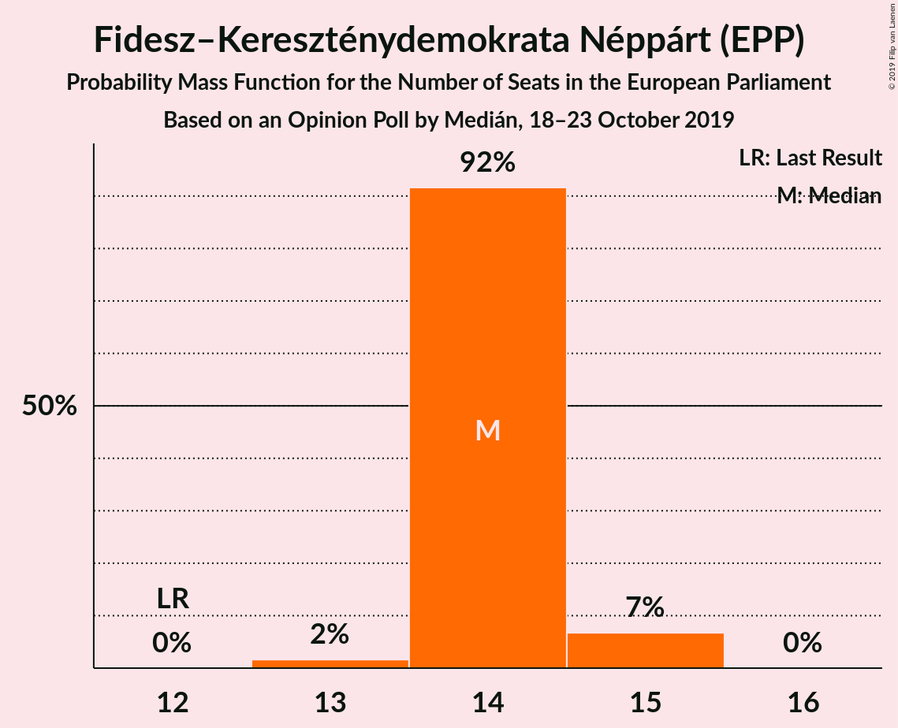
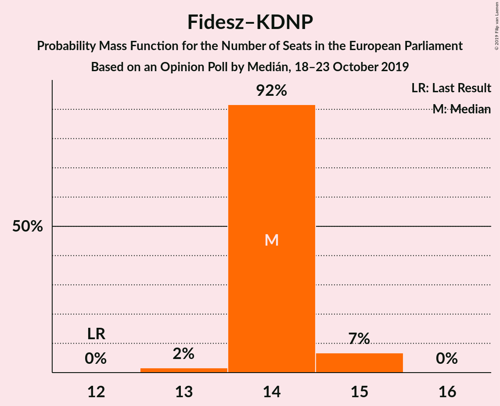
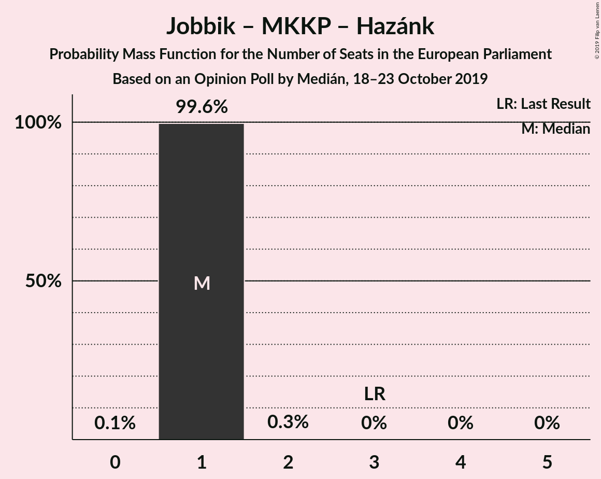

# Opinion Poll by Medián, 18–23 October 2019

<a href="#voting-intentions">Voting Intentions</a> | <a href="#seats">Seats</a> | <a href="#coalitions">Coalitions</a> | <a href="#technical-information">Technical Information</a>

## Voting Intentions

### Confidence Intervals

| Party | Last Result | Poll Result | 80% Confidence Interval | 90% Confidence Interval | 95% Confidence Interval | 99% Confidence Interval |
|:-----:|:-----------:|:-----------:|:-----------------------:|:-----------------------:|:-----------------------:|:-----------------------:|
| Fidesz–Kereszténydemokrata Néppárt (EPP) | 51.5% | 59.4% | 57.6–61.2% |57.0–61.7% |56.6–62.2% |55.7–63.0% |
| Demokratikus Koalíció (S&D) | 9.8% | 14.1% | 12.9–15.5% |12.5–15.8% |12.2–16.2% |11.7–16.8% |
| Magyar Szocialista Párt–Párbeszéd (S&D) | 18.2% | 9.3% | 8.3–10.5% |8.0–10.8% |7.8–11.1% |7.4–11.7% |
| Jobbik (NI) | 14.7% | 6.1% | 5.3–7.1% |5.0–7.3% |4.9–7.6% |4.5–8.1% |
| Momentum Mozgalom (RE) | 0.0% | 6.1% | 5.3–7.1% |5.0–7.3% |4.9–7.6% |4.5–8.1% |
| Lehet Más a Politika (Greens/EFA) | 5.0% | 2.0% | 1.6–2.6% |1.4–2.8% |1.3–3.0% |1.2–3.3% |
| Magyar Kétfarkú Kutya Párt (NI) | 0.0% | 1.0% | 0.7–1.5% |0.6–1.6% |0.6–1.8% |0.5–2.0% |
| Mi Hazánk Mozgalom (NI) | 0.0% | 1.0% | 0.7–1.5% |0.6–1.6% |0.6–1.8% |0.5–2.0% |

*Note:* The poll result column reflects the actual value used in the calculations. Published results may vary slightly, and in addition be rounded to fewer digits.

## Seats

### Confidence Intervals

| Party | Last Result | Median | 80% Confidence Interval | 90% Confidence Interval | 95% Confidence Interval | 99% Confidence Interval |
|:-----:|:-----------:|:------:|:-----------------------:|:-----------------------:|:-----------------------:|:-----------------------:|
| <a href="#fidesz–kereszténydemokrata-néppárt-(epp)">Fidesz–Kereszténydemokrata Néppárt (EPP)</a> | 12 | 14 | 14 |14–15 |14–15 |13–15 |
| <a href="#demokratikus-koalíció-(s&d)">Demokratikus Koalíció (S&D)</a> | 2 | 3 | 3 |3 |3 |2–4 |
| <a href="#magyar-szocialista-párt–párbeszéd-(s&d)">Magyar Szocialista Párt–Párbeszéd (S&D)</a> | 3 | 2 | 2 |1–2 |1–2 |1–2 |
| <a href="#jobbik-(ni)">Jobbik (NI)</a> | 3 | 1 | 1 |1 |1 |1 |
| <a href="#momentum-mozgalom-(re)">Momentum Mozgalom (RE)</a> | 0 | 1 | 1 |1 |1 |1 |
| <a href="#lehet-más-a-politika-(greens/efa)">Lehet Más a Politika (Greens/EFA)</a> | 1 | 0 | 0 |0 |0 |0 |
| <a href="#magyar-kétfarkú-kutya-párt-(ni)">Magyar Kétfarkú Kutya Párt (NI)</a> | 0 | 0 | 0 |0 |0 |0 |
| <a href="#mi-hazánk-mozgalom-(ni)">Mi Hazánk Mozgalom (NI)</a> | 0 | 0 | 0 |0 |0 |0 |

### Fidesz–Kereszténydemokrata Néppárt (EPP)

*For a full overview of the results for this party, see the [Fidesz–Kereszténydemokrata Néppárt (EPP)](party-fidesz–kereszténydemokratanéppártepp.html) page.*

| Number of Seats | Probability | Accumulated | Special Marks |
|:---------------:|:-----------:|:-----------:|:-------------:|
| 12 | 0% | 100% | Last Result |
| 13 | 2% | 100% |  |
| 14 | 92% | 98% | Median |
| 15 | 7% | 7% |  |
| 16 | 0% | 0% |  |

### Demokratikus Koalíció (S&D)

*For a full overview of the results for this party, see the [Demokratikus Koalíció (S&D)](party-demokratikuskoalíciósd.html) page.*

| Number of Seats | Probability | Accumulated | Special Marks |
|:---------------:|:-----------:|:-----------:|:-------------:|
| 2 | 2% | 100% | Last Result |
| 3 | 96% | 98% | Median |
| 4 | 2% | 2% |  |
| 5 | 0% | 0% |  |

### Magyar Szocialista Párt–Párbeszéd (S&D)

*For a full overview of the results for this party, see the [Magyar Szocialista Párt–Párbeszéd (S&D)](party-magyarszocialistapárt–párbeszédsd.html) page.*

| Number of Seats | Probability | Accumulated | Special Marks |
|:---------------:|:-----------:|:-----------:|:-------------:|
| 1 | 5% | 100% |  |
| 2 | 95% | 95% | Median |
| 3 | 0.1% | 0.1% | Last Result |
| 4 | 0% | 0% |  |

### Jobbik (NI)

*For a full overview of the results for this party, see the [Jobbik (NI)](party-jobbikni.html) page.*

| Number of Seats | Probability | Accumulated | Special Marks |
|:---------------:|:-----------:|:-----------:|:-------------:|
| 0 | 0.1% | 100% |  |
| 1 | 99.6% | 99.9% | Median |
| 2 | 0.3% | 0.3% |  |
| 3 | 0% | 0% | Last Result |

### Momentum Mozgalom (RE)

*For a full overview of the results for this party, see the [Momentum Mozgalom (RE)](party-momentummozgalomre.html) page.*

| Number of Seats | Probability | Accumulated | Special Marks |
|:---------------:|:-----------:|:-----------:|:-------------:|
| 0 | 0% | 100% | Last Result |
| 1 | 99.7% | 100% | Median |
| 2 | 0.3% | 0.3% |  |
| 3 | 0% | 0% |  |

### Lehet Más a Politika (Greens/EFA)

*For a full overview of the results for this party, see the [Lehet Más a Politika (Greens/EFA)](party-lehetmásapolitikagreensefa.html) page.*

| Number of Seats | Probability | Accumulated | Special Marks |
|:---------------:|:-----------:|:-----------:|:-------------:|
| 0 | 100% | 100% | Median |
| 1 | 0% | 0% | Last Result |

### Magyar Kétfarkú Kutya Párt (NI)

*For a full overview of the results for this party, see the [Magyar Kétfarkú Kutya Párt (NI)](party-magyarkétfarkúkutyapártni.html) page.*

| Number of Seats | Probability | Accumulated | Special Marks |
|:---------------:|:-----------:|:-----------:|:-------------:|
| 0 | 100% | 100% | Last Result, Median |

### Mi Hazánk Mozgalom (NI)

*For a full overview of the results for this party, see the [Mi Hazánk Mozgalom (NI)](party-mihazánkmozgalomni.html) page.*

| Number of Seats | Probability | Accumulated | Special Marks |
|:---------------:|:-----------:|:-----------:|:-------------:|
| 0 | 100% | 100% | Last Result, Median |

## Coalitions

### Confidence Intervals

| Coalition | Last Result | Median | Majority? | 80% Confidence Interval | 90% Confidence Interval | 95% Confidence Interval | 99% Confidence Interval |
|:---------:|:-----------:|:------:|:---------:|:-----------------------:|:-----------------------:|:-----------------------:|:-----------------------:|
| Fidesz–Kereszténydemokrata Néppárt (EPP) | 12 | 14 | 100% | 14 | 14–15 | 14–15 | 13–15 |
| Jobbik (NI) – Magyar Kétfarkú Kutya Párt (NI) – Mi Hazánk Mozgalom (NI) | 3 | 1 | 0% | 1 | 1 | 1 | 1 |

### Fidesz–Kereszténydemokrata Néppárt (EPP)

| Number of Seats | Probability | Accumulated | Special Marks |
|:---------------:|:-----------:|:-----------:|:-------------:|
| 12 | 0% | 100% | Last Result |
| 13 | 2% | 100% |  |
| 14 | 92% | 98% | Median |
| 15 | 7% | 7% |  |
| 16 | 0% | 0% |  |

### Jobbik (NI) – Magyar Kétfarkú Kutya Párt (NI) – Mi Hazánk Mozgalom (NI)

| Number of Seats | Probability | Accumulated | Special Marks |
|:---------------:|:-----------:|:-----------:|:-------------:|
| 0 | 0.1% | 100% |  |
| 1 | 99.6% | 99.9% | Median |
| 2 | 0.3% | 0.3% |  |
| 3 | 0% | 0% | Last Result |

## Technical Information

### Opinion Poll

+ **Polling firm:** Medián
+ **Commissioner(s):** —
+ **Fieldwork period:** 18–23 October 2019

### Calculations

+ **Sample size:** 1200
+ **Simulations done:** 1,048,576
+ **Error estimate:** 0.82%

