# Opinion Poll by Nézőpont Intézet, 14–27 October 2019

<a href="#voting-intentions">Voting Intentions</a> | <a href="#seats">Seats</a> | <a href="#coalitions">Coalitions</a> | <a href="#technical-information">Technical Information</a>

## Voting Intentions

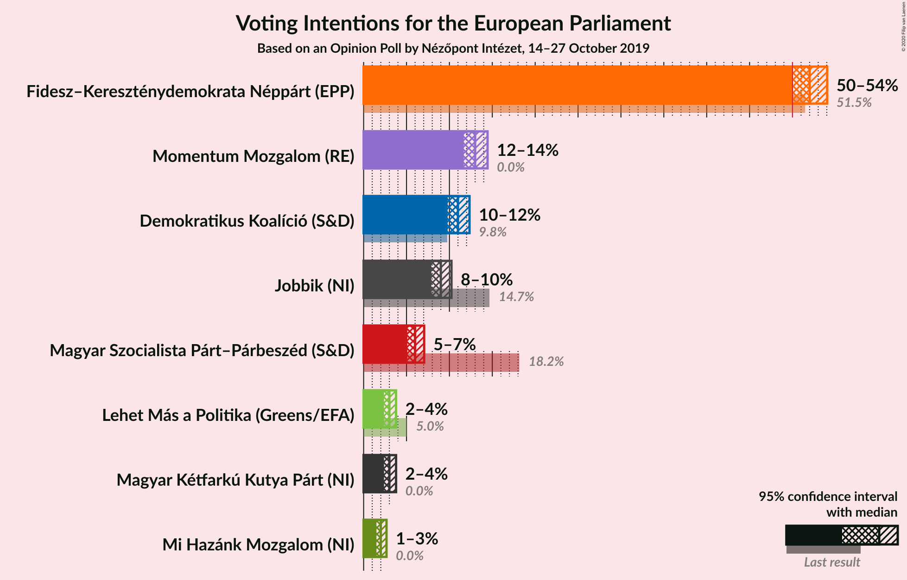

### Confidence Intervals

| Party | Last Result | Poll Result | 80% Confidence Interval | 90% Confidence Interval | 95% Confidence Interval | 99% Confidence Interval |
|:-----:|:-----------:|:-----------:|:-----------------------:|:-----------------------:|:-----------------------:|:-----------------------:|
| Fidesz–Kereszténydemokrata Néppárt (EPP) | 51.5% | 52.0% | 50.7–53.3% |50.3–53.7% |49.9–54.0% |49.3–54.7% |
| Momentum Mozgalom (RE) | 0.0% | 13.0% | 12.1–13.9% |11.9–14.2% |11.7–14.4% |11.3–14.9% |
| Demokratikus Koalíció (S&D) | 9.8% | 11.0% | 10.2–11.9% |10.0–12.1% |9.8–12.3% |9.4–12.8% |
| Jobbik (NI) | 14.7% | 9.0% | 8.3–9.8% |8.1–10.0% |7.9–10.2% |7.6–10.7% |
| Magyar Szocialista Párt–Párbeszéd (S&D) | 18.2% | 6.0% | 5.4–6.7% |5.2–6.9% |5.1–7.1% |4.8–7.4% |
| Lehet Más a Politika (Greens/EFA) | 5.0% | 3.0% | 2.6–3.5% |2.5–3.7% |2.4–3.8% |2.2–4.0% |
| Magyar Kétfarkú Kutya Párt (NI) | 0.0% | 3.0% | 2.6–3.5% |2.5–3.7% |2.4–3.8% |2.2–4.0% |
| Mi Hazánk Mozgalom (NI) | 0.0% | 2.0% | 1.7–2.4% |1.6–2.6% |1.5–2.7% |1.4–2.9% |

*Note:* The poll result column reflects the actual value used in the calculations. Published results may vary slightly, and in addition be rounded to fewer digits.

## Seats

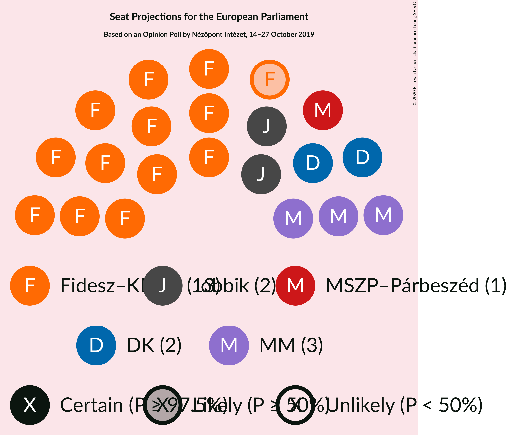

### Confidence Intervals

| Party | Last Result | Median | 80% Confidence Interval | 90% Confidence Interval | 95% Confidence Interval | 99% Confidence Interval |
|:-----:|:-----------:|:------:|:-----------------------:|:-----------------------:|:-----------------------:|:-----------------------:|
| <a href="#fidesz–kereszténydemokrata-néppárt-(epp)">Fidesz–Kereszténydemokrata Néppárt (EPP)</a> | 12 | 13 | 13 |13 |13 |12–13 |
| <a href="#momentum-mozgalom-(re)">Momentum Mozgalom (RE)</a> | 0 | 3 | 3 |3 |3 |3 |
| <a href="#demokratikus-koalíció-(s&d)">Demokratikus Koalíció (S&D)</a> | 2 | 2 | 2 |2 |2 |2–3 |
| <a href="#jobbik-(ni)">Jobbik (NI)</a> | 3 | 2 | 2 |2 |2 |2 |
| <a href="#magyar-szocialista-párt–párbeszéd-(s&d)">Magyar Szocialista Párt–Párbeszéd (S&D)</a> | 3 | 1 | 1 |1 |1 |1 |
| <a href="#lehet-más-a-politika-(greens/efa)">Lehet Más a Politika (Greens/EFA)</a> | 1 | 0 | 0 |0 |0 |0 |
| <a href="#magyar-kétfarkú-kutya-párt-(ni)">Magyar Kétfarkú Kutya Párt (NI)</a> | 0 | 0 | 0 |0 |0 |0 |
| <a href="#mi-hazánk-mozgalom-(ni)">Mi Hazánk Mozgalom (NI)</a> | 0 | 0 | 0 |0 |0 |0 |

### Fidesz–Kereszténydemokrata Néppárt (EPP)

*For a full overview of the results for this party, see the [Fidesz–Kereszténydemokrata Néppárt (EPP)](party-fidesz–kereszténydemokratanéppártepp.html) page.*

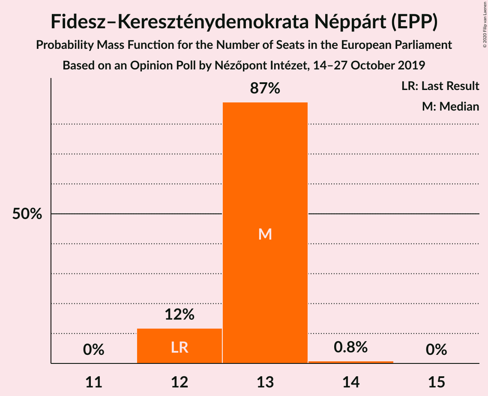

| Number of Seats | Probability | Accumulated | Special Marks |
|:---------------:|:-----------:|:-----------:|:-------------:|
| 12 | 0.6% | 100% | Last Result |
| 13 | 99.3% | 99.4% | Median |
| 14 | 0.1% | 0.1% |  |
| 15 | 0% | 0% |  |

### Momentum Mozgalom (RE)

*For a full overview of the results for this party, see the [Momentum Mozgalom (RE)](party-momentummozgalomre.html) page.*

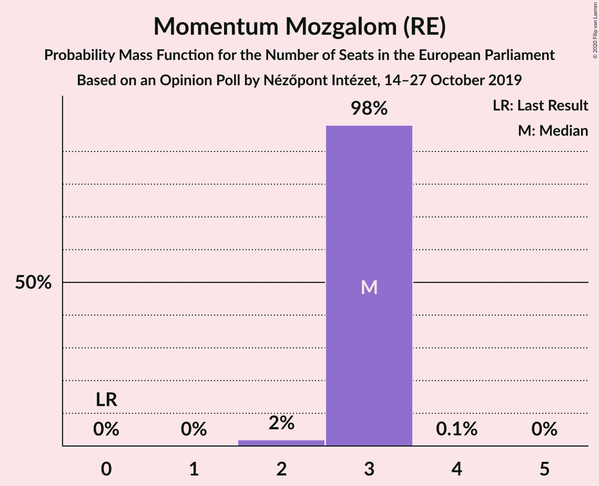

| Number of Seats | Probability | Accumulated | Special Marks |
|:---------------:|:-----------:|:-----------:|:-------------:|
| 0 | 0% | 100% | Last Result |
| 1 | 0% | 100% |  |
| 2 | 0.1% | 100% |  |
| 3 | 99.9% | 99.9% | Median |
| 4 | 0% | 0% |  |

### Demokratikus Koalíció (S&D)

*For a full overview of the results for this party, see the [Demokratikus Koalíció (S&D)](party-demokratikuskoalíciósd.html) page.*

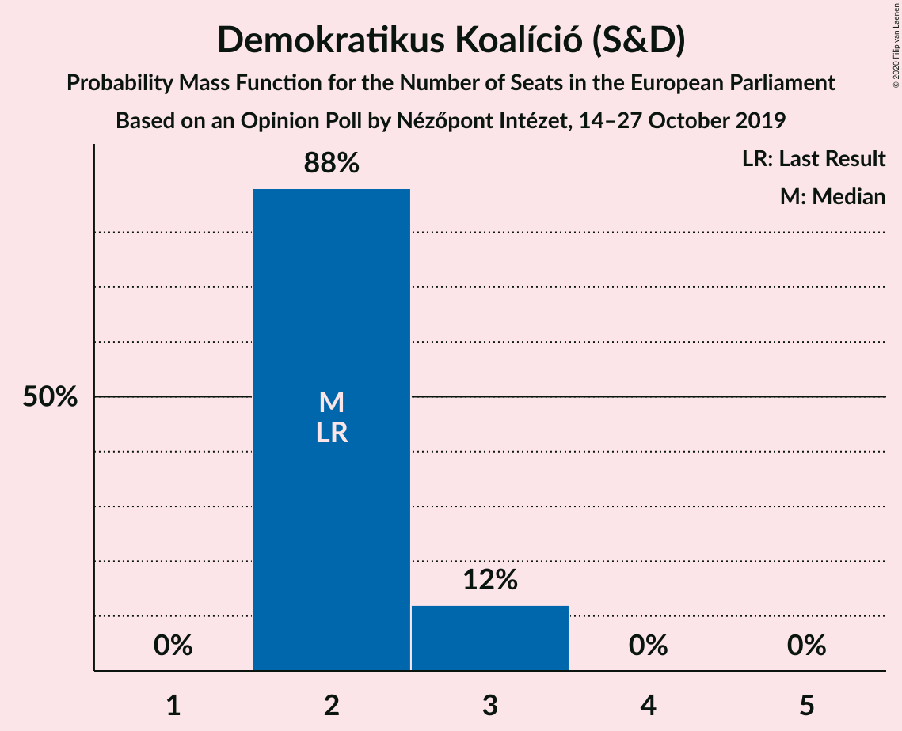

| Number of Seats | Probability | Accumulated | Special Marks |
|:---------------:|:-----------:|:-----------:|:-------------:|
| 2 | 99.4% | 100% | Last Result, Median |
| 3 | 0.6% | 0.6% |  |
| 4 | 0% | 0% |  |

### Jobbik (NI)

*For a full overview of the results for this party, see the [Jobbik (NI)](party-jobbikni.html) page.*

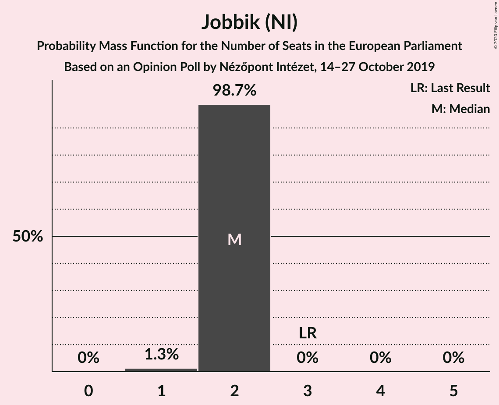

| Number of Seats | Probability | Accumulated | Special Marks |
|:---------------:|:-----------:|:-----------:|:-------------:|
| 1 | 0.1% | 100% |  |
| 2 | 99.9% | 99.9% | Median |
| 3 | 0% | 0% | Last Result |

### Magyar Szocialista Párt–Párbeszéd (S&D)

*For a full overview of the results for this party, see the [Magyar Szocialista Párt–Párbeszéd (S&D)](party-magyarszocialistapárt–párbeszédsd.html) page.*

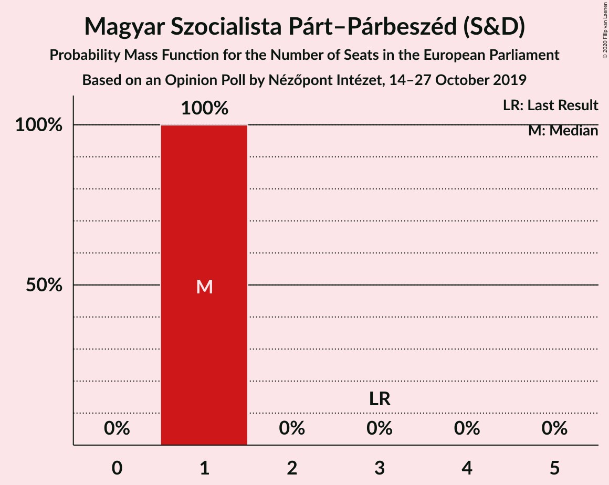

| Number of Seats | Probability | Accumulated | Special Marks |
|:---------------:|:-----------:|:-----------:|:-------------:|
| 1 | 100% | 100% | Median |
| 2 | 0% | 0% |  |
| 3 | 0% | 0% | Last Result |

### Lehet Más a Politika (Greens/EFA)

*For a full overview of the results for this party, see the [Lehet Más a Politika (Greens/EFA)](party-lehetmásapolitikagreensefa.html) page.*

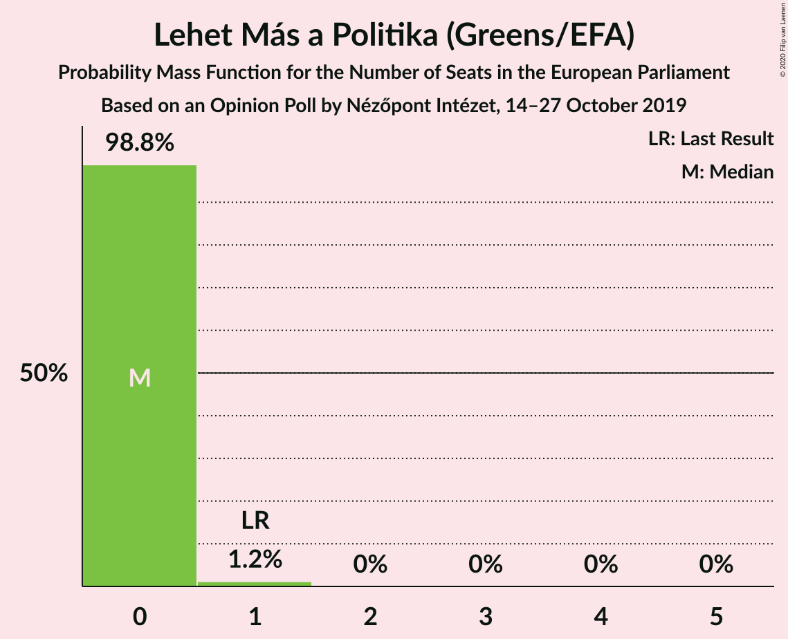

| Number of Seats | Probability | Accumulated | Special Marks |
|:---------------:|:-----------:|:-----------:|:-------------:|
| 0 | 100% | 100% | Median |
| 1 | 0% | 0% | Last Result |

### Magyar Kétfarkú Kutya Párt (NI)

*For a full overview of the results for this party, see the [Magyar Kétfarkú Kutya Párt (NI)](party-magyarkétfarkúkutyapártni.html) page.*

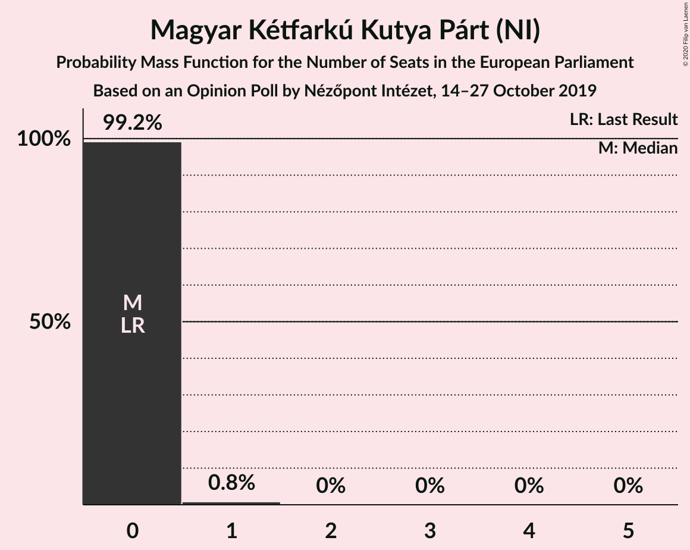

| Number of Seats | Probability | Accumulated | Special Marks |
|:---------------:|:-----------:|:-----------:|:-------------:|
| 0 | 99.9% | 100% | Last Result, Median |
| 1 | 0.1% | 0.1% |  |
| 2 | 0% | 0% |  |

### Mi Hazánk Mozgalom (NI)

*For a full overview of the results for this party, see the [Mi Hazánk Mozgalom (NI)](party-mihazánkmozgalomni.html) page.*

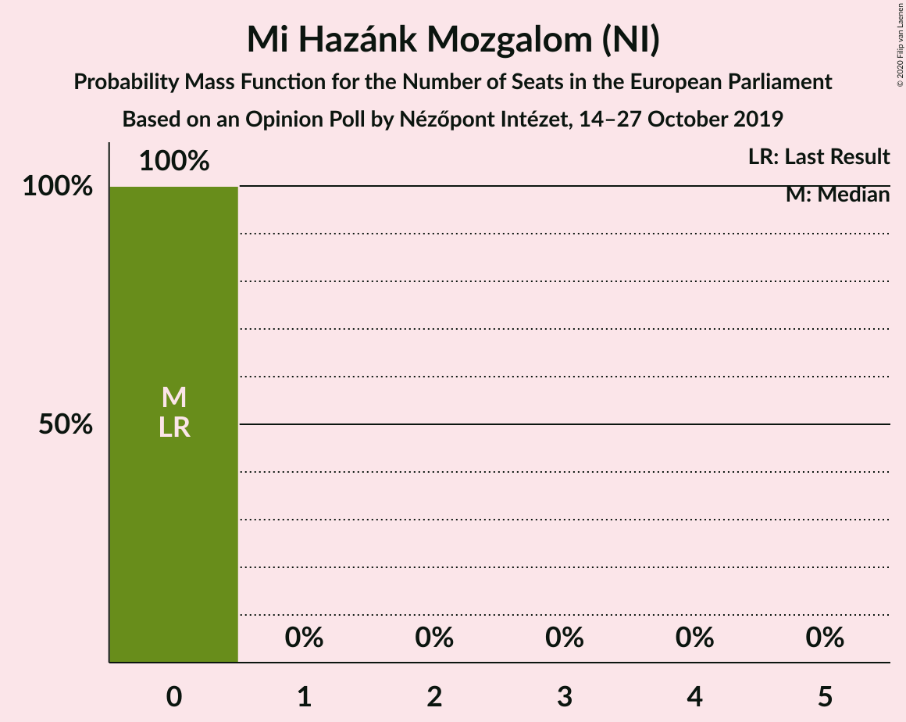

| Number of Seats | Probability | Accumulated | Special Marks |
|:---------------:|:-----------:|:-----------:|:-------------:|
| 0 | 100% | 100% | Last Result, Median |

## Coalitions

### Confidence Intervals

| Coalition | Last Result | Median | Majority? | 80% Confidence Interval | 90% Confidence Interval | 95% Confidence Interval | 99% Confidence Interval |
|:---------:|:-----------:|:------:|:---------:|:-----------------------:|:-----------------------:|:-----------------------:|:-----------------------:|
| Fidesz–Kereszténydemokrata Néppárt (EPP) | 12 | 13 | 100% | 13 | 13 | 13 | 12–13 |
| Jobbik (NI) – Magyar Kétfarkú Kutya Párt (NI) – Mi Hazánk Mozgalom (NI) | 3 | 2 | 0% | 2 | 2 | 2 | 2 |

### Fidesz–Kereszténydemokrata Néppárt (EPP)

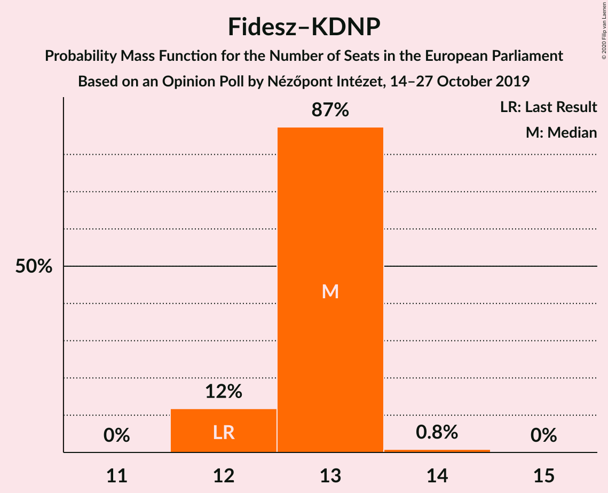

| Number of Seats | Probability | Accumulated | Special Marks |
|:---------------:|:-----------:|:-----------:|:-------------:|
| 12 | 0.6% | 100% | Last Result |
| 13 | 99.3% | 99.4% | Median |
| 14 | 0.1% | 0.1% |  |
| 15 | 0% | 0% |  |

### Jobbik (NI) – Magyar Kétfarkú Kutya Párt (NI) – Mi Hazánk Mozgalom (NI)

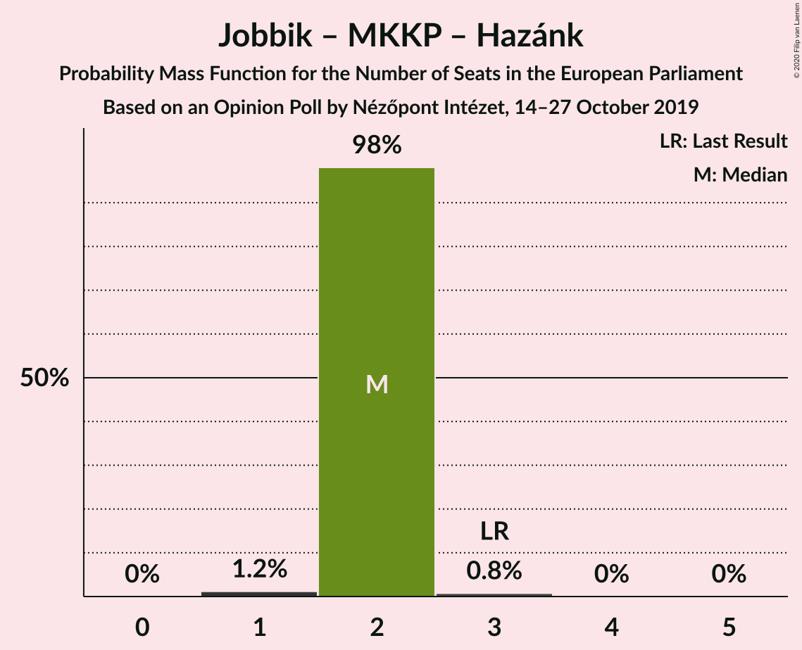

| Number of Seats | Probability | Accumulated | Special Marks |
|:---------------:|:-----------:|:-----------:|:-------------:|
| 1 | 0.1% | 100% |  |
| 2 | 99.9% | 99.9% | Median |
| 3 | 0% | 0% | Last Result |

## Technical Information

### Opinion Poll

+ **Polling firm:** Nézőpont Intézet
+ **Commissioner(s):** —
+ **Fieldwork period:** 14–27 October 2019

### Calculations

+ **Sample size:** 2300
+ **Simulations done:** 1,024
+ **Error estimate:** 1.34%

