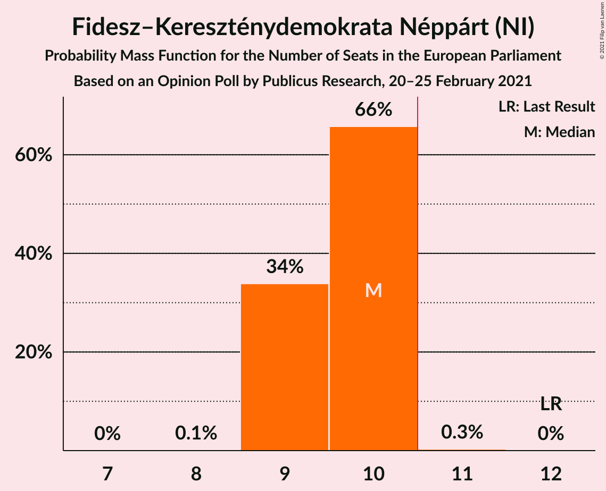
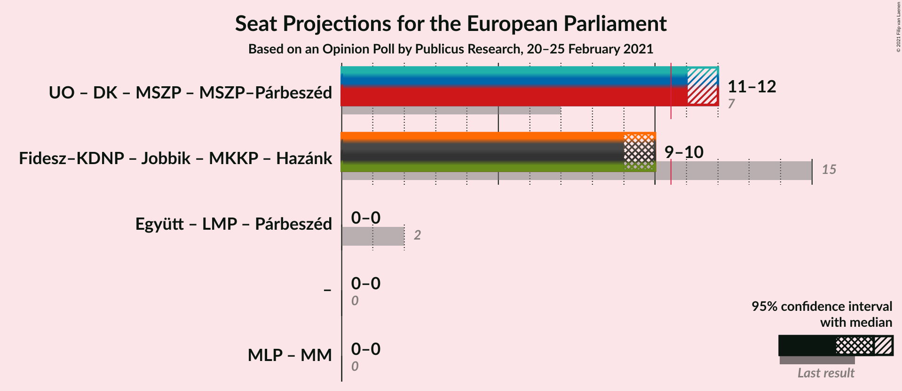

# Opinion Poll by Publicus Research, 20–25 February 2021

<a href="#voting-intentions">Voting Intentions</a> | <a href="#seats">Seats</a> | <a href="#coalitions">Coalitions</a> | <a href="#technical-information">Technical Information</a>

## Voting Intentions

### Confidence Intervals

| Party | Last Result | Poll Result | 80% Confidence Interval | 90% Confidence Interval | 95% Confidence Interval | 99% Confidence Interval |
|:-----:|:-----------:|:-----------:|:-----------------------:|:-----------------------:|:-----------------------:|:-----------------------:|
| United Opposition (S&D) | 0.0% | 54.4% | 52.4–56.5% |51.8–57.0% |51.3–57.5% |50.4–58.5% |
| Fidesz–Kereszténydemokrata Néppárt (NI) | 51.5% | 45.4% | 43.3–47.4% |42.8–48.0% |42.3–48.5% |41.3–49.4% |

*Note:* The poll result column reflects the actual value used in the calculations. Published results may vary slightly, and in addition be rounded to fewer digits.

## Seats

### Confidence Intervals

| Party | Last Result | Median | 80% Confidence Interval | 90% Confidence Interval | 95% Confidence Interval | 99% Confidence Interval |
|:-----:|:-----------:|:------:|:-----------------------:|:-----------------------:|:-----------------------:|:-----------------------:|
| <a href="#united-opposition-(s&d)">United Opposition (S&D)</a> | 0 | 10 | 10 |10 |10 |10 |
| <a href="#fidesz–kereszténydemokrata-néppárt-(ni)">Fidesz–Kereszténydemokrata Néppárt (NI)</a> | 12 | 8 | 8 |8 |8 |8 |

### United Opposition (S&D)

*For a full overview of the results for this party, see the [United Opposition (S&D)](party-unitedoppositionsd.html) page.*

| Number of Seats | Probability | Accumulated | Special Marks |
|:---------------:|:-----------:|:-----------:|:-------------:|
| 0 | 0% | 100% | Last Result |
| 1 | 0% | 100% |  |
| 2 | 0% | 100% |  |
| 3 | 0% | 100% |  |
| 4 | 0% | 100% |  |
| 5 | 0% | 100% |  |
| 6 | 0% | 100% |  |
| 7 | 0% | 100% |  |
| 8 | 0% | 100% |  |
| 9 | 0% | 100% |  |
| 10 | 100% | 100% | Median |

### Fidesz–Kereszténydemokrata Néppárt (NI)

*For a full overview of the results for this party, see the [Fidesz–Kereszténydemokrata Néppárt (NI)](party-fidesz–kereszténydemokratanéppártni.html) page.*

| Number of Seats | Probability | Accumulated | Special Marks |
|:---------------:|:-----------:|:-----------:|:-------------:|
| 8 | 100% | 100% | Median |
| 9 | 0% | 0% |  |
| 10 | 0% | 0% |  |
| 11 | 0% | 0% | Majority |
| 12 | 0% | 0% | Last Result |

## Coalitions

### Confidence Intervals

| Coalition | Last Result | Median | Majority? | 80% Confidence Interval | 90% Confidence Interval | 95% Confidence Interval | 99% Confidence Interval |
|:---------:|:-----------:|:------:|:---------:|:-----------------------:|:-----------------------:|:-----------------------:|:-----------------------:|

## Technical Information

### Opinion Poll

+ **Polling firm:** Publicus Research
+ **Commissioner(s):** —
+ **Fieldwork period:** 20–25 February 2021

### Calculations

+ **Sample size:** 1001
+ **Simulations done:** 1
+ **Error estimate:** 100.00%

