# Poll Average

<a href="#voting-intentions">Voting Intentions</a> | <a href="#seats">Seats</a> | <a href="#coalitions">Coalitions</a> | <a href="#technical-information">Technical Information</a>

## Summary

The table below lists the polls on which the average is based. They are the most recent polls (less than 90 days old) registered and analyzed so far.

| Period     | Polling firm/Commissioner(s) | Fidesz–KDNP | Jobbik | MSZP | DK | Párbeszéd | Együtt | LMP | MLP | MKKP | MM | MSZP–Párbeszéd | Hazánk |
|:----------:|:----------------------------:|:--:|:--:|:--:|:--:|:--:|:--:|:--:|:--:|:--:|:--:|:--:|:--:|
| 26 May 2019 | General Election | 51.5%   12 | 14.7%   3 | 10.9%   2 | 9.8%   2 | 7.2%   1 | 7.2%   0 | 5.0%   1 | 0.0%   0 | 0.0%   0 | 0.0%   0 | 18.2%   3 | 0.0%   0 |
| N/A | Poll Average | 47–56%   11–14 | 6–10%   1–2 | N/A   N/A | 10–18%   2–4 | N/A   N/A | N/A   N/A | 1–4%   0 | N/A   N/A | 0–7%   0–1 | 7–15%   1–3 | 2–13%   0–3 | 1–4%   0 |
| [27–31 May 2020](2020-05-31-IDEAIntézet.html) | IDEA Intézet | 47–52%   11–13 | 6–8%   1–2 | N/A   N/A | 16–19%   3–4 | N/A   N/A | N/A   N/A | 1–3%   0 | N/A   N/A | 1–2%   0 | 10–13%   2–3 | 7–9%   1–2 | 2–4%   0 |
| [18–22 May 2020](2020-05-22-PublicusResearch.html) | Publicus Research | 46–53%   11–13 | 6–10%   1–2 | N/A   N/A | 14–18%   3–4 | N/A   N/A | N/A   N/A | 1–2%   0 | N/A   N/A | 1–3%   0 | 9–13%   2–3 | 10–14%   2–3 | 1–2%   0 |
| [7–8 May 2020](2020-05-08-NézőpontIntézet.html) | Nézőpont Intézet | 51–57%   12–14 | 7–11%   1–2 | N/A   N/A | 9–13%   2–3 | N/A   N/A | N/A   N/A | 1–3%   0 | N/A   N/A | 5–8%   1 | 11–15%   2–3 | 2–4%   0–1 | 1–2%   0 |
| [14–19 April 2020](2020-04-19-ZRIZáveczResearch.html) | ZRI Závecz Research | 50–55%   12–13 | 8–10%   1–2 | N/A   N/A | 13–17%   3–4 | N/A   N/A | N/A   N/A | 2–4%   0 | N/A   N/A | 0–1%   0 | 7–9%   1–2 | 9–13%   2–3 | 1–2%   0 |
| 26 May 2019 | General Election | 51.5%   12 | 14.7%   3 | 10.9%   2 | 9.8%   2 | 7.2%   1 | 7.2%   0 | 5.0%   1 | 0.0%   0 | 0.0%   0 | 0.0%   0 | 18.2%   3 | 0.0%   0 |

Only polls for which at least the sample size has been published are included in the table above.

**Legend:**
+ **Top half of each row:** Voting intentions (95% confidence interval)
+ **Bottom half of each row:** Seat projections for the European Parliament (95% confidence interval)
+ **Fidesz–KDNP:** Fidesz–Kereszténydemokrata Néppárt (EPP)
+ **Jobbik:** Jobbik (NI)
+ **MSZP:** Magyar Szocialista Párt (S&D)
+ **DK:** Demokratikus Koalíció (S&D)
+ **Párbeszéd:** Párbeszéd (Greens/EFA)
+ **Együtt:** Együtt (Greens/EFA)
+ **LMP:** Lehet Más a Politika (Greens/EFA)
+ **MLP:** MLP (RE)
+ **MKKP:** Magyar Kétfarkú Kutya Párt (NI)
+ **MM:** Momentum Mozgalom (RE)
+ **MSZP–Párbeszéd:** Magyar Szocialista Párt–Párbeszéd (S&D)
+ **Hazánk:** Mi Hazánk Mozgalom (NI)
+ **N/A (single party):** Party not included the published results
+ **N/A (entire row):** Calculation for this opinion poll not started yet

## Voting Intentions

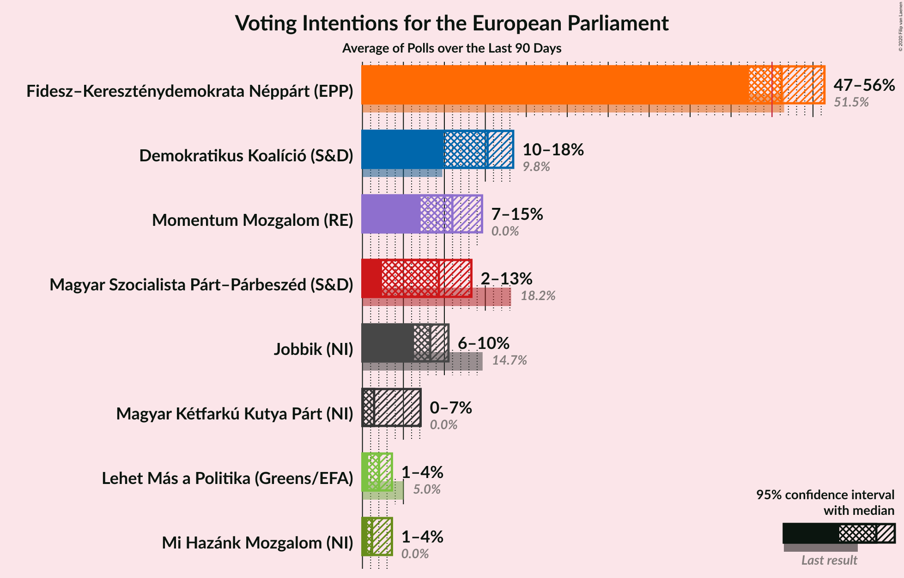

### Confidence Intervals

| Party | Last Result | Median | 80% Confidence Interval | 90% Confidence Interval | 95% Confidence Interval | 99% Confidence Interval |
|:-----:|:-----------:|:------:|:-----------------------:|:-----------------------:|:-----------------------:|:-----------------------:|
| <a href="#fidesz–kereszténydemokrata-néppárt-(epp)">Fidesz–Kereszténydemokrata Néppárt (EPP)</a> | 51.5% | 51.2% | 48.3–54.9% |47.7–55.7% | 47.2–56.4% | 46.1–57.6% |
| <a href="#magyar-szocialista-párt–párbeszéd-(s&d)">Magyar Szocialista Párt–Párbeszéd (S&D)</a> | 18.2% | 9.3% | 2.9–12.3% |2.6–12.8% | 2.4–13.3% | 2.1–14.1% |
| <a href="#jobbik-(ni)">Jobbik (NI)</a> | 14.7% | 8.3% | 6.8–9.8% |6.5–10.2% | 6.3–10.5% | 5.9–11.2% |
| <a href="#magyar-szocialista-párt-(s&d)">Magyar Szocialista Párt (S&D)</a> | 10.9% | N/A | N/A |N/A | N/A | N/A |
| <a href="#demokratikus-koalíció-(s&d)">Demokratikus Koalíció (S&D)</a> | 9.8% | 15.3% | 10.9–17.6% |10.3–18.0% | 9.9–18.4% | 9.2–19.0% |
| <a href="#párbeszéd-(greens/efa)">Párbeszéd (Greens/EFA)</a> | 7.2% | N/A | N/A |N/A | N/A | N/A |
| <a href="#együtt-(greens/efa)">Együtt (Greens/EFA)</a> | 7.2% | N/A | N/A |N/A | N/A | N/A |
| <a href="#lehet-más-a-politika-(greens/efa)">Lehet Más a Politika (Greens/EFA)</a> | 5.0% | 2.0% | 1.0–3.1% |0.8–3.4% | 0.7–3.6% | 0.5–4.0% |
| <a href="#mlp-(re)">MLP (RE)</a> | 0.0% | N/A | N/A |N/A | N/A | N/A |
| <a href="#magyar-kétfarkú-kutya-párt-(ni)">Magyar Kétfarkú Kutya Párt (NI)</a> | 0.0% | 1.4% | 0.3–6.3% |0.2–6.7% | 0.2–7.1% | 0.1–7.7% |
| <a href="#momentum-mozgalom-(re)">Momentum Mozgalom (RE)</a> | 0.0% | 11.0% | 7.8–13.5% |7.4–14.1% | 7.1–14.6% | 6.6–15.4% |
| <a href="#mi-hazánk-mozgalom-(ni)">Mi Hazánk Mozgalom (NI)</a> | 0.0% | 1.2% | 0.8–3.2% |0.7–3.4% | 0.6–3.6% | 0.5–3.9% |

### Fidesz–Kereszténydemokrata Néppárt (EPP)

*For a full overview of the results for this party, see the [Fidesz–Kereszténydemokrata Néppárt (EPP)](party-fidesz–kereszténydemokratanéppártepp.html) page.*

| Voting Intentions | Probability | Accumulated | Special Marks |
|:-----------------:|:-----------:|:-----------:|:-------------:|
| 43.5–44.5% | 0% | 100% |  |
| 44.5–45.5% | 0.2% | 100% |  |
| 45.5–46.5% | 0.8% | 99.8% |  |
| 46.5–47.5% | 3% | 99.0% |  |
| 47.5–48.5% | 8% | 96% |  |
| 48.5–49.5% | 15% | 88% |  |
| 49.5–50.5% | 15% | 73% |  |
| 50.5–51.5% | 12% | 58% | Last Result, Median |
| 51.5–52.5% | 12% | 45% |  |
| 52.5–53.5% | 11% | 33% |  |
| 53.5–54.5% | 9% | 22% |  |
| 54.5–55.5% | 7% | 13% |  |
| 55.5–56.5% | 4% | 6% |  |
| 56.5–57.5% | 2% | 2% |  |
| 57.5–58.5% | 0.4% | 0.5% |  |
| 58.5–59.5% | 0.1% | 0.1% |  |
| 59.5–60.5% | 0% | 0% |  |

### Magyar Szocialista Párt–Párbeszéd (S&D)

*For a full overview of the results for this party, see the [Magyar Szocialista Párt–Párbeszéd (S&D)](party-magyarszocialistapárt–párbeszédsd.html) page.*

| Voting Intentions | Probability | Accumulated | Special Marks |
|:-----------------:|:-----------:|:-----------:|:-------------:|
| 0.5–1.5% | 0% | 100% |  |
| 1.5–2.5% | 4% | 100% |  |
| 2.5–3.5% | 16% | 96% |  |
| 3.5–4.5% | 5% | 80% |  |
| 4.5–5.5% | 0.2% | 75% |  |
| 5.5–6.5% | 0.1% | 75% |  |
| 6.5–7.5% | 5% | 75% |  |
| 7.5–8.5% | 15% | 70% |  |
| 8.5–9.5% | 7% | 56% | Median |
| 9.5–10.5% | 9% | 49% |  |
| 10.5–11.5% | 19% | 40% |  |
| 11.5–12.5% | 14% | 21% |  |
| 12.5–13.5% | 6% | 7% |  |
| 13.5–14.5% | 1.3% | 1.5% |  |
| 14.5–15.5% | 0.2% | 0.2% |  |
| 15.5–16.5% | 0% | 0% |  |
| 16.5–17.5% | 0% | 0% |  |
| 17.5–18.5% | 0% | 0% | Last Result |

### Jobbik (NI)

*For a full overview of the results for this party, see the [Jobbik (NI)](party-jobbikni.html) page.*

| Voting Intentions | Probability | Accumulated | Special Marks |
|:-----------------:|:-----------:|:-----------:|:-------------:|
| 4.5–5.5% | 0.1% | 100% |  |
| 5.5–6.5% | 5% | 99.9% |  |
| 6.5–7.5% | 23% | 95% |  |
| 7.5–8.5% | 29% | 71% | Median |
| 8.5–9.5% | 28% | 42% |  |
| 9.5–10.5% | 12% | 14% |  |
| 10.5–11.5% | 2% | 2% |  |
| 11.5–12.5% | 0.2% | 0.2% |  |
| 12.5–13.5% | 0% | 0% |  |
| 13.5–14.5% | 0% | 0% |  |
| 14.5–15.5% | 0% | 0% | Last Result |

### Demokratikus Koalíció (S&D)

*For a full overview of the results for this party, see the [Demokratikus Koalíció (S&D)](party-demokratikuskoalíciósd.html) page.*

| Voting Intentions | Probability | Accumulated | Special Marks |
|:-----------------:|:-----------:|:-----------:|:-------------:|
| 7.5–8.5% | 0.1% | 100% |  |
| 8.5–9.5% | 1.1% | 99.9% |  |
| 9.5–10.5% | 6% | 98.8% | Last Result |
| 10.5–11.5% | 10% | 93% |  |
| 11.5–12.5% | 7% | 84% |  |
| 12.5–13.5% | 4% | 77% |  |
| 13.5–14.5% | 10% | 73% |  |
| 14.5–15.5% | 17% | 62% | Median |
| 15.5–16.5% | 18% | 45% |  |
| 16.5–17.5% | 17% | 27% |  |
| 17.5–18.5% | 9% | 10% |  |
| 18.5–19.5% | 2% | 2% |  |
| 19.5–20.5% | 0.1% | 0.1% |  |
| 20.5–21.5% | 0% | 0% |  |

### Lehet Más a Politika (Greens/EFA)

*For a full overview of the results for this party, see the [Lehet Más a Politika (Greens/EFA)](party-lehetmásapolitikagreensefa.html) page.*

| Voting Intentions | Probability | Accumulated | Special Marks |
|:-----------------:|:-----------:|:-----------:|:-------------:|
| 0.0–0.5% | 0.6% | 100% |  |
| 0.5–1.5% | 26% | 99.4% |  |
| 1.5–2.5% | 47% | 73% | Median |
| 2.5–3.5% | 24% | 27% |  |
| 3.5–4.5% | 3% | 3% |  |
| 4.5–5.5% | 0% | 0% | Last Result |

### Momentum Mozgalom (RE)

*For a full overview of the results for this party, see the [Momentum Mozgalom (RE)](party-momentummozgalomre.html) page.*

| Voting Intentions | Probability | Accumulated | Special Marks |
|:-----------------:|:-----------:|:-----------:|:-------------:|
| 0.0–0.5% | 0% | 100% | Last Result |
| 0.5–1.5% | 0% | 100% |  |
| 1.5–2.5% | 0% | 100% |  |
| 2.5–3.5% | 0% | 100% |  |
| 3.5–4.5% | 0% | 100% |  |
| 4.5–5.5% | 0% | 100% |  |
| 5.5–6.5% | 0.4% | 100% |  |
| 6.5–7.5% | 6% | 99.6% |  |
| 7.5–8.5% | 13% | 93% |  |
| 8.5–9.5% | 7% | 80% |  |
| 9.5–10.5% | 12% | 73% |  |
| 10.5–11.5% | 24% | 61% | Median |
| 11.5–12.5% | 17% | 37% |  |
| 12.5–13.5% | 11% | 20% |  |
| 13.5–14.5% | 7% | 9% |  |
| 14.5–15.5% | 2% | 3% |  |
| 15.5–16.5% | 0.4% | 0.4% |  |
| 16.5–17.5% | 0% | 0% |  |

### Magyar Kétfarkú Kutya Párt (NI)

*For a full overview of the results for this party, see the [Magyar Kétfarkú Kutya Párt (NI)](party-magyarkétfarkúkutyapártni.html) page.*

| Voting Intentions | Probability | Accumulated | Special Marks |
|:-----------------:|:-----------:|:-----------:|:-------------:|
| 0.0–0.5% | 23% | 100% | Last Result |
| 0.5–1.5% | 29% | 77% | Median |
| 1.5–2.5% | 19% | 48% |  |
| 2.5–3.5% | 4% | 29% |  |
| 3.5–4.5% | 0.4% | 25% |  |
| 4.5–5.5% | 6% | 25% |  |
| 5.5–6.5% | 12% | 19% |  |
| 6.5–7.5% | 6% | 7% |  |
| 7.5–8.5% | 0.8% | 0.8% |  |
| 8.5–9.5% | 0% | 0% |  |

### Mi Hazánk Mozgalom (NI)

*For a full overview of the results for this party, see the [Mi Hazánk Mozgalom (NI)](party-mihazánkmozgalomni.html) page.*

| Voting Intentions | Probability | Accumulated | Special Marks |
|:-----------------:|:-----------:|:-----------:|:-------------:|
| 0.0–0.5% | 1.5% | 100% | Last Result |
| 0.5–1.5% | 68% | 98.5% | Median |
| 1.5–2.5% | 7% | 31% |  |
| 2.5–3.5% | 20% | 23% |  |
| 3.5–4.5% | 3% | 3% |  |
| 4.5–5.5% | 0% | 0% |  |

## Seats

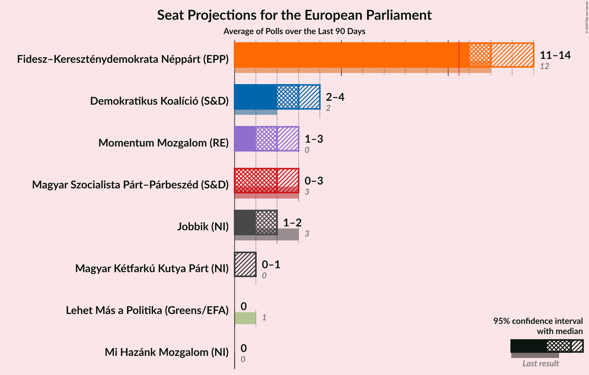

### Confidence Intervals

| Party | Last Result | Median | 80% Confidence Interval | 90% Confidence Interval | 95% Confidence Interval | 99% Confidence Interval |
|:-----:|:-----------:|:------:|:-----------------------:|:-----------------------:|:-----------------------:|:-----------------------:|
| <a href="#fidesz–kereszténydemokrata-néppárt-(epp)">Fidesz–Kereszténydemokrata Néppárt (EPP)</a> | 12 | 12 | 11–13 |11–13 | 11–14 | 11–14 |
| <a href="#magyar-szocialista-párt–párbeszéd-(s&d)">Magyar Szocialista Párt–Párbeszéd (S&D)</a> | 3 | 2 | 0–3 |0–3 | 0–3 | 0–3 |
| <a href="#jobbik-(ni)">Jobbik (NI)</a> | 3 | 2 | 1–2 |1–2 | 1–2 | 1–2 |
| <a href="#magyar-szocialista-párt-(s&d)">Magyar Szocialista Párt (S&D)</a> | 2 | N/A | N/A |N/A | N/A | N/A |
| <a href="#demokratikus-koalíció-(s&d)">Demokratikus Koalíció (S&D)</a> | 2 | 3 | 2–4 |2–4 | 2–4 | 2–4 |
| <a href="#párbeszéd-(greens/efa)">Párbeszéd (Greens/EFA)</a> | 1 | N/A | N/A |N/A | N/A | N/A |
| <a href="#együtt-(greens/efa)">Együtt (Greens/EFA)</a> | 0 | N/A | N/A |N/A | N/A | N/A |
| <a href="#lehet-más-a-politika-(greens/efa)">Lehet Más a Politika (Greens/EFA)</a> | 1 | 0 | 0 |0 | 0 | 0 |
| <a href="#mlp-(re)">MLP (RE)</a> | 0 | N/A | N/A |N/A | N/A | N/A |
| <a href="#magyar-kétfarkú-kutya-párt-(ni)">Magyar Kétfarkú Kutya Párt (NI)</a> | 0 | 0 | 0–1 |0–1 | 0–1 | 0–1 |
| <a href="#momentum-mozgalom-(re)">Momentum Mozgalom (RE)</a> | 0 | 2 | 1–3 |1–3 | 1–3 | 1–3 |
| <a href="#mi-hazánk-mozgalom-(ni)">Mi Hazánk Mozgalom (NI)</a> | 0 | 0 | 0 |0 | 0 | 0 |

### Fidesz–Kereszténydemokrata Néppárt (EPP)

*For a full overview of the results for this party, see the [Fidesz–Kereszténydemokrata Néppárt (EPP)](party-fidesz–kereszténydemokratanéppártepp.html) page.*

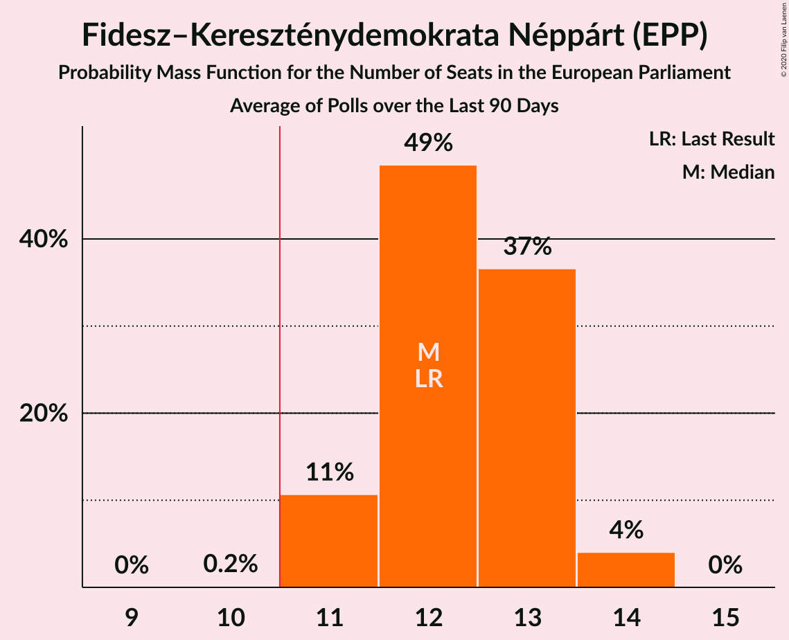

| Number of Seats | Probability | Accumulated | Special Marks |
|:---------------:|:-----------:|:-----------:|:-------------:|
| 10 | 0.2% | 100% |  |
| 11 | 11% | 99.8% | Majority |
| 12 | 49% | 89% | Last Result, Median |
| 13 | 37% | 41% |  |
| 14 | 4% | 4% |  |
| 15 | 0% | 0% |  |

### Magyar Szocialista Párt–Párbeszéd (S&D)

*For a full overview of the results for this party, see the [Magyar Szocialista Párt–Párbeszéd (S&D)](party-magyarszocialistapárt–párbeszédsd.html) page.*

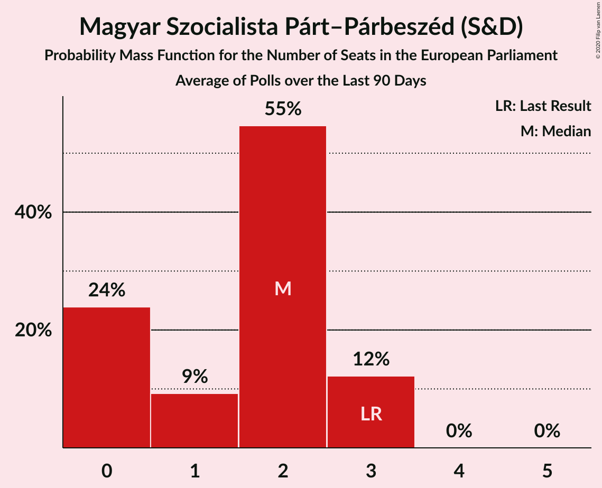

| Number of Seats | Probability | Accumulated | Special Marks |
|:---------------:|:-----------:|:-----------:|:-------------:|
| 0 | 24% | 100% |  |
| 1 | 9% | 76% |  |
| 2 | 55% | 67% | Median |
| 3 | 12% | 12% | Last Result |
| 4 | 0% | 0% |  |

### Jobbik (NI)

*For a full overview of the results for this party, see the [Jobbik (NI)](party-jobbikni.html) page.*

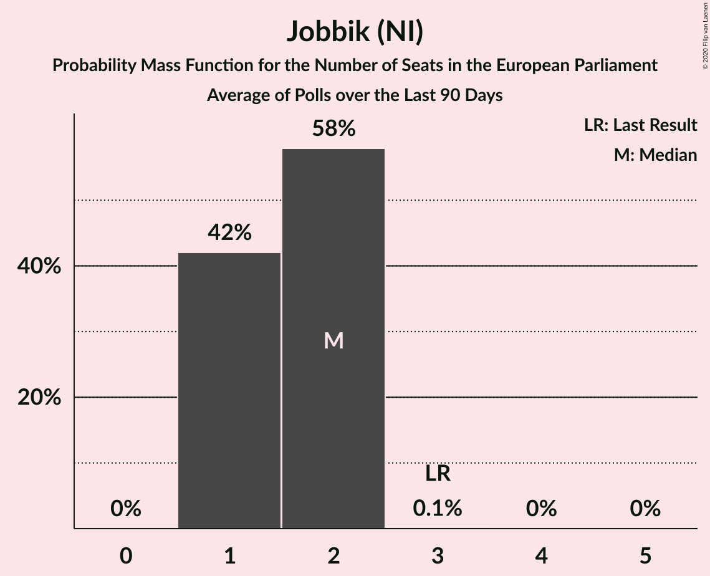

| Number of Seats | Probability | Accumulated | Special Marks |
|:---------------:|:-----------:|:-----------:|:-------------:|
| 1 | 42% | 100% |  |
| 2 | 58% | 58% | Median |
| 3 | 0.1% | 0.1% | Last Result |
| 4 | 0% | 0% |  |

### Magyar Szocialista Párt (S&D)

*For a full overview of the results for this party, see the [Magyar Szocialista Párt (S&D)](party-magyarszocialistapártsd.html) page.*

### Demokratikus Koalíció (S&D)

*For a full overview of the results for this party, see the [Demokratikus Koalíció (S&D)](party-demokratikuskoalíciósd.html) page.*

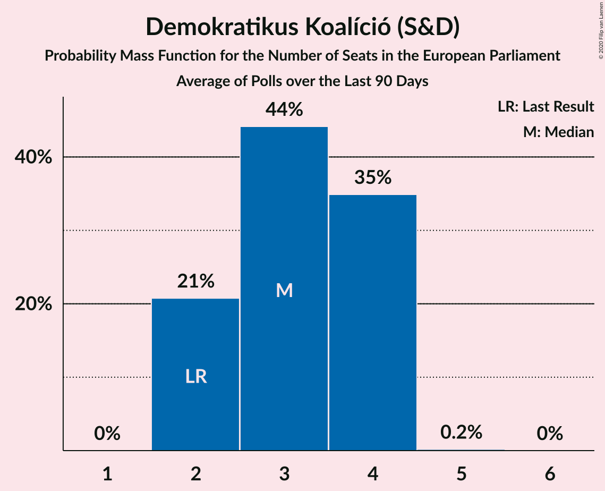

| Number of Seats | Probability | Accumulated | Special Marks |
|:---------------:|:-----------:|:-----------:|:-------------:|
| 2 | 21% | 100% | Last Result |
| 3 | 44% | 79% | Median |
| 4 | 35% | 35% |  |
| 5 | 0.2% | 0.2% |  |
| 6 | 0% | 0% |  |

### Párbeszéd (Greens/EFA)

*For a full overview of the results for this party, see the [Párbeszéd (Greens/EFA)](party-párbeszédgreensefa.html) page.*

### Együtt (Greens/EFA)

*For a full overview of the results for this party, see the [Együtt (Greens/EFA)](party-együttgreensefa.html) page.*

### Lehet Más a Politika (Greens/EFA)

*For a full overview of the results for this party, see the [Lehet Más a Politika (Greens/EFA)](party-lehetmásapolitikagreensefa.html) page.*

| Number of Seats | Probability | Accumulated | Special Marks |
|:---------------:|:-----------:|:-----------:|:-------------:|
| 0 | 99.6% | 100% | Median |
| 1 | 0.4% | 0.4% | Last Result |
| 2 | 0% | 0% |  |

### MLP (RE)

*For a full overview of the results for this party, see the [MLP (RE)](party-mlpre.html) page.*

### Magyar Kétfarkú Kutya Párt (NI)

*For a full overview of the results for this party, see the [Magyar Kétfarkú Kutya Párt (NI)](party-magyarkétfarkúkutyapártni.html) page.*

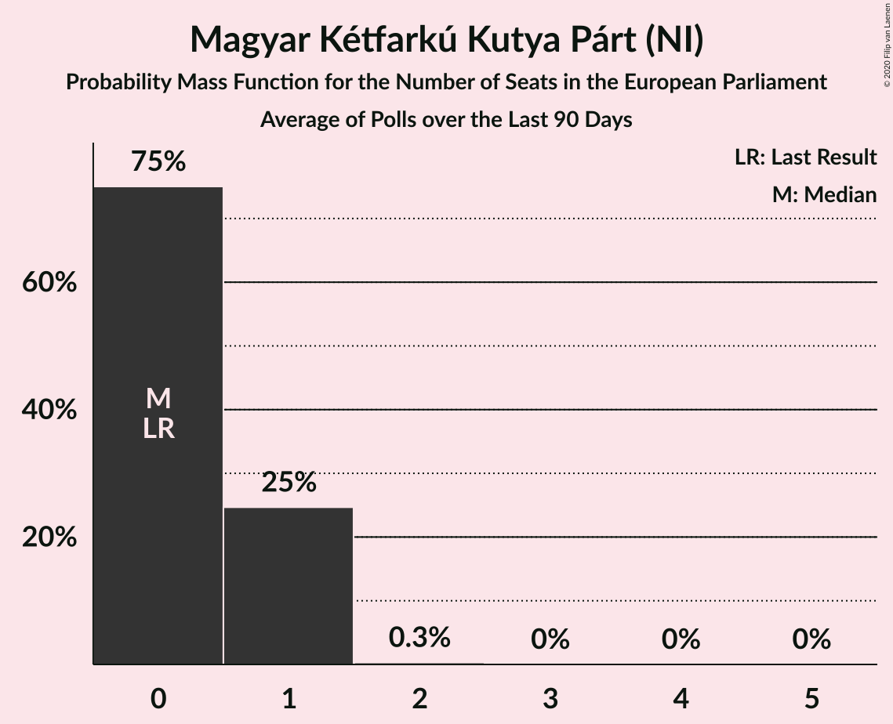

| Number of Seats | Probability | Accumulated | Special Marks |
|:---------------:|:-----------:|:-----------:|:-------------:|
| 0 | 75% | 100% | Last Result, Median |
| 1 | 25% | 25% |  |
| 2 | 0.3% | 0.3% |  |
| 3 | 0% | 0% |  |

### Momentum Mozgalom (RE)

*For a full overview of the results for this party, see the [Momentum Mozgalom (RE)](party-momentummozgalomre.html) page.*

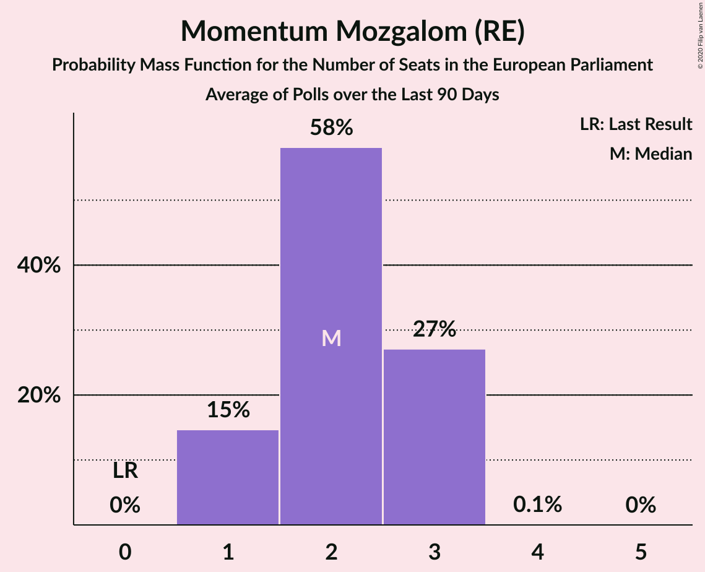

| Number of Seats | Probability | Accumulated | Special Marks |
|:---------------:|:-----------:|:-----------:|:-------------:|
| 0 | 0% | 100% | Last Result |
| 1 | 15% | 100% |  |
| 2 | 58% | 85% | Median |
| 3 | 27% | 27% |  |
| 4 | 0.1% | 0.1% |  |
| 5 | 0% | 0% |  |

### Mi Hazánk Mozgalom (NI)

*For a full overview of the results for this party, see the [Mi Hazánk Mozgalom (NI)](party-mihazánkmozgalomni.html) page.*

| Number of Seats | Probability | Accumulated | Special Marks |
|:---------------:|:-----------:|:-----------:|:-------------:|
| 0 | 99.6% | 100% | Last Result, Median |
| 1 | 0.4% | 0.4% |  |
| 2 | 0% | 0% |  |

## Coalitions

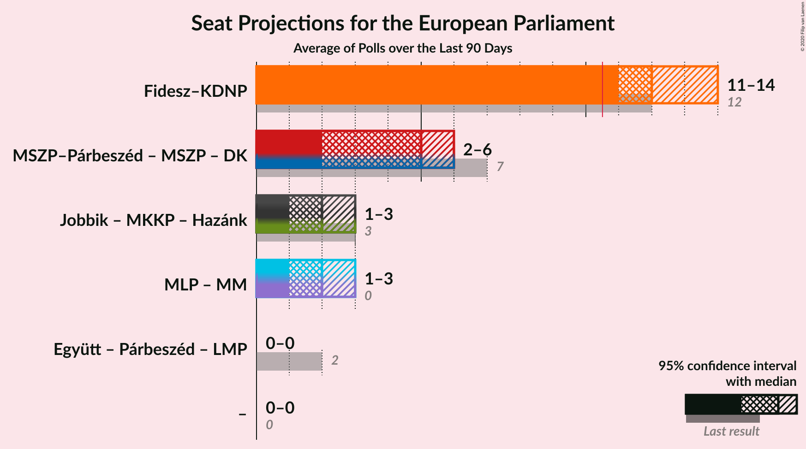

### Confidence Intervals

| Coalition | Last Result | Median | Majority? | 80% Confidence Interval | 90% Confidence Interval | 95% Confidence Interval | 99% Confidence Interval |
|:---------:|:-----------:|:------:|:---------:|:-----------------------:|:-----------------------:|:-----------------------:|:-----------------------:|
| Fidesz–Kereszténydemokrata Néppárt (EPP) | 12 | 12 | 99.8% | 11–13 | 11–13 | 11–14 | 11–14 |
| Magyar Szocialista Párt–Párbeszéd (S&D) – Magyar Szocialista Párt (S&D) – Demokratikus Koalíció (S&D) | 7 | 5 | 0% | 2–6 | 2–6 | 2–6 | 2–7 |
| Jobbik (NI) – Magyar Kétfarkú Kutya Párt (NI) – Mi Hazánk Mozgalom (NI) | 3 | 2 | 0% | 1–3 | 1–3 | 1–3 | 1–3 |
| MLP (RE) – Momentum Mozgalom (RE) | 0 | 2 | 0% | 1–3 | 1–3 | 1–3 | 1–3 |
| Együtt (Greens/EFA) – Párbeszéd (Greens/EFA) – Lehet Más a Politika (Greens/EFA) | 2 | 0 | 0% | 0 | 0 | 0 | 0 |

### Fidesz–Kereszténydemokrata Néppárt (EPP)

| Number of Seats | Probability | Accumulated | Special Marks |
|:---------------:|:-----------:|:-----------:|:-------------:|
| 10 | 0.2% | 100% |  |
| 11 | 11% | 99.8% | Majority |
| 12 | 49% | 89% | Last Result, Median |
| 13 | 37% | 41% |  |
| 14 | 4% | 4% |  |
| 15 | 0% | 0% |  |

### Magyar Szocialista Párt–Párbeszéd (S&D) – Magyar Szocialista Párt (S&D) – Demokratikus Koalíció (S&D)

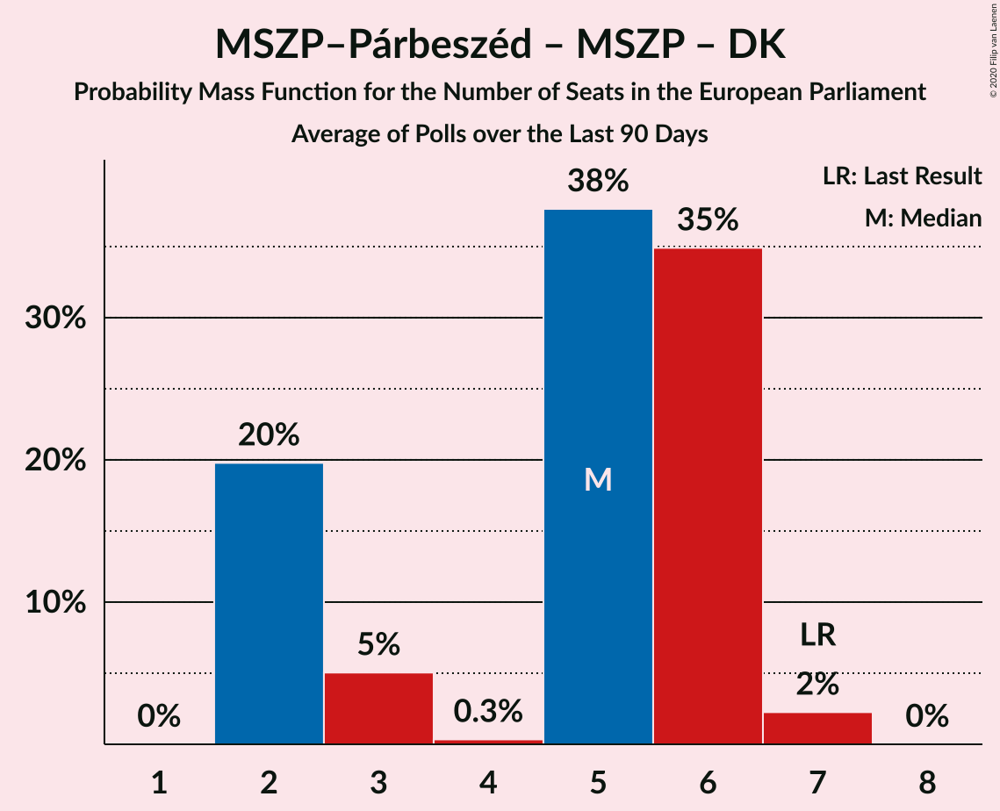

| Number of Seats | Probability | Accumulated | Special Marks |
|:---------------:|:-----------:|:-----------:|:-------------:|
| 2 | 20% | 100% |  |
| 3 | 5% | 80% |  |
| 4 | 0.3% | 75% |  |
| 5 | 38% | 75% | Median |
| 6 | 35% | 37% |  |
| 7 | 2% | 2% | Last Result |
| 8 | 0% | 0% |  |

### Jobbik (NI) – Magyar Kétfarkú Kutya Párt (NI) – Mi Hazánk Mozgalom (NI)

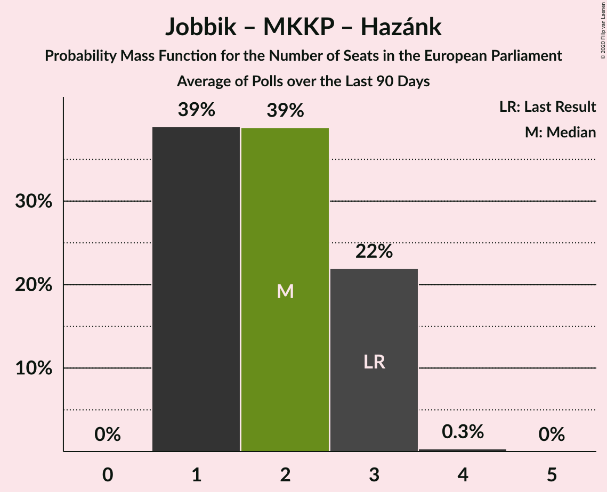

| Number of Seats | Probability | Accumulated | Special Marks |
|:---------------:|:-----------:|:-----------:|:-------------:|
| 1 | 39% | 100% |  |
| 2 | 39% | 61% | Median |
| 3 | 22% | 22% | Last Result |
| 4 | 0.3% | 0.3% |  |
| 5 | 0% | 0% |  |

### MLP (RE) – Momentum Mozgalom (RE)

| Number of Seats | Probability | Accumulated | Special Marks |
|:---------------:|:-----------:|:-----------:|:-------------:|
| 0 | 0% | 100% | Last Result |
| 1 | 15% | 100% |  |
| 2 | 58% | 85% | Median |
| 3 | 27% | 27% |  |
| 4 | 0.1% | 0.1% |  |
| 5 | 0% | 0% |  |

### Együtt (Greens/EFA) – Párbeszéd (Greens/EFA) – Lehet Más a Politika (Greens/EFA)

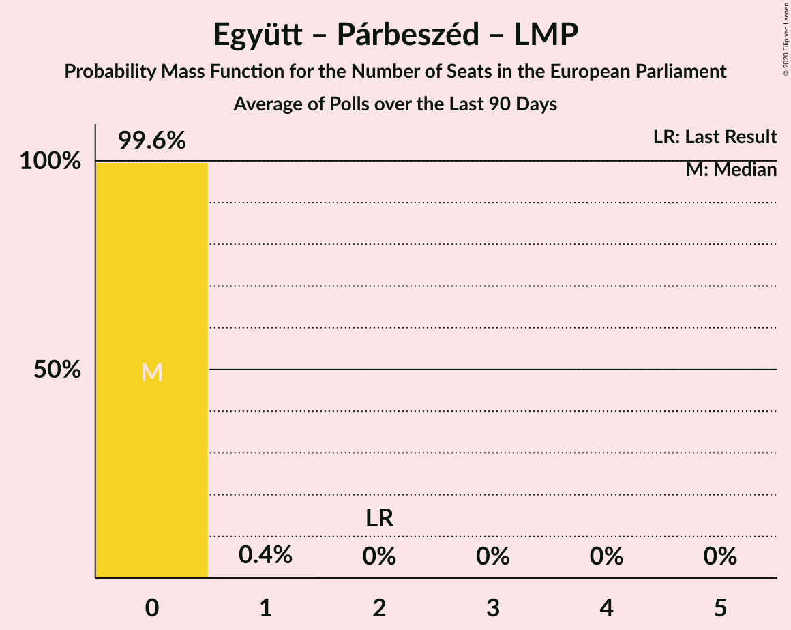

| Number of Seats | Probability | Accumulated | Special Marks |
|:---------------:|:-----------:|:-----------:|:-------------:|
| 0 | 99.6% | 100% | Median |
| 1 | 0.4% | 0.4% |  |
| 2 | 0% | 0% | Last Result |

## Technical Information

+ **Number of polls included in this average:** 4
+ **Lowest number of simulations done in a poll included in this average:** 1,048,576
+ **Total number of simulations done in the polls included in this average:** 4,194,304
+ **Error estimate:** 2.21%
