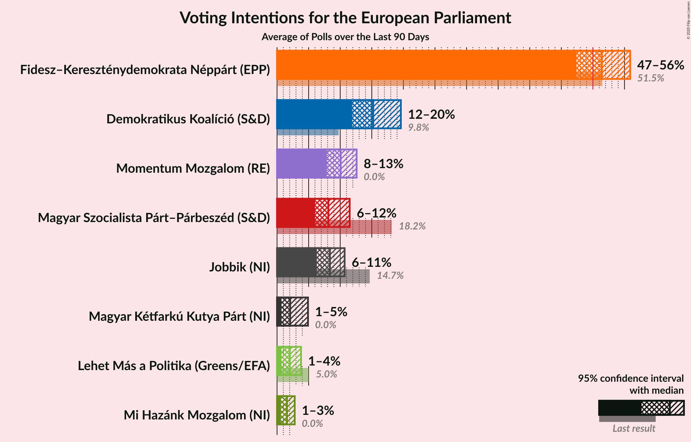
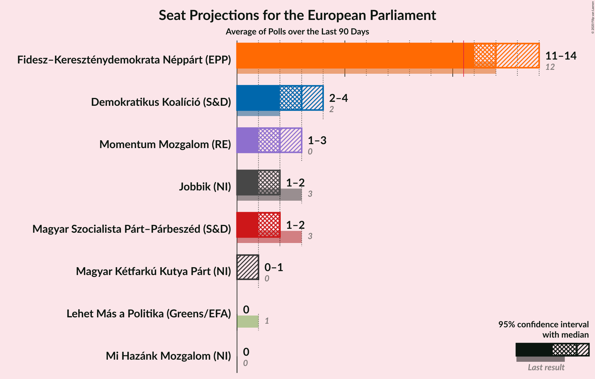
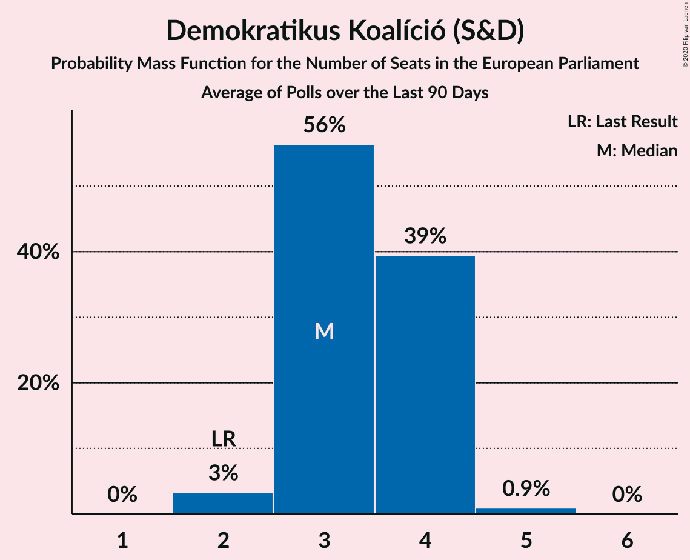
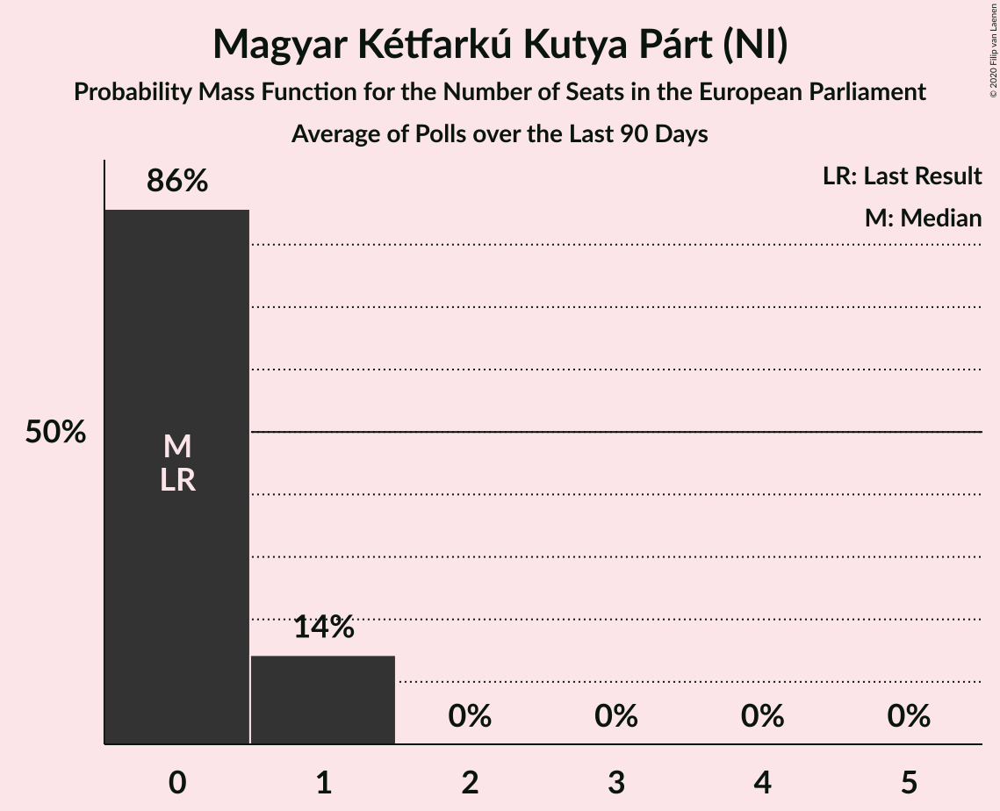
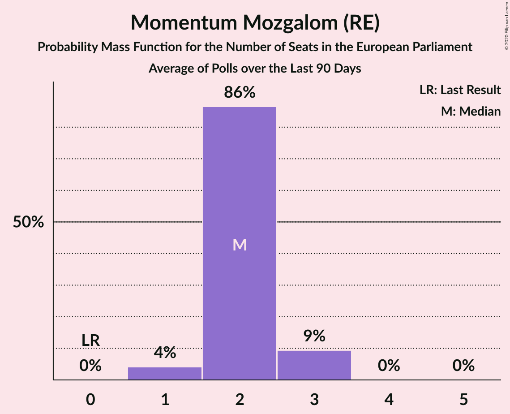
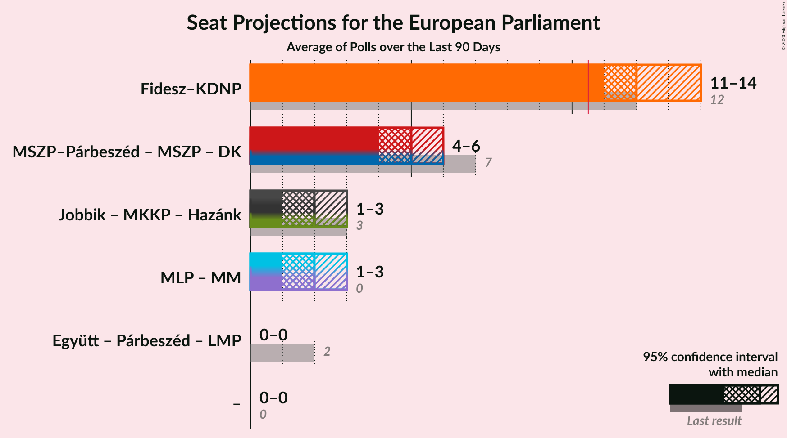
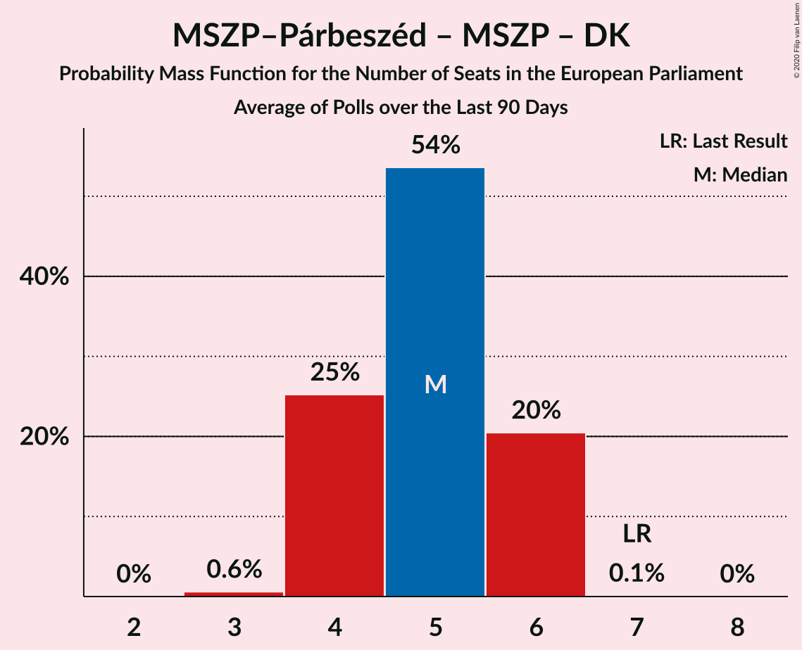
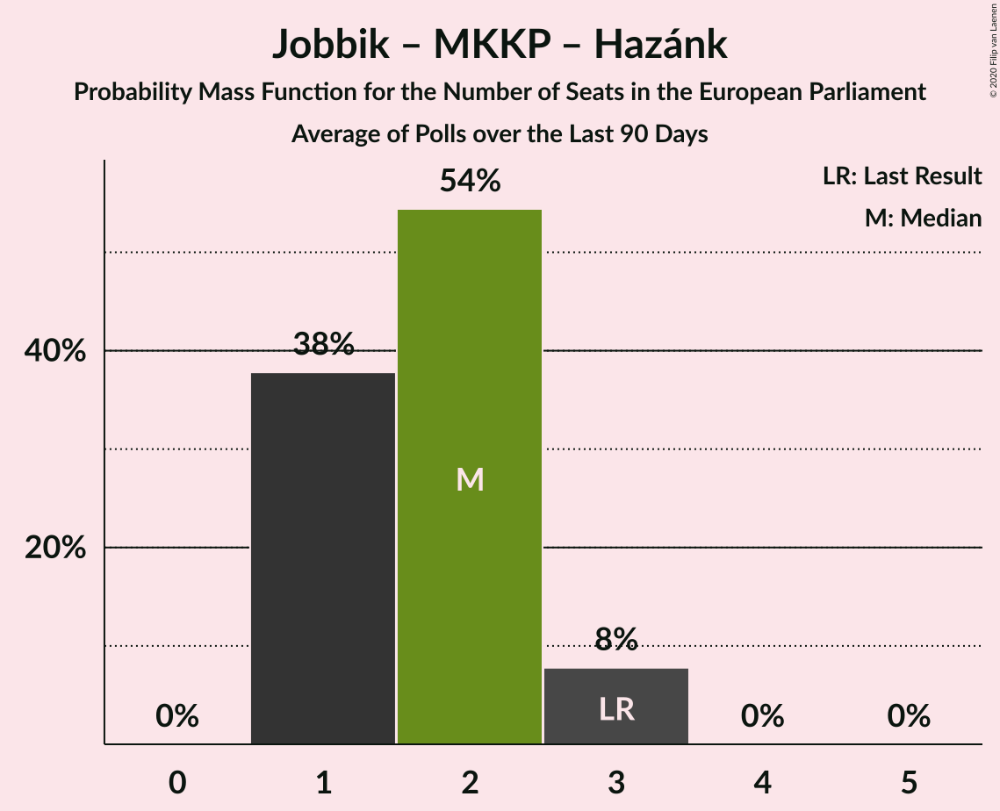

# Poll Average

<a href="#voting-intentions">Voting Intentions</a> | <a href="#seats">Seats</a> | <a href="#coalitions">Coalitions</a> | <a href="#technical-information">Technical Information</a>

## Summary

The table below lists the polls on which the average is based. They are the most recent polls (less than 90 days old) registered and analyzed so far.

| Period     | Polling firm/Commissioner(s) | Fidesz–KDNP | Jobbik | MSZP | DK | Párbeszéd | Együtt | LMP | MLP | MKKP | MM | MSZP–Párbeszéd | Hazánk |
|:----------:|:----------------------------:|:--:|:--:|:--:|:--:|:--:|:--:|:--:|:--:|:--:|:--:|:--:|:--:|
| 26 May 2019 | General Election | 51.5%   12 | 14.7%   3 | 10.9%   2 | 9.8%   2 | 7.2%   1 | 7.2%   0 | 5.0%   1 | 0.0%   0 | 0.0%   0 | 0.0%   0 | 18.2%   3 | 0.0%   0 |
| N/A | Poll Average | 47–56%   11–14 | 6–11%   1–2 | N/A   N/A | 12–20%   2–4 | N/A   N/A | N/A   N/A | 1–4%   0 | N/A   N/A | 1–5%   0–1 | 8–13%   1–3 | 6–12%   1–2 | 1–3%   0 |
| [22–25 September 2020](2020-09-25-PublicusResearch.html) | Publicus Research | 47–53%   11–13 | 8–11%   1–2 | N/A   N/A | 11–15%   2–3 | N/A   N/A | N/A   N/A | 1–2%   0 | N/A   N/A | 1–3%   0 | 9–13%   2–3 | 8–12%   2–3 | 1–2%   0 |
| [7–18 September 2020](2020-09-18-ZRIZáveczResearch.html) | ZRI Závecz Research | 47–53%   11–13 | 7–11%   1–2 | N/A   N/A | 16–21%   3–5 | N/A   N/A | N/A   N/A | 1–3%   0 | N/A   N/A | 1–2%   0 | 8–12%   1–2 | 6–10%   1–2 | 1–3%   0 |
| [27–31 August 2020](2020-08-31-IDEAIntézet.html) | IDEA Intézet | 50–54%   12–13 | 6–8%   1–2 | N/A   N/A | 14–18%   3–4 | N/A   N/A | N/A   N/A | 1–3%   0 | N/A   N/A | 1–3%   0 | 9–11%   2 | 7–9%   1–2 | 1–3%   0 |
| [14–24 August 2020](2020-08-24-Republikon.html) | Republikon | 51–57%   12–14 | 6–10%   1–2 | N/A   N/A | 12–16%   2–4 | N/A   N/A | N/A   N/A | 2–4%   0–1 | N/A   N/A | 3–5%   0–1 | 7–11%   1–2 | 6–9%   1–2 | 1–2%   0 |
| 26 May 2019 | General Election | 51.5%   12 | 14.7%   3 | 10.9%   2 | 9.8%   2 | 7.2%   1 | 7.2%   0 | 5.0%   1 | 0.0%   0 | 0.0%   0 | 0.0%   0 | 18.2%   3 | 0.0%   0 |

Only polls for which at least the sample size has been published are included in the table above.

**Legend:**
+ **Top half of each row:** Voting intentions (95% confidence interval)
+ **Bottom half of each row:** Seat projections for the European Parliament (95% confidence interval)
+ **Fidesz–KDNP:** Fidesz–Kereszténydemokrata Néppárt (EPP)
+ **Jobbik:** Jobbik (NI)
+ **MSZP:** Magyar Szocialista Párt (S&D)
+ **DK:** Demokratikus Koalíció (S&D)
+ **Párbeszéd:** Párbeszéd (Greens/EFA)
+ **Együtt:** Együtt (Greens/EFA)
+ **LMP:** Lehet Más a Politika (Greens/EFA)
+ **MLP:** MLP (RE)
+ **MKKP:** Magyar Kétfarkú Kutya Párt (NI)
+ **MM:** Momentum Mozgalom (RE)
+ **MSZP–Párbeszéd:** Magyar Szocialista Párt–Párbeszéd (S&D)
+ **Hazánk:** Mi Hazánk Mozgalom (NI)
+ **N/A (single party):** Party not included the published results
+ **N/A (entire row):** Calculation for this opinion poll not started yet

## Voting Intentions

### Confidence Intervals

| Party | Last Result | Median | 80% Confidence Interval | 90% Confidence Interval | 95% Confidence Interval | 99% Confidence Interval |
|:-----:|:-----------:|:------:|:-----------------------:|:-----------------------:|:-----------------------:|:-----------------------:|
| <a href="#fidesz–kereszténydemokrata-néppárt-(epp)">Fidesz–Kereszténydemokrata Néppárt (EPP)</a> | 51.5% | 51.4% | 48.6–54.4% |48.0–55.2% | 47.4–55.9% | 46.3–57.1% |
| <a href="#magyar-szocialista-párt–párbeszéd-(s&d)">Magyar Szocialista Párt–Párbeszéd (S&D)</a> | 18.2% | 8.1% | 6.7–10.5% |6.3–11.0% | 6.0–11.5% | 5.5–12.3% |
| <a href="#jobbik-(ni)">Jobbik (NI)</a> | 14.7% | 8.4% | 6.8–9.9% |6.5–10.4% | 6.3–10.7% | 5.9–11.4% |
| <a href="#magyar-szocialista-párt-(s&d)">Magyar Szocialista Párt (S&D)</a> | 10.9% | N/A | N/A |N/A | N/A | N/A |
| <a href="#demokratikus-koalíció-(s&d)">Demokratikus Koalíció (S&D)</a> | 9.8% | 15.2% | 12.7–18.4% |12.2–19.1% | 11.9–19.6% | 11.1–20.6% |
| <a href="#párbeszéd-(greens/efa)">Párbeszéd (Greens/EFA)</a> | 7.2% | N/A | N/A |N/A | N/A | N/A |
| <a href="#együtt-(greens/efa)">Együtt (Greens/EFA)</a> | 7.2% | N/A | N/A |N/A | N/A | N/A |
| <a href="#lehet-más-a-politika-(greens/efa)">Lehet Más a Politika (Greens/EFA)</a> | 5.0% | 2.0% | 1.0–3.2% |0.8–3.5% | 0.7–3.8% | 0.5–4.3% |
| <a href="#mlp-(re)">MLP (RE)</a> | 0.0% | N/A | N/A |N/A | N/A | N/A |
| <a href="#magyar-kétfarkú-kutya-párt-(ni)">Magyar Kétfarkú Kutya Párt (NI)</a> | 0.0% | 2.1% | 1.0–4.2% |0.8–4.6% | 0.7–4.9% | 0.5–5.5% |
| <a href="#momentum-mozgalom-(re)">Momentum Mozgalom (RE)</a> | 0.0% | 10.1% | 8.6–11.7% |8.2–12.2% | 7.9–12.6% | 7.3–13.5% |
| <a href="#mi-hazánk-mozgalom-(ni)">Mi Hazánk Mozgalom (NI)</a> | 0.0% | 1.6% | 0.8–2.4% |0.7–2.6% | 0.6–2.8% | 0.5–3.1% |

### Fidesz–Kereszténydemokrata Néppárt (EPP)

*For a full overview of the results for this party, see the [Fidesz–Kereszténydemokrata Néppárt (EPP)](party-fidesz–kereszténydemokratanéppártepp.html) page.*

| Voting Intentions | Probability | Accumulated | Special Marks |
|:-----------------:|:-----------:|:-----------:|:-------------:|
| 43.5–44.5% | 0% | 100% |  |
| 44.5–45.5% | 0.1% | 100% |  |
| 45.5–46.5% | 0.6% | 99.9% |  |
| 46.5–47.5% | 2% | 99.3% |  |
| 47.5–48.5% | 6% | 97% |  |
| 48.5–49.5% | 11% | 91% |  |
| 49.5–50.5% | 15% | 80% |  |
| 50.5–51.5% | 17% | 65% | Last Result, Median |
| 51.5–52.5% | 17% | 48% |  |
| 52.5–53.5% | 13% | 30% |  |
| 53.5–54.5% | 9% | 17% |  |
| 54.5–55.5% | 5% | 9% |  |
| 55.5–56.5% | 3% | 4% |  |
| 56.5–57.5% | 0.9% | 1.1% |  |
| 57.5–58.5% | 0.2% | 0.2% |  |
| 58.5–59.5% | 0% | 0% |  |

### Magyar Szocialista Párt–Párbeszéd (S&D)

*For a full overview of the results for this party, see the [Magyar Szocialista Párt–Párbeszéd (S&D)](party-magyarszocialistapárt–párbeszédsd.html) page.*

| Voting Intentions | Probability | Accumulated | Special Marks |
|:-----------------:|:-----------:|:-----------:|:-------------:|
| 3.5–4.5% | 0% | 100% |  |
| 4.5–5.5% | 0.6% | 100% |  |
| 5.5–6.5% | 7% | 99.4% |  |
| 6.5–7.5% | 23% | 93% |  |
| 7.5–8.5% | 33% | 70% | Median |
| 8.5–9.5% | 17% | 37% |  |
| 9.5–10.5% | 11% | 20% |  |
| 10.5–11.5% | 7% | 9% |  |
| 11.5–12.5% | 2% | 2% |  |
| 12.5–13.5% | 0.2% | 0.3% |  |
| 13.5–14.5% | 0% | 0% |  |
| 14.5–15.5% | 0% | 0% |  |
| 15.5–16.5% | 0% | 0% |  |
| 16.5–17.5% | 0% | 0% |  |
| 17.5–18.5% | 0% | 0% | Last Result |

### Jobbik (NI)

*For a full overview of the results for this party, see the [Jobbik (NI)](party-jobbikni.html) page.*

| Voting Intentions | Probability | Accumulated | Special Marks |
|:-----------------:|:-----------:|:-----------:|:-------------:|
| 4.5–5.5% | 0.1% | 100% |  |
| 5.5–6.5% | 6% | 99.9% |  |
| 6.5–7.5% | 23% | 94% |  |
| 7.5–8.5% | 27% | 71% | Median |
| 8.5–9.5% | 27% | 44% |  |
| 9.5–10.5% | 14% | 17% |  |
| 10.5–11.5% | 3% | 4% |  |
| 11.5–12.5% | 0.3% | 0.3% |  |
| 12.5–13.5% | 0% | 0% |  |
| 13.5–14.5% | 0% | 0% |  |
| 14.5–15.5% | 0% | 0% | Last Result |

### Demokratikus Koalíció (S&D)

*For a full overview of the results for this party, see the [Demokratikus Koalíció (S&D)](party-demokratikuskoalíciósd.html) page.*

| Voting Intentions | Probability | Accumulated | Special Marks |
|:-----------------:|:-----------:|:-----------:|:-------------:|
| 8.5–9.5% | 0% | 100% |  |
| 9.5–10.5% | 0.1% | 100% | Last Result |
| 10.5–11.5% | 1.3% | 99.9% |  |
| 11.5–12.5% | 7% | 98.6% |  |
| 12.5–13.5% | 15% | 92% |  |
| 13.5–14.5% | 17% | 77% |  |
| 14.5–15.5% | 15% | 60% | Median |
| 15.5–16.5% | 16% | 45% |  |
| 16.5–17.5% | 12% | 29% |  |
| 17.5–18.5% | 9% | 17% |  |
| 18.5–19.5% | 6% | 9% |  |
| 19.5–20.5% | 2% | 3% |  |
| 20.5–21.5% | 0.5% | 0.6% |  |
| 21.5–22.5% | 0.1% | 0.1% |  |
| 22.5–23.5% | 0% | 0% |  |

### Lehet Más a Politika (Greens/EFA)

*For a full overview of the results for this party, see the [Lehet Más a Politika (Greens/EFA)](party-lehetmásapolitikagreensefa.html) page.*

| Voting Intentions | Probability | Accumulated | Special Marks |
|:-----------------:|:-----------:|:-----------:|:-------------:|
| 0.0–0.5% | 0.6% | 100% |  |
| 0.5–1.5% | 26% | 99.4% |  |
| 1.5–2.5% | 47% | 73% | Median |
| 2.5–3.5% | 22% | 27% |  |
| 3.5–4.5% | 5% | 5% |  |
| 4.5–5.5% | 0.2% | 0.2% | Last Result |
| 5.5–6.5% | 0% | 0% |  |

### Momentum Mozgalom (RE)

*For a full overview of the results for this party, see the [Momentum Mozgalom (RE)](party-momentummozgalomre.html) page.*

| Voting Intentions | Probability | Accumulated | Special Marks |
|:-----------------:|:-----------:|:-----------:|:-------------:|
| 0.0–0.5% | 0% | 100% | Last Result |
| 0.5–1.5% | 0% | 100% |  |
| 1.5–2.5% | 0% | 100% |  |
| 2.5–3.5% | 0% | 100% |  |
| 3.5–4.5% | 0% | 100% |  |
| 4.5–5.5% | 0% | 100% |  |
| 5.5–6.5% | 0% | 100% |  |
| 6.5–7.5% | 1.0% | 100% |  |
| 7.5–8.5% | 8% | 99.0% |  |
| 8.5–9.5% | 23% | 91% |  |
| 9.5–10.5% | 34% | 68% | Median |
| 10.5–11.5% | 22% | 34% |  |
| 11.5–12.5% | 9% | 12% |  |
| 12.5–13.5% | 3% | 3% |  |
| 13.5–14.5% | 0.4% | 0.4% |  |
| 14.5–15.5% | 0% | 0% |  |

### Magyar Kétfarkú Kutya Párt (NI)

*For a full overview of the results for this party, see the [Magyar Kétfarkú Kutya Párt (NI)](party-magyarkétfarkúkutyapártni.html) page.*

| Voting Intentions | Probability | Accumulated | Special Marks |
|:-----------------:|:-----------:|:-----------:|:-------------:|
| 0.0–0.5% | 0.6% | 100% | Last Result |
| 0.5–1.5% | 25% | 99.4% |  |
| 1.5–2.5% | 42% | 74% | Median |
| 2.5–3.5% | 12% | 32% |  |
| 3.5–4.5% | 15% | 20% |  |
| 4.5–5.5% | 5% | 6% |  |
| 5.5–6.5% | 0.4% | 0.4% |  |
| 6.5–7.5% | 0% | 0% |  |

### Mi Hazánk Mozgalom (NI)

*For a full overview of the results for this party, see the [Mi Hazánk Mozgalom (NI)](party-mihazánkmozgalomni.html) page.*

| Voting Intentions | Probability | Accumulated | Special Marks |
|:-----------------:|:-----------:|:-----------:|:-------------:|
| 0.0–0.5% | 1.3% | 100% | Last Result |
| 0.5–1.5% | 48% | 98.7% |  |
| 1.5–2.5% | 45% | 51% | Median |
| 2.5–3.5% | 6% | 6% |  |
| 3.5–4.5% | 0.1% | 0.1% |  |
| 4.5–5.5% | 0% | 0% |  |

## Seats

### Confidence Intervals

| Party | Last Result | Median | 80% Confidence Interval | 90% Confidence Interval | 95% Confidence Interval | 99% Confidence Interval |
|:-----:|:-----------:|:------:|:-----------------------:|:-----------------------:|:-----------------------:|:-----------------------:|
| <a href="#fidesz–kereszténydemokrata-néppárt-(epp)">Fidesz–Kereszténydemokrata Néppárt (EPP)</a> | 12 | 12 | 11–13 |11–13 | 11–14 | 11–14 |
| <a href="#magyar-szocialista-párt–párbeszéd-(s&d)">Magyar Szocialista Párt–Párbeszéd (S&D)</a> | 3 | 2 | 1–2 |1–2 | 1–2 | 1–3 |
| <a href="#jobbik-(ni)">Jobbik (NI)</a> | 3 | 2 | 1–2 |1–2 | 1–2 | 1–2 |
| <a href="#magyar-szocialista-párt-(s&d)">Magyar Szocialista Párt (S&D)</a> | 2 | N/A | N/A |N/A | N/A | N/A |
| <a href="#demokratikus-koalíció-(s&d)">Demokratikus Koalíció (S&D)</a> | 2 | 3 | 3–4 |3–4 | 2–4 | 2–5 |
| <a href="#párbeszéd-(greens/efa)">Párbeszéd (Greens/EFA)</a> | 1 | N/A | N/A |N/A | N/A | N/A |
| <a href="#együtt-(greens/efa)">Együtt (Greens/EFA)</a> | 0 | N/A | N/A |N/A | N/A | N/A |
| <a href="#lehet-más-a-politika-(greens/efa)">Lehet Más a Politika (Greens/EFA)</a> | 1 | 0 | 0 |0 | 0 | 0–1 |
| <a href="#mlp-(re)">MLP (RE)</a> | 0 | N/A | N/A |N/A | N/A | N/A |
| <a href="#magyar-kétfarkú-kutya-párt-(ni)">Magyar Kétfarkú Kutya Párt (NI)</a> | 0 | 0 | 0–1 |0–1 | 0–1 | 0–1 |
| <a href="#momentum-mozgalom-(re)">Momentum Mozgalom (RE)</a> | 0 | 2 | 2 |2–3 | 1–3 | 1–3 |
| <a href="#mi-hazánk-mozgalom-(ni)">Mi Hazánk Mozgalom (NI)</a> | 0 | 0 | 0 |0 | 0 | 0 |

### Fidesz–Kereszténydemokrata Néppárt (EPP)

*For a full overview of the results for this party, see the [Fidesz–Kereszténydemokrata Néppárt (EPP)](party-fidesz–kereszténydemokratanéppártepp.html) page.*

| Number of Seats | Probability | Accumulated | Special Marks |
|:---------------:|:-----------:|:-----------:|:-------------:|
| 11 | 13% | 100% | Majority |
| 12 | 49% | 87% | Last Result, Median |
| 13 | 35% | 38% |  |
| 14 | 4% | 4% |  |
| 15 | 0% | 0% |  |

### Magyar Szocialista Párt–Párbeszéd (S&D)

*For a full overview of the results for this party, see the [Magyar Szocialista Párt–Párbeszéd (S&D)](party-magyarszocialistapárt–párbeszédsd.html) page.*

| Number of Seats | Probability | Accumulated | Special Marks |
|:---------------:|:-----------:|:-----------:|:-------------:|
| 1 | 45% | 100% |  |
| 2 | 54% | 55% | Median |
| 3 | 1.0% | 1.0% | Last Result |
| 4 | 0% | 0% |  |

### Jobbik (NI)

*For a full overview of the results for this party, see the [Jobbik (NI)](party-jobbikni.html) page.*

| Number of Seats | Probability | Accumulated | Special Marks |
|:---------------:|:-----------:|:-----------:|:-------------:|
| 1 | 45% | 100% |  |
| 2 | 55% | 55% | Median |
| 3 | 0.2% | 0.2% | Last Result |
| 4 | 0% | 0% |  |

### Magyar Szocialista Párt (S&D)

*For a full overview of the results for this party, see the [Magyar Szocialista Párt (S&D)](party-magyarszocialistapártsd.html) page.*

### Demokratikus Koalíció (S&D)

*For a full overview of the results for this party, see the [Demokratikus Koalíció (S&D)](party-demokratikuskoalíciósd.html) page.*

| Number of Seats | Probability | Accumulated | Special Marks |
|:---------------:|:-----------:|:-----------:|:-------------:|
| 2 | 3% | 100% | Last Result |
| 3 | 56% | 97% | Median |
| 4 | 39% | 40% |  |
| 5 | 0.9% | 0.9% |  |
| 6 | 0% | 0% |  |

### Párbeszéd (Greens/EFA)

*For a full overview of the results for this party, see the [Párbeszéd (Greens/EFA)](party-párbeszédgreensefa.html) page.*

### Együtt (Greens/EFA)

*For a full overview of the results for this party, see the [Együtt (Greens/EFA)](party-együttgreensefa.html) page.*

### Lehet Más a Politika (Greens/EFA)

*For a full overview of the results for this party, see the [Lehet Más a Politika (Greens/EFA)](party-lehetmásapolitikagreensefa.html) page.*

| Number of Seats | Probability | Accumulated | Special Marks |
|:---------------:|:-----------:|:-----------:|:-------------:|
| 0 | 99.0% | 100% | Median |
| 1 | 1.0% | 1.0% | Last Result |
| 2 | 0% | 0% |  |

### MLP (RE)

*For a full overview of the results for this party, see the [MLP (RE)](party-mlpre.html) page.*

### Magyar Kétfarkú Kutya Párt (NI)

*For a full overview of the results for this party, see the [Magyar Kétfarkú Kutya Párt (NI)](party-magyarkétfarkúkutyapártni.html) page.*

| Number of Seats | Probability | Accumulated | Special Marks |
|:---------------:|:-----------:|:-----------:|:-------------:|
| 0 | 86% | 100% | Last Result, Median |
| 1 | 14% | 14% |  |
| 2 | 0% | 0% |  |

### Momentum Mozgalom (RE)

*For a full overview of the results for this party, see the [Momentum Mozgalom (RE)](party-momentummozgalomre.html) page.*

| Number of Seats | Probability | Accumulated | Special Marks |
|:---------------:|:-----------:|:-----------:|:-------------:|
| 0 | 0% | 100% | Last Result |
| 1 | 4% | 100% |  |
| 2 | 86% | 96% | Median |
| 3 | 9% | 9% |  |
| 4 | 0% | 0% |  |

### Mi Hazánk Mozgalom (NI)

*For a full overview of the results for this party, see the [Mi Hazánk Mozgalom (NI)](party-mihazánkmozgalomni.html) page.*

| Number of Seats | Probability | Accumulated | Special Marks |
|:---------------:|:-----------:|:-----------:|:-------------:|
| 0 | 100% | 100% | Last Result, Median |

## Coalitions

### Confidence Intervals

| Coalition | Last Result | Median | Majority? | 80% Confidence Interval | 90% Confidence Interval | 95% Confidence Interval | 99% Confidence Interval |
|:---------:|:-----------:|:------:|:---------:|:-----------------------:|:-----------------------:|:-----------------------:|:-----------------------:|
| Fidesz–Kereszténydemokrata Néppárt (EPP) | 12 | 12 | 100% | 11–13 | 11–13 | 11–14 | 11–14 |
| Magyar Szocialista Párt–Párbeszéd (S&D) – Magyar Szocialista Párt (S&D) – Demokratikus Koalíció (S&D) | 7 | 5 | 0% | 4–6 | 4–6 | 4–6 | 3–6 |
| Jobbik (NI) – Magyar Kétfarkú Kutya Párt (NI) – Mi Hazánk Mozgalom (NI) | 3 | 2 | 0% | 1–2 | 1–3 | 1–3 | 1–3 |
| MLP (RE) – Momentum Mozgalom (RE) | 0 | 2 | 0% | 2 | 2–3 | 1–3 | 1–3 |
| Együtt (Greens/EFA) – Párbeszéd (Greens/EFA) – Lehet Más a Politika (Greens/EFA) | 2 | 0 | 0% | 0 | 0 | 0 | 0–1 |

### Fidesz–Kereszténydemokrata Néppárt (EPP)

| Number of Seats | Probability | Accumulated | Special Marks |
|:---------------:|:-----------:|:-----------:|:-------------:|
| 11 | 13% | 100% | Majority |
| 12 | 49% | 87% | Last Result, Median |
| 13 | 35% | 38% |  |
| 14 | 4% | 4% |  |
| 15 | 0% | 0% |  |

### Magyar Szocialista Párt–Párbeszéd (S&D) – Magyar Szocialista Párt (S&D) – Demokratikus Koalíció (S&D)

| Number of Seats | Probability | Accumulated | Special Marks |
|:---------------:|:-----------:|:-----------:|:-------------:|
| 3 | 0.6% | 100% |  |
| 4 | 25% | 99.4% |  |
| 5 | 54% | 74% | Median |
| 6 | 20% | 21% |  |
| 7 | 0.1% | 0.1% | Last Result |
| 8 | 0% | 0% |  |

### Jobbik (NI) – Magyar Kétfarkú Kutya Párt (NI) – Mi Hazánk Mozgalom (NI)

| Number of Seats | Probability | Accumulated | Special Marks |
|:---------------:|:-----------:|:-----------:|:-------------:|
| 1 | 38% | 100% |  |
| 2 | 54% | 62% | Median |
| 3 | 8% | 8% | Last Result |
| 4 | 0% | 0% |  |

### MLP (RE) – Momentum Mozgalom (RE)

| Number of Seats | Probability | Accumulated | Special Marks |
|:---------------:|:-----------:|:-----------:|:-------------:|
| 0 | 0% | 100% | Last Result |
| 1 | 4% | 100% |  |
| 2 | 86% | 96% | Median |
| 3 | 9% | 9% |  |
| 4 | 0% | 0% |  |

### Együtt (Greens/EFA) – Párbeszéd (Greens/EFA) – Lehet Más a Politika (Greens/EFA)

| Number of Seats | Probability | Accumulated | Special Marks |
|:---------------:|:-----------:|:-----------:|:-------------:|
| 0 | 99.0% | 100% | Median |
| 1 | 1.0% | 1.0% |  |
| 2 | 0% | 0% | Last Result |

## Technical Information

+ **Number of polls included in this average:** 4
+ **Lowest number of simulations done in a poll included in this average:** 1,048,576
+ **Total number of simulations done in the polls included in this average:** 4,194,304
+ **Error estimate:** 2.74%
