# Poll Average

<a href="#voting-intentions">Voting Intentions</a> | <a href="#seats">Seats</a> | <a href="#coalitions">Coalitions</a> | <a href="#technical-information">Technical Information</a>

## Summary

The table below lists the polls on which the average is based. They are the most recent polls (less than 90 days old) registered and analyzed so far.

| Period     | Polling firm/Commissioner(s) | Fidesz–KDNP | Jobbik | MSZP | DK | Párbeszéd | Együtt | LMP | MLP | MKKP | MM | MSZP–Párbeszéd | Hazánk | UO |
|:----------:|:----------------------------:|:--:|:--:|:--:|:--:|:--:|:--:|:--:|:--:|:--:|:--:|:--:|:--:|:--:|
| 26 May 2019 | General Election | 51.5%   12 | 14.7%   3 | 10.9%   2 | 9.8%   2 | 7.2%   1 | 7.2%   0 | 5.0%   1 | 0.0%   0 | 0.0%   0 | 0.0%   0 | 18.2%   3 | 0.0%   0 | 0.0%   0 |
| N/A | Poll Average | 53–62%   13–16 | 2–8%   0–1 | 1–6%   0–1 | 6–14%   1–3 | 1–5%   0–1 | N/A   N/A | 1–4%   0 | N/A   N/A | 1–10%   0–2 | 4–10%   1–2 | N/A   N/A | 3–9%   0–2 | N/A   N/A |
| [11–13 July 2022](2022-07-13-NézőpontIntézet.html) | Nézőpont Intézet | 53–59%   13–15 | 5–9%   1–2 | 1–3%   0 | 7–11%   1–2 | 1–3%   0 | N/A   N/A | 1–3%   0 | N/A   N/A | 7–11%   1–2 | 7–11%   1–2 | N/A   N/A | 4–7%   0–1 | N/A   N/A |
| [29 April–9 May 2022](2022-05-09-IDEAIntézet.html) | IDEA Intézet | 55–59%   13–15 | 5–7%   1 | 1–3%   0 | 11–14%   2–3 | 1–3%   0 | N/A   N/A | 1–2%   0 | N/A   N/A | 3–5%   0–1 | 6–8%   1–2 | N/A   N/A | 7–9%   1–2 | N/A   N/A |
| [25 April–4 May 2022](2022-05-04-ZRIZáveczResearch.html) | ZRI Závecz Research | 57–63%   13–15 | 4–7%   0–1 | 4–7%   0–1 | 9–13%   2–3 | 1–2%   0 | N/A   N/A | 2–4%   0–1 | N/A   N/A | 1–2%   0 | 4–7%   0–1 | N/A   N/A | 6–10%   1–2 | N/A   N/A |
| [26–30 April 2022](2022-04-30-Medián.html) | Medián | 57–63%   14–16 | 2–4%   0–1 | 1–3%   0 | 6–9%   1–2 | 1–2%   0 | N/A   N/A | 1–2%   0 | N/A   N/A | 5–8%   1 | 6–10%   1–2 | N/A   N/A | 6–9%   1–2 | N/A   N/A |
| [20–24 April 2022](2022-04-24-Republikon.html) | Republikon | 52–58%   13–14 | 5–8%   1 | 4–7%   0–1 | 10–14%   2–3 | 3–5%   0–1 | N/A   N/A | 2–4%   0–1 | N/A   N/A | 1–3%   0 | 7–11%   1–2 | N/A   N/A | 3–5%   0–1 | N/A   N/A |
| 26 May 2019 | General Election | 51.5%   12 | 14.7%   3 | 10.9%   2 | 9.8%   2 | 7.2%   1 | 7.2%   0 | 5.0%   1 | 0.0%   0 | 0.0%   0 | 0.0%   0 | 18.2%   3 | 0.0%   0 | 0.0%   0 |

Only polls for which at least the sample size has been published are included in the table above.

**Legend:**
+ **Top half of each row:** Voting intentions (95% confidence interval)
+ **Bottom half of each row:** Seat projections for the European Parliament (95% confidence interval)
+ **Fidesz–KDNP:** Fidesz–Kereszténydemokrata Néppárt (NI)
+ **Jobbik:** Jobbik (NI)
+ **MSZP:** Magyar Szocialista Párt (S&D)
+ **DK:** Demokratikus Koalíció (S&D)
+ **Párbeszéd:** Párbeszéd (Greens/EFA)
+ **Együtt:** Együtt (Greens/EFA)
+ **LMP:** Lehet Más a Politika (Greens/EFA)
+ **MLP:** MLP (RE)
+ **MKKP:** Magyar Kétfarkú Kutya Párt (NI)
+ **MM:** Momentum Mozgalom (RE)
+ **MSZP–Párbeszéd:** Magyar Szocialista Párt–Párbeszéd (S&D)
+ **Hazánk:** Mi Hazánk Mozgalom (NI)
+ **UO:** United Opposition (S&D)
+ **N/A (single party):** Party not included the published results
+ **N/A (entire row):** Calculation for this opinion poll not started yet

## Voting Intentions

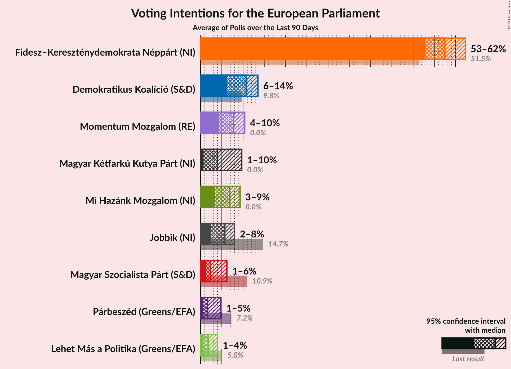

### Confidence Intervals

| Party | Last Result | Median | 80% Confidence Interval | 90% Confidence Interval | 95% Confidence Interval | 99% Confidence Interval |
|:-----:|:-----------:|:------:|:-----------------------:|:-----------------------:|:-----------------------:|:-----------------------:|
| <a href="#fidesz–kereszténydemokrata-néppárt-(ni)">Fidesz–Kereszténydemokrata Néppárt (NI)</a> | 51.5% | 57.5% | 54.4–61.0% |53.6–61.8% | 52.9–62.3% | 51.8–63.4% |
| <a href="#magyar-szocialista-párt–párbeszéd-(s&d)">Magyar Szocialista Párt–Párbeszéd (S&D)</a> | 18.2% | N/A | N/A |N/A | N/A | N/A |
| <a href="#jobbik-(ni)">Jobbik (NI)</a> | 14.7% | 5.7% | 3.1–7.2% |2.7–7.6% | 2.5–8.0% | 2.1–8.7% |
| <a href="#magyar-szocialista-párt-(s&d)">Magyar Szocialista Párt (S&D)</a> | 10.9% | 2.4% | 1.6–5.5% |1.4–5.9% | 1.3–6.2% | 1.1–6.8% |
| <a href="#demokratikus-koalíció-(s&d)">Demokratikus Koalíció (S&D)</a> | 9.8% | 10.7% | 7.0–12.7% |6.5–13.1% | 6.2–13.5% | 5.6–14.2% |
| <a href="#párbeszéd-(greens/efa)">Párbeszéd (Greens/EFA)</a> | 7.2% | 1.7% | 0.9–4.1% |0.7–4.5% | 0.6–4.8% | 0.5–5.4% |
| <a href="#együtt-(greens/efa)">Együtt (Greens/EFA)</a> | 7.2% | N/A | N/A |N/A | N/A | N/A |
| <a href="#lehet-más-a-politika-(greens/efa)">Lehet Más a Politika (Greens/EFA)</a> | 5.0% | 1.8% | 0.9–3.4% |0.8–3.7% | 0.7–4.0% | 0.5–4.4% |
| <a href="#mlp-(re)">MLP (RE)</a> | 0.0% | N/A | N/A |N/A | N/A | N/A |
| <a href="#magyar-kétfarkú-kutya-párt-(ni)">Magyar Kétfarkú Kutya Párt (NI)</a> | 0.0% | 4.0% | 1.1–8.7% |0.9–9.3% | 0.7–9.7% | 0.6–10.5% |
| <a href="#momentum-mozgalom-(re)">Momentum Mozgalom (RE)</a> | 0.0% | 7.8% | 5.1–9.6% |4.6–10.0% | 4.3–10.4% | 3.8–11.1% |
| <a href="#mi-hazánk-mozgalom-(ni)">Mi Hazánk Mozgalom (NI)</a> | 0.0% | 6.9% | 4.0–8.6% |3.7–9.0% | 3.4–9.3% | 2.9–9.9% |
| <a href="#united-opposition-(s&d)">United Opposition (S&D)</a> | 0.0% | N/A | N/A |N/A | N/A | N/A |

### Fidesz–Kereszténydemokrata Néppárt (NI)

*For a full overview of the results for this party, see the [Fidesz–Kereszténydemokrata Néppárt (NI)](party-fidesz–kereszténydemokratanéppártni.html) page.*

| Voting Intentions | Probability | Accumulated | Special Marks |
|:-----------------:|:-----------:|:-----------:|:-------------:|
| 48.5–49.5% | 0% | 100% |  |
| 49.5–50.5% | 0.1% | 100% |  |
| 50.5–51.5% | 0.3% | 99.9% | Last Result |
| 51.5–52.5% | 1.2% | 99.6% |  |
| 52.5–53.5% | 3% | 98% |  |
| 53.5–54.5% | 7% | 95% |  |
| 54.5–55.5% | 11% | 89% |  |
| 55.5–56.5% | 14% | 78% |  |
| 56.5–57.5% | 15% | 64% | Median |
| 57.5–58.5% | 13% | 49% |  |
| 58.5–59.5% | 11% | 36% |  |
| 59.5–60.5% | 11% | 25% |  |
| 60.5–61.5% | 8% | 14% |  |
| 61.5–62.5% | 4% | 6% |  |
| 62.5–63.5% | 2% | 2% |  |
| 63.5–64.5% | 0.3% | 0.4% |  |
| 64.5–65.5% | 0.1% | 0.1% |  |
| 65.5–66.5% | 0% | 0% |  |

### Jobbik (NI)

*For a full overview of the results for this party, see the [Jobbik (NI)](party-jobbikni.html) page.*

| Voting Intentions | Probability | Accumulated | Special Marks |
|:-----------------:|:-----------:|:-----------:|:-------------:|
| 0.5–1.5% | 0% | 100% |  |
| 1.5–2.5% | 3% | 100% |  |
| 2.5–3.5% | 13% | 97% |  |
| 3.5–4.5% | 8% | 84% |  |
| 4.5–5.5% | 20% | 75% |  |
| 5.5–6.5% | 32% | 56% | Median |
| 6.5–7.5% | 18% | 23% |  |
| 7.5–8.5% | 5% | 6% |  |
| 8.5–9.5% | 0.6% | 0.7% |  |
| 9.5–10.5% | 0% | 0% |  |
| 10.5–11.5% | 0% | 0% |  |
| 11.5–12.5% | 0% | 0% |  |
| 12.5–13.5% | 0% | 0% |  |
| 13.5–14.5% | 0% | 0% |  |
| 14.5–15.5% | 0% | 0% | Last Result |

### Magyar Szocialista Párt (S&D)

*For a full overview of the results for this party, see the [Magyar Szocialista Párt (S&D)](party-magyarszocialistapártsd.html) page.*

| Voting Intentions | Probability | Accumulated | Special Marks |
|:-----------------:|:-----------:|:-----------:|:-------------:|
| 0.0–0.5% | 0% | 100% |  |
| 0.5–1.5% | 9% | 100% |  |
| 1.5–2.5% | 45% | 91% | Median |
| 2.5–3.5% | 6% | 46% |  |
| 3.5–4.5% | 9% | 40% |  |
| 4.5–5.5% | 21% | 31% |  |
| 5.5–6.5% | 9% | 10% |  |
| 6.5–7.5% | 0.9% | 0.9% |  |
| 7.5–8.5% | 0% | 0% |  |
| 8.5–9.5% | 0% | 0% |  |
| 9.5–10.5% | 0% | 0% |  |
| 10.5–11.5% | 0% | 0% | Last Result |

### Demokratikus Koalíció (S&D)

*For a full overview of the results for this party, see the [Demokratikus Koalíció (S&D)](party-demokratikuskoalíciósd.html) page.*

| Voting Intentions | Probability | Accumulated | Special Marks |
|:-----------------:|:-----------:|:-----------:|:-------------:|
| 3.5–4.5% | 0% | 100% |  |
| 4.5–5.5% | 0.4% | 100% |  |
| 5.5–6.5% | 5% | 99.6% |  |
| 6.5–7.5% | 11% | 95% |  |
| 7.5–8.5% | 12% | 84% |  |
| 8.5–9.5% | 10% | 72% |  |
| 9.5–10.5% | 9% | 62% | Last Result |
| 10.5–11.5% | 18% | 53% | Median |
| 11.5–12.5% | 22% | 35% |  |
| 12.5–13.5% | 11% | 13% |  |
| 13.5–14.5% | 2% | 2% |  |
| 14.5–15.5% | 0.2% | 0.2% |  |
| 15.5–16.5% | 0% | 0% |  |

### Párbeszéd (Greens/EFA)

*For a full overview of the results for this party, see the [Párbeszéd (Greens/EFA)](party-párbeszédgreensefa.html) page.*

| Voting Intentions | Probability | Accumulated | Special Marks |
|:-----------------:|:-----------:|:-----------:|:-------------:|
| 0.0–0.5% | 1.0% | 100% |  |
| 0.5–1.5% | 42% | 99.0% |  |
| 1.5–2.5% | 34% | 57% | Median |
| 2.5–3.5% | 6% | 22% |  |
| 3.5–4.5% | 12% | 16% |  |
| 4.5–5.5% | 4% | 4% |  |
| 5.5–6.5% | 0.3% | 0.3% |  |
| 6.5–7.5% | 0% | 0% | Last Result |

### Lehet Más a Politika (Greens/EFA)

*For a full overview of the results for this party, see the [Lehet Más a Politika (Greens/EFA)](party-lehetmásapolitikagreensefa.html) page.*

| Voting Intentions | Probability | Accumulated | Special Marks |
|:-----------------:|:-----------:|:-----------:|:-------------:|
| 0.0–0.5% | 0.6% | 100% |  |
| 0.5–1.5% | 43% | 99.4% |  |
| 1.5–2.5% | 22% | 56% | Median |
| 2.5–3.5% | 27% | 35% |  |
| 3.5–4.5% | 8% | 8% |  |
| 4.5–5.5% | 0.3% | 0.3% | Last Result |
| 5.5–6.5% | 0% | 0% |  |

### Momentum Mozgalom (RE)

*For a full overview of the results for this party, see the [Momentum Mozgalom (RE)](party-momentummozgalomre.html) page.*

| Voting Intentions | Probability | Accumulated | Special Marks |
|:-----------------:|:-----------:|:-----------:|:-------------:|
| 0.0–0.5% | 0% | 100% | Last Result |
| 0.5–1.5% | 0% | 100% |  |
| 1.5–2.5% | 0% | 100% |  |
| 2.5–3.5% | 0.2% | 100% |  |
| 3.5–4.5% | 4% | 99.8% |  |
| 4.5–5.5% | 11% | 95% |  |
| 5.5–6.5% | 9% | 85% |  |
| 6.5–7.5% | 20% | 76% |  |
| 7.5–8.5% | 25% | 56% | Median |
| 8.5–9.5% | 21% | 31% |  |
| 9.5–10.5% | 8% | 10% |  |
| 10.5–11.5% | 2% | 2% |  |
| 11.5–12.5% | 0.1% | 0.1% |  |
| 12.5–13.5% | 0% | 0% |  |

### Magyar Kétfarkú Kutya Párt (NI)

*For a full overview of the results for this party, see the [Magyar Kétfarkú Kutya Párt (NI)](party-magyarkétfarkúkutyapártni.html) page.*

| Voting Intentions | Probability | Accumulated | Special Marks |
|:-----------------:|:-----------:|:-----------:|:-------------:|
| 0.0–0.5% | 0.5% | 100% | Last Result |
| 0.5–1.5% | 20% | 99.5% |  |
| 1.5–2.5% | 17% | 80% |  |
| 2.5–3.5% | 6% | 63% |  |
| 3.5–4.5% | 15% | 57% | Median |
| 4.5–5.5% | 7% | 42% |  |
| 5.5–6.5% | 10% | 35% |  |
| 6.5–7.5% | 6% | 25% |  |
| 7.5–8.5% | 8% | 19% |  |
| 8.5–9.5% | 8% | 11% |  |
| 9.5–10.5% | 3% | 3% |  |
| 10.5–11.5% | 0.4% | 0.4% |  |
| 11.5–12.5% | 0% | 0% |  |

### Mi Hazánk Mozgalom (NI)

*For a full overview of the results for this party, see the [Mi Hazánk Mozgalom (NI)](party-mihazánkmozgalomni.html) page.*

| Voting Intentions | Probability | Accumulated | Special Marks |
|:-----------------:|:-----------:|:-----------:|:-------------:|
| 0.0–0.5% | 0% | 100% | Last Result |
| 0.5–1.5% | 0% | 100% |  |
| 1.5–2.5% | 0% | 100% |  |
| 2.5–3.5% | 4% | 100% |  |
| 3.5–4.5% | 15% | 96% |  |
| 4.5–5.5% | 15% | 81% |  |
| 5.5–6.5% | 12% | 67% |  |
| 6.5–7.5% | 19% | 55% | Median |
| 7.5–8.5% | 25% | 36% |  |
| 8.5–9.5% | 10% | 11% |  |
| 9.5–10.5% | 1.2% | 1.3% |  |
| 10.5–11.5% | 0.1% | 0.1% |  |
| 11.5–12.5% | 0% | 0% |  |

## Seats

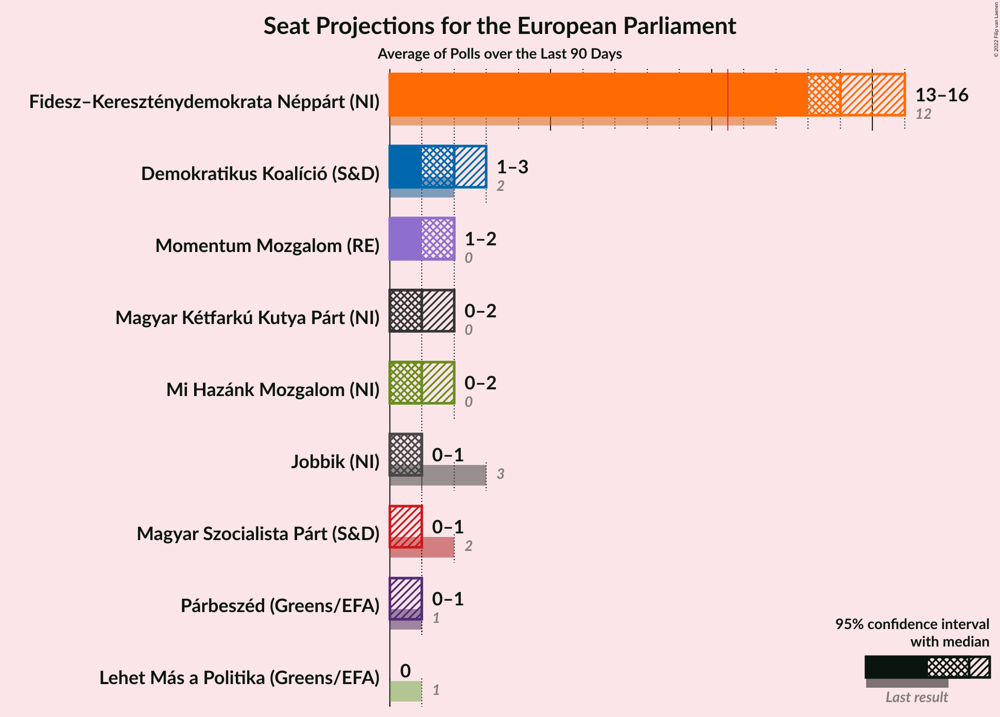

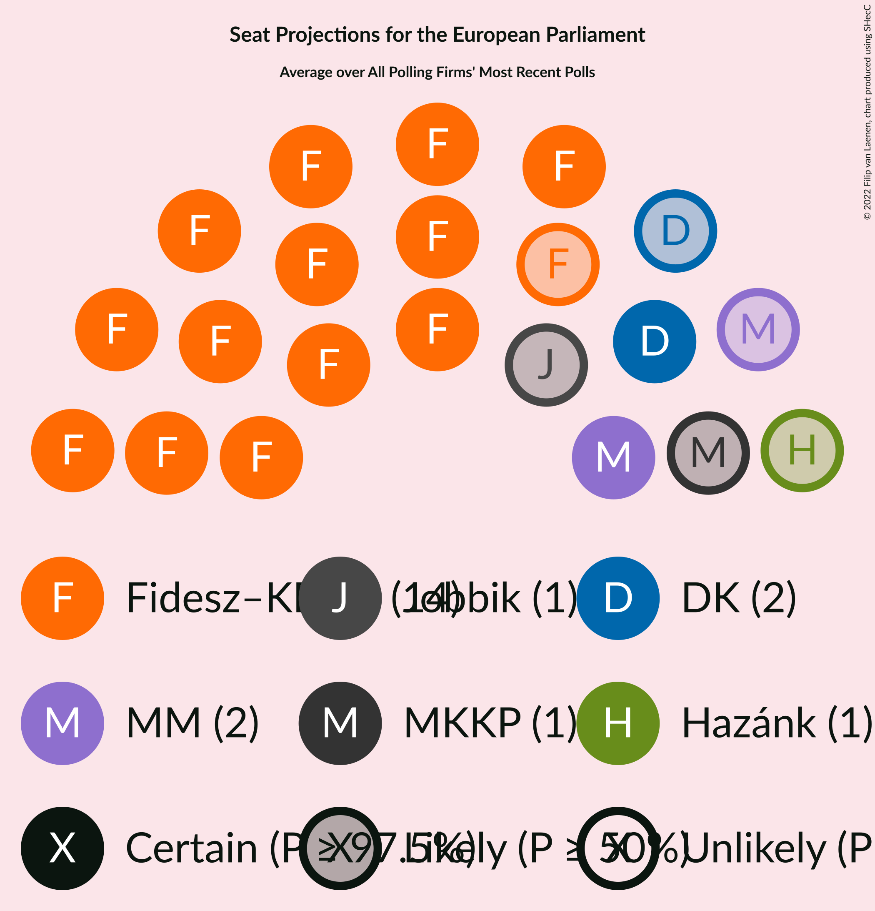

### Confidence Intervals

| Party | Last Result | Median | 80% Confidence Interval | 90% Confidence Interval | 95% Confidence Interval | 99% Confidence Interval |
|:-----:|:-----------:|:------:|:-----------------------:|:-----------------------:|:-----------------------:|:-----------------------:|
| <a href="#fidesz–kereszténydemokrata-néppárt-(ni)">Fidesz–Kereszténydemokrata Néppárt (NI)</a> | 12 | 14 | 13–15 |13–15 | 13–16 | 12–16 |
| <a href="#magyar-szocialista-párt–párbeszéd-(s&d)">Magyar Szocialista Párt–Párbeszéd (S&D)</a> | 3 | N/A | N/A |N/A | N/A | N/A |
| <a href="#jobbik-(ni)">Jobbik (NI)</a> | 3 | 1 | 0–1 |0–1 | 0–1 | 0–2 |
| <a href="#magyar-szocialista-párt-(s&d)">Magyar Szocialista Párt (S&D)</a> | 2 | 0 | 0–1 |0–1 | 0–1 | 0–1 |
| <a href="#demokratikus-koalíció-(s&d)">Demokratikus Koalíció (S&D)</a> | 2 | 2 | 1–3 |1–3 | 1–3 | 1–3 |
| <a href="#párbeszéd-(greens/efa)">Párbeszéd (Greens/EFA)</a> | 1 | 0 | 0–1 |0–1 | 0–1 | 0–1 |
| <a href="#együtt-(greens/efa)">Együtt (Greens/EFA)</a> | 0 | N/A | N/A |N/A | N/A | N/A |
| <a href="#lehet-más-a-politika-(greens/efa)">Lehet Más a Politika (Greens/EFA)</a> | 1 | 0 | 0 |0 | 0 | 0–1 |
| <a href="#mlp-(re)">MLP (RE)</a> | 0 | N/A | N/A |N/A | N/A | N/A |
| <a href="#magyar-kétfarkú-kutya-párt-(ni)">Magyar Kétfarkú Kutya Párt (NI)</a> | 0 | 1 | 0–2 |0–2 | 0–2 | 0–2 |
| <a href="#momentum-mozgalom-(re)">Momentum Mozgalom (RE)</a> | 0 | 2 | 1–2 |1–2 | 1–2 | 0–2 |
| <a href="#mi-hazánk-mozgalom-(ni)">Mi Hazánk Mozgalom (NI)</a> | 0 | 1 | 1–2 |0–2 | 0–2 | 0–2 |
| <a href="#united-opposition-(s&d)">United Opposition (S&D)</a> | 0 | N/A | N/A |N/A | N/A | N/A |

### Fidesz–Kereszténydemokrata Néppárt (NI)

*For a full overview of the results for this party, see the [Fidesz–Kereszténydemokrata Néppárt (NI)](party-fidesz–kereszténydemokratanéppártni.html) page.*

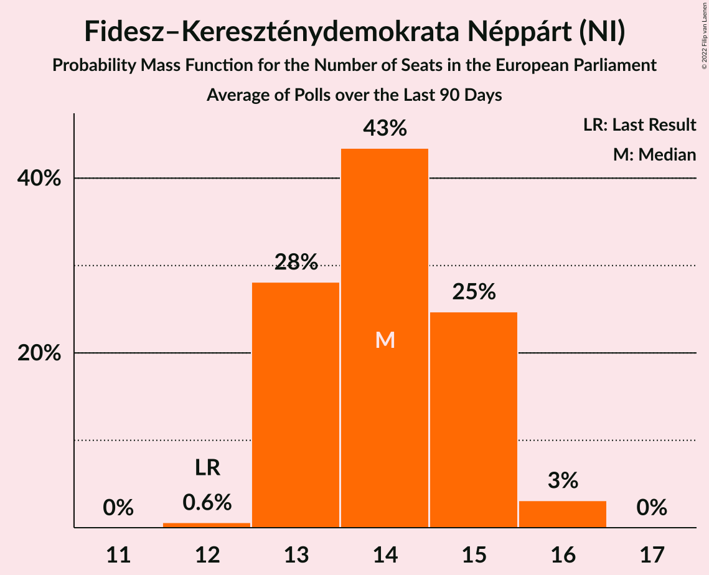

| Number of Seats | Probability | Accumulated | Special Marks |
|:---------------:|:-----------:|:-----------:|:-------------:|
| 12 | 0.6% | 100% | Last Result |
| 13 | 28% | 99.4% |  |
| 14 | 43% | 71% | Median |
| 15 | 25% | 28% |  |
| 16 | 3% | 3% |  |
| 17 | 0% | 0% |  |

### Magyar Szocialista Párt–Párbeszéd (S&D)

*For a full overview of the results for this party, see the [Magyar Szocialista Párt–Párbeszéd (S&D)](party-magyarszocialistapárt–párbeszédsd.html) page.*

### Jobbik (NI)

*For a full overview of the results for this party, see the [Jobbik (NI)](party-jobbikni.html) page.*

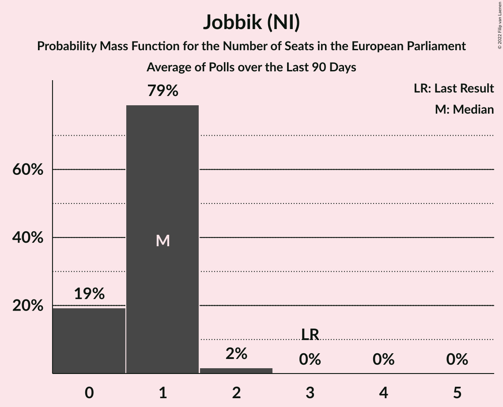

| Number of Seats | Probability | Accumulated | Special Marks |
|:---------------:|:-----------:|:-----------:|:-------------:|
| 0 | 19% | 100% |  |
| 1 | 79% | 81% | Median |
| 2 | 2% | 2% |  |
| 3 | 0% | 0% | Last Result |

### Magyar Szocialista Párt (S&D)

*For a full overview of the results for this party, see the [Magyar Szocialista Párt (S&D)](party-magyarszocialistapártsd.html) page.*

| Number of Seats | Probability | Accumulated | Special Marks |
|:---------------:|:-----------:|:-----------:|:-------------:|
| 0 | 62% | 100% | Median |
| 1 | 38% | 38% |  |
| 2 | 0% | 0% | Last Result |

### Demokratikus Koalíció (S&D)

*For a full overview of the results for this party, see the [Demokratikus Koalíció (S&D)](party-demokratikuskoalíciósd.html) page.*

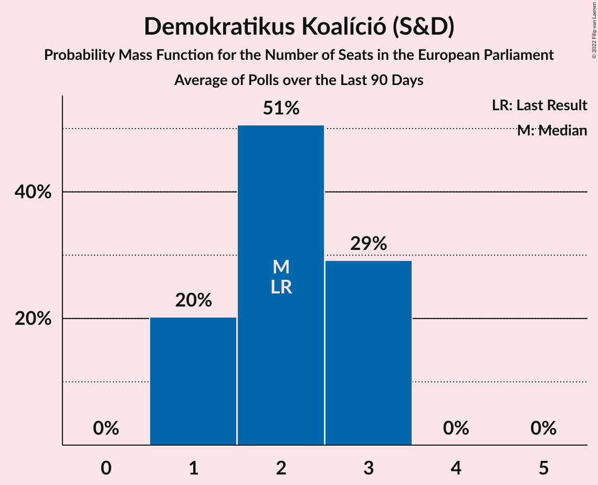

| Number of Seats | Probability | Accumulated | Special Marks |
|:---------------:|:-----------:|:-----------:|:-------------:|
| 1 | 20% | 100% |  |
| 2 | 51% | 80% | Last Result, Median |
| 3 | 29% | 29% |  |
| 4 | 0% | 0% |  |

### Párbeszéd (Greens/EFA)

*For a full overview of the results for this party, see the [Párbeszéd (Greens/EFA)](party-párbeszédgreensefa.html) page.*

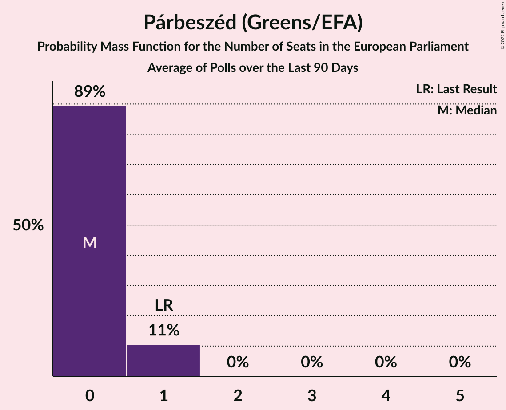

| Number of Seats | Probability | Accumulated | Special Marks |
|:---------------:|:-----------:|:-----------:|:-------------:|
| 0 | 89% | 100% | Median |
| 1 | 11% | 11% | Last Result |
| 2 | 0% | 0% |  |

### Együtt (Greens/EFA)

*For a full overview of the results for this party, see the [Együtt (Greens/EFA)](party-együttgreensefa.html) page.*

### Lehet Más a Politika (Greens/EFA)

*For a full overview of the results for this party, see the [Lehet Más a Politika (Greens/EFA)](party-lehetmásapolitikagreensefa.html) page.*

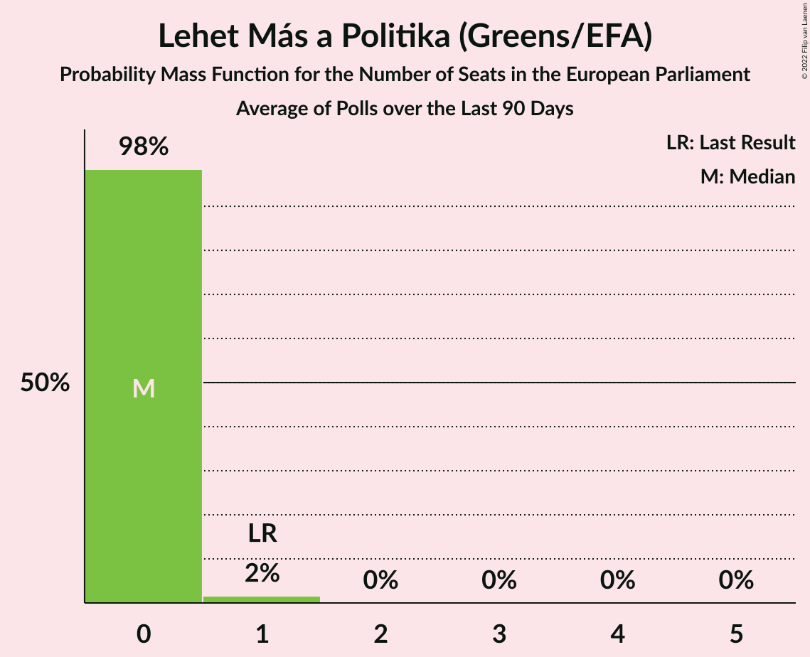

| Number of Seats | Probability | Accumulated | Special Marks |
|:---------------:|:-----------:|:-----------:|:-------------:|
| 0 | 98% | 100% | Median |
| 1 | 2% | 2% | Last Result |
| 2 | 0% | 0% |  |

### MLP (RE)

*For a full overview of the results for this party, see the [MLP (RE)](party-mlpre.html) page.*

### Magyar Kétfarkú Kutya Párt (NI)

*For a full overview of the results for this party, see the [Magyar Kétfarkú Kutya Párt (NI)](party-magyarkétfarkúkutyapártni.html) page.*

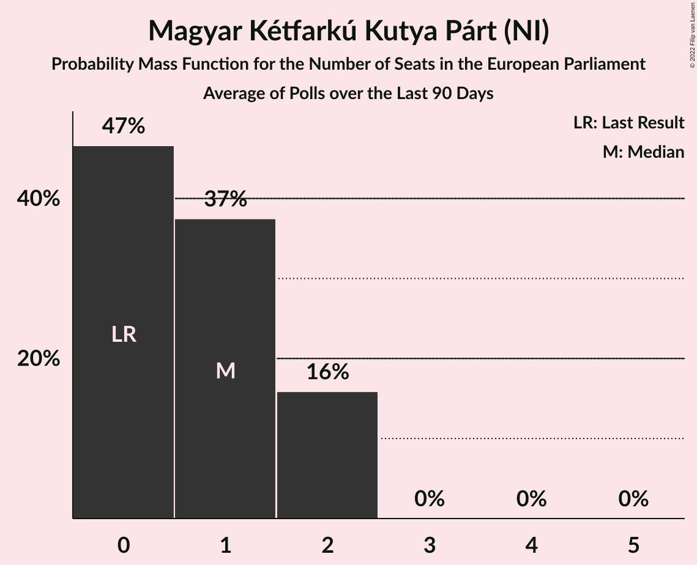

| Number of Seats | Probability | Accumulated | Special Marks |
|:---------------:|:-----------:|:-----------:|:-------------:|
| 0 | 47% | 100% | Last Result |
| 1 | 37% | 53% | Median |
| 2 | 16% | 16% |  |
| 3 | 0% | 0% |  |

### Momentum Mozgalom (RE)

*For a full overview of the results for this party, see the [Momentum Mozgalom (RE)](party-momentummozgalomre.html) page.*

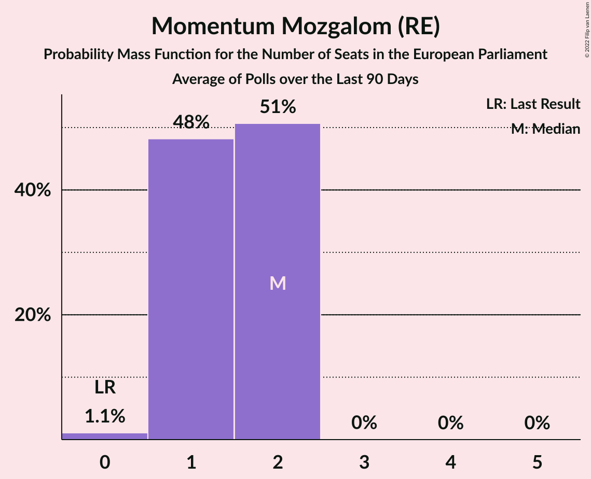

| Number of Seats | Probability | Accumulated | Special Marks |
|:---------------:|:-----------:|:-----------:|:-------------:|
| 0 | 1.1% | 100% | Last Result |
| 1 | 48% | 98.9% |  |
| 2 | 51% | 51% | Median |
| 3 | 0% | 0% |  |

### Mi Hazánk Mozgalom (NI)

*For a full overview of the results for this party, see the [Mi Hazánk Mozgalom (NI)](party-mihazánkmozgalomni.html) page.*

| Number of Seats | Probability | Accumulated | Special Marks |
|:---------------:|:-----------:|:-----------:|:-------------:|
| 0 | 7% | 100% | Last Result |
| 1 | 68% | 93% | Median |
| 2 | 25% | 25% |  |
| 3 | 0% | 0% |  |

### United Opposition (S&D)

*For a full overview of the results for this party, see the [United Opposition (S&D)](party-unitedoppositionsd.html) page.*

## Coalitions

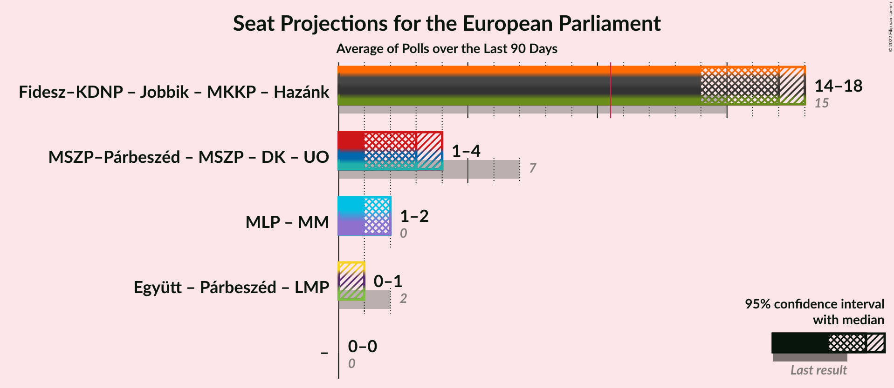

### Confidence Intervals

| Coalition | Last Result | Median | Majority? | 80% Confidence Interval | 90% Confidence Interval | 95% Confidence Interval | 99% Confidence Interval |
|:---------:|:-----------:|:------:|:---------:|:-----------------------:|:-----------------------:|:-----------------------:|:-----------------------:|
| Fidesz–Kereszténydemokrata Néppárt (NI) – Jobbik (NI) – Magyar Kétfarkú Kutya Párt (NI) – Mi Hazánk Mozgalom (NI) | 15 | 17 | 100% | 15–18 | 15–18 | 14–18 | 14–19 |
| Magyar Szocialista Párt–Párbeszéd (S&D) – Magyar Szocialista Párt (S&D) – Demokratikus Koalíció (S&D) – United Opposition (S&D) | 7 | 3 | 0% | 1–4 | 1–4 | 1–4 | 1–4 |
| MLP (RE) – Momentum Mozgalom (RE) | 0 | 2 | 0% | 1–2 | 1–2 | 1–2 | 0–2 |
| Együtt (Greens/EFA) – Párbeszéd (Greens/EFA) – Lehet Más a Politika (Greens/EFA) | 2 | 0 | 0% | 0–1 | 0–1 | 0–1 | 0–1 |

### Fidesz–Kereszténydemokrata Néppárt (NI) – Jobbik (NI) – Magyar Kétfarkú Kutya Párt (NI) – Mi Hazánk Mozgalom (NI)

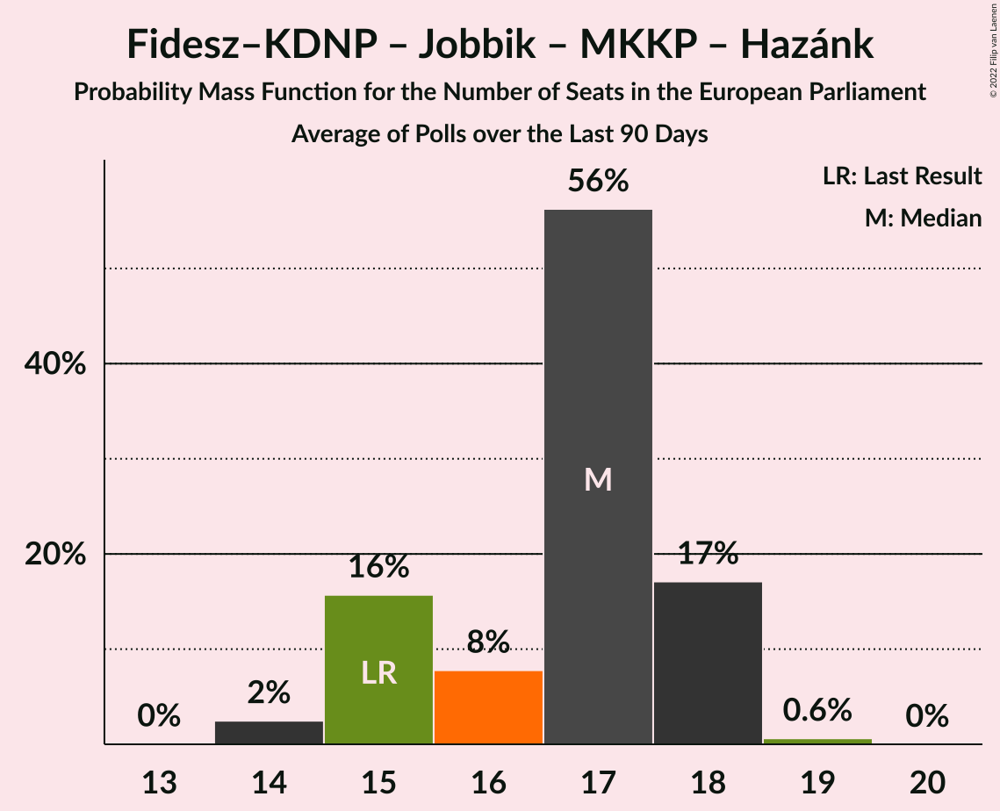

| Number of Seats | Probability | Accumulated | Special Marks |
|:---------------:|:-----------:|:-----------:|:-------------:|
| 14 | 2% | 100% |  |
| 15 | 16% | 97% | Last Result |
| 16 | 8% | 82% |  |
| 17 | 56% | 74% | Median |
| 18 | 17% | 18% |  |
| 19 | 0.6% | 0.6% |  |
| 20 | 0% | 0% |  |

### Magyar Szocialista Párt–Párbeszéd (S&D) – Magyar Szocialista Párt (S&D) – Demokratikus Koalíció (S&D) – United Opposition (S&D)

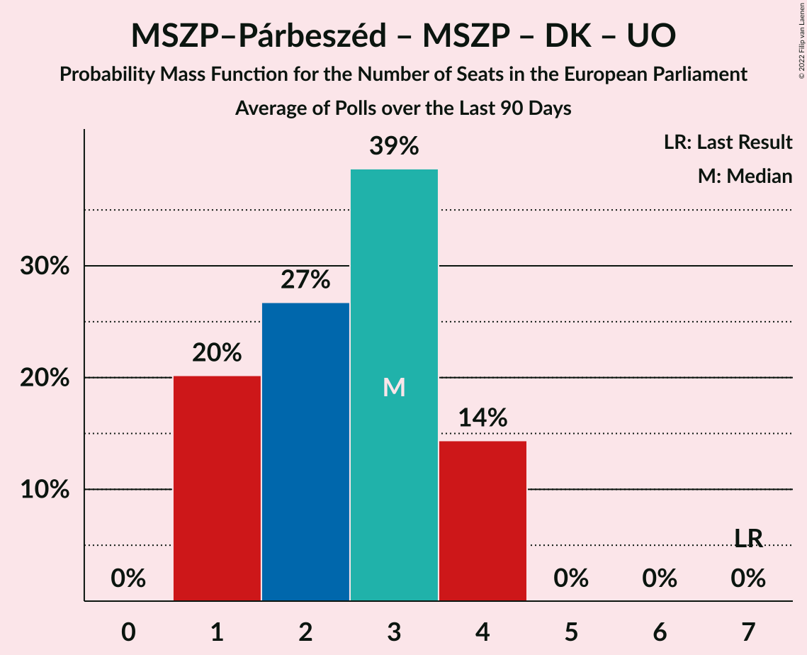

| Number of Seats | Probability | Accumulated | Special Marks |
|:---------------:|:-----------:|:-----------:|:-------------:|
| 1 | 20% | 100% |  |
| 2 | 27% | 80% | Median |
| 3 | 39% | 53% |  |
| 4 | 14% | 14% |  |
| 5 | 0% | 0% |  |
| 6 | 0% | 0% |  |
| 7 | 0% | 0% | Last Result |

### MLP (RE) – Momentum Mozgalom (RE)

| Number of Seats | Probability | Accumulated | Special Marks |
|:---------------:|:-----------:|:-----------:|:-------------:|
| 0 | 1.1% | 100% | Last Result |
| 1 | 48% | 98.9% |  |
| 2 | 51% | 51% | Median |
| 3 | 0% | 0% |  |

### Együtt (Greens/EFA) – Párbeszéd (Greens/EFA) – Lehet Más a Politika (Greens/EFA)

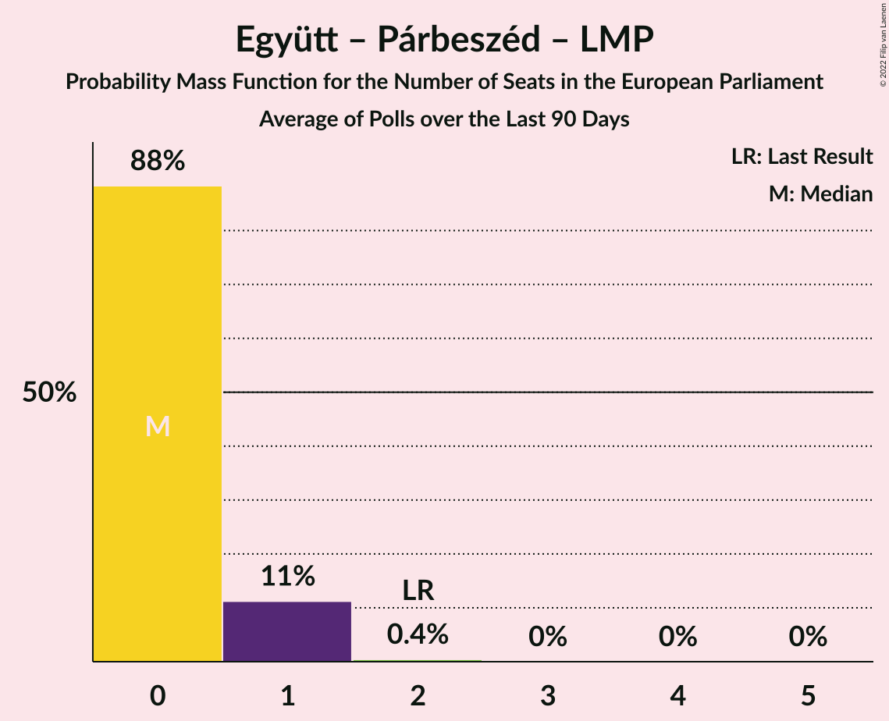

| Number of Seats | Probability | Accumulated | Special Marks |
|:---------------:|:-----------:|:-----------:|:-------------:|
| 0 | 88% | 100% | Median |
| 1 | 11% | 12% |  |
| 2 | 0.4% | 0.4% | Last Result |
| 3 | 0% | 0% |  |

## Technical Information

+ **Number of polls included in this average:** 5
+ **Lowest number of simulations done in a poll included in this average:** 1,048,576
+ **Total number of simulations done in the polls included in this average:** 5,242,880
+ **Error estimate:** 2.27%
