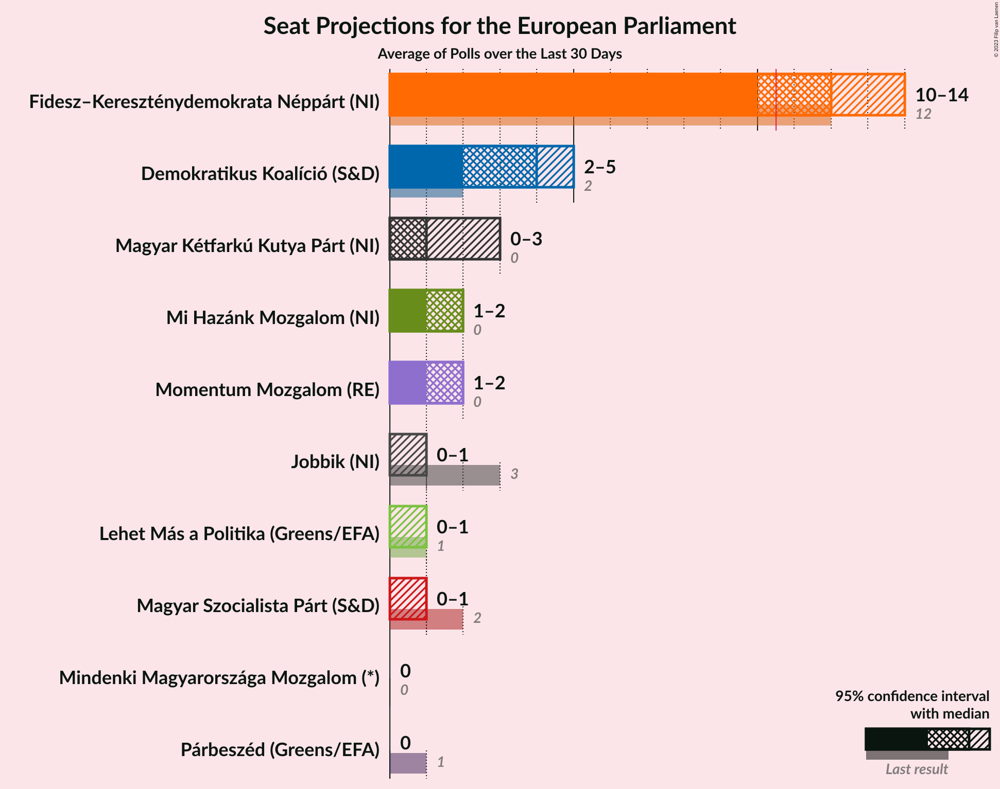
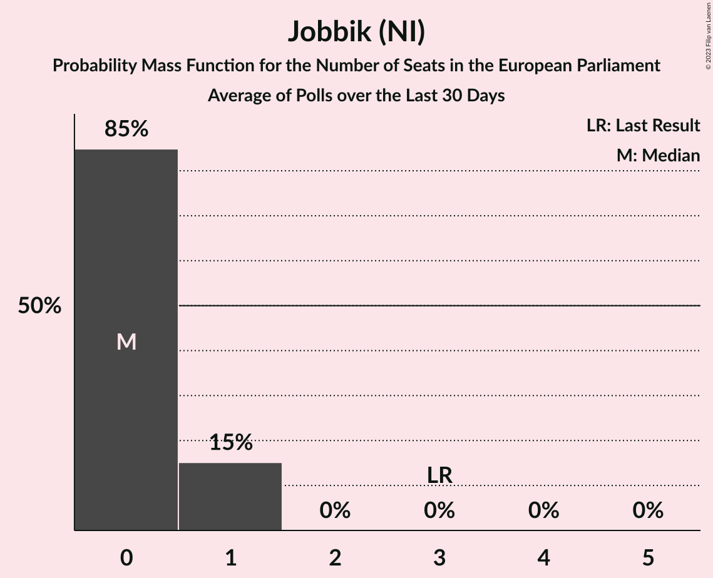
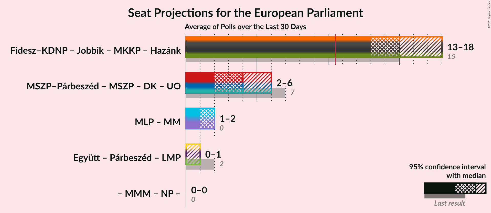
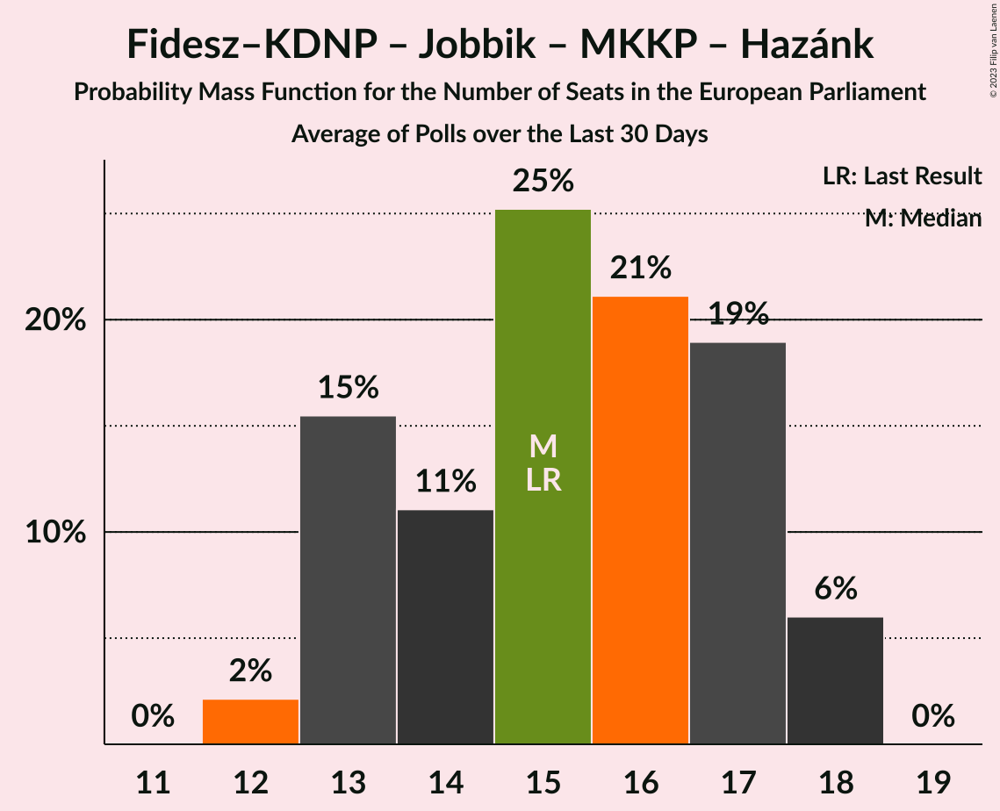

# Poll Average

<a href="#voting-intentions">Voting Intentions</a> | <a href="#seats">Seats</a> | <a href="#coalitions">Coalitions</a> | <a href="#technical-information">Technical Information</a>

## Summary

The table below lists the polls on which the average is based. They are the most recent polls (less than 30 days old) registered and analyzed so far.

| Period     | Polling firm/Commissioner(s) | Fidesz–KDNP | Jobbik | MSZP | DK | Párbeszéd | Együtt | LMP | MLP | MKKP | MM | MSZP–Párbeszéd | Hazánk | UO | MMM | NP |
|:----------:|:----------------------------:|:--:|:--:|:--:|:--:|:--:|:--:|:--:|:--:|:--:|:--:|:--:|:--:|:--:|:--:|:--:|
| 26 May 2019 | General Election | 51.5%   12 | 14.7%   3 | 10.9%   2 | 9.8%   2 | 7.2%   1 | 7.2%   0 | 5.0%   1 | 0.0%   0 | 0.0%   0 | 0.0%   0 | 18.2%   3 | 0.0%   0 | 0.0%   0 | 0.0%   0 | 0.0%   0 |
| N/A | Poll Average | 43–54%   10–14 | 1–5%   0–1 | 1–6%   0–1 | 9–22%   2–5 | 1–3%   0 | N/A   N/A | 2–5%   0–1 | N/A   N/A | 2–14%   0–3 | 5–10%   1–2 | N/A   N/A | 7–11%   1–2 | N/A   N/A | 1–3%   0 | N/A   N/A |
| [25 March–13 April 2023](2023-04-13-IDEAIntézet.html) | IDEA Intézet | 47–51%   11–12 | 1–2%   0 | 1–3%   0 | 18–22%   4–5 | 1–2%   0 | N/A   N/A | 1–3%   0 | N/A   N/A | 4–6%   1 | 7–9%   1–2 | N/A   N/A | 8–10%   2 | N/A   N/A | N/A   N/A | N/A   N/A |
| [1–31 March 2023](2023-03-31-Századvég.html) | Századvég | 42–48%   10–12 | 1–3%   0 | 1–2%   0 | 8–12%   2–3 | 1–2%   0 | N/A   N/A | 1–3%   0 | N/A   N/A | 11–15%   2–3 | 7–11%   1–2 | N/A   N/A | 8–12%   2–3 | N/A   N/A | N/A   N/A | N/A   N/A |
| [27–29 March 2023](2023-03-29-Táradalomkutató.html) | Táradalomkutató | 49–55%   12–14 | 3–5%   0–1 | 1–3%   0 | 10–14%   2–3 | 1–2%   0 | N/A   N/A | 2–4%   0–1 | N/A   N/A | 8–12%   2–3 | 5–8%   1 | N/A   N/A | 6–10%   1–2 | N/A   N/A | 1–3%   0 | N/A   N/A |
| [20–24 March 2023](2023-03-24-RepublikonIntézet.html) | Republikon Intézet | 44–50%   10–12 | 2–4%   0–1 | 4–7%   0–1 | 18–23%   4–5 | 1–3%   0 | N/A   N/A | 3–5%   0–1 | N/A   N/A | 2–4%   0–1 | 6–10%   1–2 | N/A   N/A | 6–10%   1–2 | N/A   N/A | N/A   N/A | N/A   N/A |
| 26 May 2019 | General Election | 51.5%   12 | 14.7%   3 | 10.9%   2 | 9.8%   2 | 7.2%   1 | 7.2%   0 | 5.0%   1 | 0.0%   0 | 0.0%   0 | 0.0%   0 | 18.2%   3 | 0.0%   0 | 0.0%   0 | 0.0%   0 | 0.0%   0 |

Only polls for which at least the sample size has been published are included in the table above.

**Legend:**
+ **Top half of each row:** Voting intentions (95% confidence interval)
+ **Bottom half of each row:** Seat projections for the European Parliament (95% confidence interval)
+ **Fidesz–KDNP:** Fidesz–Kereszténydemokrata Néppárt (NI)
+ **Jobbik:** Jobbik (NI)
+ **MSZP:** Magyar Szocialista Párt (S&D)
+ **DK:** Demokratikus Koalíció (S&D)
+ **Párbeszéd:** Párbeszéd (Greens/EFA)
+ **Együtt:** Együtt (Greens/EFA)
+ **LMP:** Lehet Más a Politika (Greens/EFA)
+ **MLP:** MLP (RE)
+ **MKKP:** Magyar Kétfarkú Kutya Párt (NI)
+ **MM:** Momentum Mozgalom (RE)
+ **MSZP–Párbeszéd:** Magyar Szocialista Párt–Párbeszéd (S&D)
+ **Hazánk:** Mi Hazánk Mozgalom (NI)
+ **UO:** United Opposition (S&D)
+ **MMM:** Mindenki Magyarországa Mozgalom (*)
+ **NP:** Nép Pártján (*)
+ **N/A (single party):** Party not included the published results
+ **N/A (entire row):** Calculation for this opinion poll not started yet

## Voting Intentions

### Confidence Intervals

| Party | Last Result | Median | 80% Confidence Interval | 90% Confidence Interval | 95% Confidence Interval | 99% Confidence Interval |
|:-----:|:-----------:|:------:|:-----------------------:|:-----------------------:|:-----------------------:|:-----------------------:|
| <a href="#fidesz–kereszténydemokrata-néppárt-(ni)">Fidesz–Kereszténydemokrata Néppárt (NI)</a> | 51.5% | 48.1% | 44.4–52.3% |43.6–53.2% | 42.9–53.9% | 41.8–55.1% |
| <a href="#magyar-szocialista-párt–párbeszéd-(s&d)">Magyar Szocialista Párt–Párbeszéd (S&D)</a> | 18.2% | N/A | N/A |N/A | N/A | N/A |
| <a href="#jobbik-(ni)">Jobbik (NI)</a> | 14.7% | 2.5% | 1.0–4.3% |0.8–4.6% | 0.8–4.9% | 0.6–5.5% |
| <a href="#magyar-szocialista-párt-(s&d)">Magyar Szocialista Párt (S&D)</a> | 10.9% | 2.0% | 1.0–5.2% |0.8–5.7% | 0.7–6.0% | 0.5–6.6% |
| <a href="#demokratikus-koalíció-(s&d)">Demokratikus Koalíció (S&D)</a> | 9.8% | 15.9% | 9.8–20.9% |9.3–21.5% | 8.9–21.9% | 8.2–22.8% |
| <a href="#párbeszéd-(greens/efa)">Párbeszéd (Greens/EFA)</a> | 7.2% | 1.2% | 0.8–2.2% |0.7–2.5% | 0.6–2.7% | 0.5–3.1% |
| <a href="#együtt-(greens/efa)">Együtt (Greens/EFA)</a> | 7.2% | N/A | N/A |N/A | N/A | N/A |
| <a href="#lehet-más-a-politika-(greens/efa)">Lehet Más a Politika (Greens/EFA)</a> | 5.0% | 2.6% | 1.7–4.3% |1.6–4.6% | 1.5–4.9% | 1.3–5.5% |
| <a href="#mlp-(re)">MLP (RE)</a> | 0.0% | N/A | N/A |N/A | N/A | N/A |
| <a href="#magyar-kétfarkú-kutya-párt-(ni)">Magyar Kétfarkú Kutya Párt (NI)</a> | 0.0% | 7.0% | 2.9–13.3% |2.6–14.0% | 2.4–14.5% | 2.1–15.3% |
| <a href="#momentum-mozgalom-(re)">Momentum Mozgalom (RE)</a> | 0.0% | 7.9% | 5.9–9.5% |5.4–9.9% | 5.1–10.3% | 4.6–11.0% |
| <a href="#mi-hazánk-mozgalom-(ni)">Mi Hazánk Mozgalom (NI)</a> | 0.0% | 8.8% | 7.3–10.4% |7.0–10.9% | 6.7–11.3% | 6.2–12.1% |
| <a href="#united-opposition-(s&d)">United Opposition (S&D)</a> | 0.0% | N/A | N/A |N/A | N/A | N/A |
| <a href="#mindenki-magyarországa-mozgalom-(*)">Mindenki Magyarországa Mozgalom (*)</a> | 0.0% | 2.1% | 1.5–2.7% |1.4–2.9% | 1.3–3.1% | 1.1–3.4% |
| <a href="#nép-pártján-(*)">Nép Pártján (*)</a> | 0.0% | N/A | N/A |N/A | N/A | N/A |

### Fidesz–Kereszténydemokrata Néppárt (NI)

*For a full overview of the results for this party, see the [Fidesz–Kereszténydemokrata Néppárt (NI)](party-fidesz–kereszténydemokratanéppártni.html) page.*

| Voting Intentions | Probability | Accumulated | Special Marks |
|:-----------------:|:-----------:|:-----------:|:-------------:|
| 39.5–40.5% | 0% | 100% |  |
| 40.5–41.5% | 0.3% | 99.9% |  |
| 41.5–42.5% | 1.2% | 99.7% |  |
| 42.5–43.5% | 3% | 98% |  |
| 43.5–44.5% | 7% | 95% |  |
| 44.5–45.5% | 10% | 89% |  |
| 45.5–46.5% | 11% | 79% |  |
| 46.5–47.5% | 11% | 68% |  |
| 47.5–48.5% | 12% | 57% | Median |
| 48.5–49.5% | 12% | 45% |  |
| 49.5–50.5% | 10% | 33% |  |
| 50.5–51.5% | 8% | 23% | Last Result |
| 51.5–52.5% | 7% | 15% |  |
| 52.5–53.5% | 5% | 9% |  |
| 53.5–54.5% | 3% | 4% |  |
| 54.5–55.5% | 0.9% | 1.2% |  |
| 55.5–56.5% | 0.2% | 0.3% |  |
| 56.5–57.5% | 0% | 0% |  |

### Jobbik (NI)

*For a full overview of the results for this party, see the [Jobbik (NI)](party-jobbikni.html) page.*

| Voting Intentions | Probability | Accumulated | Special Marks |
|:-----------------:|:-----------:|:-----------:|:-------------:|
| 0.0–0.5% | 0.2% | 100% |  |
| 0.5–1.5% | 27% | 99.8% |  |
| 1.5–2.5% | 23% | 73% |  |
| 2.5–3.5% | 25% | 50% | Median |
| 3.5–4.5% | 19% | 25% |  |
| 4.5–5.5% | 5% | 6% |  |
| 5.5–6.5% | 0.4% | 0.4% |  |
| 6.5–7.5% | 0% | 0% |  |
| 7.5–8.5% | 0% | 0% |  |
| 8.5–9.5% | 0% | 0% |  |
| 9.5–10.5% | 0% | 0% |  |
| 10.5–11.5% | 0% | 0% |  |
| 11.5–12.5% | 0% | 0% |  |
| 12.5–13.5% | 0% | 0% |  |
| 13.5–14.5% | 0% | 0% |  |
| 14.5–15.5% | 0% | 0% | Last Result |

### Magyar Szocialista Párt (S&D)

*For a full overview of the results for this party, see the [Magyar Szocialista Párt (S&D)](party-magyarszocialistapártsd.html) page.*

| Voting Intentions | Probability | Accumulated | Special Marks |
|:-----------------:|:-----------:|:-----------:|:-------------:|
| 0.0–0.5% | 0.6% | 100% |  |
| 0.5–1.5% | 26% | 99.4% |  |
| 1.5–2.5% | 42% | 73% | Median |
| 2.5–3.5% | 6% | 31% |  |
| 3.5–4.5% | 6% | 25% |  |
| 4.5–5.5% | 13% | 19% |  |
| 5.5–6.5% | 6% | 6% |  |
| 6.5–7.5% | 0.6% | 0.6% |  |
| 7.5–8.5% | 0% | 0% |  |
| 8.5–9.5% | 0% | 0% |  |
| 9.5–10.5% | 0% | 0% |  |
| 10.5–11.5% | 0% | 0% | Last Result |

### Demokratikus Koalíció (S&D)

*For a full overview of the results for this party, see the [Demokratikus Koalíció (S&D)](party-demokratikuskoalíciósd.html) page.*

| Voting Intentions | Probability | Accumulated | Special Marks |
|:-----------------:|:-----------:|:-----------:|:-------------:|
| 6.5–7.5% | 0.1% | 100% |  |
| 7.5–8.5% | 1.2% | 99.9% |  |
| 8.5–9.5% | 6% | 98.8% |  |
| 9.5–10.5% | 11% | 92% | Last Result |
| 10.5–11.5% | 12% | 81% |  |
| 11.5–12.5% | 11% | 69% |  |
| 12.5–13.5% | 6% | 58% |  |
| 13.5–14.5% | 2% | 52% |  |
| 14.5–15.5% | 0.2% | 50% |  |
| 15.5–16.5% | 0.1% | 50% | Median |
| 16.5–17.5% | 0.5% | 50% |  |
| 17.5–18.5% | 4% | 49% |  |
| 18.5–19.5% | 12% | 46% |  |
| 19.5–20.5% | 18% | 34% |  |
| 20.5–21.5% | 12% | 16% |  |
| 21.5–22.5% | 4% | 4% |  |
| 22.5–23.5% | 0.7% | 0.8% |  |
| 23.5–24.5% | 0.1% | 0.1% |  |
| 24.5–25.5% | 0% | 0% |  |

### Párbeszéd (Greens/EFA)

*For a full overview of the results for this party, see the [Párbeszéd (Greens/EFA)](party-párbeszédgreensefa.html) page.*

| Voting Intentions | Probability | Accumulated | Special Marks |
|:-----------------:|:-----------:|:-----------:|:-------------:|
| 0.0–0.5% | 1.4% | 100% |  |
| 0.5–1.5% | 71% | 98.6% | Median |
| 1.5–2.5% | 24% | 28% |  |
| 2.5–3.5% | 4% | 4% |  |
| 3.5–4.5% | 0.1% | 0.1% |  |
| 4.5–5.5% | 0% | 0% |  |
| 5.5–6.5% | 0% | 0% |  |
| 6.5–7.5% | 0% | 0% | Last Result |

### Lehet Más a Politika (Greens/EFA)

*For a full overview of the results for this party, see the [Lehet Más a Politika (Greens/EFA)](party-lehetmásapolitikagreensefa.html) page.*

| Voting Intentions | Probability | Accumulated | Special Marks |
|:-----------------:|:-----------:|:-----------:|:-------------:|
| 0.0–0.5% | 0% | 100% |  |
| 0.5–1.5% | 4% | 100% |  |
| 1.5–2.5% | 44% | 96% |  |
| 2.5–3.5% | 27% | 52% | Median |
| 3.5–4.5% | 19% | 25% |  |
| 4.5–5.5% | 5% | 6% | Last Result |
| 5.5–6.5% | 0.4% | 0.4% |  |
| 6.5–7.5% | 0% | 0% |  |

### Momentum Mozgalom (RE)

*For a full overview of the results for this party, see the [Momentum Mozgalom (RE)](party-momentummozgalomre.html) page.*

| Voting Intentions | Probability | Accumulated | Special Marks |
|:-----------------:|:-----------:|:-----------:|:-------------:|
| 0.0–0.5% | 0% | 100% | Last Result |
| 0.5–1.5% | 0% | 100% |  |
| 1.5–2.5% | 0% | 100% |  |
| 2.5–3.5% | 0% | 100% |  |
| 3.5–4.5% | 0.4% | 100% |  |
| 4.5–5.5% | 6% | 99.6% |  |
| 5.5–6.5% | 13% | 94% |  |
| 6.5–7.5% | 18% | 81% |  |
| 7.5–8.5% | 32% | 63% | Median |
| 8.5–9.5% | 22% | 30% |  |
| 9.5–10.5% | 7% | 9% |  |
| 10.5–11.5% | 1.4% | 2% |  |
| 11.5–12.5% | 0.1% | 0.1% |  |
| 12.5–13.5% | 0% | 0% |  |

### Magyar Kétfarkú Kutya Párt (NI)

*For a full overview of the results for this party, see the [Magyar Kétfarkú Kutya Párt (NI)](party-magyarkétfarkúkutyapártni.html) page.*

| Voting Intentions | Probability | Accumulated | Special Marks |
|:-----------------:|:-----------:|:-----------:|:-------------:|
| 0.0–0.5% | 0% | 100% | Last Result |
| 0.5–1.5% | 0% | 100% |  |
| 1.5–2.5% | 4% | 100% |  |
| 2.5–3.5% | 16% | 96% |  |
| 3.5–4.5% | 9% | 80% |  |
| 4.5–5.5% | 17% | 71% |  |
| 5.5–6.5% | 4% | 54% |  |
| 6.5–7.5% | 0.1% | 50% | Median |
| 7.5–8.5% | 1.2% | 50% |  |
| 8.5–9.5% | 6% | 49% |  |
| 9.5–10.5% | 10% | 43% |  |
| 10.5–11.5% | 8% | 32% |  |
| 11.5–12.5% | 8% | 25% |  |
| 12.5–13.5% | 9% | 17% |  |
| 13.5–14.5% | 6% | 8% |  |
| 14.5–15.5% | 2% | 2% |  |
| 15.5–16.5% | 0.3% | 0.3% |  |
| 16.5–17.5% | 0% | 0% |  |

### Mi Hazánk Mozgalom (NI)

*For a full overview of the results for this party, see the [Mi Hazánk Mozgalom (NI)](party-mihazánkmozgalomni.html) page.*

| Voting Intentions | Probability | Accumulated | Special Marks |
|:-----------------:|:-----------:|:-----------:|:-------------:|
| 0.0–0.5% | 0% | 100% | Last Result |
| 0.5–1.5% | 0% | 100% |  |
| 1.5–2.5% | 0% | 100% |  |
| 2.5–3.5% | 0% | 100% |  |
| 3.5–4.5% | 0% | 100% |  |
| 4.5–5.5% | 0% | 100% |  |
| 5.5–6.5% | 2% | 100% |  |
| 6.5–7.5% | 12% | 98% |  |
| 7.5–8.5% | 29% | 86% |  |
| 8.5–9.5% | 32% | 57% | Median |
| 9.5–10.5% | 17% | 26% |  |
| 10.5–11.5% | 7% | 8% |  |
| 11.5–12.5% | 1.5% | 2% |  |
| 12.5–13.5% | 0.2% | 0.2% |  |
| 13.5–14.5% | 0% | 0% |  |

### Mindenki Magyarországa Mozgalom (*)

*For a full overview of the results for this party, see the [Mindenki Magyarországa Mozgalom (*)](party-mindenkimagyarországamozgalom.html) page.*

| Voting Intentions | Probability | Accumulated | Special Marks |
|:-----------------:|:-----------:|:-----------:|:-------------:|
| 0.0–0.5% | 0% | 100% | Last Result |
| 0.5–1.5% | 11% | 100% |  |
| 1.5–2.5% | 73% | 89% | Median |
| 2.5–3.5% | 16% | 16% |  |
| 3.5–4.5% | 0.3% | 0.3% |  |
| 4.5–5.5% | 0% | 0% |  |

## Seats

### Confidence Intervals

| Party | Last Result | Median | 80% Confidence Interval | 90% Confidence Interval | 95% Confidence Interval | 99% Confidence Interval |
|:-----:|:-----------:|:------:|:-----------------------:|:-----------------------:|:-----------------------:|:-----------------------:|
| <a href="#fidesz–kereszténydemokrata-néppárt-(ni)">Fidesz–Kereszténydemokrata Néppárt (NI)</a> | 12 | 12 | 11–13 |11–13 | 10–14 | 10–14 |
| <a href="#magyar-szocialista-párt–párbeszéd-(s&d)">Magyar Szocialista Párt–Párbeszéd (S&D)</a> | 3 | N/A | N/A |N/A | N/A | N/A |
| <a href="#jobbik-(ni)">Jobbik (NI)</a> | 3 | 0 | 0–1 |0–1 | 0–1 | 0–1 |
| <a href="#magyar-szocialista-párt-(s&d)">Magyar Szocialista Párt (S&D)</a> | 2 | 0 | 0–1 |0–1 | 0–1 | 0–1 |
| <a href="#demokratikus-koalíció-(s&d)">Demokratikus Koalíció (S&D)</a> | 2 | 4 | 2–5 |2–5 | 2–5 | 2–5 |
| <a href="#párbeszéd-(greens/efa)">Párbeszéd (Greens/EFA)</a> | 1 | 0 | 0 |0 | 0 | 0 |
| <a href="#együtt-(greens/efa)">Együtt (Greens/EFA)</a> | 0 | N/A | N/A |N/A | N/A | N/A |
| <a href="#lehet-más-a-politika-(greens/efa)">Lehet Más a Politika (Greens/EFA)</a> | 1 | 0 | 0–1 |0–1 | 0–1 | 0–1 |
| <a href="#mlp-(re)">MLP (RE)</a> | 0 | N/A | N/A |N/A | N/A | N/A |
| <a href="#magyar-kétfarkú-kutya-párt-(ni)">Magyar Kétfarkú Kutya Párt (NI)</a> | 0 | 1 | 0–3 |0–3 | 0–3 | 0–3 |
| <a href="#momentum-mozgalom-(re)">Momentum Mozgalom (RE)</a> | 0 | 2 | 1–2 |1–2 | 1–2 | 1–2 |
| <a href="#mi-hazánk-mozgalom-(ni)">Mi Hazánk Mozgalom (NI)</a> | 0 | 2 | 1–2 |1–2 | 1–2 | 1–3 |
| <a href="#united-opposition-(s&d)">United Opposition (S&D)</a> | 0 | N/A | N/A |N/A | N/A | N/A |
| <a href="#mindenki-magyarországa-mozgalom-(*)">Mindenki Magyarországa Mozgalom (*)</a> | 0 | 0 | 0 |0 | 0 | 0 |
| <a href="#nép-pártján-(*)">Nép Pártján (*)</a> | 0 | N/A | N/A |N/A | N/A | N/A |

### Fidesz–Kereszténydemokrata Néppárt (NI)

*For a full overview of the results for this party, see the [Fidesz–Kereszténydemokrata Néppárt (NI)](party-fidesz–kereszténydemokratanéppártni.html) page.*

| Number of Seats | Probability | Accumulated | Special Marks |
|:---------------:|:-----------:|:-----------:|:-------------:|
| 10 | 5% | 100% |  |
| 11 | 36% | 95% | Majority |
| 12 | 37% | 59% | Last Result, Median |
| 13 | 17% | 22% |  |
| 14 | 5% | 5% |  |
| 15 | 0.1% | 0.1% |  |
| 16 | 0% | 0% |  |

### Magyar Szocialista Párt–Párbeszéd (S&D)

*For a full overview of the results for this party, see the [Magyar Szocialista Párt–Párbeszéd (S&D)](party-magyarszocialistapárt–párbeszédsd.html) page.*

### Jobbik (NI)

*For a full overview of the results for this party, see the [Jobbik (NI)](party-jobbikni.html) page.*

| Number of Seats | Probability | Accumulated | Special Marks |
|:---------------:|:-----------:|:-----------:|:-------------:|
| 0 | 85% | 100% | Median |
| 1 | 15% | 15% |  |
| 2 | 0% | 0% |  |
| 3 | 0% | 0% | Last Result |

### Magyar Szocialista Párt (S&D)

*For a full overview of the results for this party, see the [Magyar Szocialista Párt (S&D)](party-magyarszocialistapártsd.html) page.*

| Number of Seats | Probability | Accumulated | Special Marks |
|:---------------:|:-----------:|:-----------:|:-------------:|
| 0 | 76% | 100% | Median |
| 1 | 24% | 24% |  |
| 2 | 0% | 0% | Last Result |

### Demokratikus Koalíció (S&D)

*For a full overview of the results for this party, see the [Demokratikus Koalíció (S&D)](party-demokratikuskoalíciósd.html) page.*

| Number of Seats | Probability | Accumulated | Special Marks |
|:---------------:|:-----------:|:-----------:|:-------------:|
| 1 | 0.2% | 100% |  |
| 2 | 32% | 99.8% | Last Result |
| 3 | 18% | 68% |  |
| 4 | 24% | 50% | Median |
| 5 | 26% | 26% |  |
| 6 | 0.3% | 0.3% |  |
| 7 | 0% | 0% |  |

### Párbeszéd (Greens/EFA)

*For a full overview of the results for this party, see the [Párbeszéd (Greens/EFA)](party-párbeszédgreensefa.html) page.*

| Number of Seats | Probability | Accumulated | Special Marks |
|:---------------:|:-----------:|:-----------:|:-------------:|
| 0 | 100% | 100% | Median |
| 1 | 0% | 0% | Last Result |

### Együtt (Greens/EFA)

*For a full overview of the results for this party, see the [Együtt (Greens/EFA)](party-együttgreensefa.html) page.*

### Lehet Más a Politika (Greens/EFA)

*For a full overview of the results for this party, see the [Lehet Más a Politika (Greens/EFA)](party-lehetmásapolitikagreensefa.html) page.*

| Number of Seats | Probability | Accumulated | Special Marks |
|:---------------:|:-----------:|:-----------:|:-------------:|
| 0 | 83% | 100% | Median |
| 1 | 17% | 17% | Last Result |
| 2 | 0% | 0% |  |

### MLP (RE)

*For a full overview of the results for this party, see the [MLP (RE)](party-mlpre.html) page.*

### Magyar Kétfarkú Kutya Párt (NI)

*For a full overview of the results for this party, see the [Magyar Kétfarkú Kutya Párt (NI)](party-magyarkétfarkúkutyapártni.html) page.*

| Number of Seats | Probability | Accumulated | Special Marks |
|:---------------:|:-----------:|:-----------:|:-------------:|
| 0 | 23% | 100% | Last Result |
| 1 | 27% | 77% | Median |
| 2 | 26% | 50% |  |
| 3 | 23% | 23% |  |
| 4 | 0.2% | 0.2% |  |
| 5 | 0% | 0% |  |

### Momentum Mozgalom (RE)

*For a full overview of the results for this party, see the [Momentum Mozgalom (RE)](party-momentummozgalomre.html) page.*

| Number of Seats | Probability | Accumulated | Special Marks |
|:---------------:|:-----------:|:-----------:|:-------------:|
| 0 | 0% | 100% | Last Result |
| 1 | 44% | 100% |  |
| 2 | 56% | 56% | Median |
| 3 | 0.1% | 0.1% |  |
| 4 | 0% | 0% |  |

### Mi Hazánk Mozgalom (NI)

*For a full overview of the results for this party, see the [Mi Hazánk Mozgalom (NI)](party-mihazánkmozgalomni.html) page.*

| Number of Seats | Probability | Accumulated | Special Marks |
|:---------------:|:-----------:|:-----------:|:-------------:|
| 0 | 0% | 100% | Last Result |
| 1 | 19% | 100% |  |
| 2 | 80% | 81% | Median |
| 3 | 1.0% | 1.0% |  |
| 4 | 0% | 0% |  |

### United Opposition (S&D)

*For a full overview of the results for this party, see the [United Opposition (S&D)](party-unitedoppositionsd.html) page.*

### Mindenki Magyarországa Mozgalom (*)

*For a full overview of the results for this party, see the [Mindenki Magyarországa Mozgalom (*)](party-mindenkimagyarországamozgalom.html) page.*

| Number of Seats | Probability | Accumulated | Special Marks |
|:---------------:|:-----------:|:-----------:|:-------------:|
| 0 | 99.9% | 100% | Last Result, Median |
| 1 | 0.1% | 0.1% |  |
| 2 | 0% | 0% |  |

### Nép Pártján (*)

*For a full overview of the results for this party, see the [Nép Pártján (*)](party-néppártján.html) page.*

## Coalitions

### Confidence Intervals

| Coalition | Last Result | Median | Majority? | 80% Confidence Interval | 90% Confidence Interval | 95% Confidence Interval | 99% Confidence Interval |
|:---------:|:-----------:|:------:|:---------:|:-----------------------:|:-----------------------:|:-----------------------:|:-----------------------:|
| Fidesz–Kereszténydemokrata Néppárt (NI) – Jobbik (NI) – Magyar Kétfarkú Kutya Párt (NI) – Mi Hazánk Mozgalom (NI) | 15 | 15 | 100% | 13–17 | 13–18 | 13–18 | 12–18 |
| Magyar Szocialista Párt–Párbeszéd (S&D) – Magyar Szocialista Párt (S&D) – Demokratikus Koalíció (S&D) – United Opposition (S&D) | 7 | 4 | 0% | 2–6 | 2–6 | 2–6 | 2–6 |
| MLP (RE) – Momentum Mozgalom (RE) | 0 | 2 | 0% | 1–2 | 1–2 | 1–2 | 1–2 |
| Együtt (Greens/EFA) – Párbeszéd (Greens/EFA) – Lehet Más a Politika (Greens/EFA) | 2 | 0 | 0% | 0–1 | 0–1 | 0–1 | 0–1 |

### Fidesz–Kereszténydemokrata Néppárt (NI) – Jobbik (NI) – Magyar Kétfarkú Kutya Párt (NI) – Mi Hazánk Mozgalom (NI)

| Number of Seats | Probability | Accumulated | Special Marks |
|:---------------:|:-----------:|:-----------:|:-------------:|
| 12 | 2% | 100% |  |
| 13 | 15% | 98% |  |
| 14 | 11% | 82% |  |
| 15 | 25% | 71% | Last Result, Median |
| 16 | 21% | 46% |  |
| 17 | 19% | 25% |  |
| 18 | 6% | 6% |  |
| 19 | 0% | 0% |  |

### Magyar Szocialista Párt–Párbeszéd (S&D) – Magyar Szocialista Párt (S&D) – Demokratikus Koalíció (S&D) – United Opposition (S&D)

| Number of Seats | Probability | Accumulated | Special Marks |
|:---------------:|:-----------:|:-----------:|:-------------:|
| 1 | 0.2% | 100% |  |
| 2 | 32% | 99.8% |  |
| 3 | 18% | 68% |  |
| 4 | 13% | 50% | Median |
| 5 | 23% | 37% |  |
| 6 | 13% | 13% |  |
| 7 | 0.3% | 0.3% | Last Result |
| 8 | 0% | 0% |  |

### MLP (RE) – Momentum Mozgalom (RE)

| Number of Seats | Probability | Accumulated | Special Marks |
|:---------------:|:-----------:|:-----------:|:-------------:|
| 0 | 0% | 100% | Last Result |
| 1 | 44% | 100% |  |
| 2 | 56% | 56% | Median |
| 3 | 0.1% | 0.1% |  |
| 4 | 0% | 0% |  |

### Együtt (Greens/EFA) – Párbeszéd (Greens/EFA) – Lehet Más a Politika (Greens/EFA)

| Number of Seats | Probability | Accumulated | Special Marks |
|:---------------:|:-----------:|:-----------:|:-------------:|
| 0 | 83% | 100% | Median |
| 1 | 17% | 17% |  |
| 2 | 0% | 0% | Last Result |

## Technical Information

+ **Number of polls included in this average:** 4
+ **Lowest number of simulations done in a poll included in this average:** 1,048,576
+ **Total number of simulations done in the polls included in this average:** 4,194,304
+ **Error estimate:** 5.97%
