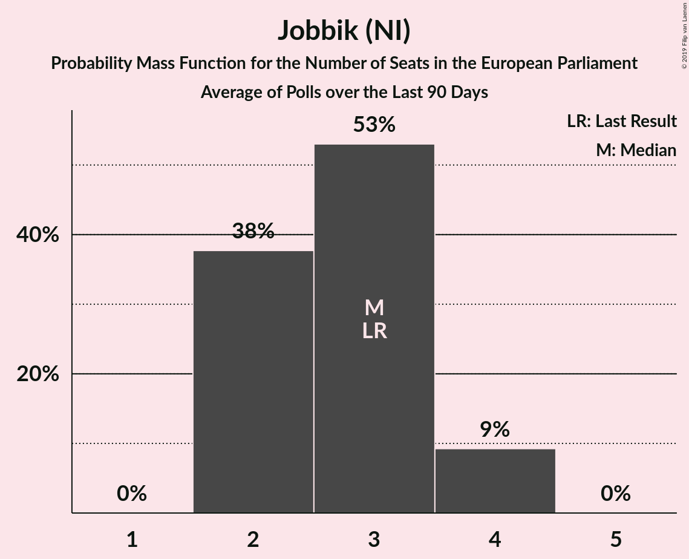
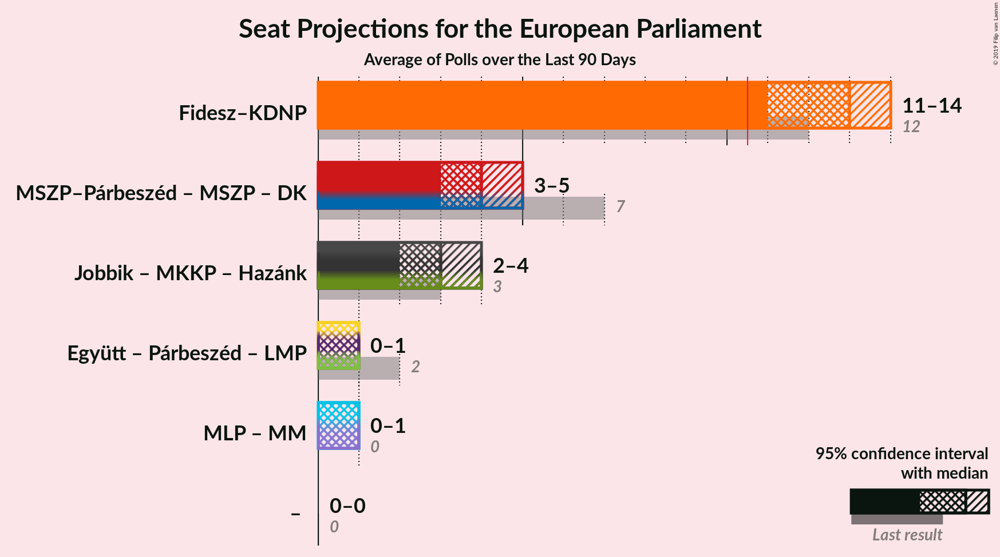
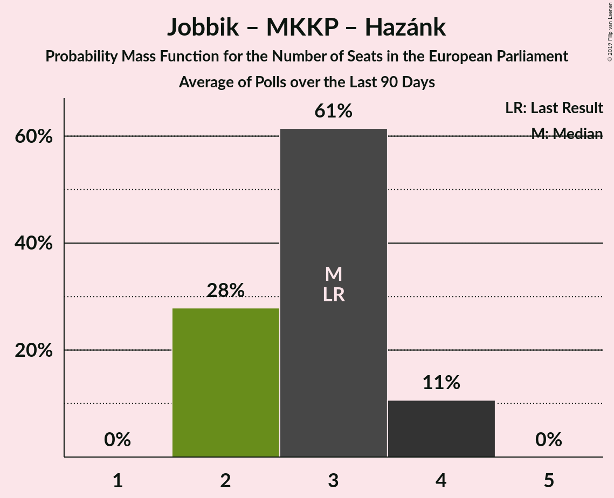
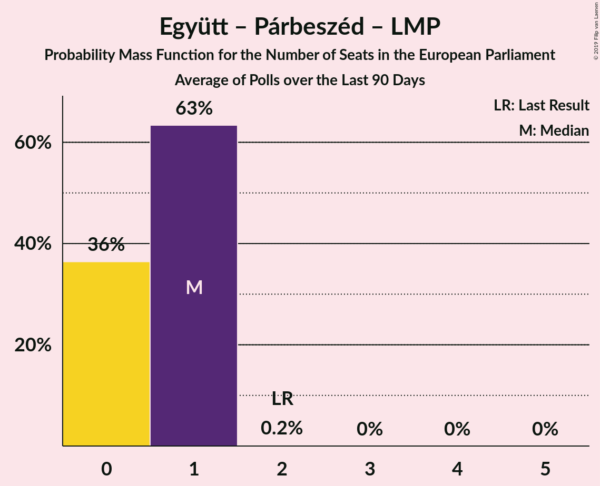

# Poll Average

<a href="#voting-intentions">Voting Intentions</a> | <a href="#seats">Seats</a> | <a href="#coalitions">Coalitions</a> | <a href="#technical-information">Technical Information</a>

## Summary

The table below lists the polls on which the average is based. They are the most recent polls (less than 90 days old) registered and analyzed so far.

| Period     | Polling firm/Commissioner(s) | Fidesz–KDNP | Jobbik | MSZP | DK | Párbeszéd | Együtt | LMP | MLP | MKKP | MM | MSZP–Párbeszéd | Hazánk |
|:----------:|:----------------------------:|:--:|:--:|:--:|:--:|:--:|:--:|:--:|:--:|:--:|:--:|:--:|:--:|
| 25 May 2014 | General Election | 51.5%   12 | 14.7%   3 | 10.9%   2 | 9.8%   2 | 7.2%   1 | 7.2%   0 | 5.0%   1 | 0.0%   0 | 0.0%   0 | 0.0%   0 | 18.2%   3 | 0.0%   0 |
| N/A | Poll Average | 50–57%   12–14 | 11–18%   2–4 | N/A   N/A | 5–7%   1 | N/A   N/A | N/A   N/A | 2–6%   0–1 | N/A   N/A | 4–5%   0–1 | 4–7%   0–1 | 10–17%   2–4 | 2%   0 |
| [1 March–17 April 2019](2019-04-17-Medián.html) | Medián | N/A   N/A | N/A   N/A | N/A   N/A | N/A   N/A | N/A   N/A | N/A   N/A | N/A   N/A | N/A   N/A | N/A   N/A | N/A   N/A | N/A   N/A | N/A   N/A |
| [5–15 April 2019](2019-04-15-ZRIZáveczResearch.html) | ZRI Závecz Research | N/A   N/A | N/A   N/A | N/A   N/A | N/A   N/A | N/A   N/A | N/A   N/A | N/A   N/A | N/A   N/A | N/A   N/A | N/A   N/A | N/A   N/A | N/A   N/A |
| [29 March–1 April 2019](2019-04-01-IDEAIntézet.html) | IDEA Intézet | N/A   N/A | N/A   N/A | N/A   N/A | N/A   N/A | N/A   N/A | N/A   N/A | N/A   N/A | N/A   N/A | N/A   N/A | N/A   N/A | N/A   N/A | N/A   N/A |
| [1–28 March 2019](2019-03-28-NézőpontIntézet.html) | Nézőpont Intézet | 54–57%   13–14 | 11–13%   2–3 | N/A   N/A | 5–7%   1 | N/A   N/A | N/A   N/A | 4–6%   1 | N/A   N/A | 3–5%   0–1 | 3–5%   0–1 | 10–12%   2 | 2%   0 |
| [13–20 March 2019](2019-03-20-PublicusResearch.html) | Publicus Research | 49–55%   11–13 | 14–18%   3–4 | N/A   N/A | 5–8%   1 | N/A   N/A | N/A   N/A | 2–4%   0–1 | N/A   N/A | N/A   N/A | 5–8%   1 | 13–17%   3–4 | N/A   N/A |
| 25 May 2014 | General Election | 51.5%   12 | 14.7%   3 | 10.9%   2 | 9.8%   2 | 7.2%   1 | 7.2%   0 | 5.0%   1 | 0.0%   0 | 0.0%   0 | 0.0%   0 | 18.2%   3 | 0.0%   0 |

Only polls for which at least the sample size has been published are included in the table above.

**Legend:**
+ **Top half of each row:** Voting intentions (95% confidence interval)
+ **Bottom half of each row:** Seat projections for the European Parliament (95% confidence interval)
+ **Fidesz–KDNP:** Fidesz–KDNP (EPP)
+ **Jobbik:** Jobbik (NI)
+ **MSZP:** MSZP (S&D)
+ **DK:** DK (S&D)
+ **Párbeszéd:** Párbeszéd (Greens/EFA)
+ **Együtt:** Együtt (Greens/EFA)
+ **LMP:** LMP (Greens/EFA)
+ **MLP:** MLP (ALDE)
+ **MKKP:** MKKP (NI)
+ **MM:** MM (ALDE)
+ **MSZP–Párbeszéd:** MSZP–Párbeszéd (S&D)
+ **Hazánk:** Mi Hazánk Mozgalom (NI)
+ **N/A (single party):** Party not included the published results
+ **N/A (entire row):** Calculation for this opinion poll not started yet

## Voting Intentions

### Confidence Intervals

| Party | Last Result | Median | 80% Confidence Interval | 90% Confidence Interval | 95% Confidence Interval | 99% Confidence Interval |
|:-----:|:-----------:|:------:|:-----------------------:|:-----------------------:|:-----------------------:|:-----------------------:|
| <a href="#fidesz–kdnp-(epp)">Fidesz–KDNP (EPP)</a> | 51.5% | 54.7% | 50.7–56.4% |50.0–56.8% | 49.5–57.0% | 48.4–57.5% |
| <a href="#mszp–párbeszéd-(s&d)">MSZP–Párbeszéd (S&D)</a> | 18.2% | 12.2% | 10.6–16.0% |10.4–16.5% | 10.3–17.0% | 10.0–17.8% |
| <a href="#jobbik-(ni)">Jobbik (NI)</a> | 14.7% | 13.2% | 11.6–17.0% |11.4–17.6% | 11.3–18.0% | 11.0–18.8% |
| <a href="#mszp-(s&d)">MSZP (S&D)</a> | 10.9% | N/A | N/A |N/A | N/A | N/A |
| <a href="#dk-(s&d)">DK (S&D)</a> | 9.8% | 6.0% | 5.4–6.7% |5.1–7.1% | 4.9–7.4% | 4.5–8.0% |
| <a href="#párbeszéd-(greens/efa)">Párbeszéd (Greens/EFA)</a> | 7.2% | N/A | N/A |N/A | N/A | N/A |
| <a href="#együtt-(greens/efa)">Együtt (Greens/EFA)</a> | 7.2% | N/A | N/A |N/A | N/A | N/A |
| <a href="#lmp-(greens/efa)">LMP (Greens/EFA)</a> | 5.0% | 4.4% | 2.6–5.3% |2.4–5.4% | 2.2–5.5% | 2.0–5.7% |
| <a href="#mlp-(alde)">MLP (ALDE)</a> | 0.0% | N/A | N/A |N/A | N/A | N/A |
| <a href="#mkkp-(ni)">MKKP (NI)</a> | 0.0% | 4.0% | 3.7–4.4% |3.6–4.5% | 3.5–4.6% | 3.3–4.8% |
| <a href="#mm-(alde)">MM (ALDE)</a> | 0.0% | 4.6% | 3.8–6.7% |3.7–7.1% | 3.6–7.4% | 3.4–8.0% |
| <a href="#mi-hazánk-mozgalom-(ni)">Mi Hazánk Mozgalom (NI)</a> | 0.0% | 2.0% | 1.8–2.3% |1.7–2.4% | 1.7–2.4% | 1.5–2.6% |

### Fidesz–KDNP (EPP)

*For a full overview of the results for this party, see the [Fidesz–KDNP (EPP)](party-fidesz–kdnpepp.html) page.*

| Voting Intentions | Probability | Accumulated | Special Marks |
|:-----------------:|:-----------:|:-----------:|:-------------:|
| 45.5–46.5% | 0% | 100% |  |
| 46.5–47.5% | 0.1% | 100% |  |
| 47.5–48.5% | 0.6% | 99.9% |  |
| 48.5–49.5% | 2% | 99.3% |  |
| 49.5–50.5% | 6% | 97% |  |
| 50.5–51.5% | 10% | 91% | Last Result |
| 51.5–52.5% | 13% | 81% |  |
| 52.5–53.5% | 10% | 69% |  |
| 53.5–54.5% | 7% | 59% |  |
| 54.5–55.5% | 17% | 51% | Median |
| 55.5–56.5% | 26% | 34% |  |
| 56.5–57.5% | 8% | 8% |  |
| 57.5–58.5% | 0.4% | 0.4% |  |
| 58.5–59.5% | 0% | 0% |  |

### MSZP–Párbeszéd (S&D)

*For a full overview of the results for this party, see the [MSZP–Párbeszéd (S&D)](party-mszp–párbeszédsd.html) page.*

| Voting Intentions | Probability | Accumulated | Special Marks |
|:-----------------:|:-----------:|:-----------:|:-------------:|
| 8.5–9.5% | 0% | 100% |  |
| 9.5–10.5% | 8% | 100% |  |
| 10.5–11.5% | 37% | 92% |  |
| 11.5–12.5% | 6% | 55% | Median |
| 12.5–13.5% | 4% | 50% |  |
| 13.5–14.5% | 12% | 46% |  |
| 14.5–15.5% | 17% | 33% |  |
| 15.5–16.5% | 12% | 16% |  |
| 16.5–17.5% | 4% | 5% |  |
| 17.5–18.5% | 0.7% | 0.8% | Last Result |
| 18.5–19.5% | 0.1% | 0.1% |  |
| 19.5–20.5% | 0% | 0% |  |

### Jobbik (NI)

*For a full overview of the results for this party, see the [Jobbik (NI)](party-jobbikni.html) page.*

| Voting Intentions | Probability | Accumulated | Special Marks |
|:-----------------:|:-----------:|:-----------:|:-------------:|
| 9.5–10.5% | 0% | 100% |  |
| 10.5–11.5% | 8% | 100% |  |
| 11.5–12.5% | 36% | 92% |  |
| 12.5–13.5% | 6% | 56% | Median |
| 13.5–14.5% | 4% | 49% |  |
| 14.5–15.5% | 12% | 45% | Last Result |
| 15.5–16.5% | 17% | 33% |  |
| 16.5–17.5% | 11% | 16% |  |
| 17.5–18.5% | 4% | 5% |  |
| 18.5–19.5% | 0.8% | 0.9% |  |
| 19.5–20.5% | 0.1% | 0.1% |  |
| 20.5–21.5% | 0% | 0% |  |

### DK (S&D)

*For a full overview of the results for this party, see the [DK (S&D)](party-dksd.html) page.*

| Voting Intentions | Probability | Accumulated | Special Marks |
|:-----------------:|:-----------:|:-----------:|:-------------:|
| 2.5–3.5% | 0% | 100% |  |
| 3.5–4.5% | 0.8% | 100% |  |
| 4.5–5.5% | 16% | 99.2% |  |
| 5.5–6.5% | 68% | 83% | Median |
| 6.5–7.5% | 14% | 15% |  |
| 7.5–8.5% | 2% | 2% |  |
| 8.5–9.5% | 0.1% | 0.1% |  |
| 9.5–10.5% | 0% | 0% | Last Result |

### LMP (Greens/EFA)

*For a full overview of the results for this party, see the [LMP (Greens/EFA)](party-lmpgreensefa.html) page.*

| Voting Intentions | Probability | Accumulated | Special Marks |
|:-----------------:|:-----------:|:-----------:|:-------------:|
| 0.5–1.5% | 0% | 100% |  |
| 1.5–2.5% | 8% | 100% |  |
| 2.5–3.5% | 32% | 92% |  |
| 3.5–4.5% | 13% | 60% | Median |
| 4.5–5.5% | 45% | 47% | Last Result |
| 5.5–6.5% | 2% | 2% |  |
| 6.5–7.5% | 0% | 0% |  |

### MM (ALDE)

*For a full overview of the results for this party, see the [MM (ALDE)](party-mmalde.html) page.*

| Voting Intentions | Probability | Accumulated | Special Marks |
|:-----------------:|:-----------:|:-----------:|:-------------:|
| 0.0–0.5% | 0% | 100% | Last Result |
| 0.5–1.5% | 0% | 100% |  |
| 1.5–2.5% | 0% | 100% |  |
| 2.5–3.5% | 2% | 100% |  |
| 3.5–4.5% | 47% | 98% |  |
| 4.5–5.5% | 13% | 51% | Median |
| 5.5–6.5% | 25% | 38% |  |
| 6.5–7.5% | 11% | 13% |  |
| 7.5–8.5% | 2% | 2% |  |
| 8.5–9.5% | 0.1% | 0.1% |  |
| 9.5–10.5% | 0% | 0% |  |

### MKKP (NI)

*For a full overview of the results for this party, see the [MKKP (NI)](party-mkkpni.html) page.*

| Voting Intentions | Probability | Accumulated | Special Marks |
|:-----------------:|:-----------:|:-----------:|:-------------:|
| 0.0–0.5% | 0% | 100% | Last Result |
| 0.5–1.5% | 0% | 100% |  |
| 1.5–2.5% | 0% | 100% |  |
| 2.5–3.5% | 4% | 100% |  |
| 3.5–4.5% | 93% | 96% | Median |
| 4.5–5.5% | 3% | 3% |  |
| 5.5–6.5% | 0% | 0% |  |

### Mi Hazánk Mozgalom (NI)

*For a full overview of the results for this party, see the [Mi Hazánk Mozgalom (NI)](party-mihazánkmozgalomni.html) page.*

| Voting Intentions | Probability | Accumulated | Special Marks |
|:-----------------:|:-----------:|:-----------:|:-------------:|
| 0.0–0.5% | 0% | 100% | Last Result |
| 0.5–1.5% | 0.6% | 100% |  |
| 1.5–2.5% | 98.7% | 99.4% | Median |
| 2.5–3.5% | 0.6% | 0.6% |  |
| 3.5–4.5% | 0% | 0% |  |

## Seats

### Confidence Intervals

| Party | Last Result | Median | 80% Confidence Interval | 90% Confidence Interval | 95% Confidence Interval | 99% Confidence Interval |
|:-----:|:-----------:|:------:|:-----------------------:|:-----------------------:|:-----------------------:|:-----------------------:|
| <a href="#fidesz–kdnp-(epp)">Fidesz–KDNP (EPP)</a> | 12 | 13 | 12–14 |12–14 | 12–14 | 11–14 |
| <a href="#mszp–párbeszéd-(s&d)">MSZP–Párbeszéd (S&D)</a> | 3 | 3 | 2–3 |2–4 | 2–4 | 2–4 |
| <a href="#jobbik-(ni)">Jobbik (NI)</a> | 3 | 3 | 2–4 |2–4 | 2–4 | 2–4 |
| <a href="#mszp-(s&d)">MSZP (S&D)</a> | 2 | N/A | N/A |N/A | N/A | N/A |
| <a href="#dk-(s&d)">DK (S&D)</a> | 2 | 1 | 1 |1 | 1 | 1 |
| <a href="#párbeszéd-(greens/efa)">Párbeszéd (Greens/EFA)</a> | 1 | N/A | N/A |N/A | N/A | N/A |
| <a href="#együtt-(greens/efa)">Együtt (Greens/EFA)</a> | 0 | N/A | N/A |N/A | N/A | N/A |
| <a href="#lmp-(greens/efa)">LMP (Greens/EFA)</a> | 1 | 1 | 0–1 |0–1 | 0–1 | 0–1 |
| <a href="#mlp-(alde)">MLP (ALDE)</a> | 0 | N/A | N/A |N/A | N/A | N/A |
| <a href="#mkkp-(ni)">MKKP (NI)</a> | 0 | 1 | 0–1 |0–1 | 0–1 | 0–1 |
| <a href="#mm-(alde)">MM (ALDE)</a> | 0 | 1 | 0–1 |0–1 | 0–1 | 0–1 |
| <a href="#mi-hazánk-mozgalom-(ni)">Mi Hazánk Mozgalom (NI)</a> | 0 | 0 | 0 |0 | 0 | 0 |

### Fidesz–KDNP (EPP)

*For a full overview of the results for this party, see the [Fidesz–KDNP (EPP)](party-fidesz–kdnpepp.html) page.*

| Number of Seats | Probability | Accumulated | Special Marks |
|:---------------:|:-----------:|:-----------:|:-------------:|
| 11 | 1.5% | 100% | Majority |
| 12 | 29% | 98.5% | Last Result |
| 13 | 46% | 69% | Median |
| 14 | 23% | 24% |  |
| 15 | 0.1% | 0.1% |  |
| 16 | 0% | 0% |  |

### MSZP–Párbeszéd (S&D)

*For a full overview of the results for this party, see the [MSZP–Párbeszéd (S&D)](party-mszp–párbeszédsd.html) page.*

| Number of Seats | Probability | Accumulated | Special Marks |
|:---------------:|:-----------:|:-----------:|:-------------:|
| 2 | 50% | 100% |  |
| 3 | 43% | 50% | Last Result, Median |
| 4 | 8% | 8% |  |
| 5 | 0% | 0% |  |

### Jobbik (NI)

*For a full overview of the results for this party, see the [Jobbik (NI)](party-jobbikni.html) page.*

| Number of Seats | Probability | Accumulated | Special Marks |
|:---------------:|:-----------:|:-----------:|:-------------:|
| 2 | 30% | 100% |  |
| 3 | 48% | 70% | Last Result, Median |
| 4 | 22% | 22% |  |
| 5 | 0% | 0% |  |

### DK (S&D)

*For a full overview of the results for this party, see the [DK (S&D)](party-dksd.html) page.*

| Number of Seats | Probability | Accumulated | Special Marks |
|:---------------:|:-----------:|:-----------:|:-------------:|
| 0 | 0.1% | 100% |  |
| 1 | 99.5% | 99.9% | Median |
| 2 | 0.4% | 0.4% | Last Result |
| 3 | 0% | 0% |  |

### LMP (Greens/EFA)

*For a full overview of the results for this party, see the [LMP (Greens/EFA)](party-lmpgreensefa.html) page.*

| Number of Seats | Probability | Accumulated | Special Marks |
|:---------------:|:-----------:|:-----------:|:-------------:|
| 0 | 48% | 100% |  |
| 1 | 52% | 52% | Last Result, Median |
| 2 | 0% | 0% |  |

### MM (ALDE)

*For a full overview of the results for this party, see the [MM (ALDE)](party-mmalde.html) page.*

| Number of Seats | Probability | Accumulated | Special Marks |
|:---------------:|:-----------:|:-----------:|:-------------:|
| 0 | 22% | 100% | Last Result |
| 1 | 77% | 78% | Median |
| 2 | 0.4% | 0.4% |  |
| 3 | 0% | 0% |  |

### MKKP (NI)

*For a full overview of the results for this party, see the [MKKP (NI)](party-mkkpni.html) page.*

| Number of Seats | Probability | Accumulated | Special Marks |
|:---------------:|:-----------:|:-----------:|:-------------:|
| 0 | 45% | 100% | Last Result |
| 1 | 55% | 55% | Median |
| 2 | 0% | 0% |  |

### Mi Hazánk Mozgalom (NI)

*For a full overview of the results for this party, see the [Mi Hazánk Mozgalom (NI)](party-mihazánkmozgalomni.html) page.*

| Number of Seats | Probability | Accumulated | Special Marks |
|:---------------:|:-----------:|:-----------:|:-------------:|
| 0 | 100% | 100% | Last Result, Median |

## Coalitions

### Confidence Intervals

| Coalition | Last Result | Median | Majority? | 80% Confidence Interval | 90% Confidence Interval | 95% Confidence Interval | 99% Confidence Interval |
|:---------:|:-----------:|:------:|:---------:|:-----------------------:|:-----------------------:|:-----------------------:|:-----------------------:|
| Fidesz–KDNP (EPP) | 12 | 13 | 100% | 12–14 | 12–14 | 12–14 | 11–14 |
| MSZP–Párbeszéd (S&D) – MSZP (S&D) – DK (S&D) | 7 | 4 | 0% | 3–4 | 3–5 | 3–5 | 3–5 |
| Jobbik (NI) – MKKP (NI) – Mi Hazánk Mozgalom (NI) | 3 | 3 | 0% | 3–4 | 2–4 | 2–4 | 2–4 |
| Együtt (Greens/EFA) – Párbeszéd (Greens/EFA) – LMP (Greens/EFA) | 2 | 1 | 0% | 0–1 | 0–1 | 0–1 | 0–1 |
| MLP (ALDE) – MM (ALDE) | 0 | 1 | 0% | 0–1 | 0–1 | 0–1 | 0–1 |

### Fidesz–KDNP (EPP)

| Number of Seats | Probability | Accumulated | Special Marks |
|:---------------:|:-----------:|:-----------:|:-------------:|
| 11 | 1.5% | 100% | Majority |
| 12 | 29% | 98.5% | Last Result |
| 13 | 46% | 69% | Median |
| 14 | 23% | 24% |  |
| 15 | 0.1% | 0.1% |  |
| 16 | 0% | 0% |  |

### MSZP–Párbeszéd (S&D) – MSZP (S&D) – DK (S&D)

| Number of Seats | Probability | Accumulated | Special Marks |
|:---------------:|:-----------:|:-----------:|:-------------:|
| 3 | 50% | 100% |  |
| 4 | 43% | 50% | Median |
| 5 | 8% | 8% |  |
| 6 | 0% | 0% |  |
| 7 | 0% | 0% | Last Result |

### Jobbik (NI) – MKKP (NI) – Mi Hazánk Mozgalom (NI)

| Number of Seats | Probability | Accumulated | Special Marks |
|:---------------:|:-----------:|:-----------:|:-------------:|
| 2 | 5% | 100% |  |
| 3 | 70% | 95% | Last Result |
| 4 | 25% | 25% | Median |
| 5 | 0% | 0% |  |

### Együtt (Greens/EFA) – Párbeszéd (Greens/EFA) – LMP (Greens/EFA)

| Number of Seats | Probability | Accumulated | Special Marks |
|:---------------:|:-----------:|:-----------:|:-------------:|
| 0 | 48% | 100% |  |
| 1 | 52% | 52% | Median |
| 2 | 0% | 0% | Last Result |

### MLP (ALDE) – MM (ALDE)

| Number of Seats | Probability | Accumulated | Special Marks |
|:---------------:|:-----------:|:-----------:|:-------------:|
| 0 | 22% | 100% | Last Result |
| 1 | 77% | 78% | Median |
| 2 | 0.4% | 0.4% |  |
| 3 | 0% | 0% |  |

## Technical Information

+ **Number of polls included in this average:** 5
+ **Lowest number of simulations done in a poll included in this average:** 0
+ **Total number of simulations done in the polls included in this average:** 2,097,152
+ **Error estimate:** 0.62%
