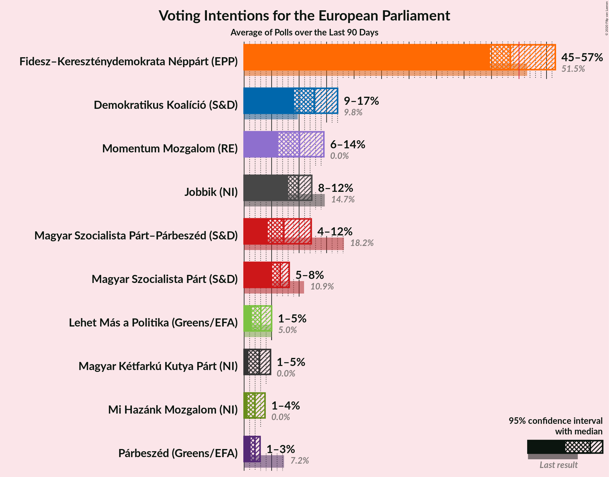
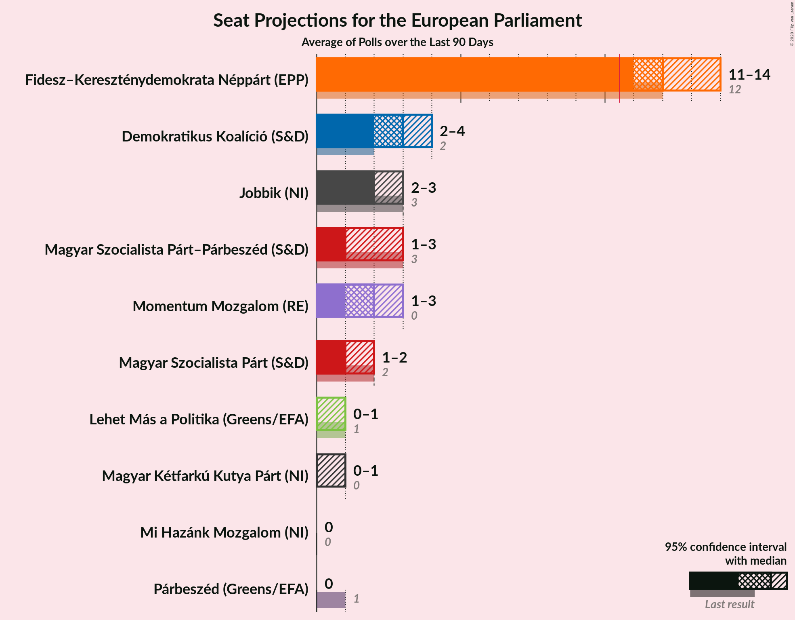

# Poll Average

<a href="#voting-intentions">Voting Intentions</a> | <a href="#seats">Seats</a> | <a href="#coalitions">Coalitions</a> | <a href="#technical-information">Technical Information</a>

## Summary

The table below lists the polls on which the average is based. They are the most recent polls (less than 90 days old) registered and analyzed so far.

| Period     | Polling firm/Commissioner(s) | Fidesz–KDNP | Jobbik | MSZP | DK | Párbeszéd | Együtt | LMP | MLP | MKKP | MM | MSZP–Párbeszéd | Hazánk |
|:----------:|:----------------------------:|:--:|:--:|:--:|:--:|:--:|:--:|:--:|:--:|:--:|:--:|:--:|:--:|
| 26 May 2019 | General Election | 51.5%   12 | 14.7%   3 | 10.9%   2 | 9.8%   2 | 7.2%   1 | 7.2%   0 | 5.0%   1 | 0.0%   0 | 0.0%   0 | 0.0%   0 | 18.2%   3 | 0.0%   0 |
| N/A | Poll Average | 45–57%   11–14 | 8–12%   2–3 | 5–8%   1–2 | 9–17%   2–4 | 1–3%   0 | N/A   N/A | 1–5%   0–1 | N/A   N/A | 1–5%   0–1 | 6–14%   1–3 | 4–12%   1–3 | 1–4%   0 |
| [13–20 February 2020](2020-02-20-ZRIZáveczResearch.html) | ZRI Závecz Research | 45–51%   11–13 | 8–11%   1–3 | 5–8%   1–2 | 11–15%   2–4 | 1–3%   0 | N/A   N/A | 1–3%   0 | N/A   N/A | 1–3%   0 | 7–10%   1–2 | 5–8%   1–2 | 1–3%   0 |
| [20 February 2020](2020-02-20-Medián.html) | Medián | 52–58%   12–14 | 9–13%   2–3 | N/A   N/A | 11–15%   2–3 | N/A   N/A | N/A   N/A | 3–5%   0–1 | N/A   N/A | 1–2%   0 | 6–9%   1–2 | 6–9%   1–2 | 1–2%   0 |
| [31 January–12 February 2020](2020-02-12-IDEAIntézet.html) | IDEA Intézet | 45–49%   11–12 | 8–10%   2 | N/A   N/A | 14–18%   3–4 | N/A   N/A | N/A   N/A | 2–4%   0 | N/A   N/A | 2–4%   0 | 9–11%   2 | 7–9%   1–2 | 2–4%   0 |
| [10–16 January 2020](2020-01-16-NézőpontIntézet.html) | Nézőpont Intézet | 47–53%   11–13 | 8–12%   2–3 | N/A   N/A | 8–12%   2–3 | N/A   N/A | N/A   N/A | 3–5%   0–1 | N/A   N/A | 3–5%   0–1 | 11–15%   2–3 | 4–7%   0–1 | 2–4%   0–1 |
| [14–20 December 2019](2019-12-20-PublicusResearch.html) | Publicus Research | 44–50%   10–12 | 8–12%   2–3 | N/A   N/A | 10–14%   2–3 | N/A   N/A | N/A   N/A | 1–3%   0 | N/A   N/A | 2–4%   0–1 | 10–14%   2–3 | 9–13%   2–3 | 1–2%   0 |
| 26 May 2019 | General Election | 51.5%   12 | 14.7%   3 | 10.9%   2 | 9.8%   2 | 7.2%   1 | 7.2%   0 | 5.0%   1 | 0.0%   0 | 0.0%   0 | 0.0%   0 | 18.2%   3 | 0.0%   0 |

Only polls for which at least the sample size has been published are included in the table above.

**Legend:**
+ **Top half of each row:** Voting intentions (95% confidence interval)
+ **Bottom half of each row:** Seat projections for the European Parliament (95% confidence interval)
+ **Fidesz–KDNP:** Fidesz–Kereszténydemokrata Néppárt (EPP)
+ **Jobbik:** Jobbik (NI)
+ **MSZP:** Magyar Szocialista Párt (S&D)
+ **DK:** Demokratikus Koalíció (S&D)
+ **Párbeszéd:** Párbeszéd (Greens/EFA)
+ **Együtt:** Együtt (Greens/EFA)
+ **LMP:** Lehet Más a Politika (Greens/EFA)
+ **MLP:** MLP (RE)
+ **MKKP:** Magyar Kétfarkú Kutya Párt (NI)
+ **MM:** Momentum Mozgalom (RE)
+ **MSZP–Párbeszéd:** Magyar Szocialista Párt–Párbeszéd (S&D)
+ **Hazánk:** Mi Hazánk Mozgalom (NI)
+ **N/A (single party):** Party not included the published results
+ **N/A (entire row):** Calculation for this opinion poll not started yet

## Voting Intentions

### Confidence Intervals

| Party | Last Result | Median | 80% Confidence Interval | 90% Confidence Interval | 95% Confidence Interval | 99% Confidence Interval |
|:-----:|:-----------:|:------:|:-----------------------:|:-----------------------:|:-----------------------:|:-----------------------:|
| <a href="#fidesz–kereszténydemokrata-néppárt-(epp)">Fidesz–Kereszténydemokrata Néppárt (EPP)</a> | 51.5% | 48.5% | 45.9–55.0% |45.4–56.0% | 44.8–56.6% | 43.8–57.8% |
| <a href="#magyar-szocialista-párt–párbeszéd-(s&d)">Magyar Szocialista Párt–Párbeszéd (S&D)</a> | 18.2% | 7.3% | 5.0–11.0% |4.6–11.7% | 4.3–12.2% | 3.8–13.1% |
| <a href="#jobbik-(ni)">Jobbik (NI)</a> | 14.7% | 9.9% | 8.6–11.5% |8.3–11.9% | 8.0–12.3% | 7.6–13.0% |
| <a href="#magyar-szocialista-párt-(s&d)">Magyar Szocialista Párt (S&D)</a> | 10.9% | 6.7% | 5.7–7.7% |5.5–8.0% | 5.3–8.3% | 4.9–8.8% |
| <a href="#demokratikus-koalíció-(s&d)">Demokratikus Koalíció (S&D)</a> | 9.8% | 12.8% | 10.0–16.0% |9.4–16.6% | 9.0–17.0% | 8.3–17.7% |
| <a href="#párbeszéd-(greens/efa)">Párbeszéd (Greens/EFA)</a> | 7.2% | 1.9% | 1.5–2.5% |1.3–2.7% | 1.2–2.9% | 1.0–3.2% |
| <a href="#együtt-(greens/efa)">Együtt (Greens/EFA)</a> | 7.2% | N/A | N/A |N/A | N/A | N/A |
| <a href="#lehet-más-a-politika-(greens/efa)">Lehet Más a Politika (Greens/EFA)</a> | 5.0% | 3.0% | 1.7–4.5% |1.5–4.8% | 1.4–5.0% | 1.2–5.5% |
| <a href="#mlp-(re)">MLP (RE)</a> | 0.0% | N/A | N/A |N/A | N/A | N/A |
| <a href="#magyar-kétfarkú-kutya-párt-(ni)">Magyar Kétfarkú Kutya Párt (NI)</a> | 0.0% | 2.8% | 1.0–4.1% |0.9–4.5% | 0.8–4.8% | 0.6–5.4% |
| <a href="#momentum-mozgalom-(re)">Momentum Mozgalom (RE)</a> | 0.0% | 10.1% | 7.0–13.3% |6.5–13.9% | 6.2–14.4% | 5.7–15.3% |
| <a href="#mi-hazánk-mozgalom-(ni)">Mi Hazánk Mozgalom (NI)</a> | 0.0% | 2.0% | 0.9–3.4% |0.7–3.6% | 0.6–3.8% | 0.5–4.3% |

### Fidesz–Kereszténydemokrata Néppárt (EPP)

*For a full overview of the results for this party, see the [Fidesz–Kereszténydemokrata Néppárt (EPP)](party-fidesz–kereszténydemokratanéppártepp.html) page.*

| Voting Intentions | Probability | Accumulated | Special Marks |
|:-----------------:|:-----------:|:-----------:|:-------------:|
| 41.5–42.5% | 0% | 100% |  |
| 42.5–43.5% | 0.3% | 100% |  |
| 43.5–44.5% | 1.3% | 99.7% |  |
| 44.5–45.5% | 5% | 98% |  |
| 45.5–46.5% | 11% | 94% |  |
| 46.5–47.5% | 17% | 82% |  |
| 47.5–48.5% | 16% | 65% | Median |
| 48.5–49.5% | 12% | 49% |  |
| 49.5–50.5% | 8% | 37% |  |
| 50.5–51.5% | 5% | 29% | Last Result |
| 51.5–52.5% | 3% | 23% |  |
| 52.5–53.5% | 3% | 20% |  |
| 53.5–54.5% | 5% | 17% |  |
| 54.5–55.5% | 6% | 12% |  |
| 55.5–56.5% | 4% | 7% |  |
| 56.5–57.5% | 2% | 3% |  |
| 57.5–58.5% | 0.6% | 0.7% |  |
| 58.5–59.5% | 0.1% | 0.1% |  |
| 59.5–60.5% | 0% | 0% |  |

### Magyar Szocialista Párt–Párbeszéd (S&D)

*For a full overview of the results for this party, see the [Magyar Szocialista Párt–Párbeszéd (S&D)](party-magyarszocialistapárt–párbeszédsd.html) page.*

| Voting Intentions | Probability | Accumulated | Special Marks |
|:-----------------:|:-----------:|:-----------:|:-------------:|
| 1.5–2.5% | 0% | 100% |  |
| 2.5–3.5% | 0.2% | 100% |  |
| 3.5–4.5% | 4% | 99.8% |  |
| 4.5–5.5% | 12% | 95% |  |
| 5.5–6.5% | 17% | 83% |  |
| 6.5–7.5% | 23% | 67% | Median |
| 7.5–8.5% | 19% | 44% |  |
| 8.5–9.5% | 6% | 25% |  |
| 9.5–10.5% | 5% | 19% |  |
| 10.5–11.5% | 8% | 14% |  |
| 11.5–12.5% | 5% | 6% |  |
| 12.5–13.5% | 1.2% | 1.4% |  |
| 13.5–14.5% | 0.2% | 0.2% |  |
| 14.5–15.5% | 0% | 0% |  |
| 15.5–16.5% | 0% | 0% |  |
| 16.5–17.5% | 0% | 0% |  |
| 17.5–18.5% | 0% | 0% | Last Result |

### Jobbik (NI)

*For a full overview of the results for this party, see the [Jobbik (NI)](party-jobbikni.html) page.*

| Voting Intentions | Probability | Accumulated | Special Marks |
|:-----------------:|:-----------:|:-----------:|:-------------:|
| 5.5–6.5% | 0% | 100% |  |
| 6.5–7.5% | 0.4% | 100% |  |
| 7.5–8.5% | 9% | 99.6% |  |
| 8.5–9.5% | 30% | 91% |  |
| 9.5–10.5% | 32% | 61% | Median |
| 10.5–11.5% | 20% | 29% |  |
| 11.5–12.5% | 7% | 9% |  |
| 12.5–13.5% | 1.3% | 1.4% |  |
| 13.5–14.5% | 0.1% | 0.1% |  |
| 14.5–15.5% | 0% | 0% | Last Result |

### Magyar Szocialista Párt (S&D)

*For a full overview of the results for this party, see the [Magyar Szocialista Párt (S&D)](party-magyarszocialistapártsd.html) page.*

| Voting Intentions | Probability | Accumulated | Special Marks |
|:-----------------:|:-----------:|:-----------:|:-------------:|
| 2.5–3.5% | 0% | 100% |  |
| 3.5–4.5% | 0.1% | 100% |  |
| 4.5–5.5% | 6% | 99.9% |  |
| 5.5–6.5% | 38% | 94% |  |
| 6.5–7.5% | 42% | 55% | Median |
| 7.5–8.5% | 12% | 13% |  |
| 8.5–9.5% | 1.1% | 1.1% |  |
| 9.5–10.5% | 0% | 0% |  |
| 10.5–11.5% | 0% | 0% | Last Result |

### Demokratikus Koalíció (S&D)

*For a full overview of the results for this party, see the [Demokratikus Koalíció (S&D)](party-demokratikuskoalíciósd.html) page.*

| Voting Intentions | Probability | Accumulated | Special Marks |
|:-----------------:|:-----------:|:-----------:|:-------------:|
| 6.5–7.5% | 0% | 100% |  |
| 7.5–8.5% | 0.9% | 100% |  |
| 8.5–9.5% | 5% | 99.0% |  |
| 9.5–10.5% | 9% | 94% | Last Result |
| 10.5–11.5% | 12% | 85% |  |
| 11.5–12.5% | 17% | 73% |  |
| 12.5–13.5% | 20% | 55% | Median |
| 13.5–14.5% | 12% | 35% |  |
| 14.5–15.5% | 8% | 23% |  |
| 15.5–16.5% | 10% | 15% |  |
| 16.5–17.5% | 5% | 5% |  |
| 17.5–18.5% | 0.7% | 0.7% |  |
| 18.5–19.5% | 0% | 0% |  |

### Párbeszéd (Greens/EFA)

*For a full overview of the results for this party, see the [Párbeszéd (Greens/EFA)](party-párbeszédgreensefa.html) page.*

| Voting Intentions | Probability | Accumulated | Special Marks |
|:-----------------:|:-----------:|:-----------:|:-------------:|
| 0.0–0.5% | 0% | 100% |  |
| 0.5–1.5% | 16% | 100% |  |
| 1.5–2.5% | 74% | 84% | Median |
| 2.5–3.5% | 10% | 10% |  |
| 3.5–4.5% | 0.1% | 0.1% |  |
| 4.5–5.5% | 0% | 0% |  |
| 5.5–6.5% | 0% | 0% |  |
| 6.5–7.5% | 0% | 0% | Last Result |

### Lehet Más a Politika (Greens/EFA)

*For a full overview of the results for this party, see the [Lehet Más a Politika (Greens/EFA)](party-lehetmásapolitikagreensefa.html) page.*

| Voting Intentions | Probability | Accumulated | Special Marks |
|:-----------------:|:-----------:|:-----------:|:-------------:|
| 0.0–0.5% | 0% | 100% |  |
| 0.5–1.5% | 5% | 100% |  |
| 1.5–2.5% | 31% | 95% |  |
| 2.5–3.5% | 29% | 63% | Median |
| 3.5–4.5% | 26% | 35% |  |
| 4.5–5.5% | 8% | 8% | Last Result |
| 5.5–6.5% | 0.5% | 0.5% |  |
| 6.5–7.5% | 0% | 0% |  |

### Momentum Mozgalom (RE)

*For a full overview of the results for this party, see the [Momentum Mozgalom (RE)](party-momentummozgalomre.html) page.*

| Voting Intentions | Probability | Accumulated | Special Marks |
|:-----------------:|:-----------:|:-----------:|:-------------:|
| 0.0–0.5% | 0% | 100% | Last Result |
| 0.5–1.5% | 0% | 100% |  |
| 1.5–2.5% | 0% | 100% |  |
| 2.5–3.5% | 0% | 100% |  |
| 3.5–4.5% | 0% | 100% |  |
| 4.5–5.5% | 0.3% | 100% |  |
| 5.5–6.5% | 5% | 99.7% |  |
| 6.5–7.5% | 12% | 95% |  |
| 7.5–8.5% | 13% | 83% |  |
| 8.5–9.5% | 13% | 70% |  |
| 9.5–10.5% | 14% | 58% | Median |
| 10.5–11.5% | 11% | 43% |  |
| 11.5–12.5% | 13% | 32% |  |
| 12.5–13.5% | 12% | 20% |  |
| 13.5–14.5% | 6% | 8% |  |
| 14.5–15.5% | 2% | 2% |  |
| 15.5–16.5% | 0.2% | 0.3% |  |
| 16.5–17.5% | 0% | 0% |  |

### Magyar Kétfarkú Kutya Párt (NI)

*For a full overview of the results for this party, see the [Magyar Kétfarkú Kutya Párt (NI)](party-magyarkétfarkúkutyapártni.html) page.*

| Voting Intentions | Probability | Accumulated | Special Marks |
|:-----------------:|:-----------:|:-----------:|:-------------:|
| 0.0–0.5% | 0.3% | 100% | Last Result |
| 0.5–1.5% | 21% | 99.7% |  |
| 1.5–2.5% | 21% | 78% |  |
| 2.5–3.5% | 35% | 57% | Median |
| 3.5–4.5% | 17% | 22% |  |
| 4.5–5.5% | 4% | 5% |  |
| 5.5–6.5% | 0.3% | 0.3% |  |
| 6.5–7.5% | 0% | 0% |  |

### Mi Hazánk Mozgalom (NI)

*For a full overview of the results for this party, see the [Mi Hazánk Mozgalom (NI)](party-mihazánkmozgalomni.html) page.*

| Voting Intentions | Probability | Accumulated | Special Marks |
|:-----------------:|:-----------:|:-----------:|:-------------:|
| 0.0–0.5% | 0.8% | 100% | Last Result |
| 0.5–1.5% | 39% | 99.2% |  |
| 1.5–2.5% | 23% | 60% | Median |
| 2.5–3.5% | 31% | 37% |  |
| 3.5–4.5% | 6% | 6% |  |
| 4.5–5.5% | 0.2% | 0.2% |  |
| 5.5–6.5% | 0% | 0% |  |

## Seats

### Confidence Intervals

| Party | Last Result | Median | 80% Confidence Interval | 90% Confidence Interval | 95% Confidence Interval | 99% Confidence Interval |
|:-----:|:-----------:|:------:|:-----------------------:|:-----------------------:|:-----------------------:|:-----------------------:|
| <a href="#fidesz–kereszténydemokrata-néppárt-(epp)">Fidesz–Kereszténydemokrata Néppárt (EPP)</a> | 12 | 12 | 11–13 |11–14 | 11–14 | 10–14 |
| <a href="#magyar-szocialista-párt–párbeszéd-(s&d)">Magyar Szocialista Párt–Párbeszéd (S&D)</a> | 3 | 1 | 1–2 |1–3 | 1–3 | 0–3 |
| <a href="#jobbik-(ni)">Jobbik (NI)</a> | 3 | 2 | 2 |2–3 | 2–3 | 1–3 |
| <a href="#magyar-szocialista-párt-(s&d)">Magyar Szocialista Párt (S&D)</a> | 2 | 1 | 1 |1–2 | 1–2 | 1–2 |
| <a href="#demokratikus-koalíció-(s&d)">Demokratikus Koalíció (S&D)</a> | 2 | 3 | 2–4 |2–4 | 2–4 | 2–4 |
| <a href="#párbeszéd-(greens/efa)">Párbeszéd (Greens/EFA)</a> | 1 | 0 | 0 |0 | 0 | 0 |
| <a href="#együtt-(greens/efa)">Együtt (Greens/EFA)</a> | 0 | N/A | N/A |N/A | N/A | N/A |
| <a href="#lehet-más-a-politika-(greens/efa)">Lehet Más a Politika (Greens/EFA)</a> | 1 | 0 | 0–1 |0–1 | 0–1 | 0–1 |
| <a href="#mlp-(re)">MLP (RE)</a> | 0 | N/A | N/A |N/A | N/A | N/A |
| <a href="#magyar-kétfarkú-kutya-párt-(ni)">Magyar Kétfarkú Kutya Párt (NI)</a> | 0 | 0 | 0–1 |0–1 | 0–1 | 0–1 |
| <a href="#momentum-mozgalom-(re)">Momentum Mozgalom (RE)</a> | 0 | 2 | 1–3 |1–3 | 1–3 | 1–3 |
| <a href="#mi-hazánk-mozgalom-(ni)">Mi Hazánk Mozgalom (NI)</a> | 0 | 0 | 0 |0 | 0 | 0–1 |

