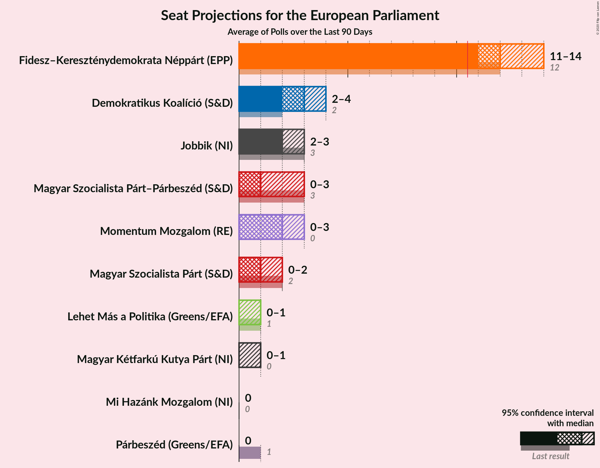
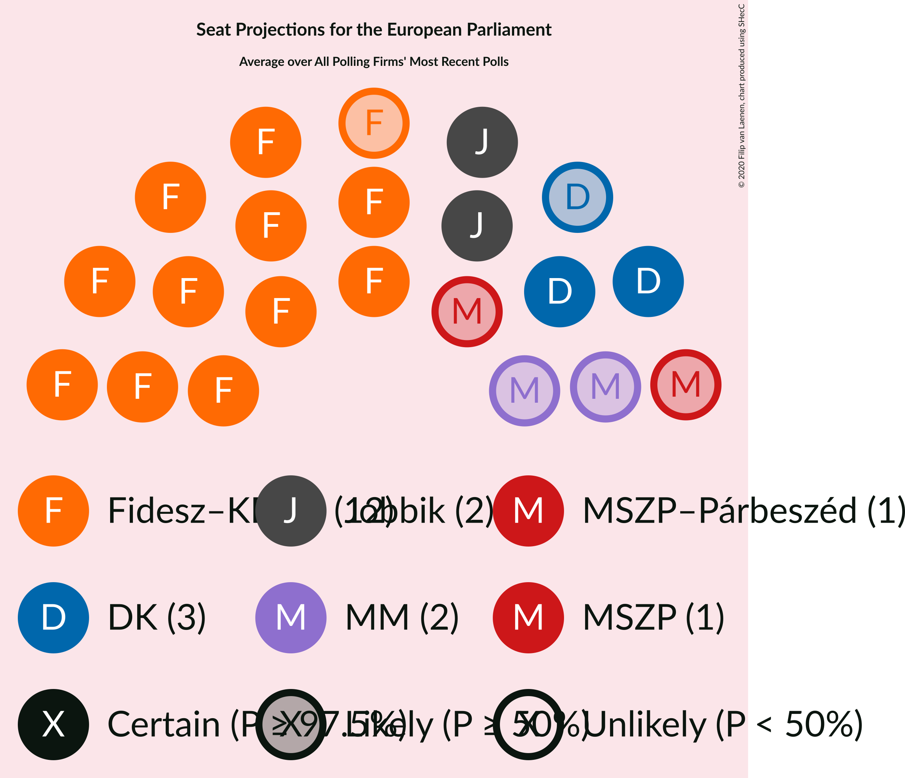

# Poll Average

<a href="#voting-intentions">Voting Intentions</a> | <a href="#seats">Seats</a> | <a href="#coalitions">Coalitions</a> | <a href="#technical-information">Technical Information</a>

## Summary

The table below lists the polls on which the average is based. They are the most recent polls (less than 90 days old) registered and analyzed so far.

| Period     | Polling firm/Commissioner(s) | Fidesz–KDNP | Jobbik | MSZP | DK | Párbeszéd | Együtt | LMP | MLP | MKKP | MM | MSZP–Párbeszéd | Hazánk |
|:----------:|:----------------------------:|:--:|:--:|:--:|:--:|:--:|:--:|:--:|:--:|:--:|:--:|:--:|:--:|
| 26 May 2019 | General Election | 51.5%   12 | 14.7%   3 | 10.9%   2 | 9.8%   2 | 7.2%   1 | 7.2%   0 | 5.0%   1 | 0.0%   0 | 0.0%   0 | 0.0%   0 | 18.2%   3 | 0.0%   0 |
| N/A | Poll Average | 45–57%   10–14 | 8–12%   2–3 | 3–5%   0–1 | 8–17%   2–4 | 1–2%   0 | N/A   N/A | 2–5%   0–1 | N/A   N/A | 1–6%   0–1 | 6–14%   1–3 | 3–13%   0–3 | 1–4%   0 |
| [12–14 March 2020](2020-03-14-NézőpontIntézet.html) | Nézőpont Intézet | 46–52%   11–13 | 8–12%   2–3 | 3–5%   0–1 | 8–12%   2 | 1–2%   0 | N/A   N/A | 2–4%   0–1 | N/A   N/A | 4–6%   0–1 | 11–15%   2–3 | 3–5%   0–1 | 1–3%   0 |
| [5–10 March 2020](2020-03-10-Publicus.html) | Publicus | 44–50%   10–12 | 8–12%   1–2 | N/A   N/A | 12–16%   2–3 | N/A   N/A | N/A   N/A | 1–3%   0 | N/A   N/A | 1–2%   0 | 10–14%   2–3 | 10–14%   2–3 | 1–2%   0 |
| [13–20 February 2020](2020-02-20-ZRIZáveczResearch.html) | ZRI Závecz Research | N/A   N/A | N/A   N/A | N/A   N/A | N/A   N/A | N/A   N/A | N/A   N/A | N/A   N/A | N/A   N/A | N/A   N/A | N/A   N/A | N/A   N/A | N/A   N/A |
| [1–20 February 2020](2020-02-20-Medián.html) | Medián | 52–58%   12–14 | 9–13%   2–3 | N/A   N/A | 11–15%   2–3 | N/A   N/A | N/A   N/A | 3–5%   0–1 | N/A   N/A | 1–2%   0 | 6–9%   1–2 | 6–9%   1–2 | 1–2%   0 |
| [31 January–12 February 2020](2020-02-12-IDEAIntézet.html) | IDEA Intézet | 45–49%   11–12 | 8–10%   2 | N/A   N/A | 14–18%   3–4 | N/A   N/A | N/A   N/A | 2–4%   0 | N/A   N/A | 2–4%   0 | 9–11%   2 | 7–9%   1–2 | 2–4%   0 |
| 26 May 2019 | General Election | 51.5%   12 | 14.7%   3 | 10.9%   2 | 9.8%   2 | 7.2%   1 | 7.2%   0 | 5.0%   1 | 0.0%   0 | 0.0%   0 | 0.0%   0 | 18.2%   3 | 0.0%   0 |

Only polls for which at least the sample size has been published are included in the table above.

**Legend:**
+ **Top half of each row:** Voting intentions (95% confidence interval)
+ **Bottom half of each row:** Seat projections for the European Parliament (95% confidence interval)
+ **Fidesz–KDNP:** Fidesz–Kereszténydemokrata Néppárt (EPP)
+ **Jobbik:** Jobbik (NI)
+ **MSZP:** Magyar Szocialista Párt (S&D)
+ **DK:** Demokratikus Koalíció (S&D)
+ **Párbeszéd:** Párbeszéd (Greens/EFA)
+ **Együtt:** Együtt (Greens/EFA)
+ **LMP:** Lehet Más a Politika (Greens/EFA)
+ **MLP:** MLP (RE)
+ **MKKP:** Magyar Kétfarkú Kutya Párt (NI)
+ **MM:** Momentum Mozgalom (RE)
+ **MSZP–Párbeszéd:** Magyar Szocialista Párt–Párbeszéd (S&D)
+ **Hazánk:** Mi Hazánk Mozgalom (NI)
+ **N/A (single party):** Party not included the published results
+ **N/A (entire row):** Calculation for this opinion poll not started yet

## Voting Intentions

### Confidence Intervals

| Party | Last Result | Median | 80% Confidence Interval | 90% Confidence Interval | 95% Confidence Interval | 99% Confidence Interval |
|:-----:|:-----------:|:------:|:-----------------------:|:-----------------------:|:-----------------------:|:-----------------------:|
| <a href="#fidesz–kereszténydemokrata-néppárt-(epp)">Fidesz–Kereszténydemokrata Néppárt (EPP)</a> | 51.5% | 48.3% | 45.9–55.4% |45.3–56.2% | 44.8–56.8% | 43.8–57.9% |
| <a href="#magyar-szocialista-párt–párbeszéd-(s&d)">Magyar Szocialista Párt–Párbeszéd (S&D)</a> | 18.2% | 7.6% | 3.7–12.1% |3.4–12.7% | 3.1–13.2% | 2.7–14.0% |
| <a href="#jobbik-(ni)">Jobbik (NI)</a> | 14.7% | 9.8% | 8.5–11.5% |8.3–11.9% | 8.0–12.3% | 7.6–13.0% |
| <a href="#magyar-szocialista-párt-(s&d)">Magyar Szocialista Párt (S&D)</a> | 10.9% | 3.9% | 3.1–4.7% |2.9–4.9% | 2.8–5.2% | 2.5–5.6% |
| <a href="#demokratikus-koalíció-(s&d)">Demokratikus Koalíció (S&D)</a> | 9.8% | 13.4% | 9.4–16.3% |8.9–16.7% | 8.5–17.1% | 7.9–17.8% |
| <a href="#párbeszéd-(greens/efa)">Párbeszéd (Greens/EFA)</a> | 7.2% | 1.1% | 0.7–1.5% |0.6–1.7% | 0.6–1.8% | 0.4–2.1% |
| <a href="#együtt-(greens/efa)">Együtt (Greens/EFA)</a> | 7.2% | N/A | N/A |N/A | N/A | N/A |
| <a href="#lehet-más-a-politika-(greens/efa)">Lehet Más a Politika (Greens/EFA)</a> | 5.0% | 3.0% | 1.9–4.2% |1.7–4.6% | 1.5–4.8% | 1.3–5.3% |
| <a href="#mlp-(re)">MLP (RE)</a> | 0.0% | N/A | N/A |N/A | N/A | N/A |
| <a href="#magyar-kétfarkú-kutya-párt-(ni)">Magyar Kétfarkú Kutya Párt (NI)</a> | 0.0% | 2.2% | 0.8–5.0% |0.7–5.4% | 0.6–5.8% | 0.5–6.4% |
| <a href="#momentum-mozgalom-(re)">Momentum Mozgalom (RE)</a> | 0.0% | 10.7% | 6.9–13.1% |6.4–13.6% | 6.1–14.1% | 5.6–14.9% |
| <a href="#mi-hazánk-mozgalom-(ni)">Mi Hazánk Mozgalom (NI)</a> | 0.0% | 1.5% | 0.8–3.1% |0.7–3.4% | 0.6–3.6% | 0.5–3.9% |

### Fidesz–Kereszténydemokrata Néppárt (EPP)

*For a full overview of the results for this party, see the [Fidesz–Kereszténydemokrata Néppárt (EPP)](party-fidesz–kereszténydemokratanéppártepp.html) page.*

| Voting Intentions | Probability | Accumulated | Special Marks |
|:-----------------:|:-----------:|:-----------:|:-------------:|
| 41.5–42.5% | 0% | 100% |  |
| 42.5–43.5% | 0.3% | 100% |  |
| 43.5–44.5% | 1.4% | 99.7% |  |
| 44.5–45.5% | 5% | 98% |  |
| 45.5–46.5% | 12% | 93% |  |
| 46.5–47.5% | 18% | 81% |  |
| 47.5–48.5% | 16% | 63% | Median |
| 48.5–49.5% | 11% | 47% |  |
| 49.5–50.5% | 6% | 36% |  |
| 50.5–51.5% | 3% | 29% | Last Result |
| 51.5–52.5% | 2% | 26% |  |
| 52.5–53.5% | 3% | 24% |  |
| 53.5–54.5% | 6% | 21% |  |
| 54.5–55.5% | 7% | 16% |  |
| 55.5–56.5% | 5% | 9% |  |
| 56.5–57.5% | 3% | 3% |  |
| 57.5–58.5% | 0.8% | 0.9% |  |
| 58.5–59.5% | 0.1% | 0.2% |  |
| 59.5–60.5% | 0% | 0% |  |

### Magyar Szocialista Párt–Párbeszéd (S&D)

*For a full overview of the results for this party, see the [Magyar Szocialista Párt–Párbeszéd (S&D)](party-magyarszocialistapárt–párbeszédsd.html) page.*

| Voting Intentions | Probability | Accumulated | Special Marks |
|:-----------------:|:-----------:|:-----------:|:-------------:|
| 0.5–1.5% | 0% | 100% |  |
| 1.5–2.5% | 0.2% | 100% |  |
| 2.5–3.5% | 7% | 99.8% |  |
| 3.5–4.5% | 14% | 92% |  |
| 4.5–5.5% | 4% | 78% |  |
| 5.5–6.5% | 6% | 75% |  |
| 6.5–7.5% | 18% | 69% |  |
| 7.5–8.5% | 20% | 51% | Median |
| 8.5–9.5% | 6% | 31% |  |
| 9.5–10.5% | 2% | 25% |  |
| 10.5–11.5% | 7% | 23% |  |
| 11.5–12.5% | 9% | 15% |  |
| 12.5–13.5% | 5% | 6% |  |
| 13.5–14.5% | 1.2% | 1.3% |  |
| 14.5–15.5% | 0.1% | 0.1% |  |
| 15.5–16.5% | 0% | 0% |  |
| 16.5–17.5% | 0% | 0% |  |
| 17.5–18.5% | 0% | 0% | Last Result |

### Jobbik (NI)

*For a full overview of the results for this party, see the [Jobbik (NI)](party-jobbikni.html) page.*

| Voting Intentions | Probability | Accumulated | Special Marks |
|:-----------------:|:-----------:|:-----------:|:-------------:|
| 5.5–6.5% | 0% | 100% |  |
| 6.5–7.5% | 0.5% | 100% |  |
| 7.5–8.5% | 10% | 99.5% |  |
| 8.5–9.5% | 31% | 90% |  |
| 9.5–10.5% | 30% | 58% | Median |
| 10.5–11.5% | 19% | 28% |  |
| 11.5–12.5% | 7% | 9% |  |
| 12.5–13.5% | 1.4% | 2% |  |
| 13.5–14.5% | 0.1% | 0.1% |  |
| 14.5–15.5% | 0% | 0% | Last Result |

### Magyar Szocialista Párt (S&D)

*For a full overview of the results for this party, see the [Magyar Szocialista Párt (S&D)](party-magyarszocialistapártsd.html) page.*

| Voting Intentions | Probability | Accumulated | Special Marks |
|:-----------------:|:-----------:|:-----------:|:-------------:|
| 0.5–1.5% | 0% | 100% |  |
| 1.5–2.5% | 0.7% | 100% |  |
| 2.5–3.5% | 29% | 99.3% |  |
| 3.5–4.5% | 56% | 70% | Median |
| 4.5–5.5% | 13% | 14% |  |
| 5.5–6.5% | 0.7% | 0.7% |  |
| 6.5–7.5% | 0% | 0% |  |
| 7.5–8.5% | 0% | 0% |  |
| 8.5–9.5% | 0% | 0% |  |
| 9.5–10.5% | 0% | 0% |  |
| 10.5–11.5% | 0% | 0% | Last Result |

### Demokratikus Koalíció (S&D)

*For a full overview of the results for this party, see the [Demokratikus Koalíció (S&D)](party-demokratikuskoalíciósd.html) page.*

| Voting Intentions | Probability | Accumulated | Special Marks |
|:-----------------:|:-----------:|:-----------:|:-------------:|
| 5.5–6.5% | 0% | 100% |  |
| 6.5–7.5% | 0.2% | 100% |  |
| 7.5–8.5% | 3% | 99.8% |  |
| 8.5–9.5% | 9% | 97% |  |
| 9.5–10.5% | 9% | 89% | Last Result |
| 10.5–11.5% | 5% | 79% |  |
| 11.5–12.5% | 10% | 74% |  |
| 12.5–13.5% | 18% | 64% | Median |
| 13.5–14.5% | 15% | 47% |  |
| 14.5–15.5% | 12% | 31% |  |
| 15.5–16.5% | 13% | 20% |  |
| 16.5–17.5% | 6% | 7% |  |
| 17.5–18.5% | 0.9% | 0.9% |  |
| 18.5–19.5% | 0% | 0% |  |

### Párbeszéd (Greens/EFA)

*For a full overview of the results for this party, see the [Párbeszéd (Greens/EFA)](party-párbeszédgreensefa.html) page.*

| Voting Intentions | Probability | Accumulated | Special Marks |
|:-----------------:|:-----------:|:-----------:|:-------------:|
| 0.0–0.5% | 2% | 100% |  |
| 0.5–1.5% | 88% | 98% | Median |
| 1.5–2.5% | 9% | 9% |  |
| 2.5–3.5% | 0% | 0% |  |
| 3.5–4.5% | 0% | 0% |  |
| 4.5–5.5% | 0% | 0% |  |
| 5.5–6.5% | 0% | 0% |  |
| 6.5–7.5% | 0% | 0% | Last Result |

### Lehet Más a Politika (Greens/EFA)

*For a full overview of the results for this party, see the [Lehet Más a Politika (Greens/EFA)](party-lehetmásapolitikagreensefa.html) page.*

| Voting Intentions | Probability | Accumulated | Special Marks |
|:-----------------:|:-----------:|:-----------:|:-------------:|
| 0.0–0.5% | 0% | 100% |  |
| 0.5–1.5% | 3% | 100% |  |
| 1.5–2.5% | 26% | 97% |  |
| 2.5–3.5% | 44% | 71% | Median |
| 3.5–4.5% | 22% | 27% |  |
| 4.5–5.5% | 5% | 5% | Last Result |
| 5.5–6.5% | 0.2% | 0.2% |  |
| 6.5–7.5% | 0% | 0% |  |

### Momentum Mozgalom (RE)

*For a full overview of the results for this party, see the [Momentum Mozgalom (RE)](party-momentummozgalomre.html) page.*

| Voting Intentions | Probability | Accumulated | Special Marks |
|:-----------------:|:-----------:|:-----------:|:-------------:|
| 0.0–0.5% | 0% | 100% | Last Result |
| 0.5–1.5% | 0% | 100% |  |
| 1.5–2.5% | 0% | 100% |  |
| 2.5–3.5% | 0% | 100% |  |
| 3.5–4.5% | 0% | 100% |  |
| 4.5–5.5% | 0.4% | 100% |  |
| 5.5–6.5% | 6% | 99.6% |  |
| 6.5–7.5% | 12% | 94% |  |
| 7.5–8.5% | 6% | 81% |  |
| 8.5–9.5% | 7% | 75% |  |
| 9.5–10.5% | 16% | 69% |  |
| 10.5–11.5% | 16% | 53% | Median |
| 11.5–12.5% | 18% | 37% |  |
| 12.5–13.5% | 13% | 19% |  |
| 13.5–14.5% | 5% | 6% |  |
| 14.5–15.5% | 0.9% | 1.0% |  |
| 15.5–16.5% | 0.1% | 0.1% |  |
| 16.5–17.5% | 0% | 0% |  |

### Magyar Kétfarkú Kutya Párt (NI)

*For a full overview of the results for this party, see the [Magyar Kétfarkú Kutya Párt (NI)](party-magyarkétfarkúkutyapártni.html) page.*

| Voting Intentions | Probability | Accumulated | Special Marks |
|:-----------------:|:-----------:|:-----------:|:-------------:|
| 0.0–0.5% | 1.1% | 100% | Last Result |
| 0.5–1.5% | 45% | 98.9% |  |
| 1.5–2.5% | 6% | 54% | Median |
| 2.5–3.5% | 21% | 48% |  |
| 3.5–4.5% | 10% | 27% |  |
| 4.5–5.5% | 13% | 17% |  |
| 5.5–6.5% | 4% | 4% |  |
| 6.5–7.5% | 0.3% | 0.3% |  |
| 7.5–8.5% | 0% | 0% |  |

### Mi Hazánk Mozgalom (NI)

*For a full overview of the results for this party, see the [Mi Hazánk Mozgalom (NI)](party-mihazánkmozgalomni.html) page.*

| Voting Intentions | Probability | Accumulated | Special Marks |
|:-----------------:|:-----------:|:-----------:|:-------------:|
| 0.0–0.5% | 1.1% | 100% | Last Result |
| 0.5–1.5% | 49% | 98.9% |  |
| 1.5–2.5% | 24% | 50% | Median |
| 2.5–3.5% | 23% | 26% |  |
| 3.5–4.5% | 2% | 3% |  |
| 4.5–5.5% | 0% | 0% |  |

## Seats

### Confidence Intervals

| Party | Last Result | Median | 80% Confidence Interval | 90% Confidence Interval | 95% Confidence Interval | 99% Confidence Interval |
|:-----:|:-----------:|:------:|:-----------------------:|:-----------------------:|:-----------------------:|:-----------------------:|
| <a href="#fidesz–kereszténydemokrata-néppárt-(epp)">Fidesz–Kereszténydemokrata Néppárt (EPP)</a> | 12 | 12 | 11–13 |11–14 | 10–14 | 10–14 |
| <a href="#magyar-szocialista-párt–párbeszéd-(s&d)">Magyar Szocialista Párt–Párbeszéd (S&D)</a> | 3 | 1 | 0–3 |0–3 | 0–3 | 0–3 |
| <a href="#jobbik-(ni)">Jobbik (NI)</a> | 3 | 2 | 2 |2–3 | 2–3 | 1–3 |
| <a href="#magyar-szocialista-párt-(s&d)">Magyar Szocialista Párt (S&D)</a> | 2 | 0 | 0–1 |0–1 | 0–1 | 0–1 |
| <a href="#demokratikus-koalíció-(s&d)">Demokratikus Koalíció (S&D)</a> | 2 | 3 | 2–4 |2–4 | 2–4 | 1–4 |
| <a href="#párbeszéd-(greens/efa)">Párbeszéd (Greens/EFA)</a> | 1 | 0 | 0 |0 | 0 | 0 |
| <a href="#együtt-(greens/efa)">Együtt (Greens/EFA)</a> | 0 | N/A | N/A |N/A | N/A | N/A |
| <a href="#lehet-más-a-politika-(greens/efa)">Lehet Más a Politika (Greens/EFA)</a> | 1 | 0 | 0–1 |0–1 | 0–1 | 0–1 |
| <a href="#mlp-(re)">MLP (RE)</a> | 0 | N/A | N/A |N/A | N/A | N/A |
| <a href="#magyar-kétfarkú-kutya-párt-(ni)">Magyar Kétfarkú Kutya Párt (NI)</a> | 0 | 0 | 0–1 |0–1 | 0–1 | 0–1 |
| <a href="#momentum-mozgalom-(re)">Momentum Mozgalom (RE)</a> | 0 | 2 | 1–3 |1–3 | 1–3 | 1–3 |
| <a href="#mi-hazánk-mozgalom-(ni)">Mi Hazánk Mozgalom (NI)</a> | 0 | 0 | 0 |0 | 0 | 0 |

