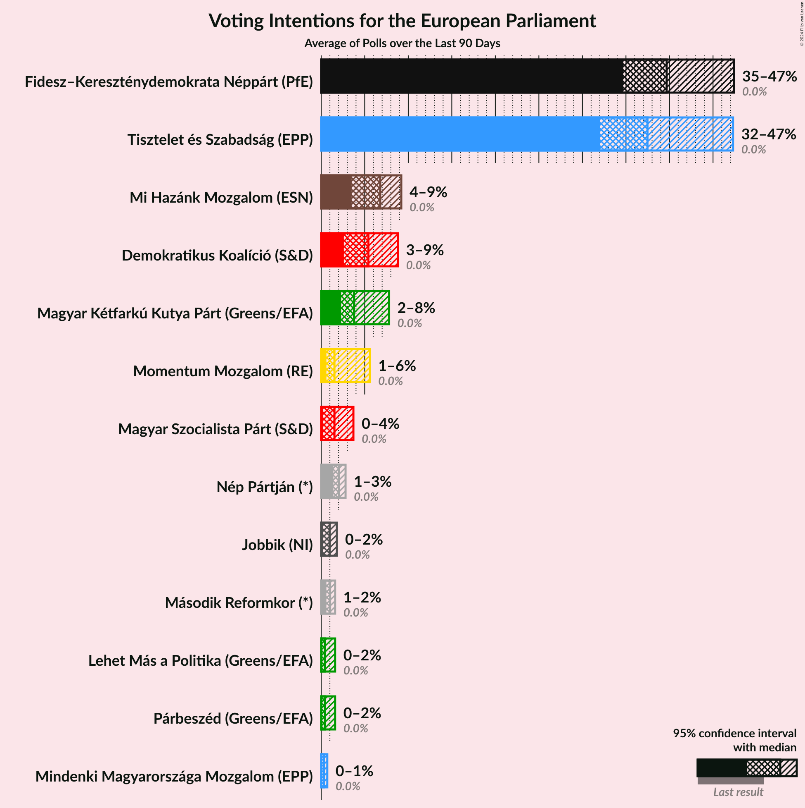
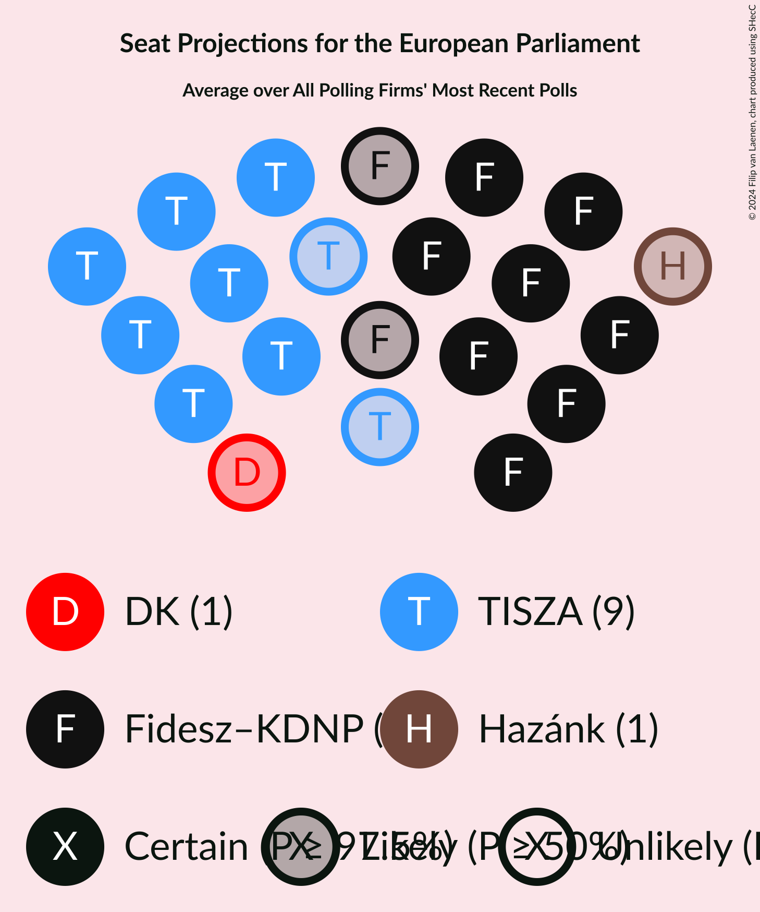
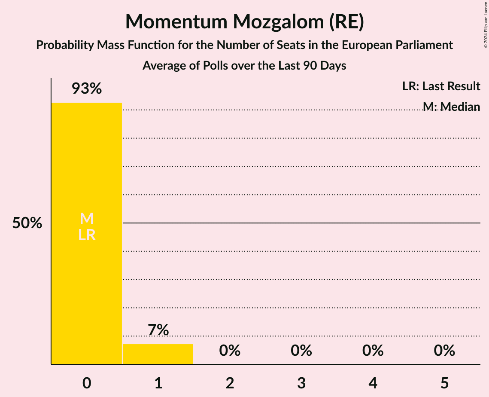
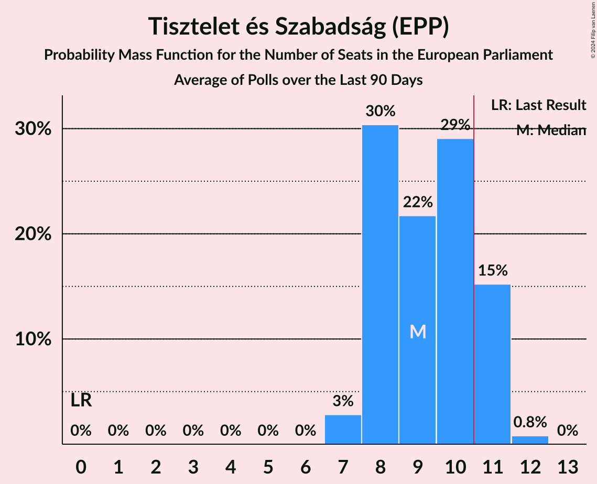
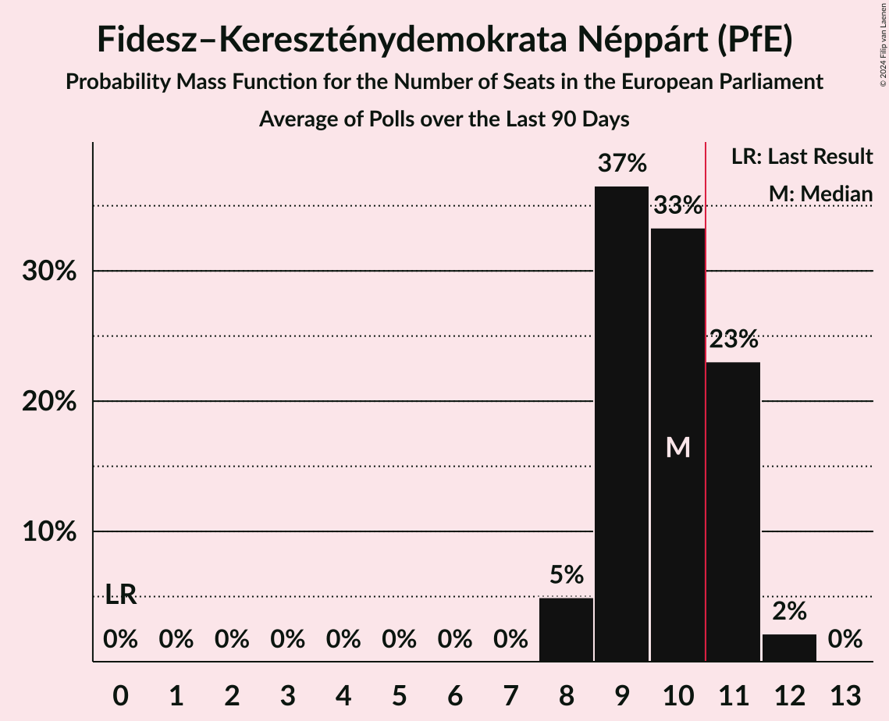
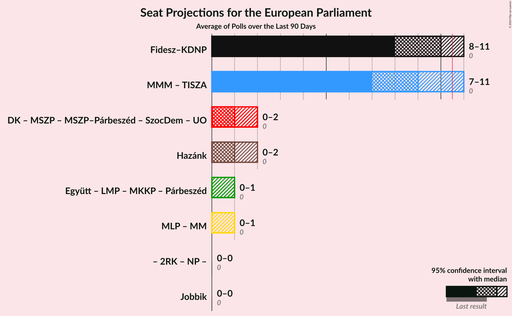

# Poll Average

<a href="#voting-intentions">Voting Intentions</a> | <a href="#seats">Seats</a> | <a href="#coalitions">Coalitions</a> | <a href="#technical-information">Technical Information</a>

## Summary

The table below lists the polls on which the average is based. They are the most recent polls (less than 90 days old) registered and analyzed so far.

| Period     | Polling firm/Commissioner(s) | Párbeszéd | Együtt | LMP | MKKP | MSZP | DK | MSZP–Párbeszéd | UO | SzocDem | MLP | MM | MMM | TISZA | Fidesz–KDNP | Hazánk | Jobbik | NP | 2RK |
|:----------:|:----------------------------:|:--:|:--:|:--:|:--:|:--:|:--:|:--:|:--:|:--:|:--:|:--:|:--:|:--:|:--:|:--:|:--:|:--:|:--:|
| 9 June 2024 | General Election | 0.0%   0 | 0.0%   0 | 0.0%   0 | 0.0%   0 | 0.0%   0 | 0.0%   0 | 0.0%   0 | 0.0%   0 | 0.0%   0 | 0.0%   0 | 0.0%   0 | 0.0%   0 | 0.0%   0 | 0.0%   0 | 0.0%   0 | 0.0%   0 | 0.0%   0 | 0.0%   0 |
| N/A | Poll Average | 0–2%   0 | N/A   N/A | 0–2%   0 | 2–8%   0–1 | 0–4%   0 | 3–9%   0–2 | N/A   N/A | N/A   N/A | N/A   N/A | N/A   N/A | 1–6%   0–1 | 0–1%   0 | 32–47%   7–11 | 35–47%   8–11 | 4–9%   0–2 | 0–2%   0 | 1–3%   0 | 1–2%   0 |
| [11–13 November 2024](2024-11-13-NézőpontIntézet.html) | Nézőpont Intézet | N/A   N/A | N/A   N/A | N/A   N/A | 3–5%   0–1 | N/A   N/A | 4–7%   0–1 | N/A   N/A | N/A   N/A | N/A   N/A | N/A   N/A | 1–2%   0 | N/A   N/A | 31–37%   7–9 | 43–49%   10–12 | 6–10%   1–2 | N/A   N/A | N/A   N/A | N/A   N/A |
| [31 October–8 November 2024](2024-11-08-IDEAIntézet.html) | IDEA Intézet | 0–1%   0 | N/A   N/A | 0–1%   0 | 2–4%   0 | 0–1%   0 | 5–7%   0–1 | N/A   N/A | N/A   N/A | N/A   N/A | N/A   N/A | 1–2%   0 | 0–1%   0 | 38–43%   9–11 | 35–40%   8–10 | 6–8%   1–2 | 0–1%   0 | 1–3%   0 | 1–2%   0 |
| [28 October–4 November 2024](2024-11-04-Medián.html) | Medián | N/A   N/A | N/A   N/A | N/A   N/A | 2–4%   0 | 1–2%   0 | 2–4%   0 | N/A   N/A | N/A   N/A | N/A   N/A | N/A   N/A | 1–2%   0 | N/A   N/A | 43–49%   10–12 | 36–42%   8–10 | 5–8%   0–1 | 1–2%   0 | N/A   N/A | N/A   N/A |
| [1–31 October 2024](2024-10-31-Századvég.html) | Századvég | N/A   N/A | N/A   N/A | N/A   N/A | 6–9%   1–2 | 1–3%   0 | 3–5%   0–1 | N/A   N/A | N/A   N/A | N/A   N/A | N/A   N/A | 1–3%   0 | N/A   N/A | 31–37%   7–9 | 40–46%   10–11 | 6–9%   1–2 | N/A   N/A | N/A   N/A | N/A   N/A |
| [28–30 October 2024](2024-10-30-Real-PR93.html) | Real-PR 93 | N/A   N/A | N/A   N/A | N/A   N/A | 3–5%   0–1 | N/A   N/A | 5–8%   0–1 | N/A   N/A | N/A   N/A | N/A   N/A | N/A   N/A | 1–2%   0 | N/A   N/A | 32–38%   8–9 | 41–47%   10–11 | 6–9%   1–2 | N/A   N/A | N/A   N/A | N/A   N/A |
| [24–29 October 2024](2024-10-29-RepublikonIntézet.html) | Republikon Intézet | 1–2%   0 | N/A   N/A | 0–1%   0 | 2–4%   0 | 2–4%   0 | 5–9%   1–2 | N/A   N/A | N/A   N/A | N/A   N/A | N/A   N/A | 4–6%   0–1 | N/A   N/A | 33–39%   8–10 | 34–40%   8–10 | 6–10%   1–2 | 1–2%   0 | N/A   N/A | N/A   N/A |
| [11–18 October 2024](2024-10-18-PublicusResearch.html) | Publicus Research | 0–1%   0 | N/A   N/A | 1–2%   0 | 3–5%   0–1 | 1–3%   0 | 6–10%   1–2 | N/A   N/A | N/A   N/A | N/A   N/A | N/A   N/A | 1–3%   0 | N/A   N/A | 36–42%   9–11 | 34–40%   8–10 | 3–5%   0–1 | 1–2%   0 | N/A   N/A | N/A   N/A |
| [9–15 October 2024](2024-10-15-21Kutatóközpont.html) | 21 Kutatóközpont | N/A   N/A | N/A   N/A | N/A   N/A | 3–5%   0–1 | 1–2%   0 | 3–5%   0–1 | N/A   N/A | N/A   N/A | N/A   N/A | N/A   N/A | 1–3%   0 | N/A   N/A | 38–44%   9–11 | 37–43%   9–11 | 4–7%   0–1 | 1–2%   0 | N/A   N/A | N/A   N/A |
| 9 June 2024 | General Election | 0.0%   0 | 0.0%   0 | 0.0%   0 | 0.0%   0 | 0.0%   0 | 0.0%   0 | 0.0%   0 | 0.0%   0 | 0.0%   0 | 0.0%   0 | 0.0%   0 | 0.0%   0 | 0.0%   0 | 0.0%   0 | 0.0%   0 | 0.0%   0 | 0.0%   0 | 0.0%   0 |

Only polls for which at least the sample size has been published are included in the table above.

**Legend:**
+ **Top half of each row:** Voting intentions (95% confidence interval)
+ **Bottom half of each row:** Seat projections for the European Parliament (95% confidence interval)
+ **Párbeszéd:** Párbeszéd (Greens/EFA)
+ **Együtt:** Együtt (Greens/EFA)
+ **LMP:** Lehet Más a Politika (Greens/EFA)
+ **MKKP:** Magyar Kétfarkú Kutya Párt (Greens/EFA)
+ **MSZP:** Magyar Szocialista Párt (S&D)
+ **DK:** Demokratikus Koalíció (S&D)
+ **MSZP–Párbeszéd:** Magyar Szocialista Párt–Párbeszéd (S&D)
+ **UO:** United Opposition (S&D)
+ **SzocDem:** Szocialisták és demokraták (S&D)
+ **MLP:** MLP (RE)
+ **MM:** Momentum Mozgalom (RE)
+ **MMM:** Mindenki Magyarországa Mozgalom (EPP)
+ **TISZA:** Tisztelet és Szabadság (EPP)
+ **Fidesz–KDNP:** Fidesz–Kereszténydemokrata Néppárt (PfE)
+ **Hazánk:** Mi Hazánk Mozgalom (ESN)
+ **Jobbik:** Jobbik (NI)
+ **NP:** Nép Pártján (*)
+ **2RK:** Második Reformkor (*)
+ **N/A (single party):** Party not included the published results
+ **N/A (entire row):** Calculation for this opinion poll not started yet

## Voting Intentions

### Confidence Intervals

| Party | Last Result | Median | 80% Confidence Interval | 90% Confidence Interval | 95% Confidence Interval | 99% Confidence Interval |
|:-----:|:-----------:|:------:|:-----------------------:|:-----------------------:|:-----------------------:|:-----------------------:|
| <a href="#párbeszéd-(greens/efa)">Párbeszéd (Greens/EFA)</a> | 0.0% | 0.4% | 0.2–1.2% |0.1–1.4% | 0.1–1.6% | 0.1–1.9% |
| <a href="#együtt-(greens/efa)">Együtt (Greens/EFA)</a> | 0.0% | N/A | N/A |N/A | N/A | N/A |
| <a href="#lehet-más-a-politika-(greens/efa)">Lehet Más a Politika (Greens/EFA)</a> | 0.0% | 0.4% | 0.2–1.2% |0.1–1.4% | 0.1–1.6% | 0.1–1.9% |
| <a href="#magyar-kétfarkú-kutya-párt-(greens/efa)">Magyar Kétfarkú Kutya Párt (Greens/EFA)</a> | 0.0% | 3.8% | 2.7–6.4% |2.5–7.3% | 2.3–7.8% | 2.0–8.6% |
| <a href="#magyar-szocialista-párt-(s&d)">Magyar Szocialista Párt (S&D)</a> | 0.0% | 1.5% | 0.3–3.0% |0.2–3.4% | 0.2–3.7% | 0.1–4.2% |
| <a href="#demokratikus-koalíció-(s&d)">Demokratikus Koalíció (S&D)</a> | 0.0% | 5.4% | 3.3–7.8% |2.9–8.4% | 2.6–8.8% | 2.2–9.7% |
| <a href="#magyar-szocialista-párt–párbeszéd-(s&d)">Magyar Szocialista Párt–Párbeszéd (S&D)</a> | 0.0% | N/A | N/A |N/A | N/A | N/A |
| <a href="#united-opposition-(s&d)">United Opposition (S&D)</a> | 0.0% | N/A | N/A |N/A | N/A | N/A |
| <a href="#szocialisták-és-demokraták-(s&d)">Szocialisták és demokraták (S&D)</a> | 0.0% | N/A | N/A |N/A | N/A | N/A |
| <a href="#mlp-(re)">MLP (RE)</a> | 0.0% | N/A | N/A |N/A | N/A | N/A |
| <a href="#momentum-mozgalom-(re)">Momentum Mozgalom (RE)</a> | 0.0% | 1.5% | 0.8–4.4% |0.7–5.1% | 0.6–5.6% | 0.5–6.3% |
| <a href="#mindenki-magyarországa-mozgalom-(epp)">Mindenki Magyarországa Mozgalom (EPP)</a> | 0.0% | 0.3% | 0.2–0.5% |0.1–0.6% | 0.1–0.7% | 0.1–0.8% |
| <a href="#tisztelet-és-szabadság-(epp)">Tisztelet és Szabadság (EPP)</a> | 0.0% | 37.5% | 33.3–44.7% |32.6–46.4% | 32.0–47.3% | 30.9–48.8% |
| <a href="#fidesz–kereszténydemokrata-néppárt-(pfe)">Fidesz–Kereszténydemokrata Néppárt (PfE)</a> | 0.0% | 39.7% | 36.0–45.6% |35.3–46.6% | 34.7–47.4% | 33.6–48.8% |
| <a href="#mi-hazánk-mozgalom-(esn)">Mi Hazánk Mozgalom (ESN)</a> | 0.0% | 6.8% | 4.3–8.4% |3.9–8.8% | 3.5–9.2% | 3.1–9.9% |
| <a href="#jobbik-(ni)">Jobbik (NI)</a> | 0.0% | 1.0% | 0.3–1.5% |0.2–1.6% | 0.2–1.8% | 0.1–2.1% |
| <a href="#nép-pártján-(*)">Nép Pártján (*)</a> | 0.0% | 2.0% | 1.6–2.6% |1.5–2.7% | 1.4–2.8% | 1.2–3.1% |
| <a href="#második-reformkor-(*)">Második Reformkor (*)</a> | 0.0% | 1.0% | 0.7–1.4% |0.7–1.5% | 0.6–1.6% | 0.5–1.9% |

### Mi Hazánk Mozgalom (ESN)

*For a full overview of the results for this party, see the [Mi Hazánk Mozgalom (ESN)](party-mihazánkmozgalomesn.html) page.*

| Voting Intentions | Probability | Accumulated | Special Marks |
|:-----------------:|:-----------:|:-----------:|:-------------:|
| 0.0–0.5% | 0% | 100% | Last Result |
| 0.5–1.5% | 0% | 100% |  |
| 1.5–2.5% | 0% | 100% |  |
| 2.5–3.5% | 3% | 100% |  |
| 3.5–4.5% | 10% | 97% |  |
| 4.5–5.5% | 13% | 87% |  |
| 5.5–6.5% | 19% | 75% |  |
| 6.5–7.5% | 28% | 55% | Median |
| 7.5–8.5% | 20% | 28% |  |
| 8.5–9.5% | 7% | 8% |  |
| 9.5–10.5% | 1.1% | 1.2% |  |
| 10.5–11.5% | 0.1% | 0.1% |  |
| 11.5–12.5% | 0% | 0% |  |

### Magyar Kétfarkú Kutya Párt (Greens/EFA)

*For a full overview of the results for this party, see the [Magyar Kétfarkú Kutya Párt (Greens/EFA)](party-magyarkétfarkúkutyapártgreensefa.html) page.*

| Voting Intentions | Probability | Accumulated | Special Marks |
|:-----------------:|:-----------:|:-----------:|:-------------:|
| 0.0–0.5% | 0% | 100% | Last Result |
| 0.5–1.5% | 0% | 100% |  |
| 1.5–2.5% | 6% | 100% |  |
| 2.5–3.5% | 35% | 94% |  |
| 3.5–4.5% | 35% | 59% | Median |
| 4.5–5.5% | 11% | 24% |  |
| 5.5–6.5% | 4% | 13% |  |
| 6.5–7.5% | 6% | 9% |  |
| 7.5–8.5% | 3% | 3% |  |
| 8.5–9.5% | 0.5% | 0.5% |  |
| 9.5–10.5% | 0% | 0% |  |

### Tisztelet és Szabadság (EPP)

*For a full overview of the results for this party, see the [Tisztelet és Szabadság (EPP)](party-tiszteletésszabadságepp.html) page.*

| Voting Intentions | Probability | Accumulated | Special Marks |
|:-----------------:|:-----------:|:-----------:|:-------------:|
| 0.0–0.5% | 0% | 100% | Last Result |
| 0.5–1.5% | 0% | 100% |  |
| 1.5–2.5% | 0% | 100% |  |
| 2.5–3.5% | 0% | 100% |  |
| 3.5–4.5% | 0% | 100% |  |
| 4.5–5.5% | 0% | 100% |  |
| 5.5–6.5% | 0% | 100% |  |
| 6.5–7.5% | 0% | 100% |  |
| 7.5–8.5% | 0% | 100% |  |
| 8.5–9.5% | 0% | 100% |  |
| 9.5–10.5% | 0% | 100% |  |
| 10.5–11.5% | 0% | 100% |  |
| 11.5–12.5% | 0% | 100% |  |
| 12.5–13.5% | 0% | 100% |  |
| 13.5–14.5% | 0% | 100% |  |
| 14.5–15.5% | 0% | 100% |  |
| 15.5–16.5% | 0% | 100% |  |
| 16.5–17.5% | 0% | 100% |  |
| 17.5–18.5% | 0% | 100% |  |
| 18.5–19.5% | 0% | 100% |  |
| 19.5–20.5% | 0% | 100% |  |
| 20.5–21.5% | 0% | 100% |  |
| 21.5–22.5% | 0% | 100% |  |
| 22.5–23.5% | 0% | 100% |  |
| 23.5–24.5% | 0% | 100% |  |
| 24.5–25.5% | 0% | 100% |  |
| 25.5–26.5% | 0% | 100% |  |
| 26.5–27.5% | 0% | 100% |  |
| 27.5–28.5% | 0% | 100% |  |
| 28.5–29.5% | 0% | 100% |  |
| 29.5–30.5% | 0.2% | 100% |  |
| 30.5–31.5% | 1.1% | 99.8% |  |
| 31.5–32.5% | 4% | 98.7% |  |
| 32.5–33.5% | 8% | 95% |  |
| 33.5–34.5% | 11% | 88% |  |
| 34.5–35.5% | 12% | 76% |  |
| 35.5–36.5% | 9% | 65% |  |
| 36.5–37.5% | 6% | 56% | Median |
| 37.5–38.5% | 6% | 50% |  |
| 38.5–39.5% | 7% | 44% |  |
| 39.5–40.5% | 9% | 37% |  |
| 40.5–41.5% | 8% | 28% |  |
| 41.5–42.5% | 5% | 20% |  |
| 42.5–43.5% | 3% | 15% |  |
| 43.5–44.5% | 2% | 13% |  |
| 44.5–45.5% | 3% | 10% |  |
| 45.5–46.5% | 3% | 8% |  |
| 46.5–47.5% | 3% | 5% |  |
| 47.5–48.5% | 1.4% | 2% |  |
| 48.5–49.5% | 0.5% | 0.7% |  |
| 49.5–50.5% | 0.1% | 0.2% |  |
| 50.5–51.5% | 0% | 0% |  |

### Momentum Mozgalom (RE)

*For a full overview of the results for this party, see the [Momentum Mozgalom (RE)](party-momentummozgalomre.html) page.*

| Voting Intentions | Probability | Accumulated | Special Marks |
|:-----------------:|:-----------:|:-----------:|:-------------:|
| 0.0–0.5% | 1.1% | 100% | Last Result |
| 0.5–1.5% | 49% | 98.9% |  |
| 1.5–2.5% | 32% | 50% | Median |
| 2.5–3.5% | 6% | 18% |  |
| 3.5–4.5% | 3% | 12% |  |
| 4.5–5.5% | 7% | 9% |  |
| 5.5–6.5% | 2% | 3% |  |
| 6.5–7.5% | 0.2% | 0.2% |  |
| 7.5–8.5% | 0% | 0% |  |

### Demokratikus Koalíció (S&D)

*For a full overview of the results for this party, see the [Demokratikus Koalíció (S&D)](party-demokratikuskoalíciósd.html) page.*

| Voting Intentions | Probability | Accumulated | Special Marks |
|:-----------------:|:-----------:|:-----------:|:-------------:|
| 0.0–0.5% | 0% | 100% | Last Result |
| 0.5–1.5% | 0% | 100% |  |
| 1.5–2.5% | 2% | 100% |  |
| 2.5–3.5% | 13% | 98% |  |
| 3.5–4.5% | 20% | 85% |  |
| 4.5–5.5% | 18% | 65% | Median |
| 5.5–6.5% | 20% | 47% |  |
| 6.5–7.5% | 14% | 27% |  |
| 7.5–8.5% | 9% | 13% |  |
| 8.5–9.5% | 3% | 4% |  |
| 9.5–10.5% | 0.6% | 0.6% |  |
| 10.5–11.5% | 0% | 0% |  |
| 11.5–12.5% | 0% | 0% |  |

### Fidesz–Kereszténydemokrata Néppárt (PfE)

*For a full overview of the results for this party, see the [Fidesz–Kereszténydemokrata Néppárt (PfE)](party-fidesz–kereszténydemokratanéppártpfe.html) page.*

| Voting Intentions | Probability | Accumulated | Special Marks |
|:-----------------:|:-----------:|:-----------:|:-------------:|
| 0.0–0.5% | 0% | 100% | Last Result |
| 0.5–1.5% | 0% | 100% |  |
| 1.5–2.5% | 0% | 100% |  |
| 2.5–3.5% | 0% | 100% |  |
| 3.5–4.5% | 0% | 100% |  |
| 4.5–5.5% | 0% | 100% |  |
| 5.5–6.5% | 0% | 100% |  |
| 6.5–7.5% | 0% | 100% |  |
| 7.5–8.5% | 0% | 100% |  |
| 8.5–9.5% | 0% | 100% |  |
| 9.5–10.5% | 0% | 100% |  |
| 10.5–11.5% | 0% | 100% |  |
| 11.5–12.5% | 0% | 100% |  |
| 12.5–13.5% | 0% | 100% |  |
| 13.5–14.5% | 0% | 100% |  |
| 14.5–15.5% | 0% | 100% |  |
| 15.5–16.5% | 0% | 100% |  |
| 16.5–17.5% | 0% | 100% |  |
| 17.5–18.5% | 0% | 100% |  |
| 18.5–19.5% | 0% | 100% |  |
| 19.5–20.5% | 0% | 100% |  |
| 20.5–21.5% | 0% | 100% |  |
| 21.5–22.5% | 0% | 100% |  |
| 22.5–23.5% | 0% | 100% |  |
| 23.5–24.5% | 0% | 100% |  |
| 24.5–25.5% | 0% | 100% |  |
| 25.5–26.5% | 0% | 100% |  |
| 26.5–27.5% | 0% | 100% |  |
| 27.5–28.5% | 0% | 100% |  |
| 28.5–29.5% | 0% | 100% |  |
| 29.5–30.5% | 0% | 100% |  |
| 30.5–31.5% | 0% | 100% |  |
| 31.5–32.5% | 0.1% | 100% |  |
| 32.5–33.5% | 0.4% | 99.9% |  |
| 33.5–34.5% | 2% | 99.5% |  |
| 34.5–35.5% | 4% | 98% |  |
| 35.5–36.5% | 9% | 94% |  |
| 36.5–37.5% | 12% | 85% |  |
| 37.5–38.5% | 12% | 73% |  |
| 38.5–39.5% | 10% | 61% |  |
| 39.5–40.5% | 8% | 51% | Median |
| 40.5–41.5% | 6% | 44% |  |
| 41.5–42.5% | 6% | 37% |  |
| 42.5–43.5% | 7% | 31% |  |
| 43.5–44.5% | 7% | 24% |  |
| 44.5–45.5% | 7% | 17% |  |
| 45.5–46.5% | 5% | 10% |  |
| 46.5–47.5% | 3% | 5% |  |
| 47.5–48.5% | 2% | 2% |  |
| 48.5–49.5% | 0.5% | 0.7% |  |
| 49.5–50.5% | 0.1% | 0.2% |  |
| 50.5–51.5% | 0% | 0% |  |

### Párbeszéd (Greens/EFA)

*For a full overview of the results for this party, see the [Párbeszéd (Greens/EFA)](party-párbeszédgreensefa.html) page.*

| Voting Intentions | Probability | Accumulated | Special Marks |
|:-----------------:|:-----------:|:-----------:|:-------------:|
| 0.0–0.5% | 62% | 100% | Last Result, Median |
| 0.5–1.5% | 35% | 38% |  |
| 1.5–2.5% | 3% | 3% |  |
| 2.5–3.5% | 0% | 0% |  |

### Nép Pártján (*)

*For a full overview of the results for this party, see the [Nép Pártján (*)](party-néppártján.html) page.*

| Voting Intentions | Probability | Accumulated | Special Marks |
|:-----------------:|:-----------:|:-----------:|:-------------:|
| 0.0–0.5% | 0% | 100% | Last Result |
| 0.5–1.5% | 7% | 100% |  |
| 1.5–2.5% | 83% | 93% | Median |
| 2.5–3.5% | 10% | 10% |  |
| 3.5–4.5% | 0% | 0% |  |

### Lehet Más a Politika (Greens/EFA)

*For a full overview of the results for this party, see the [Lehet Más a Politika (Greens/EFA)](party-lehetmásapolitikagreensefa.html) page.*

| Voting Intentions | Probability | Accumulated | Special Marks |
|:-----------------:|:-----------:|:-----------:|:-------------:|
| 0.0–0.5% | 62% | 100% | Last Result, Median |
| 0.5–1.5% | 35% | 38% |  |
| 1.5–2.5% | 3% | 3% |  |
| 2.5–3.5% | 0% | 0% |  |

### Jobbik (NI)

*For a full overview of the results for this party, see the [Jobbik (NI)](party-jobbikni.html) page.*

| Voting Intentions | Probability | Accumulated | Special Marks |
|:-----------------:|:-----------:|:-----------:|:-------------:|
| 0.0–0.5% | 20% | 100% | Last Result |
| 0.5–1.5% | 72% | 80% | Median |
| 1.5–2.5% | 7% | 7% |  |
| 2.5–3.5% | 0% | 0% |  |

### Magyar Szocialista Párt (S&D)

*For a full overview of the results for this party, see the [Magyar Szocialista Párt (S&D)](party-magyarszocialistapártsd.html) page.*

| Voting Intentions | Probability | Accumulated | Special Marks |
|:-----------------:|:-----------:|:-----------:|:-------------:|
| 0.0–0.5% | 16% | 100% | Last Result |
| 0.5–1.5% | 34% | 84% |  |
| 1.5–2.5% | 30% | 49% | Median |
| 2.5–3.5% | 16% | 19% |  |
| 3.5–4.5% | 3% | 3% |  |
| 4.5–5.5% | 0.1% | 0.1% |  |
| 5.5–6.5% | 0% | 0% |  |

### Második Reformkor (*)

*For a full overview of the results for this party, see the [Második Reformkor (*)](party-másodikreformkor.html) page.*

| Voting Intentions | Probability | Accumulated | Special Marks |
|:-----------------:|:-----------:|:-----------:|:-------------:|
| 0.0–0.5% | 1.0% | 100% | Last Result |
| 0.5–1.5% | 95% | 99.0% | Median |
| 1.5–2.5% | 4% | 4% |  |
| 2.5–3.5% | 0% | 0% |  |

### Mindenki Magyarországa Mozgalom (EPP)

*For a full overview of the results for this party, see the [Mindenki Magyarországa Mozgalom (EPP)](party-mindenkimagyarországamozgalomepp.html) page.*

| Voting Intentions | Probability | Accumulated | Special Marks |
|:-----------------:|:-----------:|:-----------:|:-------------:|
| 0.0–0.5% | 91% | 100% | Last Result, Median |
| 0.5–1.5% | 9% | 9% |  |
| 1.5–2.5% | 0% | 0% |  |

## Seats

### Confidence Intervals

| Party | Last Result | Median | 80% Confidence Interval | 90% Confidence Interval | 95% Confidence Interval | 99% Confidence Interval |
|:-----:|:-----------:|:------:|:-----------------------:|:-----------------------:|:-----------------------:|:-----------------------:|
| <a href="#párbeszéd-(greens/efa)">Párbeszéd (Greens/EFA)</a> | 0 | 0 | 0 |0 | 0 | 0 |
| <a href="#együtt-(greens/efa)">Együtt (Greens/EFA)</a> | 0 | N/A | N/A |N/A | N/A | N/A |
| <a href="#lehet-más-a-politika-(greens/efa)">Lehet Más a Politika (Greens/EFA)</a> | 0 | 0 | 0 |0 | 0 | 0 |
| <a href="#magyar-kétfarkú-kutya-párt-(greens/efa)">Magyar Kétfarkú Kutya Párt (Greens/EFA)</a> | 0 | 0 | 0–1 |0–1 | 0–1 | 0–2 |
| <a href="#magyar-szocialista-párt-(s&d)">Magyar Szocialista Párt (S&D)</a> | 0 | 0 | 0 |0 | 0 | 0 |
| <a href="#demokratikus-koalíció-(s&d)">Demokratikus Koalíció (S&D)</a> | 0 | 1 | 0–2 |0–2 | 0–2 | 0–2 |
| <a href="#magyar-szocialista-párt–párbeszéd-(s&d)">Magyar Szocialista Párt–Párbeszéd (S&D)</a> | 0 | N/A | N/A |N/A | N/A | N/A |
| <a href="#united-opposition-(s&d)">United Opposition (S&D)</a> | 0 | N/A | N/A |N/A | N/A | N/A |
| <a href="#szocialisták-és-demokraták-(s&d)">Szocialisták és demokraták (S&D)</a> | 0 | N/A | N/A |N/A | N/A | N/A |
| <a href="#mlp-(re)">MLP (RE)</a> | 0 | N/A | N/A |N/A | N/A | N/A |
| <a href="#momentum-mozgalom-(re)">Momentum Mozgalom (RE)</a> | 0 | 0 | 0 |0–1 | 0–1 | 0–1 |
| <a href="#mindenki-magyarországa-mozgalom-(epp)">Mindenki Magyarországa Mozgalom (EPP)</a> | 0 | 0 | 0 |0 | 0 | 0 |
| <a href="#tisztelet-és-szabadság-(epp)">Tisztelet és Szabadság (EPP)</a> | 0 | 9 | 8–11 |8–11 | 7–11 | 7–12 |
| <a href="#fidesz–kereszténydemokrata-néppárt-(pfe)">Fidesz–Kereszténydemokrata Néppárt (PfE)</a> | 0 | 10 | 9–11 |9–11 | 8–11 | 8–12 |
| <a href="#mi-hazánk-mozgalom-(esn)">Mi Hazánk Mozgalom (ESN)</a> | 0 | 1 | 0–2 |0–2 | 0–2 | 0–2 |
| <a href="#jobbik-(ni)">Jobbik (NI)</a> | 0 | 0 | 0 |0 | 0 | 0 |
| <a href="#nép-pártján-(*)">Nép Pártján (*)</a> | 0 | 0 | 0 |0 | 0 | 0 |
| <a href="#második-reformkor-(*)">Második Reformkor (*)</a> | 0 | 0 | 0 |0 | 0 | 0 |

### Párbeszéd (Greens/EFA)

*For a full overview of the results for this party, see the [Párbeszéd (Greens/EFA)](party-párbeszédgreensefa.html) page.*

| Number of Seats | Probability | Accumulated | Special Marks |
|:---------------:|:-----------:|:-----------:|:-------------:|
| 0 | 100% | 100% | Last Result, Median |

### Együtt (Greens/EFA)

*For a full overview of the results for this party, see the [Együtt (Greens/EFA)](party-együttgreensefa.html) page.*

### Lehet Más a Politika (Greens/EFA)

*For a full overview of the results for this party, see the [Lehet Más a Politika (Greens/EFA)](party-lehetmásapolitikagreensefa.html) page.*

| Number of Seats | Probability | Accumulated | Special Marks |
|:---------------:|:-----------:|:-----------:|:-------------:|
| 0 | 100% | 100% | Last Result, Median |

### Magyar Kétfarkú Kutya Párt (Greens/EFA)

*For a full overview of the results for this party, see the [Magyar Kétfarkú Kutya Párt (Greens/EFA)](party-magyarkétfarkúkutyapártgreensefa.html) page.*

| Number of Seats | Probability | Accumulated | Special Marks |
|:---------------:|:-----------:|:-----------:|:-------------:|
| 0 | 84% | 100% | Last Result, Median |
| 1 | 14% | 16% |  |
| 2 | 2% | 2% |  |
| 3 | 0% | 0% |  |

### Magyar Szocialista Párt (S&D)

*For a full overview of the results for this party, see the [Magyar Szocialista Párt (S&D)](party-magyarszocialistapártsd.html) page.*

| Number of Seats | Probability | Accumulated | Special Marks |
|:---------------:|:-----------:|:-----------:|:-------------:|
| 0 | 100% | 100% | Last Result, Median |

### Demokratikus Koalíció (S&D)

*For a full overview of the results for this party, see the [Demokratikus Koalíció (S&D)](party-demokratikuskoalíciósd.html) page.*

| Number of Seats | Probability | Accumulated | Special Marks |
|:---------------:|:-----------:|:-----------:|:-------------:|
| 0 | 44% | 100% | Last Result |
| 1 | 42% | 56% | Median |
| 2 | 13% | 13% |  |
| 3 | 0% | 0% |  |

### Magyar Szocialista Párt–Párbeszéd (S&D)

*For a full overview of the results for this party, see the [Magyar Szocialista Párt–Párbeszéd (S&D)](party-magyarszocialistapárt–párbeszédsd.html) page.*

### United Opposition (S&D)

*For a full overview of the results for this party, see the [United Opposition (S&D)](party-unitedoppositionsd.html) page.*

### Szocialisták és demokraták (S&D)

*For a full overview of the results for this party, see the [Szocialisták és demokraták (S&D)](party-szocialistákésdemokratáksd.html) page.*

### MLP (RE)

*For a full overview of the results for this party, see the [MLP (RE)](party-mlpre.html) page.*

### Momentum Mozgalom (RE)

*For a full overview of the results for this party, see the [Momentum Mozgalom (RE)](party-momentummozgalomre.html) page.*

| Number of Seats | Probability | Accumulated | Special Marks |
|:---------------:|:-----------:|:-----------:|:-------------:|
| 0 | 93% | 100% | Last Result, Median |
| 1 | 7% | 7% |  |
| 2 | 0% | 0% |  |

### Mindenki Magyarországa Mozgalom (EPP)

*For a full overview of the results for this party, see the [Mindenki Magyarországa Mozgalom (EPP)](party-mindenkimagyarországamozgalomepp.html) page.*

| Number of Seats | Probability | Accumulated | Special Marks |
|:---------------:|:-----------:|:-----------:|:-------------:|
| 0 | 100% | 100% | Last Result, Median |

### Tisztelet és Szabadság (EPP)

*For a full overview of the results for this party, see the [Tisztelet és Szabadság (EPP)](party-tiszteletésszabadságepp.html) page.*

| Number of Seats | Probability | Accumulated | Special Marks |
|:---------------:|:-----------:|:-----------:|:-------------:|
| 0 | 0% | 100% | Last Result |
| 1 | 0% | 100% |  |
| 2 | 0% | 100% |  |
| 3 | 0% | 100% |  |
| 4 | 0% | 100% |  |
| 5 | 0% | 100% |  |
| 6 | 0% | 100% |  |
| 7 | 3% | 100% |  |
| 8 | 30% | 97% |  |
| 9 | 22% | 67% | Median |
| 10 | 29% | 45% |  |
| 11 | 15% | 16% | Majority |
| 12 | 0.8% | 0.8% |  |
| 13 | 0% | 0% |  |

### Fidesz–Kereszténydemokrata Néppárt (PfE)

*For a full overview of the results for this party, see the [Fidesz–Kereszténydemokrata Néppárt (PfE)](party-fidesz–kereszténydemokratanéppártpfe.html) page.*

| Number of Seats | Probability | Accumulated | Special Marks |
|:---------------:|:-----------:|:-----------:|:-------------:|
| 0 | 0% | 100% | Last Result |
| 1 | 0% | 100% |  |
| 2 | 0% | 100% |  |
| 3 | 0% | 100% |  |
| 4 | 0% | 100% |  |
| 5 | 0% | 100% |  |
| 6 | 0% | 100% |  |
| 7 | 0% | 100% |  |
| 8 | 5% | 100% |  |
| 9 | 37% | 95% |  |
| 10 | 33% | 59% | Median |
| 11 | 23% | 25% | Majority |
| 12 | 2% | 2% |  |
| 13 | 0% | 0% |  |

### Mi Hazánk Mozgalom (ESN)

*For a full overview of the results for this party, see the [Mi Hazánk Mozgalom (ESN)](party-mihazánkmozgalomesn.html) page.*

| Number of Seats | Probability | Accumulated | Special Marks |
|:---------------:|:-----------:|:-----------:|:-------------:|
| 0 | 19% | 100% | Last Result |
| 1 | 64% | 81% | Median |
| 2 | 17% | 17% |  |
| 3 | 0% | 0% |  |

### Jobbik (NI)

*For a full overview of the results for this party, see the [Jobbik (NI)](party-jobbikni.html) page.*

| Number of Seats | Probability | Accumulated | Special Marks |
|:---------------:|:-----------:|:-----------:|:-------------:|
| 0 | 100% | 100% | Last Result, Median |

### Nép Pártján (*)

*For a full overview of the results for this party, see the [Nép Pártján (*)](party-néppártján.html) page.*

| Number of Seats | Probability | Accumulated | Special Marks |
|:---------------:|:-----------:|:-----------:|:-------------:|
| 0 | 100% | 100% | Last Result, Median |

### Második Reformkor (*)

*For a full overview of the results for this party, see the [Második Reformkor (*)](party-másodikreformkor.html) page.*

| Number of Seats | Probability | Accumulated | Special Marks |
|:---------------:|:-----------:|:-----------:|:-------------:|
| 0 | 100% | 100% | Last Result, Median |

## Coalitions

### Confidence Intervals

| Coalition | Last Result | Median | Majority? | 80% Confidence Interval | 90% Confidence Interval | 95% Confidence Interval | 99% Confidence Interval |
|:---------:|:-----------:|:------:|:---------:|:-----------------------:|:-----------------------:|:-----------------------:|:-----------------------:|
| Fidesz–Kereszténydemokrata Néppárt (PfE) | 0 | 10 | 25% | 9–11 | 9–11 | 8–11 | 8–12 |
| Mindenki Magyarországa Mozgalom (EPP) – Tisztelet és Szabadság (EPP) | 0 | 9 | 16% | 8–11 | 8–11 | 7–11 | 7–12 |
| Demokratikus Koalíció (S&D) – Magyar Szocialista Párt (S&D) – Magyar Szocialista Párt–Párbeszéd (S&D) – Szocialisták és demokraták (S&D) – United Opposition (S&D) | 0 | 1 | 0% | 0–2 | 0–2 | 0–2 | 0–2 |
| Mi Hazánk Mozgalom (ESN) | 0 | 1 | 0% | 0–2 | 0–2 | 0–2 | 0–2 |
| Együtt (Greens/EFA) – Lehet Más a Politika (Greens/EFA) – Magyar Kétfarkú Kutya Párt (Greens/EFA) – Párbeszéd (Greens/EFA) | 0 | 0 | 0% | 0–1 | 0–1 | 0–1 | 0–2 |
| MLP (RE) – Momentum Mozgalom (RE) | 0 | 0 | 0% | 0 | 0–1 | 0–1 | 0–1 |
| Jobbik (NI) | 0 | 0 | 0% | 0 | 0 | 0 | 0 |

### Fidesz–Kereszténydemokrata Néppárt (PfE)

| Number of Seats | Probability | Accumulated | Special Marks |
|:---------------:|:-----------:|:-----------:|:-------------:|
| 0 | 0% | 100% | Last Result |
| 1 | 0% | 100% |  |
| 2 | 0% | 100% |  |
| 3 | 0% | 100% |  |
| 4 | 0% | 100% |  |
| 5 | 0% | 100% |  |
| 6 | 0% | 100% |  |
| 7 | 0% | 100% |  |
| 8 | 5% | 100% |  |
| 9 | 37% | 95% |  |
| 10 | 33% | 59% | Median |
| 11 | 23% | 25% | Majority |
| 12 | 2% | 2% |  |
| 13 | 0% | 0% |  |

### Mindenki Magyarországa Mozgalom (EPP) – Tisztelet és Szabadság (EPP)

| Number of Seats | Probability | Accumulated | Special Marks |
|:---------------:|:-----------:|:-----------:|:-------------:|
| 0 | 0% | 100% | Last Result |
| 1 | 0% | 100% |  |
| 2 | 0% | 100% |  |
| 3 | 0% | 100% |  |
| 4 | 0% | 100% |  |
| 5 | 0% | 100% |  |
| 6 | 0% | 100% |  |
| 7 | 3% | 100% |  |
| 8 | 30% | 97% |  |
| 9 | 22% | 67% | Median |
| 10 | 29% | 45% |  |
| 11 | 15% | 16% | Majority |
| 12 | 0.8% | 0.8% |  |
| 13 | 0% | 0% |  |

### Demokratikus Koalíció (S&D) – Magyar Szocialista Párt (S&D) – Magyar Szocialista Párt–Párbeszéd (S&D) – Szocialisták és demokraták (S&D) – United Opposition (S&D)

| Number of Seats | Probability | Accumulated | Special Marks |
|:---------------:|:-----------:|:-----------:|:-------------:|
| 0 | 44% | 100% | Last Result |
| 1 | 42% | 56% | Median |
| 2 | 13% | 13% |  |
| 3 | 0% | 0% |  |

### Mi Hazánk Mozgalom (ESN)

| Number of Seats | Probability | Accumulated | Special Marks |
|:---------------:|:-----------:|:-----------:|:-------------:|
| 0 | 19% | 100% | Last Result |
| 1 | 64% | 81% | Median |
| 2 | 17% | 17% |  |
| 3 | 0% | 0% |  |

### Együtt (Greens/EFA) – Lehet Más a Politika (Greens/EFA) – Magyar Kétfarkú Kutya Párt (Greens/EFA) – Párbeszéd (Greens/EFA)

| Number of Seats | Probability | Accumulated | Special Marks |
|:---------------:|:-----------:|:-----------:|:-------------:|
| 0 | 84% | 100% | Last Result, Median |
| 1 | 14% | 16% |  |
| 2 | 2% | 2% |  |
| 3 | 0% | 0% |  |

### MLP (RE) – Momentum Mozgalom (RE)

| Number of Seats | Probability | Accumulated | Special Marks |
|:---------------:|:-----------:|:-----------:|:-------------:|
| 0 | 93% | 100% | Last Result, Median |
| 1 | 7% | 7% |  |
| 2 | 0% | 0% |  |

### Jobbik (NI)

| Number of Seats | Probability | Accumulated | Special Marks |
|:---------------:|:-----------:|:-----------:|:-------------:|
| 0 | 100% | 100% | Last Result, Median |

## Technical Information

+ **Number of polls included in this average:** 8
+ **Lowest number of simulations done in a poll included in this average:** 2,097,152
+ **Total number of simulations done in the polls included in this average:** 16,777,216
+ **Error estimate:** 1.71%
