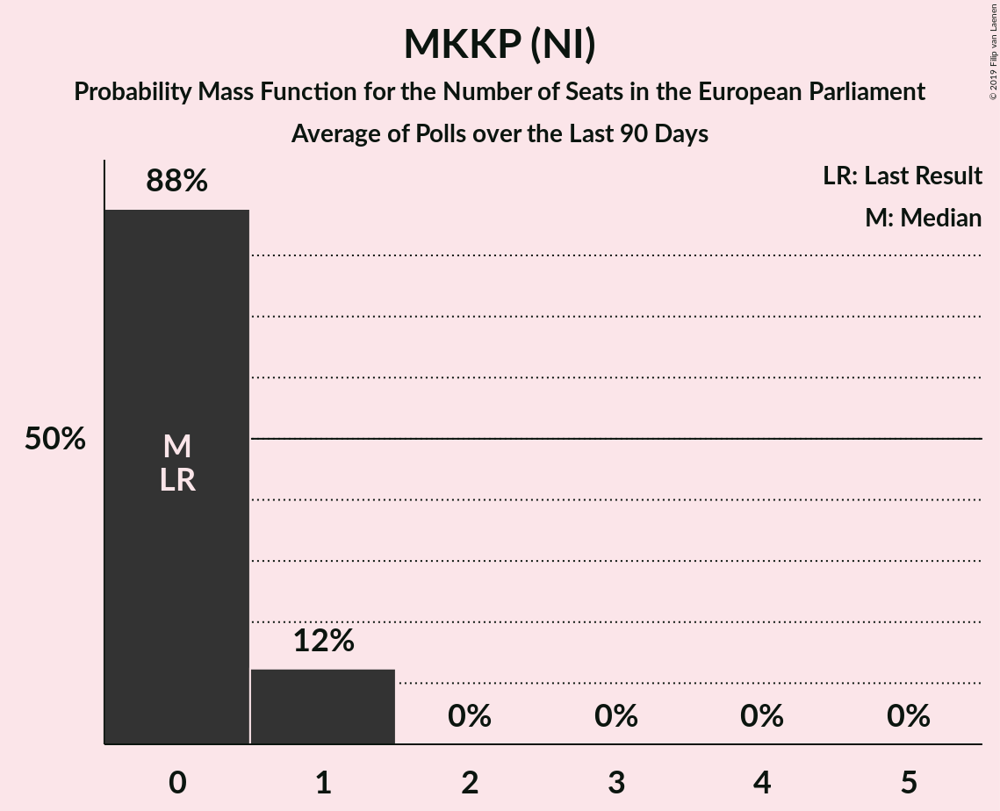

# Poll Average

<a href="#voting-intentions">Voting Intentions</a> | <a href="#seats">Seats</a> | <a href="#coalitions">Coalitions</a> | <a href="#technical-information">Technical Information</a>

## Summary

The table below lists the polls on which the average is based. They are the most recent polls (less than 90 days old) registered and analyzed so far.

| Period     | Polling firm/Commissioner(s) | Fidesz–KDNP | Jobbik | MSZP | DK | Párbeszéd | Együtt | LMP | MLP | MKKP | MM | MSZP–Párbeszéd | Hazánk |
|:----------:|:----------------------------:|:--:|:--:|:--:|:--:|:--:|:--:|:--:|:--:|:--:|:--:|:--:|:--:|
| 25 May 2014 | General Election | 51.5%   12 | 14.7%   3 | 10.9%   2 | 9.8%   2 | 7.2%   1 | 7.2%   0 | 5.0%   1 | 0.0%   0 | 0.0%   0 | 0.0%   0 | 18.2%   3 | 0.0%   0 |
| N/A | Poll Average | 46–61%   11–15 | 10–18%   2–4 | N/A   N/A | 5–11%   1–2 | N/A   N/A | N/A   N/A | 2–5%   0–1 | N/A   N/A | 1–5%   0–1 | 2–6%   0–1 | 9–16%   2–4 | 1–4%   0 |
| [17–20 December 2018](2018-12-20-IDEAIntézet.html) | IDEA Intézet | 48–53%   11–13 | 10–13%   2–3 | N/A   N/A | 8–10%   1–2 | N/A   N/A | N/A   N/A | 3–5%   0–1 | N/A   N/A | 3–5%   0–1 | 4–6%   1 | 12–15%   2–3 | 1–2%   0 |
| [13–19 December 2018](2018-12-19-PublicusResearch.html) | Publicus Research | 45–51%   11–13 | 14–18%   3–4 | N/A   N/A | 5–8%   1 | N/A   N/A | N/A   N/A | 3–5%   0–1 | N/A   N/A | 2–4%   0–1 | 3–5%   0–1 | 13–17%   3–4 | 1–2%   0 |
| [26 November–15 December 2018](2018-12-15-NézőpontIntézet.html) | Nézőpont Intézet | 52–56%   12–14 | 12–16%   3–4 | N/A   N/A | 6–8%   1–2 | N/A   N/A | N/A   N/A | 3–5%   0–1 | N/A   N/A | 2–4%   0 | 3–5%   0–1 | 10–12%   2–3 | 2–4%   0 |
| [4–11 December 2018](2018-12-11-ZRIZáveczResearch.html) | ZRI Závecz Research | 48–54%   12–13 | 13–17%   3–4 | N/A   N/A | 6–10%   1–2 | N/A   N/A | N/A   N/A | 2–4%   0–1 | N/A   N/A | 2–4%   0–1 | 3–5%   0–1 | 11–15%   2–3 | 1–3%   0 |
| [30 November–5 December 2018](2018-12-05-Medián.html) | Medián | 56–62%   14–15 | 10–14%   2–3 | N/A   N/A | 8–12%   2 | N/A   N/A | N/A   N/A | 1–3%   0 | N/A   N/A | 1–2%   0 | 2–4%   0–1 | 8–12%   2 | 1–3%   0 |
| 25 May 2014 | General Election | 51.5%   12 | 14.7%   3 | 10.9%   2 | 9.8%   2 | 7.2%   1 | 7.2%   0 | 5.0%   1 | 0.0%   0 | 0.0%   0 | 0.0%   0 | 18.2%   3 | 0.0%   0 |

Only polls for which at least the sample size has been published are included in the table above.

**Legend:**
+ **Top half of each row:** Voting intentions (95% confidence interval)
+ **Bottom half of each row:** Seat projections for the European Parliament (95% confidence interval)
+ **Fidesz–KDNP:** Fidesz–KDNP (EPP)
+ **Jobbik:** Jobbik (NI)
+ **MSZP:** MSZP (S&D)
+ **DK:** DK (S&D)
+ **Párbeszéd:** Párbeszéd (Greens/EFA)
+ **Együtt:** Együtt (Greens/EFA)
+ **LMP:** LMP (Greens/EFA)
+ **MLP:** MLP (ALDE)
+ **MKKP:** MKKP (NI)
+ **MM:** MM (ALDE)
+ **MSZP–Párbeszéd:** MSZP–Párbeszéd (S&D)
+ **Hazánk:** Mi Hazánk Mozgalom (NI)
+ **N/A (single party):** Party not included the published results
+ **N/A (entire row):** Calculation for this opinion poll not started yet

## Voting Intentions

### Confidence Intervals

| Party | Last Result | Median | 80% Confidence Interval | 90% Confidence Interval | 95% Confidence Interval | 99% Confidence Interval |
|:-----:|:-----------:|:------:|:-----------------------:|:-----------------------:|:-----------------------:|:-----------------------:|
| <a href="#fidesz–kdnp-(epp)">Fidesz–KDNP (EPP)</a> | 51.5% | 51.6% | 47.9–59.0% |46.9–59.9% | 46.2–60.6% | 44.9–61.8% |
| <a href="#mszp–párbeszéd-(s&d)">MSZP–Párbeszéd (S&D)</a> | 18.2% | 12.5% | 9.9–15.1% |9.4–15.8% | 9.1–16.4% | 8.4–17.4% |
| <a href="#jobbik-(ni)">Jobbik (NI)</a> | 14.7% | 13.8% | 10.9–16.4% |10.5–17.0% | 10.2–17.5% | 9.7–18.4% |
| <a href="#mszp-(s&d)">MSZP (S&D)</a> | 10.9% | N/A | N/A |N/A | N/A | N/A |
| <a href="#dk-(s&d)">DK (S&D)</a> | 9.8% | 8.1% | 6.0–10.2% |5.6–10.7% | 5.2–11.1% | 4.7–11.8% |
| <a href="#párbeszéd-(greens/efa)">Párbeszéd (Greens/EFA)</a> | 7.2% | N/A | N/A |N/A | N/A | N/A |
| <a href="#együtt-(greens/efa)">Együtt (Greens/EFA)</a> | 7.2% | N/A | N/A |N/A | N/A | N/A |
| <a href="#lmp-(greens/efa)">LMP (Greens/EFA)</a> | 5.0% | 3.7% | 2.0–4.6% |1.8–4.8% | 1.6–5.0% | 1.3–5.5% |
| <a href="#mlp-(alde)">MLP (ALDE)</a> | 0.0% | N/A | N/A |N/A | N/A | N/A |
| <a href="#mkkp-(ni)">MKKP (NI)</a> | 0.0% | 3.0% | 1.1–4.2% |0.9–4.4% | 0.8–4.6% | 0.6–5.0% |
| <a href="#mm-(alde)">MM (ALDE)</a> | 0.0% | 4.1% | 3.0–5.2% |2.7–5.5% | 2.5–5.7% | 2.2–6.1% |
| <a href="#mi-hazánk-mozgalom-(ni)">Mi Hazánk Mozgalom (NI)</a> | 0.0% | 1.8% | 0.9–3.1% |0.8–3.3% | 0.7–3.5% | 0.5–3.8% |

### Fidesz–KDNP (EPP)

*For a full overview of the results for this party, see the [Fidesz–KDNP (EPP)](party-fidesz–kdnpepp.html) page.*

| Voting Intentions | Probability | Accumulated | Special Marks |
|:-----------------:|:-----------:|:-----------:|:-------------:|
| 42.5–43.5% | 0% | 100% |  |
| 43.5–44.5% | 0.2% | 100% |  |
| 44.5–45.5% | 0.9% | 99.7% |  |
| 45.5–46.5% | 2% | 98.8% |  |
| 46.5–47.5% | 5% | 96% |  |
| 47.5–48.5% | 7% | 92% |  |
| 48.5–49.5% | 10% | 85% |  |
| 49.5–50.5% | 13% | 76% |  |
| 50.5–51.5% | 12% | 63% | Last Result |
| 51.5–52.5% | 9% | 51% | Median |
| 52.5–53.5% | 8% | 41% |  |
| 53.5–54.5% | 8% | 33% |  |
| 54.5–55.5% | 4% | 26% |  |
| 55.5–56.5% | 2% | 21% |  |
| 56.5–57.5% | 2% | 19% |  |
| 57.5–58.5% | 4% | 17% |  |
| 58.5–59.5% | 6% | 12% |  |
| 59.5–60.5% | 4% | 7% |  |
| 60.5–61.5% | 2% | 3% |  |
| 61.5–62.5% | 0.6% | 0.7% |  |
| 62.5–63.5% | 0.1% | 0.1% |  |
| 63.5–64.5% | 0% | 0% |  |

### MSZP–Párbeszéd (S&D)

*For a full overview of the results for this party, see the [MSZP–Párbeszéd (S&D)](party-mszp–párbeszédsd.html) page.*

| Voting Intentions | Probability | Accumulated | Special Marks |
|:-----------------:|:-----------:|:-----------:|:-------------:|
| 6.5–7.5% | 0% | 100% |  |
| 7.5–8.5% | 0.7% | 100% |  |
| 8.5–9.5% | 5% | 99.3% |  |
| 9.5–10.5% | 14% | 94% |  |
| 10.5–11.5% | 17% | 80% |  |
| 11.5–12.5% | 13% | 63% |  |
| 12.5–13.5% | 19% | 50% | Median |
| 13.5–14.5% | 15% | 31% |  |
| 14.5–15.5% | 9% | 16% |  |
| 15.5–16.5% | 5% | 7% |  |
| 16.5–17.5% | 2% | 2% |  |
| 17.5–18.5% | 0.3% | 0.3% | Last Result |
| 18.5–19.5% | 0% | 0% |  |

### Jobbik (NI)

*For a full overview of the results for this party, see the [Jobbik (NI)](party-jobbikni.html) page.*

| Voting Intentions | Probability | Accumulated | Special Marks |
|:-----------------:|:-----------:|:-----------:|:-------------:|
| 7.5–8.5% | 0% | 100% |  |
| 8.5–9.5% | 0.2% | 100% |  |
| 9.5–10.5% | 5% | 99.8% |  |
| 10.5–11.5% | 16% | 95% |  |
| 11.5–12.5% | 14% | 79% |  |
| 12.5–13.5% | 12% | 66% |  |
| 13.5–14.5% | 17% | 53% | Median |
| 14.5–15.5% | 16% | 36% | Last Result |
| 15.5–16.5% | 12% | 20% |  |
| 16.5–17.5% | 6% | 9% |  |
| 17.5–18.5% | 2% | 2% |  |
| 18.5–19.5% | 0.4% | 0.4% |  |
| 19.5–20.5% | 0% | 0% |  |

### DK (S&D)

*For a full overview of the results for this party, see the [DK (S&D)](party-dksd.html) page.*

| Voting Intentions | Probability | Accumulated | Special Marks |
|:-----------------:|:-----------:|:-----------:|:-------------:|
| 2.5–3.5% | 0% | 100% |  |
| 3.5–4.5% | 0.3% | 100% |  |
| 4.5–5.5% | 5% | 99.7% |  |
| 5.5–6.5% | 14% | 95% |  |
| 6.5–7.5% | 22% | 81% |  |
| 7.5–8.5% | 17% | 59% | Median |
| 8.5–9.5% | 21% | 42% |  |
| 9.5–10.5% | 14% | 20% | Last Result |
| 10.5–11.5% | 5% | 6% |  |
| 11.5–12.5% | 0.9% | 1.0% |  |
| 12.5–13.5% | 0.1% | 0.1% |  |
| 13.5–14.5% | 0% | 0% |  |

### LMP (Greens/EFA)

*For a full overview of the results for this party, see the [LMP (Greens/EFA)](party-lmpgreensefa.html) page.*

| Voting Intentions | Probability | Accumulated | Special Marks |
|:-----------------:|:-----------:|:-----------:|:-------------:|
| 0.0–0.5% | 0% | 100% |  |
| 0.5–1.5% | 2% | 100% |  |
| 1.5–2.5% | 19% | 98% |  |
| 2.5–3.5% | 24% | 79% |  |
| 3.5–4.5% | 45% | 55% | Median |
| 4.5–5.5% | 10% | 10% | Last Result |
| 5.5–6.5% | 0.4% | 0.4% |  |
| 6.5–7.5% | 0% | 0% |  |

### MM (ALDE)

*For a full overview of the results for this party, see the [MM (ALDE)](party-mmalde.html) page.*

| Voting Intentions | Probability | Accumulated | Special Marks |
|:-----------------:|:-----------:|:-----------:|:-------------:|
| 0.0–0.5% | 0% | 100% | Last Result |
| 0.5–1.5% | 0% | 100% |  |
| 1.5–2.5% | 3% | 100% |  |
| 2.5–3.5% | 24% | 97% |  |
| 3.5–4.5% | 44% | 73% | Median |
| 4.5–5.5% | 25% | 29% |  |
| 5.5–6.5% | 4% | 4% |  |
| 6.5–7.5% | 0.1% | 0.1% |  |
| 7.5–8.5% | 0% | 0% |  |

### MKKP (NI)

*For a full overview of the results for this party, see the [MKKP (NI)](party-mkkpni.html) page.*

| Voting Intentions | Probability | Accumulated | Special Marks |
|:-----------------:|:-----------:|:-----------:|:-------------:|
| 0.0–0.5% | 0.3% | 100% | Last Result |
| 0.5–1.5% | 18% | 99.7% |  |
| 1.5–2.5% | 9% | 81% |  |
| 2.5–3.5% | 44% | 72% | Median |
| 3.5–4.5% | 24% | 28% |  |
| 4.5–5.5% | 3% | 3% |  |
| 5.5–6.5% | 0% | 0% |  |

### Mi Hazánk Mozgalom (NI)

*For a full overview of the results for this party, see the [Mi Hazánk Mozgalom (NI)](party-mihazánkmozgalomni.html) page.*

| Voting Intentions | Probability | Accumulated | Special Marks |
|:-----------------:|:-----------:|:-----------:|:-------------:|
| 0.0–0.5% | 0.6% | 100% | Last Result |
| 0.5–1.5% | 41% | 99.4% |  |
| 1.5–2.5% | 34% | 58% | Median |
| 2.5–3.5% | 22% | 24% |  |
| 3.5–4.5% | 2% | 2% |  |
| 4.5–5.5% | 0% | 0% |  |

## Seats

### Confidence Intervals

| Party | Last Result | Median | 80% Confidence Interval | 90% Confidence Interval | 95% Confidence Interval | 99% Confidence Interval |
|:-----:|:-----------:|:------:|:-----------------------:|:-----------------------:|:-----------------------:|:-----------------------:|
| <a href="#fidesz–kdnp-(epp)">Fidesz–KDNP (EPP)</a> | 12 | 13 | 11–14 |11–15 | 11–15 | 11–15 |
| <a href="#mszp–párbeszéd-(s&d)">MSZP–Párbeszéd (S&D)</a> | 3 | 3 | 2–3 |2–4 | 2–4 | 2–4 |
| <a href="#jobbik-(ni)">Jobbik (NI)</a> | 3 | 3 | 2–4 |2–4 | 2–4 | 2–4 |
| <a href="#mszp-(s&d)">MSZP (S&D)</a> | 2 | N/A | N/A |N/A | N/A | N/A |
| <a href="#dk-(s&d)">DK (S&D)</a> | 2 | 2 | 1–2 |1–2 | 1–2 | 1–2 |
| <a href="#párbeszéd-(greens/efa)">Párbeszéd (Greens/EFA)</a> | 1 | N/A | N/A |N/A | N/A | N/A |
| <a href="#együtt-(greens/efa)">Együtt (Greens/EFA)</a> | 0 | N/A | N/A |N/A | N/A | N/A |
| <a href="#lmp-(greens/efa)">LMP (Greens/EFA)</a> | 1 | 0 | 0–1 |0–1 | 0–1 | 0–1 |
| <a href="#mlp-(alde)">MLP (ALDE)</a> | 0 | N/A | N/A |N/A | N/A | N/A |
| <a href="#mkkp-(ni)">MKKP (NI)</a> | 0 | 0 | 0–1 |0–1 | 0–1 | 0–1 |
| <a href="#mm-(alde)">MM (ALDE)</a> | 0 | 1 | 0–1 |0–1 | 0–1 | 0–1 |
| <a href="#mi-hazánk-mozgalom-(ni)">Mi Hazánk Mozgalom (NI)</a> | 0 | 0 | 0 |0 | 0 | 0 |

### Fidesz–KDNP (EPP)

*For a full overview of the results for this party, see the [Fidesz–KDNP (EPP)](party-fidesz–kdnpepp.html) page.*

| Number of Seats | Probability | Accumulated | Special Marks |
|:---------------:|:-----------:|:-----------:|:-------------:|
| 10 | 0.2% | 100% |  |
| 11 | 10% | 99.8% | Majority |
| 12 | 37% | 89% | Last Result |
| 13 | 23% | 52% | Median |
| 14 | 21% | 29% |  |
| 15 | 8% | 8% |  |
| 16 | 0% | 0% |  |

### MSZP–Párbeszéd (S&D)

*For a full overview of the results for this party, see the [MSZP–Párbeszéd (S&D)](party-mszp–párbeszédsd.html) page.*

| Number of Seats | Probability | Accumulated | Special Marks |
|:---------------:|:-----------:|:-----------:|:-------------:|
| 1 | 0.1% | 100% |  |
| 2 | 40% | 99.9% |  |
| 3 | 54% | 60% | Last Result, Median |
| 4 | 7% | 7% |  |
| 5 | 0% | 0% |  |

### Jobbik (NI)

*For a full overview of the results for this party, see the [Jobbik (NI)](party-jobbikni.html) page.*

| Number of Seats | Probability | Accumulated | Special Marks |
|:---------------:|:-----------:|:-----------:|:-------------:|
| 2 | 27% | 100% |  |
| 3 | 54% | 73% | Last Result, Median |
| 4 | 19% | 19% |  |
| 5 | 0.1% | 0.1% |  |
| 6 | 0% | 0% |  |

### DK (S&D)

*For a full overview of the results for this party, see the [DK (S&D)](party-dksd.html) page.*

| Number of Seats | Probability | Accumulated | Special Marks |
|:---------------:|:-----------:|:-----------:|:-------------:|
| 1 | 46% | 100% |  |
| 2 | 53% | 54% | Last Result, Median |
| 3 | 0.3% | 0.3% |  |
| 4 | 0% | 0% |  |

### LMP (Greens/EFA)

*For a full overview of the results for this party, see the [LMP (Greens/EFA)](party-lmpgreensefa.html) page.*

| Number of Seats | Probability | Accumulated | Special Marks |
|:---------------:|:-----------:|:-----------:|:-------------:|
| 0 | 60% | 100% | Median |
| 1 | 40% | 40% | Last Result |
| 2 | 0% | 0% |  |

### MM (ALDE)

*For a full overview of the results for this party, see the [MM (ALDE)](party-mmalde.html) page.*

| Number of Seats | Probability | Accumulated | Special Marks |
|:---------------:|:-----------:|:-----------:|:-------------:|
| 0 | 46% | 100% | Last Result |
| 1 | 54% | 54% | Median |
| 2 | 0% | 0% |  |

### MKKP (NI)

*For a full overview of the results for this party, see the [MKKP (NI)](party-mkkpni.html) page.*

| Number of Seats | Probability | Accumulated | Special Marks |
|:---------------:|:-----------:|:-----------:|:-------------:|
| 0 | 87% | 100% | Last Result, Median |
| 1 | 13% | 13% |  |
| 2 | 0% | 0% |  |

### Mi Hazánk Mozgalom (NI)

*For a full overview of the results for this party, see the [Mi Hazánk Mozgalom (NI)](party-mihazánkmozgalomni.html) page.*

| Number of Seats | Probability | Accumulated | Special Marks |
|:---------------:|:-----------:|:-----------:|:-------------:|
| 0 | 99.6% | 100% | Last Result, Median |
| 1 | 0.4% | 0.4% |  |
| 2 | 0% | 0% |  |

## Coalitions

### Confidence Intervals

| Coalition | Last Result | Median | Majority? | 80% Confidence Interval | 90% Confidence Interval | 95% Confidence Interval | 99% Confidence Interval |
|:---------:|:-----------:|:------:|:---------:|:-----------------------:|:-----------------------:|:-----------------------:|:-----------------------:|
| Fidesz–KDNP (EPP) | 12 | 13 | 99.8% | 11–14 | 11–15 | 11–15 | 11–15 |
| MSZP–Párbeszéd (S&D) – MSZP (S&D) – DK (S&D) | 7 | 4 | 0% | 3–5 | 3–5 | 3–5 | 3–5 |
| Jobbik (NI) – MKKP (NI) – Mi Hazánk Mozgalom (NI) | 3 | 3 | 0% | 2–4 | 2–4 | 2–4 | 2–5 |
| Együtt (Greens/EFA) – Párbeszéd (Greens/EFA) – LMP (Greens/EFA) | 2 | 0 | 0% | 0–1 | 0–1 | 0–1 | 0–1 |
| MLP (ALDE) – MM (ALDE) | 0 | 1 | 0% | 0–1 | 0–1 | 0–1 | 0–1 |

### Fidesz–KDNP (EPP)

| Number of Seats | Probability | Accumulated | Special Marks |
|:---------------:|:-----------:|:-----------:|:-------------:|
| 10 | 0.2% | 100% |  |
| 11 | 10% | 99.8% | Majority |
| 12 | 37% | 89% | Last Result |
| 13 | 23% | 52% | Median |
| 14 | 21% | 29% |  |
| 15 | 8% | 8% |  |
| 16 | 0% | 0% |  |

### MSZP–Párbeszéd (S&D) – MSZP (S&D) – DK (S&D)

| Number of Seats | Probability | Accumulated | Special Marks |
|:---------------:|:-----------:|:-----------:|:-------------:|
| 3 | 15% | 100% |  |
| 4 | 50% | 85% |  |
| 5 | 35% | 35% | Median |
| 6 | 0.2% | 0.2% |  |
| 7 | 0% | 0% | Last Result |

### Jobbik (NI) – MKKP (NI) – Mi Hazánk Mozgalom (NI)

| Number of Seats | Probability | Accumulated | Special Marks |
|:---------------:|:-----------:|:-----------:|:-------------:|
| 2 | 17% | 100% |  |
| 3 | 61% | 83% | Last Result, Median |
| 4 | 21% | 22% |  |
| 5 | 0.7% | 0.7% |  |
| 6 | 0% | 0% |  |

### Együtt (Greens/EFA) – Párbeszéd (Greens/EFA) – LMP (Greens/EFA)

| Number of Seats | Probability | Accumulated | Special Marks |
|:---------------:|:-----------:|:-----------:|:-------------:|
| 0 | 60% | 100% | Median |
| 1 | 40% | 40% |  |
| 2 | 0% | 0% | Last Result |

### MLP (ALDE) – MM (ALDE)

| Number of Seats | Probability | Accumulated | Special Marks |
|:---------------:|:-----------:|:-----------:|:-------------:|
| 0 | 46% | 100% | Last Result |
| 1 | 54% | 54% | Median |
| 2 | 0% | 0% |  |

## Technical Information

+ **Number of polls included in this average:** 5
+ **Lowest number of simulations done in a poll included in this average:** 1,048,576
+ **Total number of simulations done in the polls included in this average:** 5,242,880
+ **Error estimate:** 2.55%
