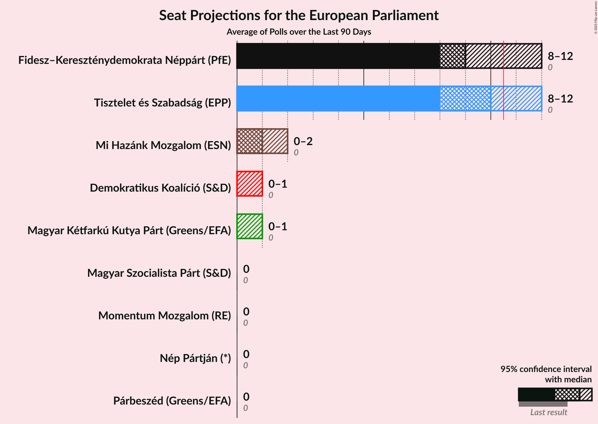

# Poll Average

<a href="#voting-intentions">Voting Intentions</a> | <a href="#seats">Seats</a> | <a href="#coalitions">Coalitions</a> | <a href="#technical-information">Technical Information</a>

## Summary

The table below lists the polls on which the average is based. They are the most recent polls (less than 90 days old) registered and analyzed so far.

| Period     | Polling firm/Commissioner(s) | Fidesz–KDNP | Jobbik | MSZP | DK | Párbeszéd | Együtt | LMP | MLP | MKKP | MM |
|:----------:|:----------------------------:|:--:|:--:|:--:|:--:|:--:|:--:|:--:|:--:|:--:|:--:|
| 25 May 2014 | General Election | 51.5%   12 | 14.7%   3 | 10.9%   2 | 9.8%   2 | 7.2%   1 | 7.2%   0 | 5.0%   1 | 0.0%   0 | 0.0%   0 | 0.0%   0 |
| N/A | Poll Average | 43–64%   10–15 | 10–25%   2–6 | 6–20%   1–4 | 4–10%   1–2 | 0–3%   0 | 0–3%   0 | 4–10%   1–2 | 0–1%   0 | 0–3%   0 | 0–5%   0–1 |
| [7–14 March 2018](2018-03-14-ZRIZáveczResearch.html) | ZRI Závecz Research | 44–50%   11–12 | 17–22%   4 | 11–15%   2–3 | 6–10%   1–2 | N/A   N/A | 1–2%   0 | 5–8%   1 | N/A   N/A | 1–3%   0 | 2–4%   0–1 |
| [9–14 March 2018](2018-03-14-PublicusResearch.html) | Publicus Research | 46–52%   11 | 15–19%   3 | 16–20%   4 | 4–7%   1 | N/A   N/A | 1–2%   0 | 6–10%   2 | 0–1%   0 | 1–2%   0 | 1–2%   0 |
| [2–7 March 2018](2018-03-07-Medián.html) | Medián   hvg.hu | 51–57%   12 | 14–18%   3 | 10–14%   3 | 7–11%   2 | N/A   N/A | 1–3%   0 | 4–6%   1 | N/A   N/A | 0–1%   0 | 1–3%   0 |
| [1–5 March 2018](2018-03-05-NézőpontIntézet.html) | Nézőpont Intézet | 49–55%   12 | 15–19%   3–4 | 8–12%   2 | 5–8%   1 | N/A   N/A | 0–1%   0 | 7–11%   2 | N/A   N/A | 1–3%   0 | 3–5%   0–1 |
| [26–28 February 2018](2018-02-28-SzázadvégAlapítvány.html) | Századvég Alapítvány | 50–56%   11–13 | 9–13%   2 | 12–16%   3 | 5–8%   1 | N/A   N/A | 1–2%   0 | 6–10%   1–2 | N/A   N/A | 0–1%   0 | 0–1%   0 |
| [1–28 February 2018](2018-02-28-IránytűIntézet.html) | Iránytű Intézet   Magyar Nemzet | 41–47%   10–11 | 21–27%   5–6 | 9–13%   2–3 | 6–10%   1–2 | 0–1%   0 | 0–1%   0 | 6–10%   1–2 | 0–1%   0 | 0–1%   0 | 3–5%   0 |
| [9–22 February 2018](2018-02-22-RepublikonIntézet.html) | Republikon Intézet   24.hu | 47–53%   10–12 | 17–22%   3–5 | 15–20%   3–4 | 5–8%   1–2 | N/A   N/A | 0–1%   0 | 4–7%   0–1 | N/A   N/A | 0–1%   0 | 0–1%   0 |
| [11–23 January 2018](2018-01-23-TÁRKI.html) | TÁRKI | 60–66%   14–15 | 12–16%   3 | 6–9%   1–2 | 5–8%   1–2 | 1–3%   0 | 1–3%   0 | 3–5%   0–1 | 0–1%   0 | 0–1%   0 | 1–2%   0 |
| 25 May 2014 | General Election | 51.5%   12 | 14.7%   3 | 10.9%   2 | 9.8%   2 | 7.2%   1 | 7.2%   0 | 5.0%   1 | 0.0%   0 | 0.0%   0 | 0.0%   0 |

Only polls for which at least the sample size has been published are included in the table above.

**Legend:**
+ **Top half of each row:** Voting intentions (95% confidence interval)
+ **Bottom half of each row:** Seat projections for the European Parliament (95% confidence interval)
+ **Fidesz–KDNP:** Fidesz–KDNP (EPP)
+ **Jobbik:** Jobbik (NI)
+ **MSZP:** MSZP (S&D)
+ **DK:** DK (S&D)
+ **Párbeszéd:** Párbeszéd (Greens/EFA)
+ **Együtt:** Együtt (Greens/EFA)
+ **LMP:** LMP (Greens/EFA)
+ **MLP:** MLP (ALDE)
+ **MKKP:** MKKP (*)
+ **MM:** MM (ALDE)
+ **N/A (single party):** Party not included the published results
+ **N/A (entire row):** Calculation for this opinion poll not started yet

## Voting Intentions

### Confidence Intervals

| Party | Last Result | Median | 80% Confidence Interval | 90% Confidence Interval | 95% Confidence Interval | 99% Confidence Interval |
|:-----:|:-----------:|:------:|:-----------------------:|:-----------------------:|:-----------------------:|:-----------------------:|
| <a href="#fidesz–kdnp-(epp)">Fidesz–KDNP (EPP)</a> | 51.5% | 50.8% | 44.8–61.4% |43.5–63.1% | 42.6–64.0% | 41.2–65.4% |
| <a href="#jobbik-(ni)">Jobbik (NI)</a> | 14.7% | 17.1% | 11.8–22.9% |10.7–24.3% | 10.1–25.1% | 9.3–26.3% |
| <a href="#mszp-(s&d)">MSZP (S&D)</a> | 10.9% | 12.5% | 7.9–18.2% |7.0–18.9% | 6.5–19.5% | 5.8–20.4% |
| <a href="#dk-(s&d)">DK (S&D)</a> | 9.8% | 6.6% | 5.1–9.0% |4.7–9.5% | 4.4–9.8% | 3.9–10.6% |
| <a href="#párbeszéd-(greens/efa)">Párbeszéd (Greens/EFA)</a> | 7.2% | 1.0% | 0.2–2.4% |0.1–2.7% | 0.1–2.9% | 0.0–3.2% |
| <a href="#együtt-(greens/efa)">Együtt (Greens/EFA)</a> | 7.2% | 0.9% | 0.2–2.2% |0.1–2.4% | 0.1–2.6% | 0.1–3.0% |
| <a href="#lmp-(greens/efa)">LMP (Greens/EFA)</a> | 5.0% | 6.8% | 4.3–9.1% |3.9–9.6% | 3.6–10.0% | 3.1–10.8% |
| <a href="#mlp-(alde)">MLP (ALDE)</a> | 0.0% | 0.3% | 0.1–0.6% |0.1–0.7% | 0.1–0.8% | 0.0–1.0% |
| <a href="#mkkp-(*)">MKKP (*)</a> | 0.0% | 0.5% | 0.2–2.2% |0.1–2.5% | 0.1–2.7% | 0.1–3.1% |
| <a href="#mm-(alde)">MM (ALDE)</a> | 0.0% | 1.6% | 0.3–4.2% |0.2–4.6% | 0.1–4.9% | 0.1–5.5% |

### Fidesz–KDNP (EPP)

*For a full overview of the results for this party, see the [Fidesz–KDNP (EPP)](party-fidesz–kdnpepp.html) page.*

| Voting Intentions | Probability | Accumulated | Special Marks |
|:-----------------:|:-----------:|:-----------:|:-------------:|
| 38.5–39.5% | 0% | 100% |  |
| 39.5–40.5% | 0.2% | 100% |  |
| 40.5–41.5% | 0.6% | 99.8% |  |
| 41.5–42.5% | 2% | 99.2% |  |
| 42.5–43.5% | 3% | 98% |  |
| 43.5–44.5% | 4% | 95% |  |
| 44.5–45.5% | 4% | 91% |  |
| 45.5–46.5% | 5% | 87% |  |
| 46.5–47.5% | 6% | 82% |  |
| 47.5–48.5% | 7% | 76% |  |
| 48.5–49.5% | 8% | 69% |  |
| 49.5–50.5% | 9% | 61% |  |
| 50.5–51.5% | 9% | 52% | Last Result, Median |
| 51.5–52.5% | 9% | 43% |  |
| 52.5–53.5% | 9% | 34% |  |
| 53.5–54.5% | 7% | 25% |  |
| 54.5–55.5% | 4% | 18% |  |
| 55.5–56.5% | 1.4% | 14% |  |
| 56.5–57.5% | 0.4% | 13% |  |
| 57.5–58.5% | 0.1% | 13% |  |
| 58.5–59.5% | 0.2% | 12% |  |
| 59.5–60.5% | 0.7% | 12% |  |
| 60.5–61.5% | 2% | 12% |  |
| 61.5–62.5% | 3% | 10% |  |
| 62.5–63.5% | 3% | 7% |  |
| 63.5–64.5% | 2% | 4% |  |
| 64.5–65.5% | 1.0% | 1.4% |  |
| 65.5–66.5% | 0.3% | 0.4% |  |
| 66.5–67.5% | 0.1% | 0.1% |  |
| 67.5–68.5% | 0% | 0% |  |

### Jobbik (NI)

*For a full overview of the results for this party, see the [Jobbik (NI)](party-jobbikni.html) page.*

| Voting Intentions | Probability | Accumulated | Special Marks |
|:-----------------:|:-----------:|:-----------:|:-------------:|
| 7.5–8.5% | 0.1% | 100% |  |
| 8.5–9.5% | 0.8% | 99.9% |  |
| 9.5–10.5% | 3% | 99.1% |  |
| 10.5–11.5% | 5% | 96% |  |
| 11.5–12.5% | 3% | 91% |  |
| 12.5–13.5% | 4% | 87% |  |
| 13.5–14.5% | 6% | 84% |  |
| 14.5–15.5% | 9% | 78% | Last Result |
| 15.5–16.5% | 12% | 69% |  |
| 16.5–17.5% | 12% | 57% | Median |
| 17.5–18.5% | 11% | 45% |  |
| 18.5–19.5% | 9% | 34% |  |
| 19.5–20.5% | 7% | 25% |  |
| 20.5–21.5% | 4% | 18% |  |
| 21.5–22.5% | 3% | 14% |  |
| 22.5–23.5% | 3% | 11% |  |
| 23.5–24.5% | 4% | 8% |  |
| 24.5–25.5% | 3% | 4% |  |
| 25.5–26.5% | 1.1% | 1.5% |  |
| 26.5–27.5% | 0.3% | 0.4% |  |
| 27.5–28.5% | 0.1% | 0.1% |  |
| 28.5–29.5% | 0% | 0% |  |

### MSZP (S&D)

*For a full overview of the results for this party, see the [MSZP (S&D)](party-mszpsd.html) page.*

| Voting Intentions | Probability | Accumulated | Special Marks |
|:-----------------:|:-----------:|:-----------:|:-------------:|
| 3.5–4.5% | 0% | 100% |  |
| 4.5–5.5% | 0.2% | 100% |  |
| 5.5–6.5% | 3% | 99.8% |  |
| 6.5–7.5% | 6% | 97% |  |
| 7.5–8.5% | 4% | 92% |  |
| 8.5–9.5% | 4% | 88% |  |
| 9.5–10.5% | 9% | 83% |  |
| 10.5–11.5% | 12% | 74% | Last Result |
| 11.5–12.5% | 13% | 62% | Median |
| 12.5–13.5% | 11% | 49% |  |
| 13.5–14.5% | 8% | 38% |  |
| 14.5–15.5% | 4% | 30% |  |
| 15.5–16.5% | 4% | 26% |  |
| 16.5–17.5% | 7% | 22% |  |
| 17.5–18.5% | 8% | 15% |  |
| 18.5–19.5% | 5% | 7% |  |
| 19.5–20.5% | 2% | 2% |  |
| 20.5–21.5% | 0.4% | 0.4% |  |
| 21.5–22.5% | 0% | 0% |  |
| 22.5–23.5% | 0% | 0% |  |

### DK (S&D)

*For a full overview of the results for this party, see the [DK (S&D)](party-dksd.html) page.*

| Voting Intentions | Probability | Accumulated | Special Marks |
|:-----------------:|:-----------:|:-----------:|:-------------:|
| 1.5–2.5% | 0% | 100% |  |
| 2.5–3.5% | 0.1% | 100% |  |
| 3.5–4.5% | 3% | 99.9% |  |
| 4.5–5.5% | 17% | 96% |  |
| 5.5–6.5% | 28% | 80% |  |
| 6.5–7.5% | 19% | 52% | Median |
| 7.5–8.5% | 16% | 32% |  |
| 8.5–9.5% | 12% | 16% |  |
| 9.5–10.5% | 4% | 4% | Last Result |
| 10.5–11.5% | 0.5% | 0.5% |  |
| 11.5–12.5% | 0% | 0% |  |

### Együtt (Greens/EFA)

*For a full overview of the results for this party, see the [Együtt (Greens/EFA)](party-együttgreensefa.html) page.*

| Voting Intentions | Probability | Accumulated | Special Marks |
|:-----------------:|:-----------:|:-----------:|:-------------:|
| 0.0–0.5% | 34% | 100% |  |
| 0.5–1.5% | 40% | 66% | Median |
| 1.5–2.5% | 22% | 26% |  |
| 2.5–3.5% | 3% | 3% |  |
| 3.5–4.5% | 0% | 0% |  |
| 4.5–5.5% | 0% | 0% |  |
| 5.5–6.5% | 0% | 0% |  |
| 6.5–7.5% | 0% | 0% | Last Result |

### Párbeszéd (Greens/EFA)

*For a full overview of the results for this party, see the [Párbeszéd (Greens/EFA)](party-párbeszédgreensefa.html) page.*

| Voting Intentions | Probability | Accumulated | Special Marks |
|:-----------------:|:-----------:|:-----------:|:-------------:|
| 0.0–0.5% | 46% | 100% |  |
| 0.5–1.5% | 10% | 54% | Median |
| 1.5–2.5% | 37% | 44% |  |
| 2.5–3.5% | 7% | 7% |  |
| 3.5–4.5% | 0.1% | 0.1% |  |
| 4.5–5.5% | 0% | 0% |  |
| 5.5–6.5% | 0% | 0% |  |
| 6.5–7.5% | 0% | 0% | Last Result |

### LMP (Greens/EFA)

*For a full overview of the results for this party, see the [LMP (Greens/EFA)](party-lmpgreensefa.html) page.*

| Voting Intentions | Probability | Accumulated | Special Marks |
|:-----------------:|:-----------:|:-----------:|:-------------:|
| 1.5–2.5% | 0% | 100% |  |
| 2.5–3.5% | 2% | 100% |  |
| 3.5–4.5% | 12% | 98% |  |
| 4.5–5.5% | 19% | 86% | Last Result |
| 5.5–6.5% | 14% | 67% |  |
| 6.5–7.5% | 13% | 53% | Median |
| 7.5–8.5% | 20% | 40% |  |
| 8.5–9.5% | 14% | 20% |  |
| 9.5–10.5% | 5% | 5% |  |
| 10.5–11.5% | 0.8% | 0.9% |  |
| 11.5–12.5% | 0.1% | 0.1% |  |
| 12.5–13.5% | 0% | 0% |  |

### MKKP (*)

*For a full overview of the results for this party, see the [MKKP (*)](party-mkkp.html) page.*

| Voting Intentions | Probability | Accumulated | Special Marks |
|:-----------------:|:-----------:|:-----------:|:-------------:|
| 0.0–0.5% | 54% | 100% | Last Result, Median |
| 0.5–1.5% | 22% | 46% |  |
| 1.5–2.5% | 19% | 23% |  |
| 2.5–3.5% | 4% | 4% |  |
| 3.5–4.5% | 0.1% | 0.1% |  |
| 4.5–5.5% | 0% | 0% |  |

### MM (ALDE)

*For a full overview of the results for this party, see the [MM (ALDE)](party-mmalde.html) page.*

| Voting Intentions | Probability | Accumulated | Special Marks |
|:-----------------:|:-----------:|:-----------:|:-------------:|
| 0.0–0.5% | 22% | 100% | Last Result |
| 0.5–1.5% | 27% | 78% |  |
| 1.5–2.5% | 14% | 51% | Median |
| 2.5–3.5% | 15% | 37% |  |
| 3.5–4.5% | 17% | 23% |  |
| 4.5–5.5% | 5% | 6% |  |
| 5.5–6.5% | 0.4% | 0.4% |  |
| 6.5–7.5% | 0% | 0% |  |

### MLP (ALDE)

*For a full overview of the results for this party, see the [MLP (ALDE)](party-mlpalde.html) page.*

| Voting Intentions | Probability | Accumulated | Special Marks |
|:-----------------:|:-----------:|:-----------:|:-------------:|
| 0.0–0.5% | 88% | 100% | Last Result, Median |
| 0.5–1.5% | 12% | 12% |  |
| 1.5–2.5% | 0% | 0% |  |

## Seats

### Confidence Intervals

| Party | Last Result | Median | 80% Confidence Interval | 90% Confidence Interval | 95% Confidence Interval | 99% Confidence Interval |
|:-----:|:-----------:|:------:|:-----------------------:|:-----------------------:|:-----------------------:|:-----------------------:|
| <a href="#fidesz–kdnp-(epp)">Fidesz–KDNP (EPP)</a> | 12 | 12 | 10–15 |10–15 | 10–15 | 10–15 |
| <a href="#jobbik-(ni)">Jobbik (NI)</a> | 3 | 3 | 2–6 |2–6 | 2–6 | 2–6 |
| <a href="#mszp-(s&d)">MSZP (S&D)</a> | 2 | 3 | 1–4 |1–4 | 1–4 | 1–4 |
| <a href="#dk-(s&d)">DK (S&D)</a> | 2 | 1 | 1–2 |1–2 | 1–2 | 1–2 |
| <a href="#párbeszéd-(greens/efa)">Párbeszéd (Greens/EFA)</a> | 1 | 0 | 0 |0 | 0 | 0 |
| <a href="#együtt-(greens/efa)">Együtt (Greens/EFA)</a> | 0 | 0 | 0 |0 | 0 | 0 |
| <a href="#lmp-(greens/efa)">LMP (Greens/EFA)</a> | 1 | 1 | 1–2 |1–2 | 1–2 | 0–2 |
| <a href="#mlp-(alde)">MLP (ALDE)</a> | 0 | 0 | 0 |0 | 0 | 0 |
| <a href="#mkkp-(*)">MKKP (*)</a> | 0 | 0 | 0 |0 | 0 | 0 |
| <a href="#mm-(alde)">MM (ALDE)</a> | 0 | 0 | 0–1 |0–1 | 0–1 | 0–1 |

### Fidesz–KDNP (EPP)

*For a full overview of the results for this party, see the [Fidesz–KDNP (EPP)](party-fidesz–kdnpepp.html) page.*

| Number of Seats | Probability | Accumulated | Special Marks |
|:---------------:|:-----------:|:-----------:|:-------------:|
| 10 | 11% | 100% |  |
| 11 | 24% | 89% | Majority |
| 12 | 43% | 65% | Last Result, Median |
| 13 | 10% | 23% |  |
| 14 | 0.4% | 12% |  |
| 15 | 12% | 12% |  |
| 16 | 0.2% | 0.2% |  |
| 17 | 0% | 0% |  |

### Jobbik (NI)

*For a full overview of the results for this party, see the [Jobbik (NI)](party-jobbikni.html) page.*

| Number of Seats | Probability | Accumulated | Special Marks |
|:---------------:|:-----------:|:-----------:|:-------------:|
| 1 | 0.1% | 100% |  |
| 2 | 13% | 99.9% |  |
| 3 | 60% | 87% | Last Result, Median |
| 4 | 14% | 28% |  |
| 5 | 4% | 14% |  |
| 6 | 10% | 10% |  |
| 7 | 0% | 0% |  |

### MSZP (S&D)

*For a full overview of the results for this party, see the [MSZP (S&D)](party-mszpsd.html) page.*

| Number of Seats | Probability | Accumulated | Special Marks |
|:---------------:|:-----------:|:-----------:|:-------------:|
| 1 | 12% | 100% |  |
| 2 | 29% | 88% | Last Result |
| 3 | 35% | 59% | Median |
| 4 | 24% | 24% |  |
| 5 | 0% | 0% |  |

### DK (S&D)

*For a full overview of the results for this party, see the [DK (S&D)](party-dksd.html) page.*

| Number of Seats | Probability | Accumulated | Special Marks |
|:---------------:|:-----------:|:-----------:|:-------------:|
| 0 | 0.2% | 100% |  |
| 1 | 82% | 99.8% | Median |
| 2 | 18% | 18% | Last Result |
| 3 | 0% | 0% |  |

### Együtt (Greens/EFA)

*For a full overview of the results for this party, see the [Együtt (Greens/EFA)](party-együttgreensefa.html) page.*

| Number of Seats | Probability | Accumulated | Special Marks |
|:---------------:|:-----------:|:-----------:|:-------------:|
| 0 | 100% | 100% | Last Result, Median |

### Párbeszéd (Greens/EFA)

*For a full overview of the results for this party, see the [Párbeszéd (Greens/EFA)](party-párbeszédgreensefa.html) page.*

| Number of Seats | Probability | Accumulated | Special Marks |
|:---------------:|:-----------:|:-----------:|:-------------:|
| 0 | 100% | 100% | Median |
| 1 | 0% | 0% | Last Result |

### LMP (Greens/EFA)

*For a full overview of the results for this party, see the [LMP (Greens/EFA)](party-lmpgreensefa.html) page.*

| Number of Seats | Probability | Accumulated | Special Marks |
|:---------------:|:-----------:|:-----------:|:-------------:|
| 0 | 1.0% | 100% |  |
| 1 | 62% | 99.0% | Last Result, Median |
| 2 | 37% | 37% |  |
| 3 | 0% | 0% |  |

### MKKP (*)

*For a full overview of the results for this party, see the [MKKP (*)](party-mkkp.html) page.*

| Number of Seats | Probability | Accumulated | Special Marks |
|:---------------:|:-----------:|:-----------:|:-------------:|
| 0 | 100% | 100% | Last Result, Median |

### MM (ALDE)

*For a full overview of the results for this party, see the [MM (ALDE)](party-mmalde.html) page.*

| Number of Seats | Probability | Accumulated | Special Marks |
|:---------------:|:-----------:|:-----------:|:-------------:|
| 0 | 79% | 100% | Last Result, Median |
| 1 | 21% | 21% |  |
| 2 | 0% | 0% |  |

### MLP (ALDE)

*For a full overview of the results for this party, see the [MLP (ALDE)](party-mlpalde.html) page.*

| Number of Seats | Probability | Accumulated | Special Marks |
|:---------------:|:-----------:|:-----------:|:-------------:|
| 0 | 100% | 100% | Last Result, Median |

## Coalitions

### Confidence Intervals

| Coalition | Last Result | Median | Majority? | 80% Confidence Interval | 90% Confidence Interval | 95% Confidence Interval | 99% Confidence Interval |
|:---------:|:-----------:|:------:|:---------:|:-----------------------:|:-----------------------:|:-----------------------:|:-----------------------:|
| Fidesz–KDNP (EPP) | 12 | 12 | 89% | 10–15 | 10–15 | 10–15 | 10–15 |
| Jobbik (NI) | 3 | 3 | 0% | 2–6 | 2–6 | 2–6 | 2–6 |
| MSZP (S&D) – DK (S&D) | 4 | 4 | 0% | 2–5 | 2–5 | 2–5 | 2–5 |
| Együtt (Greens/EFA) – Párbeszéd (Greens/EFA) – LMP (Greens/EFA) | 2 | 1 | 0% | 1–2 | 1–2 | 1–2 | 0–2 |
| MLP (ALDE) – MM (ALDE) | 0 | 0 | 0% | 0–1 | 0–1 | 0–1 | 0–1 |

### Fidesz–KDNP (EPP)

| Number of Seats | Probability | Accumulated | Special Marks |
|:---------------:|:-----------:|:-----------:|:-------------:|
| 10 | 11% | 100% |  |
| 11 | 24% | 89% | Majority |
| 12 | 43% | 65% | Last Result, Median |
| 13 | 10% | 23% |  |
| 14 | 0.4% | 12% |  |
| 15 | 12% | 12% |  |
| 16 | 0.2% | 0.2% |  |
| 17 | 0% | 0% |  |

### Jobbik (NI)

| Number of Seats | Probability | Accumulated | Special Marks |
|:---------------:|:-----------:|:-----------:|:-------------:|
| 1 | 0.1% | 100% |  |
| 2 | 13% | 99.9% |  |
| 3 | 60% | 87% | Last Result, Median |
| 4 | 14% | 28% |  |
| 5 | 4% | 14% |  |
| 6 | 10% | 10% |  |
| 7 | 0% | 0% |  |

### MSZP (S&D) – DK (S&D)

| Number of Seats | Probability | Accumulated | Special Marks |
|:---------------:|:-----------:|:-----------:|:-------------:|
| 2 | 12% | 100% |  |
| 3 | 28% | 88% |  |
| 4 | 19% | 59% | Last Result, Median |
| 5 | 41% | 41% |  |
| 6 | 0.1% | 0.1% |  |
| 7 | 0% | 0% |  |

### Együtt (Greens/EFA) – Párbeszéd (Greens/EFA) – LMP (Greens/EFA)

| Number of Seats | Probability | Accumulated | Special Marks |
|:---------------:|:-----------:|:-----------:|:-------------:|
| 0 | 1.0% | 100% |  |
| 1 | 62% | 99.0% | Median |
| 2 | 37% | 37% | Last Result |
| 3 | 0% | 0% |  |

### MLP (ALDE) – MM (ALDE)

| Number of Seats | Probability | Accumulated | Special Marks |
|:---------------:|:-----------:|:-----------:|:-------------:|
| 0 | 79% | 100% | Last Result, Median |
| 1 | 21% | 21% |  |
| 2 | 0% | 0% |  |

## Technical Information

