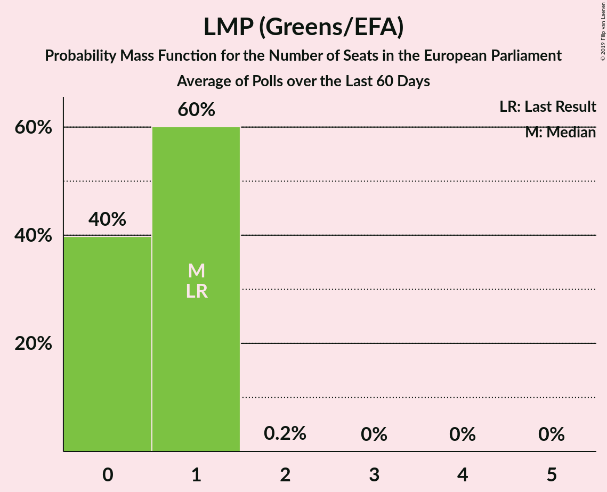
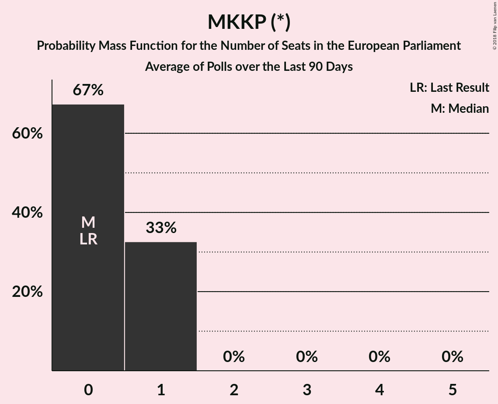

# Poll Average

<a href="#voting-intentions">Voting Intentions</a> | <a href="#seats">Seats</a> | <a href="#coalitions">Coalitions</a> | <a href="#technical-information">Technical Information</a>

## Summary

The table below lists the polls on which the average is based. They are the most recent polls (less than 90 days old) registered and analyzed so far.

| Period     | Polling firm/Commissioner(s) | Fidesz–KDNP | Jobbik | MSZP | DK | Párbeszéd | Együtt | LMP | MLP | MKKP | MM |
|:----------:|:----------------------------:|:--:|:--:|:--:|:--:|:--:|:--:|:--:|:--:|:--:|:--:|
| 25 May 2014 | General Election | 51.5%   12 | 14.7%   3 | 10.9%   2 | 9.8%   2 | 7.2%   1 | 7.2%   0 | 5.0%   1 | 0.0%   0 | 0.0%   0 | 0.0%   0 |
| N/A | Poll Average | 39–64%   9–15 | 12–26%   2–6 | 6–18%   1–4 | 4–9%   1–2 | 1–3%   0 | 0–3%   0 | 3–9%   0–2 | 0–1%   0 | 0–3%   0 | 1–4%   0–1 |
| [28 March–3 April 2018](2018-04-03-PublicusResearch.html) | Publicus Research | N/A   N/A | N/A   N/A | N/A   N/A | N/A   N/A | N/A   N/A | N/A   N/A | N/A   N/A | N/A   N/A | N/A   N/A | N/A   N/A |
| [1–31 March 2018](2018-03-31-SzázadvégAlapítvány.html) | Századvég Alapítvány | 48–54%   11–13 | 11–15%   2–3 | 13–17%   3–4 | 5–8%   1 | N/A   N/A | 1–2%   0 | 6–9%   1–2 | N/A   N/A | N/A   N/A | N/A   N/A |
| [23–27 March 2018](2018-03-27-Medián.html) | Medián   hvg.hu | 50–56%   12–14 | 14–18%   3–4 | 10–14%   2–3 | 5–7%   1 | N/A   N/A | 1–2%   0 | 6–9%   1–2 | 0–1%   0 | 1–3%   0 | 1–3%   0 |
| [21–24 March 2018](2018-03-24-IránytűIntézet.html) | Iránytű Intézet   Magyar Nemzet | 38–44%   9–11 | 22–28%   5–7 | 10–14%   2–3 | 6–9%   1–2 | N/A   N/A | 0–1%   0 | 6–10%   1–2 | 0–1%   0 | 1–3%   0 | 2–4%   0–1 |
| [10–23 March 2018](2018-03-23-RepublikonIntézet.html) | Republikon Intézet   24.hu | 46–52%   11–13 | 17–22%   4–5 | 15–19%   3–4 | 4–7%   0–1 | N/A   N/A | 1–3%   0 | 3–5%   0–1 | N/A   N/A | 0–1%   0 | 1–3%   0 |
| [3–19 March 2018](2018-03-19-NézőpontIntézet.html) | Nézőpont Intézet | 49–55%   11–13 | 13–17%   3–4 | 9–13%   2–3 | 6–10%   1–2 | N/A   N/A | 0–1%   0 | 6–10%   1–2 | 0–1%   0 | 1–3%   0 | 2–4%   0–1 |
| [7–14 March 2018](2018-03-14-ZRIZáveczResearch.html) | ZRI Závecz Research | 44–50%   10–12 | 17–22%   4–5 | 11–15%   2–3 | 6–10%   1–2 | N/A   N/A | 1–2%   0 | 5–8%   1 | N/A   N/A | 1–3%   0 | 2–4%   0–1 |
| [11–23 January 2018](2018-01-23-TÁRKI.html) | TÁRKI | 60–66%   14–16 | 12–16%   2–4 | 6–9%   1–2 | 5–8%   1 | 1–3%   0 | 1–3%   0 | 3–5%   0–1 | 0–1%   0 | 0–1%   0 | 1–2%   0 |
| 25 May 2014 | General Election | 51.5%   12 | 14.7%   3 | 10.9%   2 | 9.8%   2 | 7.2%   1 | 7.2%   0 | 5.0%   1 | 0.0%   0 | 0.0%   0 | 0.0%   0 |

Only polls for which at least the sample size has been published are included in the table above.

**Legend:**
+ **Top half of each row:** Voting intentions (95% confidence interval)
+ **Bottom half of each row:** Seat projections for the European Parliament (95% confidence interval)
+ **Fidesz–KDNP:** Fidesz–KDNP (EPP)
+ **Jobbik:** Jobbik (NI)
+ **MSZP:** MSZP (S&D)
+ **DK:** DK (S&D)
+ **Párbeszéd:** Párbeszéd (Greens/EFA)
+ **Együtt:** Együtt (Greens/EFA)
+ **LMP:** LMP (Greens/EFA)
+ **MLP:** MLP (ALDE)
+ **MKKP:** MKKP (*)
+ **MM:** MM (ALDE)
+ **N/A (single party):** Party not included the published results
+ **N/A (entire row):** Calculation for this opinion poll not started yet

## Voting Intentions

### Confidence Intervals

| Party | Last Result | Median | 80% Confidence Interval | 90% Confidence Interval | 95% Confidence Interval | 99% Confidence Interval |
|:-----:|:-----------:|:------:|:-----------------------:|:-----------------------:|:-----------------------:|:-----------------------:|
| <a href="#fidesz–kdnp-(epp)">Fidesz–KDNP (EPP)</a> | 51.5% | 50.5% | 41.6–61.9% |40.2–63.3% | 39.4–64.1% | 38.0–65.5% |
| <a href="#jobbik-(ni)">Jobbik (NI)</a> | 14.7% | 16.4% | 13.1–24.2% |12.5–25.5% | 12.0–26.2% | 11.2–27.5% |
| <a href="#mszp-(s&d)">MSZP (S&D)</a> | 10.9% | 12.4% | 7.6–16.7% |6.9–17.6% | 6.4–18.2% | 5.8–19.3% |
| <a href="#dk-(s&d)">DK (S&D)</a> | 9.8% | 6.5% | 5.0–8.5% |4.7–8.9% | 4.4–9.3% | 3.9–10.0% |
| <a href="#párbeszéd-(greens/efa)">Párbeszéd (Greens/EFA)</a> | 7.2% | 2.0% | 1.5–2.7% |1.4–2.9% | 1.3–3.0% | 1.1–3.4% |
| <a href="#együtt-(greens/efa)">Együtt (Greens/EFA)</a> | 7.2% | 1.1% | 0.2–2.2% |0.1–2.5% | 0.1–2.7% | 0.1–3.1% |
| <a href="#lmp-(greens/efa)">LMP (Greens/EFA)</a> | 5.0% | 6.7% | 3.8–8.5% |3.5–8.9% | 3.3–9.3% | 2.9–10.0% |
| <a href="#mlp-(alde)">MLP (ALDE)</a> | 0.0% | 0.3% | 0.1–0.6% |0.1–0.7% | 0.1–0.8% | 0.0–1.0% |
| <a href="#mkkp-(*)">MKKP (*)</a> | 0.0% | 1.8% | 0.2–2.6% |0.2–2.8% | 0.1–2.9% | 0.1–3.3% |
| <a href="#mm-(alde)">MM (ALDE)</a> | 0.0% | 2.5% | 1.1–3.5% |0.9–3.8% | 0.8–4.0% | 0.6–4.5% |

### Fidesz–KDNP (EPP)

*For a full overview of the results for this party, see the [Fidesz–KDNP (EPP)](party-fidesz–kdnpepp.html) page.*

| Voting Intentions | Probability | Accumulated | Special Marks |
|:-----------------:|:-----------:|:-----------:|:-------------:|
| 35.5–36.5% | 0% | 100% |  |
| 36.5–37.5% | 0.2% | 100% |  |
| 37.5–38.5% | 0.8% | 99.8% |  |
| 38.5–39.5% | 2% | 99.0% |  |
| 39.5–40.5% | 3% | 97% |  |
| 40.5–41.5% | 4% | 94% |  |
| 41.5–42.5% | 3% | 90% |  |
| 42.5–43.5% | 1.5% | 88% |  |
| 43.5–44.5% | 1.1% | 86% |  |
| 44.5–45.5% | 2% | 85% |  |
| 45.5–46.5% | 4% | 83% |  |
| 46.5–47.5% | 6% | 79% |  |
| 47.5–48.5% | 7% | 74% |  |
| 48.5–49.5% | 8% | 67% |  |
| 49.5–50.5% | 9% | 59% |  |
| 50.5–51.5% | 10% | 50% | Last Result, Median |
| 51.5–52.5% | 10% | 39% |  |
| 52.5–53.5% | 8% | 29% |  |
| 53.5–54.5% | 5% | 21% |  |
| 54.5–55.5% | 2% | 17% |  |
| 55.5–56.5% | 0.5% | 15% |  |
| 56.5–57.5% | 0.1% | 14% |  |
| 57.5–58.5% | 0% | 14% |  |
| 58.5–59.5% | 0.2% | 14% |  |
| 59.5–60.5% | 0.8% | 14% |  |
| 60.5–61.5% | 2% | 13% |  |
| 61.5–62.5% | 3% | 11% |  |
| 62.5–63.5% | 4% | 8% |  |
| 63.5–64.5% | 3% | 4% |  |
| 64.5–65.5% | 1.2% | 2% |  |
| 65.5–66.5% | 0.4% | 0.4% |  |
| 66.5–67.5% | 0.1% | 0.1% |  |
| 67.5–68.5% | 0% | 0% |  |

### Jobbik (NI)

*For a full overview of the results for this party, see the [Jobbik (NI)](party-jobbikni.html) page.*

| Voting Intentions | Probability | Accumulated | Special Marks |
|:-----------------:|:-----------:|:-----------:|:-------------:|
| 8.5–9.5% | 0% | 100% |  |
| 9.5–10.5% | 0.1% | 100% |  |
| 10.5–11.5% | 1.0% | 99.9% |  |
| 11.5–12.5% | 4% | 98.9% |  |
| 12.5–13.5% | 10% | 94% |  |
| 13.5–14.5% | 13% | 85% |  |
| 14.5–15.5% | 13% | 72% | Last Result |
| 15.5–16.5% | 10% | 59% | Median |
| 16.5–17.5% | 7% | 48% |  |
| 17.5–18.5% | 8% | 41% |  |
| 18.5–19.5% | 9% | 33% |  |
| 19.5–20.5% | 6% | 24% |  |
| 20.5–21.5% | 3% | 18% |  |
| 21.5–22.5% | 1.1% | 15% |  |
| 22.5–23.5% | 2% | 14% |  |
| 23.5–24.5% | 3% | 12% |  |
| 24.5–25.5% | 4% | 9% |  |
| 25.5–26.5% | 3% | 5% |  |
| 26.5–27.5% | 1.3% | 2% |  |
| 27.5–28.5% | 0.4% | 0.4% |  |
| 28.5–29.5% | 0.1% | 0.1% |  |
| 29.5–30.5% | 0% | 0% |  |

### MSZP (S&D)

*For a full overview of the results for this party, see the [MSZP (S&D)](party-mszpsd.html) page.*

| Voting Intentions | Probability | Accumulated | Special Marks |
|:-----------------:|:-----------:|:-----------:|:-------------:|
| 3.5–4.5% | 0% | 100% |  |
| 4.5–5.5% | 0.2% | 100% |  |
| 5.5–6.5% | 3% | 99.8% |  |
| 6.5–7.5% | 7% | 97% |  |
| 7.5–8.5% | 4% | 90% |  |
| 8.5–9.5% | 2% | 86% |  |
| 9.5–10.5% | 6% | 85% |  |
| 10.5–11.5% | 14% | 79% | Last Result |
| 11.5–12.5% | 18% | 65% | Median |
| 12.5–13.5% | 14% | 47% |  |
| 13.5–14.5% | 9% | 34% |  |
| 14.5–15.5% | 7% | 25% |  |
| 15.5–16.5% | 7% | 18% |  |
| 16.5–17.5% | 6% | 11% |  |
| 17.5–18.5% | 4% | 5% |  |
| 18.5–19.5% | 1.3% | 2% |  |
| 19.5–20.5% | 0.3% | 0.3% |  |
| 20.5–21.5% | 0% | 0% |  |

### DK (S&D)

*For a full overview of the results for this party, see the [DK (S&D)](party-dksd.html) page.*

| Voting Intentions | Probability | Accumulated | Special Marks |
|:-----------------:|:-----------:|:-----------:|:-------------:|
| 1.5–2.5% | 0% | 100% |  |
| 2.5–3.5% | 0.1% | 100% |  |
| 3.5–4.5% | 4% | 99.9% |  |
| 4.5–5.5% | 17% | 96% |  |
| 5.5–6.5% | 29% | 79% |  |
| 6.5–7.5% | 23% | 50% | Median |
| 7.5–8.5% | 17% | 26% |  |
| 8.5–9.5% | 7% | 9% |  |
| 9.5–10.5% | 1.3% | 1.4% | Last Result |
| 10.5–11.5% | 0.1% | 0.1% |  |
| 11.5–12.5% | 0% | 0% |  |

### Együtt (Greens/EFA)

*For a full overview of the results for this party, see the [Együtt (Greens/EFA)](party-együttgreensefa.html) page.*

| Voting Intentions | Probability | Accumulated | Special Marks |
|:-----------------:|:-----------:|:-----------:|:-------------:|
| 0.0–0.5% | 27% | 100% |  |
| 0.5–1.5% | 44% | 73% | Median |
| 1.5–2.5% | 25% | 29% |  |
| 2.5–3.5% | 4% | 4% |  |
| 3.5–4.5% | 0.1% | 0.1% |  |
| 4.5–5.5% | 0% | 0% |  |
| 5.5–6.5% | 0% | 0% |  |
| 6.5–7.5% | 0% | 0% | Last Result |

### Párbeszéd (Greens/EFA)

*For a full overview of the results for this party, see the [Párbeszéd (Greens/EFA)](party-párbeszédgreensefa.html) page.*

| Voting Intentions | Probability | Accumulated | Special Marks |
|:-----------------:|:-----------:|:-----------:|:-------------:|
| 0.0–0.5% | 0% | 100% |  |
| 0.5–1.5% | 12% | 100% |  |
| 1.5–2.5% | 74% | 88% | Median |
| 2.5–3.5% | 14% | 14% |  |
| 3.5–4.5% | 0.2% | 0.2% |  |
| 4.5–5.5% | 0% | 0% |  |
| 5.5–6.5% | 0% | 0% |  |
| 6.5–7.5% | 0% | 0% | Last Result |

### LMP (Greens/EFA)

*For a full overview of the results for this party, see the [LMP (Greens/EFA)](party-lmpgreensefa.html) page.*

| Voting Intentions | Probability | Accumulated | Special Marks |
|:-----------------:|:-----------:|:-----------:|:-------------:|
| 1.5–2.5% | 0.1% | 100% |  |
| 2.5–3.5% | 5% | 99.9% |  |
| 3.5–4.5% | 17% | 95% |  |
| 4.5–5.5% | 10% | 78% | Last Result |
| 5.5–6.5% | 15% | 68% |  |
| 6.5–7.5% | 24% | 53% | Median |
| 7.5–8.5% | 20% | 29% |  |
| 8.5–9.5% | 8% | 9% |  |
| 9.5–10.5% | 1.3% | 1.4% |  |
| 10.5–11.5% | 0.1% | 0.1% |  |
| 11.5–12.5% | 0% | 0% |  |

### MLP (ALDE)

*For a full overview of the results for this party, see the [MLP (ALDE)](party-mlpalde.html) page.*

| Voting Intentions | Probability | Accumulated | Special Marks |
|:-----------------:|:-----------:|:-----------:|:-------------:|
| 0.0–0.5% | 88% | 100% | Last Result, Median |
| 0.5–1.5% | 12% | 12% |  |
| 1.5–2.5% | 0% | 0% |  |

### MKKP (*)

*For a full overview of the results for this party, see the [MKKP (*)](party-mkkp.html) page.*

| Voting Intentions | Probability | Accumulated | Special Marks |
|:-----------------:|:-----------:|:-----------:|:-------------:|
| 0.0–0.5% | 29% | 100% | Last Result |
| 0.5–1.5% | 12% | 71% |  |
| 1.5–2.5% | 50% | 60% | Median |
| 2.5–3.5% | 10% | 10% |  |
| 3.5–4.5% | 0.2% | 0.2% |  |
| 4.5–5.5% | 0% | 0% |  |

### MM (ALDE)

*For a full overview of the results for this party, see the [MM (ALDE)](party-mmalde.html) page.*

| Voting Intentions | Probability | Accumulated | Special Marks |
|:-----------------:|:-----------:|:-----------:|:-------------:|
| 0.0–0.5% | 0.4% | 100% | Last Result |
| 0.5–1.5% | 18% | 99.6% |  |
| 1.5–2.5% | 34% | 81% | Median |
| 2.5–3.5% | 37% | 47% |  |
| 3.5–4.5% | 9% | 10% |  |
| 4.5–5.5% | 0.4% | 0.4% |  |
| 5.5–6.5% | 0% | 0% |  |

## Seats

### Confidence Intervals

| Party | Last Result | Median | 80% Confidence Interval | 90% Confidence Interval | 95% Confidence Interval | 99% Confidence Interval |
|:-----:|:-----------:|:------:|:-----------------------:|:-----------------------:|:-----------------------:|:-----------------------:|
| <a href="#fidesz–kdnp-(epp)">Fidesz–KDNP (EPP)</a> | 12 | 12 | 10–15 |10–15 | 9–15 | 9–16 |
| <a href="#jobbik-(ni)">Jobbik (NI)</a> | 3 | 4 | 3–6 |3–6 | 2–6 | 2–7 |
| <a href="#mszp-(s&d)">MSZP (S&D)</a> | 2 | 3 | 1–4 |1–4 | 1–4 | 1–4 |
| <a href="#dk-(s&d)">DK (S&D)</a> | 2 | 1 | 1–2 |1–2 | 1–2 | 0–2 |
| <a href="#párbeszéd-(greens/efa)">Párbeszéd (Greens/EFA)</a> | 1 | 0 | 0 |0 | 0 | 0 |
| <a href="#együtt-(greens/efa)">Együtt (Greens/EFA)</a> | 0 | 0 | 0 |0 | 0 | 0 |
| <a href="#lmp-(greens/efa)">LMP (Greens/EFA)</a> | 1 | 1 | 0–2 |0–2 | 0–2 | 0–2 |
| <a href="#mlp-(alde)">MLP (ALDE)</a> | 0 | 0 | 0 |0 | 0 | 0 |
| <a href="#mkkp-(*)">MKKP (*)</a> | 0 | 0 | 0 |0 | 0 | 0 |
| <a href="#mm-(alde)">MM (ALDE)</a> | 0 | 0 | 0 |0 | 0–1 | 0–1 |

### Fidesz–KDNP (EPP)

*For a full overview of the results for this party, see the [Fidesz–KDNP (EPP)](party-fidesz–kdnpepp.html) page.*

| Number of Seats | Probability | Accumulated | Special Marks |
|:---------------:|:-----------:|:-----------:|:-------------:|
| 9 | 3% | 100% |  |
| 10 | 10% | 97% |  |
| 11 | 17% | 87% | Majority |
| 12 | 35% | 69% | Last Result, Median |
| 13 | 19% | 34% |  |
| 14 | 2% | 15% |  |
| 15 | 12% | 14% |  |
| 16 | 2% | 2% |  |
| 17 | 0% | 0% |  |

### Jobbik (NI)

*For a full overview of the results for this party, see the [Jobbik (NI)](party-jobbikni.html) page.*

| Number of Seats | Probability | Accumulated | Special Marks |
|:---------------:|:-----------:|:-----------:|:-------------:|
| 2 | 4% | 100% |  |
| 3 | 42% | 96% | Last Result |
| 4 | 35% | 54% | Median |
| 5 | 7% | 20% |  |
| 6 | 11% | 12% |  |
| 7 | 1.2% | 1.2% |  |
| 8 | 0% | 0% |  |

### MSZP (S&D)

*For a full overview of the results for this party, see the [MSZP (S&D)](party-mszpsd.html) page.*

| Number of Seats | Probability | Accumulated | Special Marks |
|:---------------:|:-----------:|:-----------:|:-------------:|
| 1 | 13% | 100% |  |
| 2 | 32% | 87% | Last Result |
| 3 | 41% | 55% | Median |
| 4 | 13% | 13% |  |
| 5 | 0.1% | 0.1% |  |
| 6 | 0% | 0% |  |

### DK (S&D)

*For a full overview of the results for this party, see the [DK (S&D)](party-dksd.html) page.*

| Number of Seats | Probability | Accumulated | Special Marks |
|:---------------:|:-----------:|:-----------:|:-------------:|
| 0 | 0.9% | 100% |  |
| 1 | 82% | 99.1% | Median |
| 2 | 17% | 17% | Last Result |
| 3 | 0% | 0% |  |

### Együtt (Greens/EFA)

*For a full overview of the results for this party, see the [Együtt (Greens/EFA)](party-együttgreensefa.html) page.*

| Number of Seats | Probability | Accumulated | Special Marks |
|:---------------:|:-----------:|:-----------:|:-------------:|
| 0 | 100% | 100% | Last Result, Median |

### Párbeszéd (Greens/EFA)

*For a full overview of the results for this party, see the [Párbeszéd (Greens/EFA)](party-párbeszédgreensefa.html) page.*

| Number of Seats | Probability | Accumulated | Special Marks |
|:---------------:|:-----------:|:-----------:|:-------------:|
| 0 | 100% | 100% | Median |
| 1 | 0% | 0% | Last Result |

### LMP (Greens/EFA)

*For a full overview of the results for this party, see the [LMP (Greens/EFA)](party-lmpgreensefa.html) page.*

| Number of Seats | Probability | Accumulated | Special Marks |
|:---------------:|:-----------:|:-----------:|:-------------:|
| 0 | 11% | 100% |  |
| 1 | 68% | 89% | Last Result, Median |
| 2 | 21% | 21% |  |
| 3 | 0% | 0% |  |

### MLP (ALDE)

*For a full overview of the results for this party, see the [MLP (ALDE)](party-mlpalde.html) page.*

| Number of Seats | Probability | Accumulated | Special Marks |
|:---------------:|:-----------:|:-----------:|:-------------:|
| 0 | 100% | 100% | Last Result, Median |

### MKKP (*)

*For a full overview of the results for this party, see the [MKKP (*)](party-mkkp.html) page.*

| Number of Seats | Probability | Accumulated | Special Marks |
|:---------------:|:-----------:|:-----------:|:-------------:|
| 0 | 100% | 100% | Last Result, Median |

### MM (ALDE)

*For a full overview of the results for this party, see the [MM (ALDE)](party-mmalde.html) page.*

| Number of Seats | Probability | Accumulated | Special Marks |
|:---------------:|:-----------:|:-----------:|:-------------:|
| 0 | 97% | 100% | Last Result, Median |
| 1 | 3% | 3% |  |
| 2 | 0% | 0% |  |

## Coalitions

### Confidence Intervals

| Coalition | Last Result | Median | Majority? | 80% Confidence Interval | 90% Confidence Interval | 95% Confidence Interval | 99% Confidence Interval |
|:---------:|:-----------:|:------:|:---------:|:-----------------------:|:-----------------------:|:-----------------------:|:-----------------------:|
| Fidesz–KDNP (EPP) | 12 | 12 | 87% | 10–15 | 10–15 | 9–15 | 9–16 |
| Jobbik (NI) | 3 | 4 | 0% | 3–6 | 3–6 | 2–6 | 2–7 |
| MSZP (S&D) – DK (S&D) | 4 | 4 | 0% | 2–5 | 2–5 | 2–5 | 2–5 |
| Együtt (Greens/EFA) – Párbeszéd (Greens/EFA) – LMP (Greens/EFA) | 2 | 1 | 0% | 0–2 | 0–2 | 0–2 | 0–2 |
| MLP (ALDE) – MM (ALDE) | 0 | 0 | 0% | 0 | 0 | 0–1 | 0–1 |

### Fidesz–KDNP (EPP)

| Number of Seats | Probability | Accumulated | Special Marks |
|:---------------:|:-----------:|:-----------:|:-------------:|
| 9 | 3% | 100% |  |
| 10 | 10% | 97% |  |
| 11 | 17% | 87% | Majority |
| 12 | 35% | 69% | Last Result, Median |
| 13 | 19% | 34% |  |
| 14 | 2% | 15% |  |
| 15 | 12% | 14% |  |
| 16 | 2% | 2% |  |
| 17 | 0% | 0% |  |

### Jobbik (NI)

| Number of Seats | Probability | Accumulated | Special Marks |
|:---------------:|:-----------:|:-----------:|:-------------:|
| 2 | 4% | 100% |  |
| 3 | 42% | 96% | Last Result |
| 4 | 35% | 54% | Median |
| 5 | 7% | 20% |  |
| 6 | 11% | 12% |  |
| 7 | 1.2% | 1.2% |  |
| 8 | 0% | 0% |  |

### MSZP (S&D) – DK (S&D)

| Number of Seats | Probability | Accumulated | Special Marks |
|:---------------:|:-----------:|:-----------:|:-------------:|
| 2 | 13% | 100% |  |
| 3 | 24% | 87% |  |
| 4 | 43% | 63% | Last Result, Median |
| 5 | 20% | 20% |  |
| 6 | 0.2% | 0.2% |  |
| 7 | 0% | 0% |  |

### Együtt (Greens/EFA) – Párbeszéd (Greens/EFA) – LMP (Greens/EFA)

| Number of Seats | Probability | Accumulated | Special Marks |
|:---------------:|:-----------:|:-----------:|:-------------:|
| 0 | 11% | 100% |  |
| 1 | 68% | 89% | Median |
| 2 | 21% | 21% | Last Result |
| 3 | 0% | 0% |  |

### MLP (ALDE) – MM (ALDE)

| Number of Seats | Probability | Accumulated | Special Marks |
|:---------------:|:-----------:|:-----------:|:-------------:|
| 0 | 97% | 100% | Last Result, Median |
| 1 | 3% | 3% |  |
| 2 | 0% | 0% |  |

## Technical Information

