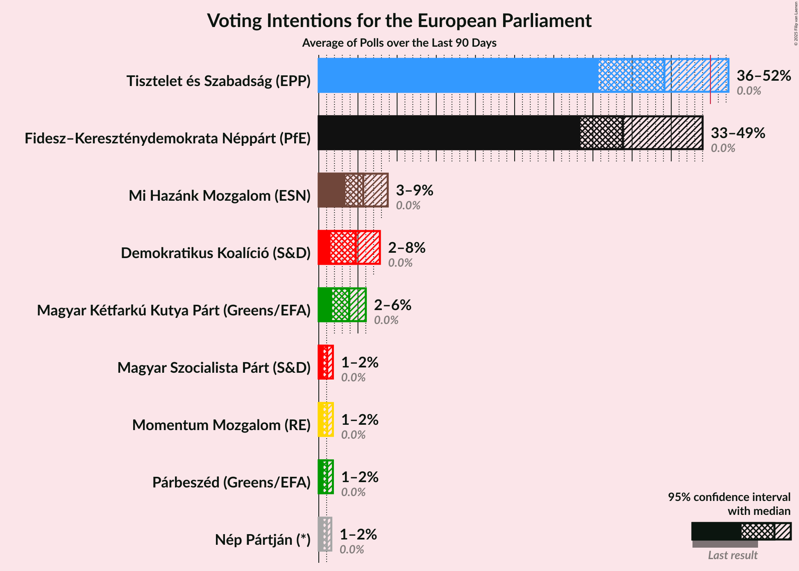
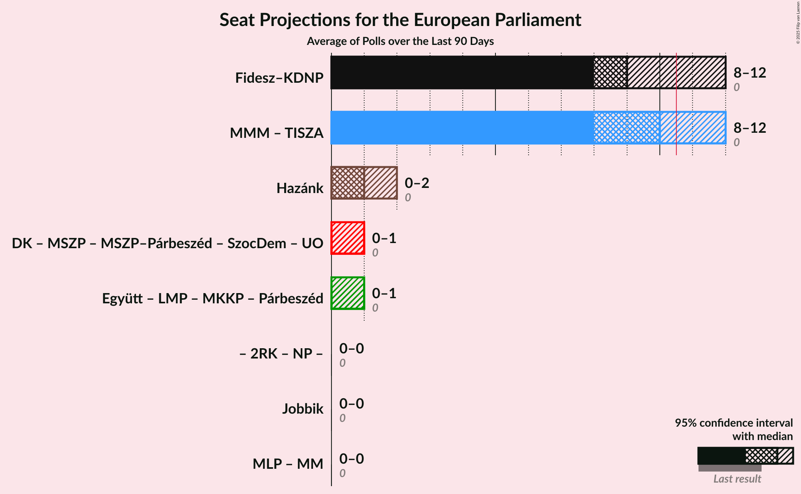

# Overview

The table below lists the most recent polls (less than 30 days old) registered and analyzed so far.

| Period     | Polling firm/Commissioner(s) | Fidesz–KDNP | Jobbik | MSZP | DK | Párbeszéd | Együtt | LMP | MLP | MKKP | MM | MSZP–Párbeszéd | Hazánk | UO | MMM | NP |
|:----------:|:----------------------------:|:--:|:--:|:--:|:--:|:--:|:--:|:--:|:--:|:--:|:--:|:--:|:--:|:--:|:--:|:--:|
| 26 May 2019 | General Election | 51.5%   12 | 14.7%   3 | 10.9%   2 | 9.8%   2 | 7.2%   1 | 7.2%   0 | 5.0%   1 | 0.0%   0 | 0.0%   0 | 0.0%   0 | 18.2%   3 | 0.0%   0 | 0.0%   0 | 0.0%   0 | 0.0%   0 |
| N/A | [Poll Average](average.html) | 40–53%   9–13 | 2–8%   0–2 | 2–5%   0–1 | 9–20%   2–5 | 0–3%   0 | N/A   N/A | 1–5%   0–1 | N/A   N/A | 4–9%   1–2 | 7–11%   1–2 | N/A   N/A | 7–12%   1–2 | N/A   N/A | 1–5%   0–1 | 2–5%   0–1 |
| [28 August–8 September 2023](2023-09-08-IDEAIntézet.html) | IDEA Intézet | 43–47%   10–12 | 1–3%   0 | 1–3%   0 | 17–21%   4–5 | 1–2%   0 | N/A   N/A | 1–3%   0 | N/A   N/A | 5–7%   1 | 7–9%   1–2 | N/A   N/A | 9–11%   2 | N/A   N/A | N/A   N/A | N/A   N/A |
| [4–6 September 2023](2023-09-06-NézőpontIntézet.html) | Nézőpont Intézet | 48–54%   12–14 | 4–7%   1 | 1–3%   0 | 8–12%   2 | 0–1%   0 | N/A   N/A | 1–3%   0 | N/A   N/A | 6–10%   1–2 | 6–10%   1–2 | N/A   N/A | 7–11%   1–2 | N/A   N/A | 1–3%   0 | 2–4%   0–1 |
| [24–29 August 2023](2023-08-29-21Kutatóközpont.html) | 21 Kutatóközpont | 39–44%   9–11 | 6–8%   1–2 | 3–5%   0–1 | 13–17%   3–4 | 1–2%   0 | N/A   N/A | 1–2%   0 | N/A   N/A | 4–6%   1 | 8–11%   1–2 | N/A   N/A | 7–9%   1–2 | N/A   N/A | 3–5%   0–1 | 3–5%   0–1 |
| [16–23 August 2023](2023-08-23-RepublikonIntézet.html) | Republikon Intézet | 39–45%   9–11 | 3–5%   0–1 | 3–5%   0–1 | 15–19%   3–4 | 1–3%   0 | N/A   N/A | 3–5%   0–1 | N/A   N/A | 6–9%   1–2 | 8–12%   2 | N/A   N/A | 8–12%   2–3 | N/A   N/A | N/A   N/A | N/A   N/A |
| 26 May 2019 | General Election | 51.5%   12 | 14.7%   3 | 10.9%   2 | 9.8%   2 | 7.2%   1 | 7.2%   0 | 5.0%   1 | 0.0%   0 | 0.0%   0 | 0.0%   0 | 18.2%   3 | 0.0%   0 | 0.0%   0 | 0.0%   0 | 0.0%   0 |

Only polls for which at least the sample size has been published are included in the table above.

**Legend:**
+ **Top half of each row:** Voting intentions (95% confidence interval)
+ **Bottom half of each row:** Seat projections for the European Parliament (95% confidence interval)
+ **Fidesz–KDNP:** Fidesz–Kereszténydemokrata Néppárt (NI)
+ **Jobbik:** Jobbik (NI)
+ **MSZP:** Magyar Szocialista Párt (S&D)
+ **DK:** Demokratikus Koalíció (S&D)
+ **Párbeszéd:** Párbeszéd (Greens/EFA)
+ **Együtt:** Együtt (Greens/EFA)
+ **LMP:** Lehet Más a Politika (Greens/EFA)
+ **MLP:** MLP (RE)
+ **MKKP:** Magyar Kétfarkú Kutya Párt (NI)
+ **MM:** Momentum Mozgalom (RE)
+ **MSZP–Párbeszéd:** Magyar Szocialista Párt–Párbeszéd (S&D)
+ **Hazánk:** Mi Hazánk Mozgalom (NI)
+ **UO:** United Opposition (S&D)
+ **MMM:** Mindenki Magyarországa Mozgalom (*)
+ **NP:** Nép Pártján (*)
+ **N/A (single party):** Party not included the published results
+ **N/A (entire row):** Calculation for this opinion poll not started yet

