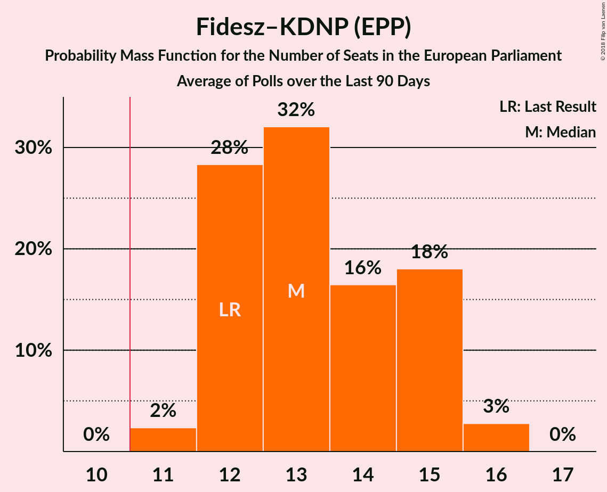

# Fidesz–KDNP (EPP)

<a href="#voting-intentions">Voting Intentions</a> | <a href="#seats">Seats</a>

## Voting Intentions

Last result: **51.5%** (General Election of 25 May 2014)

### Confidence Intervals

| Period     | Polling firm/Commissioner(s) | Median | 80% Confidence Interval | 90% Confidence Interval | 95% Confidence Interval | 99% Confidence Interval |
|:----------:|:----------------:|:-----------:|:-----------------------:|:-----------------------:|:-----------------------:|:-----------------------:|
| N/A | [Poll Average](average.html) | 52.1% | 47.3–61.4% | 46.4–63.1% | 45.7–64.0% | 44.5–65.4% |
| [3–21 February 2018](2018-02-21-NézőpontIntézet.html) | Nézőpont Intézet | 53.9% | 52.4–55.3% | 52.0–55.7% | 51.7–56.0% | 51.0–56.7% |
| [7–15 February 2018](2018-02-15-ZRIZáveczResearch.html) | ZRI Závecz Research | 51.6% | 49.6–53.6% | 49.0–54.2% | 48.5–54.7% | 47.5–55.7% |
| [9–14 February 2018](2018-02-14-PublicusResearch.html) | Publicus Research | 47.6% | 45.6–49.6% | 45.0–50.2% | 44.5–50.7% | 43.6–51.7% |
| [6–13 February 2018](2018-02-13-SzázadvégAlapítvány.html) | Századvég Alapítvány | 50.6% | 48.6–52.6% | 48.0–53.2% | 47.5–53.7% | 46.5–54.7% |
| [1–31 January 2018](2018-01-31-RepublikonIntézet.html) | Republikon Intézet   24.hu | 52.9% | 50.9–54.9% | 50.3–55.5% | 49.8–56.0% | 48.8–56.9% |
| [17–24 January 2018](2018-01-24-SzázadvégAlapítvány.html) | Századvég Alapítvány | 50.5% | 48.5–52.5% | 47.9–53.1% | 47.4–53.6% | 46.4–54.6% |
| [11–23 January 2018](2018-01-23-TÁRKI.html) | TÁRKI | 62.7% | 60.8–64.7% | 60.2–65.2% | 59.7–65.7% | 58.8–66.6% |
| [19–23 January 2018](2018-01-23-Medián.html) | Medián   hvg.hu | 53.2% | 51.3–55.0% | 50.8–55.5% | 50.3–56.0% | 49.4–56.9% |
| [1–20 January 2018](2018-01-20-ZRIZáveczResearch.html) | ZRI Závecz Research | 49.9% | 47.9–51.9% | 47.3–52.5% | 46.8–53.0% | 45.8–54.0% |
| [3–18 January 2018](2018-01-18-NézőpontIntézet.html) | Nézőpont Intézet | 52.5% | 51.0–53.9% | 50.6–54.3% | 50.3–54.6% | 49.6–55.3% |
| [10–16 January 2018](2018-01-16-PublicusResearch.html) | Publicus Research | 48.3% | 46.3–50.3% | 45.7–50.9% | 45.2–51.4% | 44.3–52.3% |
| [5–9 January 2018](2018-01-09-IránytűIntézet.html) | Iránytű Intézet | 47.8% | 45.8–49.8% | 45.2–50.4% | 44.7–50.9% | 43.7–51.9% |
| [27 December 2017–2 January 2018](2018-01-02-SzázadvégAlapítvány.html) | Századvég Alapítvány | 51.5% | 49.5–53.5% | 48.9–54.1% | 48.4–54.6% | 47.4–55.6% |
| [10–20 December 2017](2017-12-20-RepublikonIntézet.html) | Republikon Intézet   24.hu | 57.3% | 55.3–59.3% | 54.7–59.9% | 54.2–60.3% | 53.2–61.3% |
| [1–18 December 2017](2017-12-18-NézőpontIntézet.html) | Nézőpont Intézet | 50.9% | 49.4–52.3% | 49.0–52.7% | 48.7–53.0% | 48.0–53.7% |
| [6–14 December 2017](2017-12-14-ZRIZáveczResearch.html) | ZRI Závecz Research | 51.9% | 49.9–53.9% | 49.3–54.5% | 48.8–55.0% | 47.8–56.0% |
| [8–13 December 2017](2017-12-13-PublicusResearch.html) | Publicus Research | 47.8% | 45.7–49.8% | 45.2–50.4% | 44.7–50.9% | 43.7–51.8% |
| [6–12 December 2017](2017-12-12-IránytűIntézet.html) | Iránytű Intézet | 49.3% | 47.3–51.3% | 46.7–51.9% | 46.2–52.4% | 45.2–53.4% |
| [18–30 November 2017](2017-11-30-RepublikonIntézet.html) | Republikon Intézet   24.hu | 56.3% | 54.3–58.3% | 53.7–58.9% | 53.2–59.4% | 52.2–60.3% |
| [1–30 November 2017](2017-11-30-Medián.html) | Medián   hvg.hu | 59.6% | 57.8–61.4% | 57.2–61.9% | 56.8–62.3% | 55.9–63.2% |
| [24–30 November 2017](2017-11-30-IránytűIntézet.html) | Iránytű Intézet | 49.4% | 47.4–51.4% | 46.8–52.0% | 46.3–52.5% | 45.3–53.5% |
| [20–28 November 2017](2017-11-28-SzázadvégAlapítvány.html) | Századvég Alapítvány | 50.6% | 48.6–52.6% | 48.0–53.2% | 47.5–53.7% | 46.5–54.7% |
| [1–19 November 2017](2017-11-19-NézőpontIntézet.html) | Nézőpont Intézet | 48.0% | 46.6–49.4% | 46.2–49.8% | 45.8–50.2% | 45.1–50.9% |
| [11–15 November 2017](2017-11-15-PublicusResearch.html) | Publicus Research | 50.8% | 48.8–52.9% | 48.2–53.5% | 47.8–53.9% | 46.8–54.9% |
| [6–14 November 2017](2017-11-14-ZRIZáveczResearch.html) | ZRI Závecz Research | 49.0% | 47.0–51.0% | 46.4–51.6% | 45.9–52.1% | 44.9–53.1% |

### Probability Mass Function

The following table shows the probability mass function per percentage block of voting intentions for the [poll average](average.html) for Fidesz–KDNP (EPP).

| Voting Intentions | Probability | Accumulated | Special Marks |
|:-----------------:|:-----------:|:-----------:|:-------------:|
| 41.5–42.5% | 0% | 100% |  |
| 42.5–43.5% | 0.1% | 100% |  |
| 43.5–44.5% | 0.5% | 99.9% |  |
| 44.5–45.5% | 2% | 99.4% |  |
| 45.5–46.5% | 4% | 98% |  |
| 46.5–47.5% | 6% | 94% |  |
| 47.5–48.5% | 7% | 88% |  |
| 48.5–49.5% | 7% | 81% |  |
| 49.5–50.5% | 8% | 73% |  |
| 50.5–51.5% | 10% | 65% | Last Result |
| 51.5–52.5% | 12% | 56% | Median |
| 52.5–53.5% | 13% | 44% |  |
| 53.5–54.5% | 11% | 31% |  |
| 54.5–55.5% | 6% | 20% |  |
| 55.5–56.5% | 2% | 15% |  |
| 56.5–57.5% | 0.3% | 13% |  |
| 57.5–58.5% | 0.1% | 13% |  |
| 58.5–59.5% | 0.2% | 12% |  |
| 59.5–60.5% | 0.7% | 12% |  |
| 60.5–61.5% | 2% | 12% |  |
| 61.5–62.5% | 3% | 10% |  |
| 62.5–63.5% | 3% | 7% |  |
| 63.5–64.5% | 2% | 4% |  |
| 64.5–65.5% | 1.0% | 1.4% |  |
| 65.5–66.5% | 0.3% | 0.4% |  |
| 66.5–67.5% | 0.1% | 0.1% |  |
| 67.5–68.5% | 0% | 0% |  |

## Seats

Last result: **12** seats (General Election of 25 May 2014)

### Confidence Intervals

| Period     | Polling firm/Commissioner(s) | Median | 80% Confidence Interval | 90% Confidence Interval | 95% Confidence Interval | 99% Confidence Interval |
|:----------:|:----------------:|:------:|:-----------------------:|:-----------------------:|:-----------------------:|:-----------------------:|
| N/A | [Poll Average](average.html) | 12 | 11–15 | 11–15 | 11–15 | 11–16 |
| [3–21 February 2018](2018-02-21-NézőpontIntézet.html) | Nézőpont Intézet | 13 | 13 | 13 | 13 | 12–13 |
| [7–15 February 2018](2018-02-15-ZRIZáveczResearch.html) | ZRI Závecz Research | 12 | 12–13 | 12–13 | 12–13 | 12–13 |
| [9–14 February 2018](2018-02-14-PublicusResearch.html) | Publicus Research | 11 | 11 | 11 | 11 | 11 |
| [6–13 February 2018](2018-02-13-SzázadvégAlapítvány.html) | Századvég Alapítvány | 12 | 11–12 | 11–12 | 11–13 | 11–13 |
| [1–31 January 2018](2018-01-31-RepublikonIntézet.html) | Republikon Intézet   24.hu | 13 | 12–13 | 12–14 | 12–14 | 12–14 |
| [17–24 January 2018](2018-01-24-SzázadvégAlapítvány.html) | Századvég Alapítvány | 12 | 11–12 | 11–12 | 11–12 | 11–13 |
| [11–23 January 2018](2018-01-23-TÁRKI.html) | TÁRKI | 15 | 15–16 | 14–16 | 14–16 | 14–16 |
| [19–23 January 2018](2018-01-23-Medián.html) | Medián   hvg.hu | 12 | 12–13 | 12–13 | 12–13 | 11–13 |
| [1–20 January 2018](2018-01-20-ZRIZáveczResearch.html) | ZRI Závecz Research | 12 | 11–13 | 11–13 | 11–13 | 11–13 |
| [3–18 January 2018](2018-01-18-NézőpontIntézet.html) | Nézőpont Intézet | 13 | 13–14 | 12–14 | 12–14 | 12–14 |
| [10–16 January 2018](2018-01-16-PublicusResearch.html) | Publicus Research | 12 | 11–12 | 11–12 | 11–13 | 10–13 |
| [5–9 January 2018](2018-01-09-IránytűIntézet.html) | Iránytű Intézet | 12 | 11–12 | 11–13 | 11–13 | 10–13 |
| [27 December 2017–2 January 2018](2018-01-02-SzázadvégAlapítvány.html) | Századvég Alapítvány | 12 | 11–13 | 11–13 | 11–13 | 11–13 |
| [10–20 December 2017](2017-12-20-RepublikonIntézet.html) | Republikon Intézet   24.hu | 14 | 13–14 | 13–14 | 13–14 | 12–15 |
| [1–18 December 2017](2017-12-18-NézőpontIntézet.html) | Nézőpont Intézet | 12 | 12–13 | 12–13 | 12–13 | 11–13 |
| [6–14 December 2017](2017-12-14-ZRIZáveczResearch.html) | ZRI Závecz Research | 13 | 12–13 | 12–13 | 12–14 | 11–14 |
| [8–13 December 2017](2017-12-13-PublicusResearch.html) | Publicus Research | 12 | 11–12 | 11–13 | 11–13 | 10–13 |
| [6–12 December 2017](2017-12-12-IránytűIntézet.html) | Iránytű Intézet | 12 | 12–13 | 12–13 | 11–13 | 11–13 |
| [18–30 November 2017](2017-11-30-RepublikonIntézet.html) | Republikon Intézet   24.hu | 14 | 13–14 | 13–14 | 13–15 | 13–15 |
| [1–30 November 2017](2017-11-30-Medián.html) | Medián   hvg.hu | 14 | 13–14 | 13–14 | 13–15 | 13–15 |
| [24–30 November 2017](2017-11-30-IránytűIntézet.html) | Iránytű Intézet | 12 | 11–13 | 11–13 | 11–13 | 11–13 |
| [20–28 November 2017](2017-11-28-SzázadvégAlapítvány.html) | Századvég Alapítvány | 12 | 11–12 | 11–12 | 11–13 | 11–13 |
| [1–19 November 2017](2017-11-19-NézőpontIntézet.html) | Nézőpont Intézet | 11 | 11–12 | 11–12 | 11–12 | 11–13 |
| [11–15 November 2017](2017-11-15-PublicusResearch.html) | Publicus Research | 12 | 12–13 | 11–13 | 11–13 | 11–13 |
| [6–14 November 2017](2017-11-14-ZRIZáveczResearch.html) | ZRI Závecz Research | 11 | 11–12 | 11–12 | 11–13 | 11–13 |

### Probability Mass Function

The following table shows the probability mass function per seat for the [poll average](average.html) for Fidesz–KDNP (EPP).

| Number of Seats | Probability | Accumulated | Special Marks |
|:---------------:|:-----------:|:-----------:|:-------------:|
| 10 | 0.1% | 100% |  |
| 11 | 20% | 99.9% | Majority |
| 12 | 37% | 80% | Last Result, Median |
| 13 | 30% | 44% |  |
| 14 | 2% | 13% |  |
| 15 | 10% | 12% |  |
| 16 | 2% | 2% |  |
| 17 | 0% | 0% |  |

