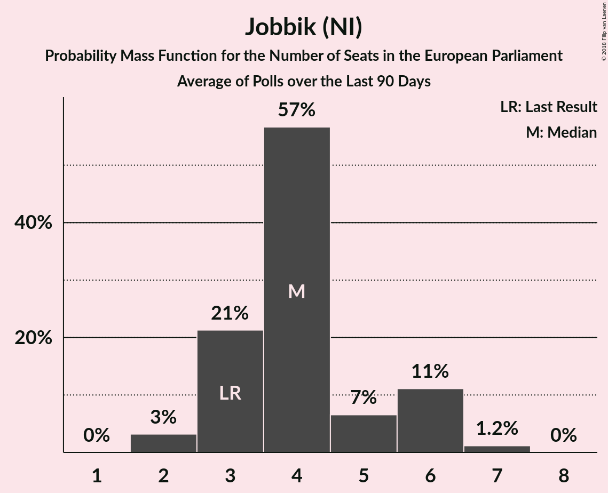

# Jobbik (NI)

<a href="#voting-intentions">Voting Intentions</a> | <a href="#seats">Seats</a>

## Voting Intentions

Last result: **14.7%** (General Election of 26 May 2019)

### Confidence Intervals

| Period     | Polling firm/Commissioner(s) | Median | 80% Confidence Interval | 90% Confidence Interval | 95% Confidence Interval | 99% Confidence Interval |
|:----------:|:----------------:|:-----------:|:-----------------------:|:-----------------------:|:-----------------------:|:-----------------------:|
| N/A | [Poll Average](average.html) | 1.1% | 0.7–1.5% | 0.6–1.7% | 0.6–1.8% | 0.4–2.1% |
| [25 April–4 May 2024](2024-05-04-IDEAIntézet.html) | IDEA Intézet | 1.0% | 0.7–1.4% | 0.7–1.5% | 0.6–1.6% | 0.5–1.9% |
| [29 April–2 May 2024](2024-05-02-NézőpontIntézet.html) | Nézőpont Intézet | 1.0% | 0.7–1.5% | 0.6–1.7% | 0.5–1.8% | 0.4–2.1% |
| [26–30 April 2024](2024-04-30-PublicusResearch.html) | Publicus Research | 1.0% | 0.7–1.5% | 0.6–1.7% | 0.5–1.8% | 0.4–2.1% |
| [26–29 April 2024](2024-04-29-Medián.html) | Medián | 1.0% | 0.7–1.5% | 0.6–1.7% | 0.5–1.8% | 0.4–2.1% |
| [17–19 April 2024](2024-04-19-IránytűIntézet.html) | Iránytű Intézet | 1.0% | 0.7–1.6% | 0.6–1.7% | 0.6–1.8% | 0.5–2.1% |
| [9–12 April 2024](2024-04-12-IránytűIntézet.html) | Iránytű Intézet | 2.0% | N/A | N/A | N/A | N/A |
| [4–11 April 2024](2024-04-11-ZRIZáveczResearch.html) | ZRI Závecz Research | 1.0% | 0.7–1.5% | 0.6–1.7% | 0.5–1.8% | 0.4–2.1% |
| [2–4 April 2024](2024-04-04-NézőpontIntézet.html) | Nézőpont Intézet | 1.0% | 0.7–1.5% | 0.6–1.7% | 0.5–1.8% | 0.4–2.1% |
| [23 February–5 March 2024](2024-03-05-Ipsos.html) | Ipsos   Euronews | 3.0% | 2.4–3.9% | 2.3–4.1% | 2.1–4.3% | 1.9–4.8% |
| [26–28 February 2024](2024-02-28-NézőpontIntézet.html) | Nézőpont Intézet | 2.0% | 1.5–2.7% | 1.4–2.9% | 1.3–3.1% | 1.1–3.5% |
| [22–26 February 2024](2024-02-26-21Kutatóközpont.html) | 21 Kutatóközpont | 2.0% | 1.6–2.7% | 1.5–2.9% | 1.4–3.0% | 1.2–3.4% |
| [1–31 December 2023](2023-12-31-Társadalomkutató.html) | Társadalomkutató | 2.0% | 1.7–2.3% | 1.7–2.4% | 1.6–2.5% | 1.5–2.7% |
| [18–21 December 2023](2023-12-21-Real-PR93.html) | Real-PR 93 | 3.0% | 2.4–3.8% | 2.2–4.1% | 2.1–4.3% | 1.9–4.7% |
| [12–15 December 2023](2023-12-15-PublicusResearch.html) | Publicus Research | 2.4% | 1.9–3.1% | 1.7–3.4% | 1.6–3.5% | 1.4–3.9% |
| [30 November–13 December 2023](2023-12-13-IDEAIntézet.html) | IDEA Intézet | 1.0% | 0.7–1.4% | 0.7–1.5% | 0.6–1.6% | 0.5–1.9% |
| [17–24 November 2023](2023-11-24-RepublikonIntézet.html) | Republikon Intézet | 4.0% | 3.3–4.9% | 3.1–5.2% | 2.9–5.4% | 2.7–5.9% |
| [31 October–16 November 2023](2023-11-16-IDEAIntézet.html) | IDEA Intézet | 2.0% | 1.5–2.7% | 1.4–2.9% | 1.3–3.1% | 1.1–3.4% |
| [29 October–8 November 2023](2023-11-08-ZRIZáveczResearch.html) | ZRI Závecz Research | 4.0% | 3.3–4.9% | 3.1–5.2% | 2.9–5.4% | 2.7–5.9% |
| [17–24 October 2023](2023-10-24-RepublikonIntézet.html) | Republikon Intézet | 3.0% | 2.4–3.8% | 2.2–4.1% | 2.1–4.3% | 1.9–4.7% |
| [13–18 October 2023](2023-10-18-21Kutatóközpont.html) | 21 Kutatóközpont | 2.0% | 1.5–2.7% | 1.4–2.9% | 1.3–3.1% | 1.1–3.4% |
| [29 September–13 October 2023](2023-10-13-IDEAIntézet.html) | IDEA Intézet | 1.0% | 0.7–1.4% | 0.7–1.5% | 0.6–1.6% | 0.5–1.8% |
| [1–30 September 2023](2023-09-30-Medián.html) | Medián | 5.0% | 4.2–6.0% | 4.0–6.3% | 3.8–6.5% | 3.5–7.1% |
| [18–25 September 2023](2023-09-25-RepublikonIntézet.html) | Republikon Intézet | 3.0% | 2.4–3.8% | 2.2–4.1% | 2.1–4.3% | 1.9–4.7% |
| [8–18 September 2023](2023-09-18-ZRIZáveczResearch.html) | ZRI Závecz Research | 4.0% | 3.3–4.9% | 3.1–5.2% | 2.9–5.4% | 2.7–5.9% |
| [28 August–8 September 2023](2023-09-08-IDEAIntézet.html) | IDEA Intézet | 2.0% | 1.6–2.5% | 1.5–2.6% | 1.4–2.8% | 1.3–3.0% |
| [4–6 September 2023](2023-09-06-NézőpontIntézet.html) | Nézőpont Intézet | 5.0% | 4.2–6.0% | 4.0–6.3% | 3.8–6.5% | 3.5–7.1% |
| [24–29 August 2023](2023-08-29-21Kutatóközpont.html) | 21 Kutatóközpont | 7.0% | 6.2–7.9% | 6.0–8.2% | 5.8–8.4% | 5.5–8.9% |
| [16–23 August 2023](2023-08-23-RepublikonIntézet.html) | Republikon Intézet | 4.0% | 3.3–4.9% | 3.1–5.2% | 2.9–5.4% | 2.7–5.9% |
| [28 July–9 August 2023](2023-08-09-IDEAIntézet.html) | IDEA Intézet | 2.0% | 1.6–2.5% | 1.5–2.6% | 1.4–2.8% | 1.3–3.0% |
| [14–25 July 2023](2023-07-25-RepublikonIntézet.html) | Republikon Intézet | 4.0% | 3.3–4.9% | 3.1–5.2% | 2.9–5.4% | 2.7–5.9% |
| [28 June–19 July 2023](2023-07-19-IDEAIntézet.html) | IDEA Intézet | 2.0% | 1.6–2.5% | 1.5–2.6% | 1.4–2.8% | 1.3–3.0% |
| [1–30 June 2023](2023-06-30-RepublikonIntézet.html) | Republikon Intézet | 5.9% | 5.0–7.1% | 4.7–7.5% | 4.5–7.8% | 4.1–8.4% |
| [19–23 June 2023](2023-06-23-RepublikonIntézet.html) | Republikon Intézet | 4.0% | N/A | N/A | N/A | N/A |
| [25 May–10 June 2023](2023-06-10-IDEAIntézet.html) | IDEA Intézet | 2.0% | N/A | N/A | N/A | N/A |
| [26–31 May 2023](2023-05-31-Medián.html) | Medián | 4.0% | N/A | N/A | N/A | N/A |
| [27 April–19 May 2023](2023-05-19-IDEAIntézet.html) | IDEA Intézet | 2.0% | N/A | N/A | N/A | N/A |
| [15–17 May 2023](2023-05-17-NézőpontIntézet.html) | Nézőpont Intézet | 5.0% | 4.2–6.0% | 4.0–6.3% | 3.8–6.5% | 3.5–7.1% |
| [28 April–5 May 2023](2023-05-05-ZRIZáveczResearch.html) | ZRI Závecz Research | 6.0% | 5.1–7.1% | 4.9–7.4% | 4.7–7.7% | 4.3–8.2% |
| [21–28 April 2023](2023-04-28-RepublikonIntézet.html) | Republikon Intézet | 4.0% | N/A | N/A | N/A | N/A |
| [25 March–13 April 2023](2023-04-13-IDEAIntézet.html) | IDEA Intézet | 1.0% | N/A | N/A | N/A | N/A |
| [1–31 March 2023](2023-03-31-Századvég.html) | Századvég | 2.0% | 1.5–2.7% | 1.4–2.9% | 1.3–3.1% | 1.1–3.4% |
| [27–29 March 2023](2023-03-29-Társadalomkutató.html) | Társadalomkutató | 4.0% | N/A | N/A | N/A | N/A |
| [27–29 March 2023](2023-03-29-Táradalomkutató.html) | Táradalomkutató | 4.0% | 3.3–4.9% | 3.1–5.2% | 2.9–5.4% | 2.7–5.9% |
| [27–29 March 2023](2023-03-29-NézőpontIntézet.html) | Nézőpont Intézet | 0.0% | N/A | N/A | N/A | N/A |
| [20–24 March 2023](2023-03-24-RepublikonIntézet.html) | Republikon Intézet | 3.0% | 2.4–3.8% | 2.2–4.1% | 2.1–4.3% | 1.9–4.7% |
| [25 February–16 March 2023](2023-03-16-IDEAIntézet.html) | IDEA Intézet | 2.0% | 1.6–2.5% | 1.5–2.6% | 1.4–2.8% | 1.3–3.0% |
| [28 February–8 March 2023](2023-03-08-ZRIZáveczResearch.html) | ZRI Závecz Research | 4.0% | 3.3–4.9% | 3.1–5.2% | 2.9–5.4% | 2.7–5.9% |
| [21–27 February 2023](2023-02-27-Medián.html) | Medián | 5.0% | N/A | N/A | N/A | N/A |
| [20–22 February 2023](2023-02-22-NézőpontIntézet.html) | Nézőpont Intézet | 4.0% | 3.3–4.9% | 3.1–5.2% | 2.9–5.4% | 2.7–5.9% |
| [10–15 February 2023](2023-02-15-RepublikonIntézet.html) | Republikon Intézet | 3.0% | 2.4–3.8% | 2.2–4.1% | 2.1–4.3% | 1.9–4.7% |
| [30 January–15 February 2023](2023-02-15-IDEAIntézet.html) | IDEA Intézet | 2.0% | 1.6–2.5% | 1.5–2.6% | 1.4–2.8% | 1.3–3.0% |
| [31 December 2022–11 January 2023](2023-01-11-IDEAIntézet.html) | IDEA Intézet | 3.0% | N/A | N/A | N/A | N/A |
| [2–6 January 2023](2023-01-06-RepublikonIntézet.html) | Republikon Intézet | 5.0% | N/A | N/A | N/A | N/A |
| [2–4 January 2023](2023-01-04-NézőpontIntézet.html) | Nézőpont Intézet | 2.0% | 1.5–2.7% | 1.4–2.9% | 1.3–3.1% | 1.1–3.4% |
| [12–16 December 2022](2022-12-16-PublicusResearch.html) | Publicus Research | 5.0% | N/A | N/A | N/A | N/A |
| [9–15 December 2022](2022-12-15-Medián.html) | Medián | 5.0% | N/A | N/A | N/A | N/A |
| [12–14 December 2022](2022-12-14-Real-PR93.html) | Real-PR 93 | 6.0% | N/A | N/A | N/A | N/A |
| [29 November–12 December 2022](2022-12-12-IDEAIntézet.html) | IDEA Intézet | 3.9% | N/A | N/A | N/A | N/A |
| [23–28 November 2022](2022-11-28-RepublikonIntézet.html) | Republikon Intézet | 4.0% | 3.3–4.9% | 3.1–5.2% | 2.9–5.4% | 2.7–5.9% |
| [14–22 November 2022](2022-11-22-ZRIZáveczResearch.html) | ZRI Závecz Research | 5.0% | 4.2–6.0% | 4.0–6.3% | 3.8–6.5% | 3.5–7.1% |
| [28 October–8 November 2022](2022-11-08-IDEAIntézet.html) | IDEA Intézet | 3.0% | 2.5–3.6% | 2.4–3.7% | 2.3–3.9% | 2.1–4.2% |
| [19–24 October 2022](2022-10-24-RepublikonIntézet.html) | Republikon Intézet | 4.0% | 3.3–4.9% | 3.1–5.2% | 2.9–5.4% | 2.7–5.9% |
| [15–21 October 2022](2022-10-21-Medián.html) | Medián | 2.6% | 2.1–3.4% | 1.9–3.6% | 1.8–3.8% | 1.5–4.2% |
| [17–19 October 2022](2022-10-19-NézőpontIntézet.html) | Nézőpont Intézet | 3.9% | 3.2–4.8% | 3.0–5.1% | 2.9–5.3% | 2.6–5.8% |
| [29 September–9 October 2022](2022-10-09-IDEAIntézet.html) | IDEA Intézet | 4.0% | 3.5–4.7% | 3.4–4.9% | 3.2–5.1% | 3.0–5.4% |
| [14–22 September 2022](2022-09-22-ZRIZáveczResearch.html) | ZRI Závecz Research | 5.0% | 4.2–6.0% | 4.0–6.3% | 3.8–6.5% | 3.5–7.1% |
| [31 August–9 September 2022](2022-09-09-IDEAIntézet.html) | IDEA Intézet | 3.0% | 2.5–3.6% | 2.4–3.7% | 2.3–3.9% | 2.1–4.2% |
| [29–31 August 2022](2022-08-31-NézőpontIntézet.html) | Nézőpont Intézet | 6.5% | 5.6–7.6% | 5.3–7.9% | 5.1–8.2% | 4.7–8.8% |
| [25–30 August 2022](2022-08-30-PublicusResearch.html) | Publicus Research | 3.7% | 3.0–4.6% | 2.9–4.8% | 2.7–5.1% | 2.4–5.5% |
| [27 July–7 August 2022](2022-08-07-IDEAIntézet.html) | IDEA Intézet | 6.0% | N/A | N/A | N/A | N/A |
| [9–22 July 2022](2022-07-22-PublicusResearch.html) | Publicus Research | 7.3% | N/A | N/A | N/A | N/A |
| [9–20 July 2022](2022-07-20-IDEAIntézet.html) | IDEA Intézet | 5.0% | N/A | N/A | N/A | N/A |
| [11–13 July 2022](2022-07-13-NézőpontIntézet.html) | Nézőpont Intézet | 7.8% | N/A | N/A | N/A | N/A |
| [20–22 June 2022](2022-06-22-NézőpontIntézet.html) | Nézőpont Intézet | 7.0% | N/A | N/A | N/A | N/A |
| [29 April–9 May 2022](2022-05-09-IDEAIntézet.html) | IDEA Intézet | 6.0% | 5.3–6.8% | 5.2–7.0% | 5.0–7.2% | 4.7–7.6% |
| [25 April–4 May 2022](2022-05-04-ZRIZáveczResearch.html) | ZRI Závecz Research | 5.0% | 4.2–6.0% | 4.0–6.3% | 3.8–6.5% | 3.5–7.1% |
| [26–30 April 2022](2022-04-30-Medián.html) | Medián | 3.0% | N/A | N/A | N/A | N/A |
| [20–24 April 2022](2022-04-24-Republikon.html) | Republikon | 6.0% | 5.1–7.1% | 4.9–7.4% | 4.7–7.7% | 4.3–8.2% |
| [31 March–1 April 2022](2022-04-01-Medián.html) | Medián | 0.0% | N/A | N/A | N/A | N/A |
| [29–31 March 2022](2022-03-31-PublicusResearch.html) | Publicus Research | 0.0% | N/A | N/A | N/A | N/A |
| [1–31 March 2022](2022-03-31-Medián.html) | Medián | 0.0% | N/A | N/A | N/A | N/A |
| [28–30 March 2022](2022-03-30-Társadalomkutató.html) | Társadalomkutató | 0.0% | N/A | N/A | N/A | N/A |
| [26–29 March 2022](2022-03-29-Republikon.html) | Republikon | 0.0% | N/A | N/A | N/A | N/A |
| [28 March 2022](2022-03-28-Real-PR93.html) | Real-PR 93 | 0.0% | N/A | N/A | N/A | N/A |
| [22–28 March 2022](2022-03-28-IDEAIntézet.html) | IDEA Intézet | 0.0% | N/A | N/A | N/A | N/A |
| [21–27 March 2022](2022-03-27-ZRIZáveczResearch.html) | ZRI Závecz Research | 0.0% | N/A | N/A | N/A | N/A |
| [21–27 March 2022](2022-03-27-Századvég.html) | Századvég | 0.0% | N/A | N/A | N/A | N/A |
| [23–25 March 2022](2022-03-25-ZRIZáveczResearch.html) | ZRI Závecz Research | 0.0% | N/A | N/A | N/A | N/A |
| [21–25 March 2022](2022-03-25-PublicusResearch.html) | Publicus Research | 0.0% | N/A | N/A | N/A | N/A |
| [23–25 March 2022](2022-03-25-NézőpontIntézet.html) | Nézőpont Intézet | 0.0% | N/A | N/A | N/A | N/A |
| [21–23 March 2022](2022-03-23-Társadalomkutató.html) | Társadalomkutató | 0.0% | N/A | N/A | N/A | N/A |
| [16–21 March 2022](2022-03-21-NézőpontIntézet.html) | Nézőpont Intézet | 0.0% | N/A | N/A | N/A | N/A |
| [16–18 March 2022](2022-03-18-Republikon.html) | Republikon | 0.0% | N/A | N/A | N/A | N/A |
| [7–11 March 2022](2022-03-11-PublicusResearch.html) | Publicus Research | 0.0% | N/A | N/A | N/A | N/A |
| [2–11 March 2022](2022-03-11-IDEAIntézet.html) | IDEA Intézet | 0.0% | N/A | N/A | N/A | N/A |
| [26 February–5 March 2022](2022-03-05-e-benchmark.html) | e-benchmark | 0.0% | N/A | N/A | N/A | N/A |
| [22–26 February 2022](2022-02-26-Medián.html) | Medián | 0.0% | N/A | N/A | N/A | N/A |
| [18–24 February 2022](2022-02-24-Republikon.html) | Republikon | 0.0% | N/A | N/A | N/A | N/A |
| [14–16 February 2022](2022-02-16-NézőpontIntézet.html) | Nézőpont Intézet | 0.0% | N/A | N/A | N/A | N/A |
| [10–14 February 2022](2022-02-14-PublicusResearch.html) | Publicus Research | 0.0% | N/A | N/A | N/A | N/A |
| [9–11 February 2022](2022-02-11-Real-PR93.html) | Real-PR 93 | 0.0% | N/A | N/A | N/A | N/A |
| [2–10 February 2022](2022-02-10-ZRIZáveczResearch.html) | ZRI Závecz Research | 0.0% | N/A | N/A | N/A | N/A |
| [31 January–9 February 2022](2022-02-09-IDEAIntézet.html) | IDEA Intézet | 0.0% | N/A | N/A | N/A | N/A |
| [24–26 January 2022](2022-01-26-Társadalomkutató.html) | Társadalomkutató | 0.0% | N/A | N/A | N/A | N/A |
| [20–25 January 2022](2022-01-25-Republikon.html) | Republikon | 0.0% | N/A | N/A | N/A | N/A |
| [17–19 January 2022](2022-01-19-AlapjogokértKözpont.html) | Alapjogokért Központ | 0.0% | N/A | N/A | N/A | N/A |
| [4–14 January 2022](2022-01-14-IDEAIntézet.html) | IDEA Intézet | 0.0% | N/A | N/A | N/A | N/A |
| [2–5 January 2022](2022-01-05-NézőpontIntézet.html) | Nézőpont Intézet | 0.0% | N/A | N/A | N/A | N/A |
| [21–23 December 2021](2021-12-23-Real-PR93.html) | Real-PR 93 | 0.0% | N/A | N/A | N/A | N/A |
| [13–15 December 2021](2021-12-15-NézőpontIntézet.html) | Nézőpont Intézet | 0.0% | N/A | N/A | N/A | N/A |
| [9–14 December 2021](2021-12-14-Republikon.html) | Republikon | 0.0% | N/A | N/A | N/A | N/A |
| [4–13 December 2021](2021-12-13-ZRIZáveczResearch.html) | ZRI Závecz Research | 0.0% | N/A | N/A | N/A | N/A |
| [29 November–13 December 2021](2021-12-13-IDEAIntézet.html) | IDEA Intézet | 0.0% | N/A | N/A | N/A | N/A |
| [6–11 December 2021](2021-12-11-IránytűIntézet.html) | Iránytű Intézet | 0.0% | N/A | N/A | N/A | N/A |
| [4–7 December 2021](2021-12-07-Medián.html) | Medián | 0.0% | N/A | N/A | N/A | N/A |
| [28–30 November 2021](2021-11-30-Társadalomkutató.html) | Társadalomkutató | 0.0% | N/A | N/A | N/A | N/A |
| [25–30 November 2021](2021-11-30-PublicusResearch.html) | Publicus Research | 0.0% | N/A | N/A | N/A | N/A |
| [15–24 November 2021](2021-11-24-ZRIZáveczResearch.html) | ZRI Závecz Research | 0.0% | N/A | N/A | N/A | N/A |
| [17–23 November 2021](2021-11-23-Republikon.html) | Republikon | 0.0% | N/A | N/A | N/A | N/A |
| [4–12 November 2021](2021-11-12-e-benchmark.html) | e-benchmark | 0.0% | N/A | N/A | N/A | N/A |
| [2–12 November 2021](2021-11-12-ZRIZáveczResearch.html) | ZRI Závecz Research | 0.0% | N/A | N/A | N/A | N/A |
| [9–11 November 2021](2021-11-11-Real-PR93.html) | Real-PR 93 | 0.0% | N/A | N/A | N/A | N/A |
| [26 October–5 November 2021](2021-11-05-IDEAIntézet.html) | IDEA Intézet | 0.0% | N/A | N/A | N/A | N/A |
| [2–3 November 2021](2021-11-03-NézőpontIntézet.html) | Nézőpont Intézet | 0.0% | N/A | N/A | N/A | N/A |
| [1–31 October 2021](2021-10-31-Századvég.html) | Századvég | 0.0% | N/A | N/A | N/A | N/A |
| [25–29 October 2021](2021-10-29-Republikon.html) | Republikon | 0.0% | N/A | N/A | N/A | N/A |
| [25–27 October 2021](2021-10-27-NézőpontIntézet.html) | Nézőpont Intézet | 0.0% | N/A | N/A | N/A | N/A |
| [19–21 October 2021](2021-10-21-Real-PR93.html) | Real-PR 93 | 0.0% | N/A | N/A | N/A | N/A |
| [18–20 October 2021](2021-10-20-NézőpontIntézet.html) | Nézőpont Intézet | 0.0% | N/A | N/A | N/A | N/A |
| [11–19 October 2021](2021-10-19-ZRIZáveczResearch.html) | ZRI Závecz Research | 0.0% | N/A | N/A | N/A | N/A |
| [7–16 October 2021](2021-10-16-e-benchmark.html) | e-benchmark | 0.0% | N/A | N/A | N/A | N/A |
| [11–13 October 2021](2021-10-13-NézőpontIntézet.html) | Nézőpont Intézet | 0.0% | N/A | N/A | N/A | N/A |
| [30 September–9 October 2021](2021-10-09-IDEAIntézet.html) | IDEA Intézet | 0.0% | N/A | N/A | N/A | N/A |
| [4–6 October 2021](2021-10-06-Társadalomkutató.html) | Társadalomkutató | 0.0% | N/A | N/A | N/A | N/A |
| [4–6 October 2021](2021-10-06-NézőpontIntézet.html) | Nézőpont Intézet | 0.0% | N/A | N/A | N/A | N/A |
| [4–6 October 2021](2021-10-06-Medián.html) | Medián | 0.0% | N/A | N/A | N/A | N/A |
| [1–4 October 2021](2021-10-04-Republikon.html) | Republikon | 0.0% | N/A | N/A | N/A | N/A |
| [2–4 October 2021](2021-10-04-PublicusResearch.html) | Publicus Research | 0.0% | N/A | N/A | N/A | N/A |
| [27–29 September 2021](2021-09-29-NézőpontIntézet.html) | Nézőpont Intézet | 0.0% | N/A | N/A | N/A | N/A |
| [20–21 September 2021](2021-09-21-NézőpontIntézet.html) | Nézőpont Intézet | 0.0% | N/A | N/A | N/A | N/A |
| [13–20 September 2021](2021-09-20-ZRIZáveczResearch.html) | ZRI Závecz Research | 0.0% | N/A | N/A | N/A | N/A |
| [10–18 September 2021](2021-09-18-e-benchmark.html) | e-benchmark | 0.0% | N/A | N/A | N/A | N/A |
| [31 August–7 September 2021](2021-09-07-IDEAIntézet.html) | IDEA Intézet | 0.0% | N/A | N/A | N/A | N/A |
| [1–31 August 2021](2021-08-31-ZRIZáveczResearch.html) | ZRI Závecz Research | 0.0% | N/A | N/A | N/A | N/A |
| [23–28 August 2021](2021-08-28-Republikon.html) | Republikon | 0.0% | N/A | N/A | N/A | N/A |
| [20–25 August 2021](2021-08-25-NézőpontIntézet.html) | Nézőpont Intézet | 0.0% | N/A | N/A | N/A | N/A |
| [16–18 August 2021](2021-08-18-Társadalomkutató.html) | Társadalomkutató | 0.0% | N/A | N/A | N/A | N/A |
| [22 July–1 August 2021](2021-08-01-IDEAIntézet.html) | IDEA Intézet | 0.0% | N/A | N/A | N/A | N/A |
| [30 June–4 July 2021](2021-07-04-IDEAIntézet.html) | IDEA Intézet | 0.0% | N/A | N/A | N/A | N/A |
| [8–16 June 2021](2021-06-16-ZávecResearch.html) | Závec Research | 0.0% | N/A | N/A | N/A | N/A |
| [8–16 June 2021](2021-06-16-ZRIZáveczResearch.html) | ZRI Závecz Research | 0.0% | N/A | N/A | N/A | N/A |
| [7–9 June 2021](2021-06-09-Medián.html) | Medián | 0.0% | N/A | N/A | N/A | N/A |
| [3–8 June 2021](2021-06-08-NézőpontIntézet.html) | Nézőpont Intézet | 0.0% | N/A | N/A | N/A | N/A |
| [27 May–8 June 2021](2021-06-08-IDEAIntézet.html) | IDEA Intézet | 0.0% | N/A | N/A | N/A | N/A |
| [18–21 May 2021](2021-05-21-PublicusResearch.html) | Publicus Research | 0.0% | N/A | N/A | N/A | N/A |
| [8–17 May 2021](2021-05-17-ZRIZáveczResearch.html) | ZRI Závecz Research | 0.0% | N/A | N/A | N/A | N/A |
| [6–11 May 2021](2021-05-11-CivitasIntézet.html) | Civitas Intézet | 0.0% | N/A | N/A | N/A | N/A |
| [27 April–4 May 2021](2021-05-04-IDEAIntézet.html) | IDEA Intézet | 0.0% | N/A | N/A | N/A | N/A |
| [1–30 April 2021](2021-04-30-ZRIZáveczResearch.html) | ZRI Závecz Research | 0.0% | N/A | N/A | N/A | N/A |
| [24–28 April 2021](2021-04-28-PublicusResearch.html) | Publicus Research | 0.0% | N/A | N/A | N/A | N/A |
| [27–28 April 2021](2021-04-28-NézőpontIntézet.html) | Nézőpont Intézet | 0.0% | N/A | N/A | N/A | N/A |
| [19–23 April 2021](2021-04-23-Republikon.html) | Republikon | 0.0% | N/A | N/A | N/A | N/A |
| [26–31 March 2021](2021-03-31-IDEAIntézet.html) | IDEA Intézet | 0.0% | N/A | N/A | N/A | N/A |
| [18–25 March 2021](2021-03-25-Republikon.html) | Republikon | 0.0% | N/A | N/A | N/A | N/A |
| [2–11 March 2021](2021-03-11-ZRIZáveczResearch.html) | ZRI Závecz Research | 0.0% | N/A | N/A | N/A | N/A |
| [5–11 March 2021](2021-03-11-CivitasIntézet.html) | Civitas Intézet | 0.0% | N/A | N/A | N/A | N/A |
| [8–9 March 2021](2021-03-09-NézőpontIntézet.html) | Nézőpont Intézet | 0.0% | N/A | N/A | N/A | N/A |
| [20–25 February 2021](2021-02-25-PublicusResearch.html) | Publicus Research | 0.0% | N/A | N/A | N/A | N/A |
| [22–25 February 2021](2021-02-25-IDEAIntézet.html) | IDEA Intézet | 0.0% | N/A | N/A | N/A | N/A |
| [15–22 February 2021](2021-02-22-Republikon.html) | Republikon | 0.0% | N/A | N/A | N/A | N/A |
| [5–13 February 2021](2021-02-13-ZRIZáveczResearch.html) | ZRI Závecz Research | 0.0% | N/A | N/A | N/A | N/A |
| [22–26 January 2021](2021-01-26-IDEAIntézet.html) | IDEA Intézet | 0.0% | N/A | N/A | N/A | N/A |
| [14–21 January 2021](2021-01-21-Republikon.html) | Republikon | 0.0% | N/A | N/A | N/A | N/A |
| [18–20 January 2021](2021-01-20-NézőpontIntézet.html) | Nézőpont Intézet | 0.0% | N/A | N/A | N/A | N/A |
| [1–31 December 2020](2020-12-31-Medián.html) | Medián | 15.0% | 13.4–17.2% | 12.9–17.8% | 12.5–18.3% | 11.7–19.3% |
| [8–15 December 2020](2020-12-15-Republikon.html) | Republikon | 8.0% | 7.0–9.2% | 6.7–9.6% | 6.5–9.9% | 6.0–10.5% |
| [11–15 December 2020](2020-12-15-IDEAIntézet.html) | IDEA Intézet | 9.0% | 8.2–9.9% | 8.0–10.1% | 7.8–10.3% | 7.5–10.8% |
| [1–8 December 2020](2020-12-08-ZRIZáveczResearch.html) | ZRI Závecz Research | 10.0% | 8.9–11.3% | 8.6–11.7% | 8.3–12.0% | 7.8–12.7% |
| [30 November–4 December 2020](2020-12-04-IDEAIntézet.html) | IDEA Intézet | 8.9% | 8.1–9.8% | 7.9–10.0% | 7.7–10.2% | 7.4–10.7% |
| [16–23 November 2020](2020-11-23-Republikon.html) | Republikon | 7.0% | 6.1–8.2% | 5.8–8.5% | 5.6–8.8% | 5.2–9.3% |
| [18–21 November 2020](2020-11-21-PublicusResearch.html) | Publicus Research | 8.4% | 7.4–9.6% | 7.1–10.0% | 6.8–10.3% | 6.4–10.9% |
| [3–17 November 2020](2020-11-17-ZRIZáveczResearch.html) | ZRI Závecz Research | 10.0% | 8.9–11.3% | 8.6–11.7% | 8.3–12.0% | 7.8–12.7% |
| [31 October–5 November 2020](2020-11-05-IDEAIntézet.html) | IDEA Intézet | 8.0% | 7.3–8.8% | 7.1–9.1% | 6.9–9.3% | 6.6–9.7% |
| [19–26 October 2020](2020-10-26-Republikon.html) | Republikon | 7.0% | 6.1–8.2% | 5.8–8.5% | 5.6–8.8% | 5.2–9.3% |
| [15–20 October 2020](2020-10-20-IránytűIntézet.html) | Iránytű Intézet | 12.0% | 10.8–13.4% | 10.4–13.8% | 10.1–14.2% | 9.6–14.9% |
| [5–15 October 2020](2020-10-15-ZRIZáveczResearch.html) | ZRI Závecz Research | 10.0% | 8.9–11.3% | 8.6–11.7% | 8.3–12.0% | 7.8–12.7% |
| [30 September–4 October 2020](2020-10-04-IDEAIntézet.html) | IDEA Intézet | 8.0% | 7.3–8.9% | 7.1–9.1% | 6.9–9.3% | 6.6–9.7% |
| [22–25 September 2020](2020-09-25-PublicusResearch.html) | Publicus Research | 9.0% | 8.1–10.4% | 7.8–10.8% | 7.5–11.1% | 7.0–11.7% |
| [7–18 September 2020](2020-09-18-ZRIZáveczResearch.html) | ZRI Závecz Research | 9.0% | 7.9–10.3% | 7.6–10.6% | 7.4–10.9% | 6.9–11.6% |
| [27–31 August 2020](2020-08-31-PublicusResearch.html) | Publicus Research | 8.0% | 7.0–9.2% | 6.7–9.6% | 6.5–9.9% | 6.1–10.5% |
| [27–31 August 2020](2020-08-31-IDEAIntézet.html) | IDEA Intézet | 7.0% | 6.3–7.8% | 6.1–8.0% | 6.0–8.2% | 5.6–8.6% |
| [14–24 August 2020](2020-08-24-Republikon.html) | Republikon | 8.0% | 7.0–9.2% | 6.7–9.6% | 6.5–9.9% | 6.0–10.5% |
| [5–19 August 2020](2020-08-19-ZRIZáveczResearch.html) | ZRI Závecz Research | 8.0% | 7.1–9.3% | 6.8–9.7% | 6.6–10.0% | 6.1–10.6% |
| [30 July–3 August 2020](2020-08-03-IDEAIntézet.html) | IDEA Intézet | 6.0% | 5.4–6.7% | 5.2–7.0% | 5.0–7.1% | 4.8–7.5% |
| [13–15 July 2020](2020-07-15-ZRIZáveczResearch.html) | ZRI Závecz Research | 6.8% | 5.9–7.9% | 5.6–8.3% | 5.4–8.5% | 5.0–9.1% |
| [30 June–2 July 2020](2020-07-02-NézőpontIntézet.html) | Nézőpont Intézet | 9.0% | 7.9–10.3% | 7.6–10.6% | 7.4–10.9% | 6.9–11.6% |
| [27–30 June 2020](2020-06-30-IDEAIntézet.html) | IDEA Intézet | 6.0% | 5.4–6.7% | 5.2–7.0% | 5.0–7.1% | 4.8–7.5% |
| [5–10 June 2020](2020-06-10-PublicusResearch.html) | Publicus Research | 7.0% | 6.0–8.1% | 5.8–8.4% | 5.5–8.7% | 5.1–9.3% |
| [3–5 June 2020](2020-06-05-NézőpontIntézet.html) | Nézőpont Intézet | 9.0% | 7.9–10.3% | 7.6–10.6% | 7.4–10.9% | 6.9–11.6% |
| [28 May–5 June 2020](2020-06-05-Medián.html) | Medián | 7.0% | 6.2–8.3% | 5.9–8.6% | 5.7–8.9% | 5.2–9.4% |
| [27–31 May 2020](2020-05-31-IDEAIntézet.html) | IDEA Intézet | 7.0% | 6.4–7.8% | 6.2–8.1% | 6.0–8.3% | 5.7–8.7% |
| [18–22 May 2020](2020-05-22-PublicusResearch.html) | Publicus Research | 7.9% | 6.9–9.1% | 6.6–9.5% | 6.4–9.8% | 5.9–10.4% |
| [7–8 May 2020](2020-05-08-NézőpontIntézet.html) | Nézőpont Intézet | 9.0% | 8.0–10.4% | 7.7–10.7% | 7.5–11.1% | 7.0–11.7% |
| [20–26 April 2020](2020-04-26-IDEAIntézet.html) | IDEA Intézet | 8.0% | 7.3–8.8% | 7.1–9.1% | 6.9–9.3% | 6.6–9.7% |
| [14–19 April 2020](2020-04-19-ZRIZáveczResearch.html) | ZRI Závecz Research | 8.9% | 8.0–9.9% | 7.7–10.2% | 7.5–10.4% | 7.1–10.9% |
| [14–18 April 2020](2020-04-18-PublicusResearch.html) | Publicus Research | 9.8% | 8.9–10.9% | 8.6–11.2% | 8.4–11.4% | 8.0–11.9% |
| [16–18 April 2020](2020-04-18-NézőpontIntézet.html) | Nézőpont Intézet | 9.0% | 8.2–10.6% | 7.9–10.9% | 7.7–11.3% | 7.2–11.9% |
| [17–21 March 2020](2020-03-21-PublicusResearch.html) | Publicus Research | 10.0% | 9.0–11.5% | 8.7–11.9% | 8.4–12.2% | 7.9–12.9% |
| [17–20 March 2020](2020-03-20-IDEAIntézet.html) | IDEA Intézet | 9.0% | 8.2–9.9% | 8.0–10.1% | 7.8–10.3% | 7.5–10.8% |
| [12–14 March 2020](2020-03-14-NézőpontIntézet.html) | Nézőpont Intézet | 9.6% | 8.5–10.9% | 8.2–11.3% | 7.9–11.6% | 7.4–12.2% |
| [3–13 March 2020](2020-03-13-ZRIZáveczResearch.html) | ZRI Závecz Research | 9.0% | 7.9–10.3% | 7.6–10.6% | 7.4–10.9% | 6.9–11.6% |
| [5–10 March 2020](2020-03-10-PublicusResearch.html) | Publicus Research | 10.0% | 8.9–11.3% | 8.6–11.7% | 8.3–12.0% | 7.8–12.7% |
| [1–29 February 2020](2020-02-29-Medián.html) | Medián | 11.0% | 9.9–12.2% | 9.6–12.6% | 9.3–12.9% | 8.9–13.5% |
| [13–20 February 2020](2020-02-20-ZRIZáveczResearch.html) | ZRI Závecz Research | 10.0% | 8.9–11.3% | 8.6–11.7% | 8.3–12.0% | 7.8–12.7% |
| [31 January–12 February 2020](2020-02-12-IDEAIntézet.html) | IDEA Intézet | 9.0% | 8.2–9.9% | 8.0–10.1% | 7.8–10.3% | 7.5–10.8% |
| [13–20 January 2020](2020-01-20-ZRIZáveczResearch.html) | ZRI Závecz Research | 9.0% | 7.7–10.7% | 7.4–11.1% | 7.0–11.6% | 6.5–12.4% |
| [10–16 January 2020](2020-01-16-NézőpontIntézet.html) | Nézőpont Intézet | 10.0% | 9.0–11.4% | 8.6–11.8% | 8.4–12.1% | 7.9–12.8% |
| [14–20 December 2019](2019-12-20-PublicusResearch.html) | Publicus Research | 10.0% | 8.9–11.3% | 8.5–11.7% | 8.3–12.0% | 7.8–12.7% |
| [8–15 December 2019](2019-12-15-ZRIZáveczResearch.html) | ZRI Závecz Research | 8.9% | 7.7–10.5% | 7.3–11.0% | 7.0–11.4% | 6.4–12.2% |
| [28 November–5 December 2019](2019-12-05-Medián.html) | Medián | 10.0% | 9.0–11.2% | 8.7–11.5% | 8.4–11.8% | 8.0–12.4% |
| [29 November–3 December 2019](2019-12-03-IDEAIntézet.html) | IDEA Intézet | 7.0% | 6.3–7.8% | 6.1–8.0% | 6.0–8.2% | 5.6–8.6% |
| [1–30 November 2019](2019-11-30-NézőpontIntézet.html) | Nézőpont Intézet | 9.0% | 8.5–9.5% | 8.3–9.7% | 8.2–9.8% | 8.0–10.1% |
| [8–16 November 2019](2019-11-16-ZRIZáveczResearch.html) | ZRI Závecz Research | 9.0% | 7.9–10.3% | 7.6–10.6% | 7.4–10.9% | 6.9–11.6% |
| [29–31 October 2019](2019-10-31-IDEAIntézet.html) | IDEA Intézet | 9.0% | 8.2–9.9% | 8.0–10.1% | 7.8–10.3% | 7.5–10.8% |
| [14–27 October 2019](2019-10-27-NézőpontIntézet.html) | Nézőpont Intézet | 9.0% | 8.3–9.8% | 8.1–10.0% | 7.9–10.2% | 7.6–10.7% |
| [18–23 October 2019](2019-10-23-Medián.html) | Medián | 6.0% | 5.3–7.1% | 5.0–7.3% | 4.9–7.6% | 4.5–8.1% |
| [17–22 October 2019](2019-10-22-PublicusResearch.html) | Publicus Research | 10.0% | 8.9–11.3% | 8.6–11.7% | 8.3–12.0% | 7.8–12.7% |
| [20–26 September 2019](2019-09-26-Medián.html) | Medián | 7.0% | 6.1–8.0% | 5.9–8.3% | 5.7–8.6% | 5.3–9.1% |
| [23–25 September 2019](2019-09-25-Századvég.html) | Századvég | 8.0% | 7.0–9.2% | 6.7–9.6% | 6.5–9.9% | 6.0–10.5% |
| [20–24 September 2019](2019-09-24-IDEAIntézet.html) | IDEA Intézet | 8.0% | 7.3–8.8% | 7.1–9.1% | 6.9–9.3% | 6.6–9.7% |
| [7–15 September 2019](2019-09-15-ZRIZáveczResearch.html) | ZRI Závecz Research | 7.5% | 6.5–8.7% | 6.2–9.0% | 6.0–9.3% | 5.6–9.9% |
| [1–26 August 2019](2019-08-26-NézőpontIntézet.html) | Nézőpont Intézet | 8.0% | 7.5–8.5% | 7.4–8.7% | 7.3–8.8% | 7.1–9.0% |
| [12–17 August 2019](2019-08-17-PublicusResearch.html) | Publicus Research | 9.9% | 8.8–11.2% | 8.5–11.6% | 8.2–11.9% | 7.7–12.6% |
| [4–14 August 2019](2019-08-14-ZRIZáveczResearch.html) | ZRI Závecz Research | 9.0% | 7.9–10.3% | 7.6–10.6% | 7.4–10.9% | 6.9–11.6% |
| [2–28 July 2019](2019-07-28-NézőpontIntézet.html) | Nézőpont Intézet | 9.0% | 8.5–9.5% | 8.3–9.7% | 8.2–9.8% | 8.0–10.1% |
| [23–26 July 2019](2019-07-26-IDEAIntézet.html) | IDEA Intézet | 9.0% | 8.2–9.9% | 8.0–10.1% | 7.8–10.3% | 7.5–10.8% |
| [16–23 July 2019](2019-07-23-PublicusResearch.html) | Publicus Research | 10.0% | 9.0–11.4% | 8.7–11.8% | 8.4–12.2% | 7.9–12.8% |
| [4–14 July 2019](2019-07-14-ZRIZáveczResearch.html) | ZRI Závecz Research | 8.0% | 7.0–9.2% | 6.7–9.6% | 6.5–9.9% | 6.0–10.5% |
| [28 June–2 July 2019](2019-07-02-Medián.html) | Medián | 8.0% | 7.1–9.1% | 6.8–9.4% | 6.6–9.7% | 6.2–10.2% |
| [21–27 June 2019](2019-06-27-PublicusResearch.html) | Publicus Research | 10.0% | 8.9–11.3% | 8.6–11.7% | 8.3–12.0% | 7.8–12.7% |
| [31 May–26 June 2019](2019-06-26-NézőpontIntézet.html) | Nézőpont Intézet | 8.0% | 7.5–8.5% | 7.4–8.7% | 7.3–8.8% | 7.1–9.0% |
| [4–14 June 2019](2019-06-14-ZRIZáveczResearch.html) | ZRI Závecz Research | 6.9% | 6.0–8.0% | 5.7–8.4% | 5.5–8.7% | 5.1–9.2% |
| [5–9 June 2019](2019-06-09-IDEAIntézet.html) | IDEA Intézet | 8.8% | 8.0–9.7% | 7.8–9.9% | 7.6–10.1% | 7.3–10.6% |

### Probability Mass Function

The following table shows the probability mass function per percentage block of voting intentions for the [poll average](average.html) for Jobbik (NI).

| Voting Intentions | Probability | Accumulated | Special Marks |
|:-----------------:|:-----------:|:-----------:|:-------------:|
| 0.0–0.5% | 2% | 100% |  |
| 0.5–1.5% | 89% | 98% | Median |
| 1.5–2.5% | 8% | 8% |  |
| 2.5–3.5% | 0% | 0% |  |
| 3.5–4.5% | 0% | 0% |  |
| 4.5–5.5% | 0% | 0% |  |
| 5.5–6.5% | 0% | 0% |  |
| 6.5–7.5% | 0% | 0% |  |
| 7.5–8.5% | 0% | 0% |  |
| 8.5–9.5% | 0% | 0% |  |
| 9.5–10.5% | 0% | 0% |  |
| 10.5–11.5% | 0% | 0% |  |
| 11.5–12.5% | 0% | 0% |  |
| 12.5–13.5% | 0% | 0% |  |
| 13.5–14.5% | 0% | 0% |  |
| 14.5–15.5% | 0% | 0% | Last Result |

## Seats

Last result: **3** seats (General Election of 26 May 2019)

### Confidence Intervals

| Period     | Polling firm/Commissioner(s) | Median | 80% Confidence Interval | 90% Confidence Interval | 95% Confidence Interval | 99% Confidence Interval |
|:----------:|:----------------:|:------:|:-----------------------:|:-----------------------:|:-----------------------:|:-----------------------:|
| N/A | [Poll Average](average.html) | 0 | 0 | 0 | 0 | 0 |
| [25 April–4 May 2024](2024-05-04-IDEAIntézet.html) | IDEA Intézet | 0 | 0 | 0 | 0 | 0 |
| [29 April–2 May 2024](2024-05-02-NézőpontIntézet.html) | Nézőpont Intézet | 0 | 0 | 0 | 0 | 0 |
| [26–30 April 2024](2024-04-30-PublicusResearch.html) | Publicus Research | 0 | 0 | 0 | 0 | 0 |
| [26–29 April 2024](2024-04-29-Medián.html) | Medián | 0 | 0 | 0 | 0 | 0 |
| [17–19 April 2024](2024-04-19-IránytűIntézet.html) | Iránytű Intézet | 0 | 0 | 0 | 0 | 0 |
| [9–12 April 2024](2024-04-12-IránytűIntézet.html) | Iránytű Intézet |  |  |  |  |  |
| [4–11 April 2024](2024-04-11-ZRIZáveczResearch.html) | ZRI Závecz Research | 0 | 0 | 0 | 0 | 0 |
| [2–4 April 2024](2024-04-04-NézőpontIntézet.html) | Nézőpont Intézet | 0 | 0 | 0 | 0 | 0 |
| [23 February–5 March 2024](2024-03-05-Ipsos.html) | Ipsos   Euronews | 0 | 0 | 0 | 0 | 0–1 |
| [26–28 February 2024](2024-02-28-NézőpontIntézet.html) | Nézőpont Intézet | 0 | 0 | 0 | 0 | 0 |
| [22–26 February 2024](2024-02-26-21Kutatóközpont.html) | 21 Kutatóközpont | 0 | 0 | 0 | 0 | 0 |
| [1–31 December 2023](2023-12-31-Társadalomkutató.html) | Társadalomkutató | 0 | 0 | 0 | 0 | 0 |
| [18–21 December 2023](2023-12-21-Real-PR93.html) | Real-PR 93 | 0 | 0 | 0–1 | 0–1 | 0–1 |
| [12–15 December 2023](2023-12-15-PublicusResearch.html) | Publicus Research | 0 | 0 | 0 | 0 | 0–1 |
| [30 November–13 December 2023](2023-12-13-IDEAIntézet.html) | IDEA Intézet | 0 | 0 | 0 | 0 | 0 |
| [17–24 November 2023](2023-11-24-RepublikonIntézet.html) | Republikon Intézet | 1 | 0–1 | 0–1 | 0–1 | 0–1 |
| [31 October–16 November 2023](2023-11-16-IDEAIntézet.html) | IDEA Intézet | 0 | 0 | 0 | 0 | 0 |
| [29 October–8 November 2023](2023-11-08-ZRIZáveczResearch.html) | ZRI Závecz Research | 1 | 0–1 | 0–1 | 0–1 | 0–1 |
| [17–24 October 2023](2023-10-24-RepublikonIntézet.html) | Republikon Intézet | 0 | 0 | 0–1 | 0–1 | 0–1 |
| [13–18 October 2023](2023-10-18-21Kutatóközpont.html) | 21 Kutatóközpont | 0 | 0 | 0 | 0 | 0 |
| [29 September–13 October 2023](2023-10-13-IDEAIntézet.html) | IDEA Intézet | 0 | 0 | 0 | 0 | 0 |
| [1–30 September 2023](2023-09-30-Medián.html) | Medián | 1 | 1 | 1 | 0–1 | 0–1 |
| [18–25 September 2023](2023-09-25-RepublikonIntézet.html) | Republikon Intézet | 0 | 0 | 0 | 0–1 | 0–1 |
| [8–18 September 2023](2023-09-18-ZRIZáveczResearch.html) | ZRI Závecz Research | 0 | 0–1 | 0–1 | 0–1 | 0–1 |
| [28 August–8 September 2023](2023-09-08-IDEAIntézet.html) | IDEA Intézet | 0 | 0 | 0 | 0 | 0 |
| [4–6 September 2023](2023-09-06-NézőpontIntézet.html) | Nézőpont Intézet | 1 | 1 | 1 | 1 | 1 |
| [24–29 August 2023](2023-08-29-21Kutatóközpont.html) | 21 Kutatóközpont | 1 | 1 | 1–2 | 1–2 | 1–2 |
| [16–23 August 2023](2023-08-23-RepublikonIntézet.html) | Republikon Intézet | 1 | 0–1 | 0–1 | 0–1 | 0–1 |
| [28 July–9 August 2023](2023-08-09-IDEAIntézet.html) | IDEA Intézet | 0 | 0 | 0 | 0 | 0 |
| [14–25 July 2023](2023-07-25-RepublikonIntézet.html) | Republikon Intézet | 0 | 0–1 | 0–1 | 0–1 | 0–1 |
| [28 June–19 July 2023](2023-07-19-IDEAIntézet.html) | IDEA Intézet | 0 | 0 | 0 | 0 | 0 |
| [1–30 June 2023](2023-06-30-RepublikonIntézet.html) | Republikon Intézet | 1 | 1 | 1 | 1 | 1–2 |
| [19–23 June 2023](2023-06-23-RepublikonIntézet.html) | Republikon Intézet |  |  |  |  |  |
| [25 May–10 June 2023](2023-06-10-IDEAIntézet.html) | IDEA Intézet |  |  |  |  |  |
| [26–31 May 2023](2023-05-31-Medián.html) | Medián |  |  |  |  |  |
| [27 April–19 May 2023](2023-05-19-IDEAIntézet.html) | IDEA Intézet |  |  |  |  |  |
| [15–17 May 2023](2023-05-17-NézőpontIntézet.html) | Nézőpont Intézet | 1 | 1 | 1 | 0–1 | 0–1 |
| [28 April–5 May 2023](2023-05-05-ZRIZáveczResearch.html) | ZRI Závecz Research | 1 | 1 | 1 | 1 | 1–2 |
| [21–28 April 2023](2023-04-28-RepublikonIntézet.html) | Republikon Intézet |  |  |  |  |  |
| [25 March–13 April 2023](2023-04-13-IDEAIntézet.html) | IDEA Intézet |  |  |  |  |  |
| [1–31 March 2023](2023-03-31-Századvég.html) | Századvég | 0 | 0 | 0 | 0 | 0 |
| [27–29 March 2023](2023-03-29-Társadalomkutató.html) | Társadalomkutató |  |  |  |  |  |
| [27–29 March 2023](2023-03-29-Táradalomkutató.html) | Táradalomkutató | 1 | 0–1 | 0–1 | 0–1 | 0–1 |
| [27–29 March 2023](2023-03-29-NézőpontIntézet.html) | Nézőpont Intézet |  |  |  |  |  |
| [20–24 March 2023](2023-03-24-RepublikonIntézet.html) | Republikon Intézet | 0 | 0 | 0–1 | 0–1 | 0–1 |
| [25 February–16 March 2023](2023-03-16-IDEAIntézet.html) | IDEA Intézet | 0 | 0 | 0 | 0 | 0 |
| [28 February–8 March 2023](2023-03-08-ZRIZáveczResearch.html) | ZRI Závecz Research | 1 | 0–1 | 0–1 | 0–1 | 0–1 |
| [21–27 February 2023](2023-02-27-Medián.html) | Medián |  |  |  |  |  |
| [20–22 February 2023](2023-02-22-NézőpontIntézet.html) | Nézőpont Intézet | 1 | 0–1 | 0–1 | 0–1 | 0–1 |
| [10–15 February 2023](2023-02-15-RepublikonIntézet.html) | Republikon Intézet | 0 | 0 | 0–1 | 0–1 | 0–1 |
| [30 January–15 February 2023](2023-02-15-IDEAIntézet.html) | IDEA Intézet | 0 | 0 | 0 | 0 | 0 |
| [31 December 2022–11 January 2023](2023-01-11-IDEAIntézet.html) | IDEA Intézet |  |  |  |  |  |
| [2–6 January 2023](2023-01-06-RepublikonIntézet.html) | Republikon Intézet |  |  |  |  |  |
| [2–4 January 2023](2023-01-04-NézőpontIntézet.html) | Nézőpont Intézet | 0 | 0 | 0 | 0 | 0 |
| [12–16 December 2022](2022-12-16-PublicusResearch.html) | Publicus Research |  |  |  |  |  |
| [9–15 December 2022](2022-12-15-Medián.html) | Medián |  |  |  |  |  |
| [12–14 December 2022](2022-12-14-Real-PR93.html) | Real-PR 93 |  |  |  |  |  |
| [29 November–12 December 2022](2022-12-12-IDEAIntézet.html) | IDEA Intézet |  |  |  |  |  |
| [23–28 November 2022](2022-11-28-RepublikonIntézet.html) | Republikon Intézet | 1 | 0–1 | 0–1 | 0–1 | 0–1 |
| [14–22 November 2022](2022-11-22-ZRIZáveczResearch.html) | ZRI Závecz Research | 1 | 1 | 1 | 0–1 | 0–1 |
| [28 October–8 November 2022](2022-11-08-IDEAIntézet.html) | IDEA Intézet | 0 | 0 | 0 | 0–1 | 0–1 |
| [19–24 October 2022](2022-10-24-RepublikonIntézet.html) | Republikon Intézet | 1 | 0–1 | 0–1 | 0–1 | 0–1 |
| [15–21 October 2022](2022-10-21-Medián.html) | Medián | 0 | 0 | 0 | 0 | 0–1 |
| [17–19 October 2022](2022-10-19-NézőpontIntézet.html) | Nézőpont Intézet | 0 | 0–1 | 0–1 | 0–1 | 0–1 |
| [29 September–9 October 2022](2022-10-09-IDEAIntézet.html) | IDEA Intézet | 1 | 0–1 | 0–1 | 0–1 | 0–1 |
| [14–22 September 2022](2022-09-22-ZRIZáveczResearch.html) | ZRI Závecz Research | 1 | 1 | 1 | 0–1 | 0–1 |
| [31 August–9 September 2022](2022-09-09-IDEAIntézet.html) | IDEA Intézet | 0 | 0 | 0 | 0–1 | 0–1 |
| [29–31 August 2022](2022-08-31-NézőpontIntézet.html) | Nézőpont Intézet | 1 | 1 | 1–2 | 1–2 | 1–2 |
| [25–30 August 2022](2022-08-30-PublicusResearch.html) | Publicus Research | 0 | 0–1 | 0–1 | 0–1 | 0–1 |
| [27 July–7 August 2022](2022-08-07-IDEAIntézet.html) | IDEA Intézet |  |  |  |  |  |
| [9–22 July 2022](2022-07-22-PublicusResearch.html) | Publicus Research |  |  |  |  |  |
| [9–20 July 2022](2022-07-20-IDEAIntézet.html) | IDEA Intézet |  |  |  |  |  |
| [11–13 July 2022](2022-07-13-NézőpontIntézet.html) | Nézőpont Intézet |  |  |  |  |  |
| [20–22 June 2022](2022-06-22-NézőpontIntézet.html) | Nézőpont Intézet |  |  |  |  |  |
| [29 April–9 May 2022](2022-05-09-IDEAIntézet.html) | IDEA Intézet | 1 | 1 | 1 | 1 | 1 |
| [25 April–4 May 2022](2022-05-04-ZRIZáveczResearch.html) | ZRI Závecz Research | 1 | 1 | 0–1 | 0–1 | 0–1 |
| [26–30 April 2022](2022-04-30-Medián.html) | Medián |  |  |  |  |  |
| [20–24 April 2022](2022-04-24-Republikon.html) | Republikon | 1 | 1 | 1 | 1 | 1–2 |
| [31 March–1 April 2022](2022-04-01-Medián.html) | Medián |  |  |  |  |  |
| [29–31 March 2022](2022-03-31-PublicusResearch.html) | Publicus Research |  |  |  |  |  |
| [1–31 March 2022](2022-03-31-Medián.html) | Medián |  |  |  |  |  |
| [28–30 March 2022](2022-03-30-Társadalomkutató.html) | Társadalomkutató |  |  |  |  |  |
| [26–29 March 2022](2022-03-29-Republikon.html) | Republikon |  |  |  |  |  |
| [28 March 2022](2022-03-28-Real-PR93.html) | Real-PR 93 |  |  |  |  |  |
| [22–28 March 2022](2022-03-28-IDEAIntézet.html) | IDEA Intézet |  |  |  |  |  |
| [21–27 March 2022](2022-03-27-ZRIZáveczResearch.html) | ZRI Závecz Research |  |  |  |  |  |
| [21–27 March 2022](2022-03-27-Századvég.html) | Századvég |  |  |  |  |  |
| [23–25 March 2022](2022-03-25-ZRIZáveczResearch.html) | ZRI Závecz Research |  |  |  |  |  |
| [21–25 March 2022](2022-03-25-PublicusResearch.html) | Publicus Research |  |  |  |  |  |
| [23–25 March 2022](2022-03-25-NézőpontIntézet.html) | Nézőpont Intézet |  |  |  |  |  |
| [21–23 March 2022](2022-03-23-Társadalomkutató.html) | Társadalomkutató |  |  |  |  |  |
| [16–21 March 2022](2022-03-21-NézőpontIntézet.html) | Nézőpont Intézet |  |  |  |  |  |
| [16–18 March 2022](2022-03-18-Republikon.html) | Republikon |  |  |  |  |  |
| [7–11 March 2022](2022-03-11-PublicusResearch.html) | Publicus Research |  |  |  |  |  |
| [2–11 March 2022](2022-03-11-IDEAIntézet.html) | IDEA Intézet |  |  |  |  |  |
| [26 February–5 March 2022](2022-03-05-e-benchmark.html) | e-benchmark |  |  |  |  |  |
| [22–26 February 2022](2022-02-26-Medián.html) | Medián |  |  |  |  |  |
| [18–24 February 2022](2022-02-24-Republikon.html) | Republikon |  |  |  |  |  |
| [14–16 February 2022](2022-02-16-NézőpontIntézet.html) | Nézőpont Intézet |  |  |  |  |  |
| [10–14 February 2022](2022-02-14-PublicusResearch.html) | Publicus Research |  |  |  |  |  |
| [9–11 February 2022](2022-02-11-Real-PR93.html) | Real-PR 93 |  |  |  |  |  |
| [2–10 February 2022](2022-02-10-ZRIZáveczResearch.html) | ZRI Závecz Research |  |  |  |  |  |
| [31 January–9 February 2022](2022-02-09-IDEAIntézet.html) | IDEA Intézet |  |  |  |  |  |
| [24–26 January 2022](2022-01-26-Társadalomkutató.html) | Társadalomkutató |  |  |  |  |  |
| [20–25 January 2022](2022-01-25-Republikon.html) | Republikon |  |  |  |  |  |
| [17–19 January 2022](2022-01-19-AlapjogokértKözpont.html) | Alapjogokért Központ |  |  |  |  |  |
| [4–14 January 2022](2022-01-14-IDEAIntézet.html) | IDEA Intézet |  |  |  |  |  |
| [2–5 January 2022](2022-01-05-NézőpontIntézet.html) | Nézőpont Intézet |  |  |  |  |  |
| [21–23 December 2021](2021-12-23-Real-PR93.html) | Real-PR 93 |  |  |  |  |  |
| [13–15 December 2021](2021-12-15-NézőpontIntézet.html) | Nézőpont Intézet |  |  |  |  |  |
| [9–14 December 2021](2021-12-14-Republikon.html) | Republikon |  |  |  |  |  |
| [4–13 December 2021](2021-12-13-ZRIZáveczResearch.html) | ZRI Závecz Research |  |  |  |  |  |
| [29 November–13 December 2021](2021-12-13-IDEAIntézet.html) | IDEA Intézet |  |  |  |  |  |
| [6–11 December 2021](2021-12-11-IránytűIntézet.html) | Iránytű Intézet |  |  |  |  |  |
| [4–7 December 2021](2021-12-07-Medián.html) | Medián |  |  |  |  |  |
| [28–30 November 2021](2021-11-30-Társadalomkutató.html) | Társadalomkutató |  |  |  |  |  |
| [25–30 November 2021](2021-11-30-PublicusResearch.html) | Publicus Research |  |  |  |  |  |
| [15–24 November 2021](2021-11-24-ZRIZáveczResearch.html) | ZRI Závecz Research |  |  |  |  |  |
| [17–23 November 2021](2021-11-23-Republikon.html) | Republikon |  |  |  |  |  |
| [4–12 November 2021](2021-11-12-e-benchmark.html) | e-benchmark |  |  |  |  |  |
| [2–12 November 2021](2021-11-12-ZRIZáveczResearch.html) | ZRI Závecz Research |  |  |  |  |  |
| [9–11 November 2021](2021-11-11-Real-PR93.html) | Real-PR 93 |  |  |  |  |  |
| [26 October–5 November 2021](2021-11-05-IDEAIntézet.html) | IDEA Intézet |  |  |  |  |  |
| [2–3 November 2021](2021-11-03-NézőpontIntézet.html) | Nézőpont Intézet |  |  |  |  |  |
| [1–31 October 2021](2021-10-31-Századvég.html) | Századvég |  |  |  |  |  |
| [25–29 October 2021](2021-10-29-Republikon.html) | Republikon |  |  |  |  |  |
| [25–27 October 2021](2021-10-27-NézőpontIntézet.html) | Nézőpont Intézet |  |  |  |  |  |
| [19–21 October 2021](2021-10-21-Real-PR93.html) | Real-PR 93 |  |  |  |  |  |
| [18–20 October 2021](2021-10-20-NézőpontIntézet.html) | Nézőpont Intézet |  |  |  |  |  |
| [11–19 October 2021](2021-10-19-ZRIZáveczResearch.html) | ZRI Závecz Research |  |  |  |  |  |
| [7–16 October 2021](2021-10-16-e-benchmark.html) | e-benchmark |  |  |  |  |  |
| [11–13 October 2021](2021-10-13-NézőpontIntézet.html) | Nézőpont Intézet |  |  |  |  |  |
| [30 September–9 October 2021](2021-10-09-IDEAIntézet.html) | IDEA Intézet |  |  |  |  |  |
| [4–6 October 2021](2021-10-06-Társadalomkutató.html) | Társadalomkutató |  |  |  |  |  |
| [4–6 October 2021](2021-10-06-NézőpontIntézet.html) | Nézőpont Intézet |  |  |  |  |  |
| [4–6 October 2021](2021-10-06-Medián.html) | Medián |  |  |  |  |  |
| [1–4 October 2021](2021-10-04-Republikon.html) | Republikon |  |  |  |  |  |
| [2–4 October 2021](2021-10-04-PublicusResearch.html) | Publicus Research |  |  |  |  |  |
| [27–29 September 2021](2021-09-29-NézőpontIntézet.html) | Nézőpont Intézet |  |  |  |  |  |
| [20–21 September 2021](2021-09-21-NézőpontIntézet.html) | Nézőpont Intézet |  |  |  |  |  |
| [13–20 September 2021](2021-09-20-ZRIZáveczResearch.html) | ZRI Závecz Research |  |  |  |  |  |
| [10–18 September 2021](2021-09-18-e-benchmark.html) | e-benchmark |  |  |  |  |  |
| [31 August–7 September 2021](2021-09-07-IDEAIntézet.html) | IDEA Intézet |  |  |  |  |  |
| [1–31 August 2021](2021-08-31-ZRIZáveczResearch.html) | ZRI Závecz Research |  |  |  |  |  |
| [23–28 August 2021](2021-08-28-Republikon.html) | Republikon |  |  |  |  |  |
| [20–25 August 2021](2021-08-25-NézőpontIntézet.html) | Nézőpont Intézet |  |  |  |  |  |
| [16–18 August 2021](2021-08-18-Társadalomkutató.html) | Társadalomkutató |  |  |  |  |  |
| [22 July–1 August 2021](2021-08-01-IDEAIntézet.html) | IDEA Intézet |  |  |  |  |  |
| [30 June–4 July 2021](2021-07-04-IDEAIntézet.html) | IDEA Intézet |  |  |  |  |  |
| [8–16 June 2021](2021-06-16-ZávecResearch.html) | Závec Research |  |  |  |  |  |
| [8–16 June 2021](2021-06-16-ZRIZáveczResearch.html) | ZRI Závecz Research |  |  |  |  |  |
| [7–9 June 2021](2021-06-09-Medián.html) | Medián |  |  |  |  |  |
| [3–8 June 2021](2021-06-08-NézőpontIntézet.html) | Nézőpont Intézet |  |  |  |  |  |
| [27 May–8 June 2021](2021-06-08-IDEAIntézet.html) | IDEA Intézet |  |  |  |  |  |
| [18–21 May 2021](2021-05-21-PublicusResearch.html) | Publicus Research |  |  |  |  |  |
| [8–17 May 2021](2021-05-17-ZRIZáveczResearch.html) | ZRI Závecz Research |  |  |  |  |  |
| [6–11 May 2021](2021-05-11-CivitasIntézet.html) | Civitas Intézet |  |  |  |  |  |
| [27 April–4 May 2021](2021-05-04-IDEAIntézet.html) | IDEA Intézet |  |  |  |  |  |
| [1–30 April 2021](2021-04-30-ZRIZáveczResearch.html) | ZRI Závecz Research |  |  |  |  |  |
| [24–28 April 2021](2021-04-28-PublicusResearch.html) | Publicus Research |  |  |  |  |  |
| [27–28 April 2021](2021-04-28-NézőpontIntézet.html) | Nézőpont Intézet |  |  |  |  |  |
| [19–23 April 2021](2021-04-23-Republikon.html) | Republikon |  |  |  |  |  |
| [26–31 March 2021](2021-03-31-IDEAIntézet.html) | IDEA Intézet |  |  |  |  |  |
| [18–25 March 2021](2021-03-25-Republikon.html) | Republikon |  |  |  |  |  |
| [2–11 March 2021](2021-03-11-ZRIZáveczResearch.html) | ZRI Závecz Research |  |  |  |  |  |
| [5–11 March 2021](2021-03-11-CivitasIntézet.html) | Civitas Intézet |  |  |  |  |  |
| [8–9 March 2021](2021-03-09-NézőpontIntézet.html) | Nézőpont Intézet |  |  |  |  |  |
| [20–25 February 2021](2021-02-25-PublicusResearch.html) | Publicus Research |  |  |  |  |  |
| [22–25 February 2021](2021-02-25-IDEAIntézet.html) | IDEA Intézet |  |  |  |  |  |
| [15–22 February 2021](2021-02-22-Republikon.html) | Republikon |  |  |  |  |  |
| [5–13 February 2021](2021-02-13-ZRIZáveczResearch.html) | ZRI Závecz Research |  |  |  |  |  |
| [22–26 January 2021](2021-01-26-IDEAIntézet.html) | IDEA Intézet |  |  |  |  |  |
| [14–21 January 2021](2021-01-21-Republikon.html) | Republikon |  |  |  |  |  |
| [18–20 January 2021](2021-01-20-NézőpontIntézet.html) | Nézőpont Intézet |  |  |  |  |  |
| [1–31 December 2020](2020-12-31-Medián.html) | Medián | 3 | 3–4 | 3–4 | 3–4 | 2–4 |
| [8–15 December 2020](2020-12-15-Republikon.html) | Republikon | 1 | 1–2 | 1–2 | 1–2 | 1–2 |
| [11–15 December 2020](2020-12-15-IDEAIntézet.html) | IDEA Intézet | 2 | 2 | 1–2 | 1–2 | 1–2 |
| [1–8 December 2020](2020-12-08-ZRIZáveczResearch.html) | ZRI Závecz Research | 2 | 2 | 2 | 2–3 | 1–3 |
| [30 November–4 December 2020](2020-12-04-IDEAIntézet.html) | IDEA Intézet | 2 | 2 | 2 | 1–2 | 1–2 |
| [16–23 November 2020](2020-11-23-Republikon.html) | Republikon | 1 | 1–2 | 1–2 | 1–2 | 1–2 |
| [18–21 November 2020](2020-11-21-PublicusResearch.html) | Publicus Research | 2 | 1–2 | 1–2 | 1–2 | 1–2 |
| [3–17 November 2020](2020-11-17-ZRIZáveczResearch.html) | ZRI Závecz Research | 2 | 2 | 2 | 2–3 | 1–3 |
| [31 October–5 November 2020](2020-11-05-IDEAIntézet.html) | IDEA Intézet | 2 | 1–2 | 1–2 | 1–2 | 1–2 |
| [19–26 October 2020](2020-10-26-Republikon.html) | Republikon | 1 | 1–2 | 1–2 | 1–2 | 1–2 |
| [15–20 October 2020](2020-10-20-IránytűIntézet.html) | Iránytű Intézet | 3 | 2–3 | 2–3 | 2–3 | 2–3 |
| [5–15 October 2020](2020-10-15-ZRIZáveczResearch.html) | ZRI Závecz Research | 2 | 2 | 2 | 2–3 | 1–3 |
| [30 September–4 October 2020](2020-10-04-IDEAIntézet.html) | IDEA Intézet | 2 | 1–2 | 1–2 | 1–2 | 1–2 |
| [22–25 September 2020](2020-09-25-PublicusResearch.html) | Publicus Research | 2 | 1–2 | 1–2 | 1–2 | 1–3 |
| [7–18 September 2020](2020-09-18-ZRIZáveczResearch.html) | ZRI Závecz Research | 2 | 1–2 | 1–2 | 1–2 | 1–2 |
| [27–31 August 2020](2020-08-31-PublicusResearch.html) | Publicus Research | 2 | 1–2 | 1–2 | 1–2 | 1–2 |
| [27–31 August 2020](2020-08-31-IDEAIntézet.html) | IDEA Intézet | 1 | 1 | 1–2 | 1–2 | 1–2 |
| [14–24 August 2020](2020-08-24-Republikon.html) | Republikon | 2 | 1–2 | 1–2 | 1–2 | 1–2 |
| [5–19 August 2020](2020-08-19-ZRIZáveczResearch.html) | ZRI Závecz Research | 2 | 1–2 | 1–2 | 1–2 | 1–2 |
| [30 July–3 August 2020](2020-08-03-IDEAIntézet.html) | IDEA Intézet | 1 | 1 | 1 | 1 | 1 |
| [13–15 July 2020](2020-07-15-ZRIZáveczResearch.html) | ZRI Závecz Research | 1 | 1–2 | 1–2 | 1–2 | 1–2 |
| [30 June–2 July 2020](2020-07-02-NézőpontIntézet.html) | Nézőpont Intézet | 2 | 1–2 | 1–2 | 1–2 | 1–2 |
| [27–30 June 2020](2020-06-30-IDEAIntézet.html) | IDEA Intézet | 1 | 1 | 1 | 1 | 1 |
| [5–10 June 2020](2020-06-10-PublicusResearch.html) | Publicus Research | 1 | 1–2 | 1–2 | 1–2 | 1–2 |
| [3–5 June 2020](2020-06-05-NézőpontIntézet.html) | Nézőpont Intézet | 2 | 1–2 | 1–2 | 1–2 | 1–2 |
| [28 May–5 June 2020](2020-06-05-Medián.html) | Medián | 1 | 1–2 | 1–2 | 1–2 | 1–2 |
| [27–31 May 2020](2020-05-31-IDEAIntézet.html) | IDEA Intézet | 1 | 1 | 1–2 | 1–2 | 1–2 |
| [18–22 May 2020](2020-05-22-PublicusResearch.html) | Publicus Research | 1 | 1–2 | 1–2 | 1–2 | 1–2 |
| [7–8 May 2020](2020-05-08-NézőpontIntézet.html) | Nézőpont Intézet | 2 | 1–2 | 1–2 | 1–2 | 1–2 |
| [20–26 April 2020](2020-04-26-IDEAIntézet.html) | IDEA Intézet | 2 | 1–2 | 1–2 | 1–2 | 1–2 |
| [14–19 April 2020](2020-04-19-ZRIZáveczResearch.html) | ZRI Závecz Research | 2 | 1–2 | 1–2 | 1–2 | 1–2 |
| [14–18 April 2020](2020-04-18-PublicusResearch.html) | Publicus Research | 2 | 2 | 2 | 2 | 2–3 |
| [16–18 April 2020](2020-04-18-NézőpontIntézet.html) | Nézőpont Intézet | 2 | 2 | 1–2 | 1–2 | 1–2 |
| [17–21 March 2020](2020-03-21-PublicusResearch.html) | Publicus Research | 2 | 2 | 2 | 2–3 | 2–3 |
| [17–20 March 2020](2020-03-20-IDEAIntézet.html) | IDEA Intézet | 2 | 2 | 2 | 2 | 1–2 |
| [12–14 March 2020](2020-03-14-NézőpontIntézet.html) | Nézőpont Intézet | 2 | 2 | 2–3 | 2–3 | 1–3 |
| [3–13 March 2020](2020-03-13-ZRIZáveczResearch.html) | ZRI Závecz Research | 2 | 1–2 | 1–2 | 1–2 | 1–2 |
| [5–10 March 2020](2020-03-10-PublicusResearch.html) | Publicus Research | 2 | 2 | 2 | 2 | 1–3 |
| [1–29 February 2020](2020-02-29-Medián.html) | Medián | 2 | 2–3 | 2–3 | 2–3 | 2–3 |
| [13–20 February 2020](2020-02-20-ZRIZáveczResearch.html) | ZRI Závecz Research | 2 | 2 | 2 | 2–3 | 1–3 |
| [31 January–12 February 2020](2020-02-12-IDEAIntézet.html) | IDEA Intézet | 2 | 2 | 2 | 2 | 1–2 |
| [13–20 January 2020](2020-01-20-ZRIZáveczResearch.html) | ZRI Závecz Research | 2 | 1–2 | 1–2 | 1–2 | 1–3 |
| [10–16 January 2020](2020-01-16-NézőpontIntézet.html) | Nézőpont Intézet | 2 | 2 | 2 | 2–3 | 1–3 |
| [14–20 December 2019](2019-12-20-PublicusResearch.html) | Publicus Research | 2 | 2 | 2 | 2–3 | 1–3 |
| [8–15 December 2019](2019-12-15-ZRIZáveczResearch.html) | ZRI Závecz Research | 2 | 1–2 | 1–2 | 1–2 | 1–3 |
| [28 November–5 December 2019](2019-12-05-Medián.html) | Medián | 2 | 2 | 2 | 2–3 | 2–3 |
| [29 November–3 December 2019](2019-12-03-IDEAIntézet.html) | IDEA Intézet | 1 | 1 | 1–2 | 1–2 | 1–2 |
| [1–30 November 2019](2019-11-30-NézőpontIntézet.html) | Nézőpont Intézet | 2 | 2 | 2 | 2 | 2 |
| [8–16 November 2019](2019-11-16-ZRIZáveczResearch.html) | ZRI Závecz Research | 2 | 2 | 1–2 | 1–2 | 1–2 |
| [29–31 October 2019](2019-10-31-IDEAIntézet.html) | IDEA Intézet | 2 | 2 | 2 | 2 | 1–2 |
| [14–27 October 2019](2019-10-27-NézőpontIntézet.html) | Nézőpont Intézet | 2 | 2 | 2 | 2 | 1–2 |
| [18–23 October 2019](2019-10-23-Medián.html) | Medián | 1 | 1 | 1 | 1 | 1 |
| [17–22 October 2019](2019-10-22-PublicusResearch.html) | Publicus Research | 2 | 2 | 2 | 2 | 1–3 |
| [20–26 September 2019](2019-09-26-Medián.html) | Medián | 1 | 1 | 1 | 1–2 | 1–2 |
| [23–25 September 2019](2019-09-25-Századvég.html) | Századvég | 2 | 1–2 | 1–2 | 1–2 | 1–2 |
| [20–24 September 2019](2019-09-24-IDEAIntézet.html) | IDEA Intézet | 2 | 1–2 | 1–2 | 1–2 | 1–2 |
| [7–15 September 2019](2019-09-15-ZRIZáveczResearch.html) | ZRI Závecz Research | 1 | 1–2 | 1–2 | 1–2 | 1–2 |
| [1–26 August 2019](2019-08-26-NézőpontIntézet.html) | Nézőpont Intézet | 2 | 1–2 | 1–2 | 1–2 | 1–2 |
| [12–17 August 2019](2019-08-17-PublicusResearch.html) | Publicus Research | 2 | 2 | 2 | 2 | 1–3 |
| [4–14 August 2019](2019-08-14-ZRIZáveczResearch.html) | ZRI Závecz Research | 2 | 2 | 1–2 | 1–2 | 1–3 |
| [2–28 July 2019](2019-07-28-NézőpontIntézet.html) | Nézőpont Intézet | 2 | 2 | 2 | 2 | 2 |
| [23–26 July 2019](2019-07-26-IDEAIntézet.html) | IDEA Intézet | 2 | 2 | 2 | 1–2 | 1–2 |
| [16–23 July 2019](2019-07-23-PublicusResearch.html) | Publicus Research | 2 | 2 | 2 | 2–3 | 2–3 |
| [4–14 July 2019](2019-07-14-ZRIZáveczResearch.html) | ZRI Závecz Research | 2 | 1–2 | 1–2 | 1–2 | 1–2 |
| [28 June–2 July 2019](2019-07-02-Medián.html) | Medián | 1 | 1–2 | 1–2 | 1–2 | 1–2 |
| [21–27 June 2019](2019-06-27-PublicusResearch.html) | Publicus Research | 2 | 2 | 2 | 2 | 1–3 |
| [31 May–26 June 2019](2019-06-26-NézőpontIntézet.html) | Nézőpont Intézet | 2 | 1–2 | 1–2 | 1–2 | 1–2 |
| [4–14 June 2019](2019-06-14-ZRIZáveczResearch.html) | ZRI Závecz Research | 1 | 1–2 | 1–2 | 1–2 | 1–2 |
| [5–9 June 2019](2019-06-09-IDEAIntézet.html) | IDEA Intézet | 2 | 2 | 2 | 1–2 | 1–2 |

### Probability Mass Function

The following table shows the probability mass function per seat for the [poll average](average.html) for Jobbik (NI).

| Number of Seats | Probability | Accumulated | Special Marks |
|:---------------:|:-----------:|:-----------:|:-------------:|
| 0 | 100% | 100% | Median |
| 1 | 0% | 0% |  |
| 2 | 0% | 0% |  |
| 3 | 0% | 0% | Last Result |

