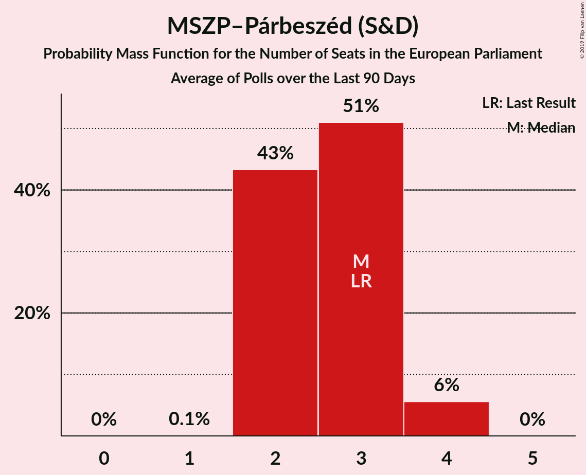

# MSZP–Párbeszéd (S&D)

<a href="#voting-intentions">Voting Intentions</a> | <a href="#seats">Seats</a>

## Voting Intentions

Last result: **18.2%** (General Election of 25 May 2014)

### Confidence Intervals

| Period     | Polling firm/Commissioner(s) | Median | 80% Confidence Interval | 90% Confidence Interval | 95% Confidence Interval | 99% Confidence Interval |
|:----------:|:----------------:|:-----------:|:-----------------------:|:-----------------------:|:-----------------------:|:-----------------------:|
| N/A | [Poll Average](average.html) | 11.9% | 9.9–14.4% | 9.4–15.0% | 9.1–15.4% | 8.4–16.3% |
| [26 November–15 December 2018](2018-12-15-NézőpontIntézet.html) | Nézőpont Intézet | 11.0% | 10.1–11.9% | 9.9–12.2% | 9.6–12.4% | 9.3–12.9% |
| [4–11 December 2018](2018-12-11-ZRIZáveczResearch.html) | ZRI Závecz Research | 13.0% | 11.7–14.5% | 11.4–14.9% | 11.1–15.2% | 10.5–16.0% |
| [30 November–5 December 2018](2018-12-05-Medián.html) | Medián | 10.0% | 9.0–11.2% | 8.7–11.5% | 8.4–11.8% | 8.0–12.4% |
| [30 November–3 December 2018](2018-12-03-IDEAIntézet.html) | IDEA Intézet | 12.0% | 11.1–13.0% | 10.9–13.3% | 10.6–13.5% | 10.2–14.0% |
| [10–27 November 2018](2018-11-27-NézőpontIntézet.html) | Nézőpont Intézet | 10.0% | N/A | N/A | N/A | N/A |
| [13–22 November 2018](2018-11-22-ZRIZáveczResearch.html) | ZRI Závecz Research | 12.1% | N/A | N/A | N/A | N/A |
| [14–21 November 2018](2018-11-21-PublicusResearch.html) | Publicus Research | 14.0% | 12.7–15.5% | 12.3–15.9% | 12.0–16.3% | 11.4–17.0% |
| [10–29 October 2018](2018-10-29-NézőpontIntézet.html) | Nézőpont Intézet | 10.0% | N/A | N/A | N/A | N/A |
| [18–22 October 2018](2018-10-22-IDEAIntézet.html) | IDEA Intézet | 9.0% | N/A | N/A | N/A | N/A |
| [12–21 October 2018](2018-10-21-ZRIZáveczResearch.html) | ZRI Závecz Research | 13.1% | 11.8–14.6% | 11.4–15.0% | 11.1–15.3% | 10.6–16.1% |
| [11–17 October 2018](2018-10-17-PublicusResearch.html) | Publicus Research | 15.2% | 13.8–16.7% | 13.4–17.2% | 13.1–17.6% | 12.5–18.3% |
| [12–17 October 2018](2018-10-17-Medián.html) | Medián | 9.0% | N/A | N/A | N/A | N/A |
| [1–30 September 2018](2018-09-30-Medián.html) | Medián | 9.0% | N/A | N/A | N/A | N/A |
| [12–19 September 2018](2018-09-19-PublicusResearch.html) | Publicus Research | 15.0% | 13.6–16.5% | 13.2–17.0% | 12.9–17.3% | 12.3–18.1% |
| [10–18 September 2018](2018-09-18-ZRIZáveczResearch.html) | ZRI Závecz Research | 11.8% | 10.6–13.2% | 10.2–13.6% | 9.9–14.0% | 9.4–14.6% |
| [29 August–18 September 2018](2018-09-18-NézőpontIntézet.html) | Nézőpont Intézet | 8.0% | N/A | N/A | N/A | N/A |
| [3–10 September 2018](2018-09-10-SzázadvégAlapítvány.html) | Századvég Alapítvány | 13.0% | N/A | N/A | N/A | N/A |
| [10–18 August 2018](2018-08-18-ZRIZáveczResearch.html) | ZRI Závecz Research | 10.0% | N/A | N/A | N/A | N/A |
| [8–16 August 2018](2018-08-16-PublicusResearch.html) | Publicus Research | 14.9% | N/A | N/A | N/A | N/A |
| [19 July–14 August 2018](2018-08-14-NézőpontIntézet.html) | Nézőpont Intézet | 9.0% | N/A | N/A | N/A | N/A |
| [10–18 July 2018](2018-07-18-ZRIZáveczResearch.html) | ZRI Závecz Research | 13.0% | 11.7–14.5% | 11.4–14.9% | 11.1–15.2% | 10.5–16.0% |
| [1–17 July 2018](2018-07-17-NézőpontIntézet.html) | Nézőpont Intézet | 9.0% | N/A | N/A | N/A | N/A |
| [10–16 July 2018](2018-07-16-PublicusResearch.html) | Publicus Research | 15.9% | N/A | N/A | N/A | N/A |
| [2–6 July 2018](2018-07-06-SzázadvégAlapítvány.html) | Századvég Alapítvány | 14.0% | 12.7–15.5% | 12.3–15.9% | 12.0–16.3% | 11.4–17.0% |
| [3–22 June 2018](2018-06-22-NézőpontIntézet.html) | Nézőpont Intézet | 9.0% | N/A | N/A | N/A | N/A |
| [7–13 June 2018](2018-06-13-PublicusResearch.html) | Publicus Research | 16.0% | N/A | N/A | N/A | N/A |
| [4–11 June 2018](2018-06-11-ZRIZáveczResearch.html) | ZRI Závecz Research | 11.0% | 9.8–12.4% | 9.5–12.8% | 9.2–13.1% | 8.7–13.8% |
| [28 May–1 June 2018](2018-06-01-Medián.html) | Medián   hvg.hu | 11.0% | N/A | N/A | N/A | N/A |
| [2–22 May 2018](2018-05-22-NézőpontIntézet.html) | Nézőpont Intézet | 9.0% | N/A | N/A | N/A | N/A |
| [6–13 May 2018](2018-05-13-ZRIZáveczResearch.html) | ZRI Závecz Research | 10.8% | N/A | N/A | N/A | N/A |
| [4–9 May 2018](2018-05-09-PublicusResearch.html) | Publicus Research | 14.7% | 13.3–16.2% | 13.0–16.6% | 12.6–17.0% | 12.0–17.8% |
| [13–30 April 2018](2018-04-30-NézőpontIntézet.html) | Nézőpont Intézet | 10.0% | 9.2–10.9% | 8.9–11.2% | 8.7–11.4% | 8.4–11.9% |
| [18–23 April 2018](2018-04-23-PublicusResearch.html) | Publicus Research   Vasárnapi Hírek | 15.5% | N/A | N/A | N/A | N/A |
| [28 March–3 April 2018](2018-04-03-PublicusResearch.html) | Publicus Research | 18.9% | 17.4–20.5% | 16.9–21.0% | 16.6–21.4% | 15.9–22.3% |
| [1–31 March 2018](2018-03-31-SzázadvégAlapítvány.html) | Századvég Alapítvány | 15.0% | N/A | N/A | N/A | N/A |
| [23–27 March 2018](2018-03-27-Medián.html) | Medián   hvg.hu | 12.0% | N/A | N/A | N/A | N/A |
| [21–24 March 2018](2018-03-24-IránytűIntézet.html) | Iránytű Intézet   Magyar Nemzet | 11.9% | 10.7–13.3% | 10.3–13.7% | 10.0–14.1% | 9.5–14.8% |
| [10–23 March 2018](2018-03-23-RepublikonIntézet.html) | Republikon Intézet   24.hu | 17.0% | N/A | N/A | N/A | N/A |
| [3–19 March 2018](2018-03-19-NézőpontIntézet.html) | Nézőpont Intézet | 10.9% | 9.7–12.3% | 9.4–12.7% | 9.1–13.0% | 8.6–13.7% |
| [7–14 March 2018](2018-03-14-ZRIZáveczResearch.html) | ZRI Závecz Research | 13.0% | N/A | N/A | N/A | N/A |
| [9–14 March 2018](2018-03-14-PublicusResearch.html) | Publicus Research | 17.9% | 16.5–19.6% | 16.0–20.0% | 15.7–20.5% | 15.0–21.2% |
| [2–7 March 2018](2018-03-07-Medián.html) | Medián   hvg.hu | 11.9% | N/A | N/A | N/A | N/A |
| [1–5 March 2018](2018-03-05-NézőpontIntézet.html) | Nézőpont Intézet | 10.0% | N/A | N/A | N/A | N/A |
| [26–28 February 2018](2018-02-28-SzázadvégAlapítvány.html) | Századvég Alapítvány | 13.9% | N/A | N/A | N/A | N/A |
| [1–28 February 2018](2018-02-28-IránytűIntézet.html) | Iránytű Intézet   Magyar Nemzet | 11.0% | 9.8–12.4% | 9.5–12.8% | 9.2–13.1% | 8.7–13.8% |
| [9–22 February 2018](2018-02-22-RepublikonIntézet.html) | Republikon Intézet   24.hu | 17.7% | N/A | N/A | N/A | N/A |
| [3–21 February 2018](2018-02-21-NézőpontIntézet.html) | Nézőpont Intézet | 10.0% | N/A | N/A | N/A | N/A |
| [7–15 February 2018](2018-02-15-ZRIZáveczResearch.html) | ZRI Závecz Research | 13.2% | N/A | N/A | N/A | N/A |
| [9–14 February 2018](2018-02-14-PublicusResearch.html) | Publicus Research | 17.9% | 16.4–19.5% | 16.0–20.0% | 15.6–20.4% | 14.9–21.2% |
| [6–13 February 2018](2018-02-13-SzázadvégAlapítvány.html) | Századvég Alapítvány | 9.9% | 8.8–11.2% | 8.5–11.6% | 8.2–11.9% | 7.7–12.6% |
| [1–31 January 2018](2018-01-31-RepublikonIntézet.html) | Republikon Intézet   24.hu | 13.0% | N/A | N/A | N/A | N/A |
| [17–24 January 2018](2018-01-24-SzázadvégAlapítvány.html) | Századvég Alapítvány | 0.0% | N/A | N/A | N/A | N/A |
| [11–23 January 2018](2018-01-23-TÁRKI.html) | TÁRKI | 0.0% | N/A | N/A | N/A | N/A |
| [19–23 January 2018](2018-01-23-Medián.html) | Medián   hvg.hu | 0.0% | N/A | N/A | N/A | N/A |
| [1–20 January 2018](2018-01-20-ZRIZáveczResearch.html) | ZRI Závecz Research | 0.0% | N/A | N/A | N/A | N/A |
| [3–18 January 2018](2018-01-18-NézőpontIntézet.html) | Nézőpont Intézet | 0.0% | N/A | N/A | N/A | N/A |
| [10–16 January 2018](2018-01-16-PublicusResearch.html) | Publicus Research | 0.0% | N/A | N/A | N/A | N/A |
| [5–9 January 2018](2018-01-09-IránytűIntézet.html) | Iránytű Intézet | 0.0% | N/A | N/A | N/A | N/A |
| [27 December 2017–2 January 2018](2018-01-02-SzázadvégAlapítvány.html) | Századvég Alapítvány | 0.0% | N/A | N/A | N/A | N/A |
| [10–20 December 2017](2017-12-20-RepublikonIntézet.html) | Republikon Intézet   24.hu | 0.0% | N/A | N/A | N/A | N/A |
| [1–18 December 2017](2017-12-18-NézőpontIntézet.html) | Nézőpont Intézet | 0.0% | N/A | N/A | N/A | N/A |
| [6–14 December 2017](2017-12-14-ZRIZáveczResearch.html) | ZRI Závecz Research | 0.0% | N/A | N/A | N/A | N/A |
| [8–13 December 2017](2017-12-13-PublicusResearch.html) | Publicus Research | 0.0% | N/A | N/A | N/A | N/A |
| [6–12 December 2017](2017-12-12-IránytűIntézet.html) | Iránytű Intézet | 0.0% | N/A | N/A | N/A | N/A |
| [18–30 November 2017](2017-11-30-RepublikonIntézet.html) | Republikon Intézet   24.hu | 0.0% | N/A | N/A | N/A | N/A |
| [1–30 November 2017](2017-11-30-Medián.html) | Medián   hvg.hu | 0.0% | N/A | N/A | N/A | N/A |
| [24–30 November 2017](2017-11-30-IránytűIntézet.html) | Iránytű Intézet | 0.0% | N/A | N/A | N/A | N/A |
| [20–28 November 2017](2017-11-28-SzázadvégAlapítvány.html) | Századvég Alapítvány | 0.0% | N/A | N/A | N/A | N/A |
| [1–19 November 2017](2017-11-19-NézőpontIntézet.html) | Nézőpont Intézet | 0.0% | N/A | N/A | N/A | N/A |
| [11–15 November 2017](2017-11-15-PublicusResearch.html) | Publicus Research | 0.0% | N/A | N/A | N/A | N/A |
| [6–14 November 2017](2017-11-14-ZRIZáveczResearch.html) | ZRI Závecz Research | 0.0% | N/A | N/A | N/A | N/A |

### Probability Mass Function

The following table shows the probability mass function per percentage block of voting intentions for the [poll average](average.html) for MSZP–Párbeszéd (S&D).

| Voting Intentions | Probability | Accumulated | Special Marks |
|:-----------------:|:-----------:|:-----------:|:-------------:|
| 6.5–7.5% | 0% | 100% |  |
| 7.5–8.5% | 0.7% | 100% |  |
| 8.5–9.5% | 5% | 99.3% |  |
| 9.5–10.5% | 14% | 94% |  |
| 10.5–11.5% | 21% | 80% |  |
| 11.5–12.5% | 21% | 58% | Median |
| 12.5–13.5% | 17% | 37% |  |
| 13.5–14.5% | 12% | 20% |  |
| 14.5–15.5% | 6% | 8% |  |
| 15.5–16.5% | 2% | 2% |  |
| 16.5–17.5% | 0.3% | 0.3% |  |
| 17.5–18.5% | 0% | 0% | Last Result |

## Seats

Last result: **3** seats (General Election of 25 May 2014)

### Confidence Intervals

| Period     | Polling firm/Commissioner(s) | Median | 80% Confidence Interval | 90% Confidence Interval | 95% Confidence Interval | 99% Confidence Interval |
|:----------:|:----------------:|:------:|:-----------------------:|:-----------------------:|:-----------------------:|:-----------------------:|
| N/A | [Poll Average](average.html) | 3 | 2–3 | 2–3 | 2–3 | 2–4 |
| [26 November–15 December 2018](2018-12-15-NézőpontIntézet.html) | Nézőpont Intézet | 2 | 2–3 | 2–3 | 2–3 | 2–3 |
| [4–11 December 2018](2018-12-11-ZRIZáveczResearch.html) | ZRI Závecz Research | 3 | 2–3 | 2–3 | 2–3 | 2–4 |
| [30 November–5 December 2018](2018-12-05-Medián.html) | Medián | 2 | 2 | 2 | 2 | 1–3 |
| [30 November–3 December 2018](2018-12-03-IDEAIntézet.html) | IDEA Intézet | 3 | 2–3 | 2–3 | 2–3 | 2–3 |
| [10–27 November 2018](2018-11-27-NézőpontIntézet.html) | Nézőpont Intézet |  |  |  |  |  |
| [13–22 November 2018](2018-11-22-ZRIZáveczResearch.html) | ZRI Závecz Research |  |  |  |  |  |
| [14–21 November 2018](2018-11-21-PublicusResearch.html) | Publicus Research | 3 | 3 | 3–4 | 3–4 | 2–4 |
| [10–29 October 2018](2018-10-29-NézőpontIntézet.html) | Nézőpont Intézet |  |  |  |  |  |
| [18–22 October 2018](2018-10-22-IDEAIntézet.html) | IDEA Intézet |  |  |  |  |  |
| [12–21 October 2018](2018-10-21-ZRIZáveczResearch.html) | ZRI Závecz Research | 3 | 2–3 | 2–3 | 2–3 | 2–4 |
| [11–17 October 2018](2018-10-17-PublicusResearch.html) | Publicus Research | 3 | 3–4 | 3–4 | 3–4 | 3–4 |
| [12–17 October 2018](2018-10-17-Medián.html) | Medián |  |  |  |  |  |
| [1–30 September 2018](2018-09-30-Medián.html) | Medián |  |  |  |  |  |
| [12–19 September 2018](2018-09-19-PublicusResearch.html) | Publicus Research | 3 | 3–4 | 3–4 | 3–4 | 3–4 |
| [10–18 September 2018](2018-09-18-ZRIZáveczResearch.html) | ZRI Závecz Research | 2 | 2–3 | 2–3 | 2–3 | 2–3 |
| [29 August–18 September 2018](2018-09-18-NézőpontIntézet.html) | Nézőpont Intézet |  |  |  |  |  |
| [3–10 September 2018](2018-09-10-SzázadvégAlapítvány.html) | Századvég Alapítvány |  |  |  |  |  |
| [10–18 August 2018](2018-08-18-ZRIZáveczResearch.html) | ZRI Závecz Research |  |  |  |  |  |
| [8–16 August 2018](2018-08-16-PublicusResearch.html) | Publicus Research |  |  |  |  |  |
| [19 July–14 August 2018](2018-08-14-NézőpontIntézet.html) | Nézőpont Intézet |  |  |  |  |  |
| [10–18 July 2018](2018-07-18-ZRIZáveczResearch.html) | ZRI Závecz Research | 3 | 2–3 | 2–3 | 2–3 | 2–3 |
| [1–17 July 2018](2018-07-17-NézőpontIntézet.html) | Nézőpont Intézet |  |  |  |  |  |
| [10–16 July 2018](2018-07-16-PublicusResearch.html) | Publicus Research |  |  |  |  |  |
| [2–6 July 2018](2018-07-06-SzázadvégAlapítvány.html) | Századvég Alapítvány | 3 | 3 | 2–3 | 2–3 | 2–4 |
| [3–22 June 2018](2018-06-22-NézőpontIntézet.html) | Nézőpont Intézet |  |  |  |  |  |
| [7–13 June 2018](2018-06-13-PublicusResearch.html) | Publicus Research |  |  |  |  |  |
| [4–11 June 2018](2018-06-11-ZRIZáveczResearch.html) | ZRI Závecz Research | 2 | 2–3 | 2–3 | 2–3 | 2–3 |
| [28 May–1 June 2018](2018-06-01-Medián.html) | Medián   hvg.hu |  |  |  |  |  |
| [2–22 May 2018](2018-05-22-NézőpontIntézet.html) | Nézőpont Intézet |  |  |  |  |  |
| [6–13 May 2018](2018-05-13-ZRIZáveczResearch.html) | ZRI Závecz Research |  |  |  |  |  |
| [4–9 May 2018](2018-05-09-PublicusResearch.html) | Publicus Research | 3 | 3–4 | 3–4 | 3–4 | 2–4 |
| [13–30 April 2018](2018-04-30-NézőpontIntézet.html) | Nézőpont Intézet | 2 | 2 | 2 | 2 | 2 |
| [18–23 April 2018](2018-04-23-PublicusResearch.html) | Publicus Research   Vasárnapi Hírek |  |  |  |  |  |
| [28 March–3 April 2018](2018-04-03-PublicusResearch.html) | Publicus Research | 4 | 4–5 | 4–5 | 4–5 | 3–5 |
| [1–31 March 2018](2018-03-31-SzázadvégAlapítvány.html) | Századvég Alapítvány |  |  |  |  |  |
| [23–27 March 2018](2018-03-27-Medián.html) | Medián   hvg.hu |  |  |  |  |  |
| [21–24 March 2018](2018-03-24-IránytűIntézet.html) | Iránytű Intézet   Magyar Nemzet | 2 | 2–3 | 2–3 | 2–3 | 2–3 |
| [10–23 March 2018](2018-03-23-RepublikonIntézet.html) | Republikon Intézet   24.hu |  |  |  |  |  |
| [3–19 March 2018](2018-03-19-NézőpontIntézet.html) | Nézőpont Intézet | 2 | 2–3 | 2–3 | 2–3 | 2–3 |
| [7–14 March 2018](2018-03-14-ZRIZáveczResearch.html) | ZRI Závecz Research |  |  |  |  |  |
| [9–14 March 2018](2018-03-14-PublicusResearch.html) | Publicus Research | 4 | 3–4 | 3–4 | 3–5 | 3–5 |
| [2–7 March 2018](2018-03-07-Medián.html) | Medián   hvg.hu |  |  |  |  |  |
| [1–5 March 2018](2018-03-05-NézőpontIntézet.html) | Nézőpont Intézet |  |  |  |  |  |
| [26–28 February 2018](2018-02-28-SzázadvégAlapítvány.html) | Századvég Alapítvány |  |  |  |  |  |
| [1–28 February 2018](2018-02-28-IránytűIntézet.html) | Iránytű Intézet   Magyar Nemzet | 2 | 2–3 | 2–3 | 2–3 | 2–3 |
| [9–22 February 2018](2018-02-22-RepublikonIntézet.html) | Republikon Intézet   24.hu |  |  |  |  |  |
| [3–21 February 2018](2018-02-21-NézőpontIntézet.html) | Nézőpont Intézet |  |  |  |  |  |
| [7–15 February 2018](2018-02-15-ZRIZáveczResearch.html) | ZRI Závecz Research |  |  |  |  |  |
| [9–14 February 2018](2018-02-14-PublicusResearch.html) | Publicus Research | 4 | 4 | 3–4 | 3–5 | 3–5 |
| [6–13 February 2018](2018-02-13-SzázadvégAlapítvány.html) | Századvég Alapítvány | 2 | 2 | 2 | 1–2 | 1–3 |
| [1–31 January 2018](2018-01-31-RepublikonIntézet.html) | Republikon Intézet   24.hu |  |  |  |  |  |
| [17–24 January 2018](2018-01-24-SzázadvégAlapítvány.html) | Századvég Alapítvány |  |  |  |  |  |
| [11–23 January 2018](2018-01-23-TÁRKI.html) | TÁRKI |  |  |  |  |  |
| [19–23 January 2018](2018-01-23-Medián.html) | Medián   hvg.hu |  |  |  |  |  |
| [1–20 January 2018](2018-01-20-ZRIZáveczResearch.html) | ZRI Závecz Research |  |  |  |  |  |
| [3–18 January 2018](2018-01-18-NézőpontIntézet.html) | Nézőpont Intézet |  |  |  |  |  |
| [10–16 January 2018](2018-01-16-PublicusResearch.html) | Publicus Research |  |  |  |  |  |
| [5–9 January 2018](2018-01-09-IránytűIntézet.html) | Iránytű Intézet |  |  |  |  |  |
| [27 December 2017–2 January 2018](2018-01-02-SzázadvégAlapítvány.html) | Századvég Alapítvány |  |  |  |  |  |
| [10–20 December 2017](2017-12-20-RepublikonIntézet.html) | Republikon Intézet   24.hu |  |  |  |  |  |
| [1–18 December 2017](2017-12-18-NézőpontIntézet.html) | Nézőpont Intézet |  |  |  |  |  |
| [6–14 December 2017](2017-12-14-ZRIZáveczResearch.html) | ZRI Závecz Research |  |  |  |  |  |
| [8–13 December 2017](2017-12-13-PublicusResearch.html) | Publicus Research |  |  |  |  |  |
| [6–12 December 2017](2017-12-12-IránytűIntézet.html) | Iránytű Intézet |  |  |  |  |  |
| [18–30 November 2017](2017-11-30-RepublikonIntézet.html) | Republikon Intézet   24.hu |  |  |  |  |  |
| [1–30 November 2017](2017-11-30-Medián.html) | Medián   hvg.hu |  |  |  |  |  |
| [24–30 November 2017](2017-11-30-IránytűIntézet.html) | Iránytű Intézet |  |  |  |  |  |
| [20–28 November 2017](2017-11-28-SzázadvégAlapítvány.html) | Századvég Alapítvány |  |  |  |  |  |
| [1–19 November 2017](2017-11-19-NézőpontIntézet.html) | Nézőpont Intézet |  |  |  |  |  |
| [11–15 November 2017](2017-11-15-PublicusResearch.html) | Publicus Research |  |  |  |  |  |
| [6–14 November 2017](2017-11-14-ZRIZáveczResearch.html) | ZRI Závecz Research |  |  |  |  |  |

### Probability Mass Function

The following table shows the probability mass function per seat for the [poll average](average.html) for MSZP–Párbeszéd (S&D).

| Number of Seats | Probability | Accumulated | Special Marks |
|:---------------:|:-----------:|:-----------:|:-------------:|
| 1 | 0.1% | 100% |  |
| 2 | 47% | 99.9% |  |
| 3 | 50% | 53% | Last Result, Median |
| 4 | 2% | 2% |  |
| 5 | 0% | 0% |  |

