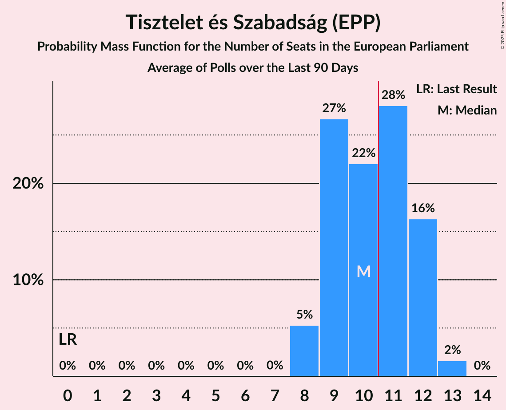

# Tisztelet és Szabadság (EPP)

<a href="#voting-intentions">Voting Intentions</a> | <a href="#seats">Seats</a>

## Voting Intentions

Last result: **0.0%** (General Election of 9 June 2024)

### Confidence Intervals

| Period     | Polling firm/Commissioner(s) | Median | 80% Confidence Interval | 90% Confidence Interval | 95% Confidence Interval | 99% Confidence Interval |
|:----------:|:----------------:|:-----------:|:-----------------------:|:-----------------------:|:-----------------------:|:-----------------------:|
| N/A | [Poll Average](average.html) | 31.1% | 29.2–33.0% | 28.6–33.5% | 28.2–34.0% | 27.3–34.8% |
| [4–10 July 2024](2024-07-10-Medián.html) | Medián | 30.7% | 28.9–32.6% | 28.3–33.2% | 27.9–33.6% | 27.1–34.6% |
| [3–8 July 2024](2024-07-08-RepublikonIntézet.html) | Republikon Intézet | 30.7% | 28.9–32.6% | 28.3–33.2% | 27.9–33.6% | 27.1–34.6% |
| [19–27 June 2024](2024-06-27-IDEAIntézet.html) | IDEA Intézet | 31.9% | 30.3–33.4% | 29.9–33.9% | 29.6–34.3% | 28.8–35.0% |

### Probability Mass Function

The following table shows the probability mass function per percentage block of voting intentions for the [poll average](average.html) for Tisztelet és Szabadság (EPP).

| Voting Intentions | Probability | Accumulated | Special Marks |
|:-----------------:|:-----------:|:-----------:|:-------------:|
| 0.0–0.5% | 0% | 100% | Last Result |
| 0.5–1.5% | 0% | 100% |  |
| 1.5–2.5% | 0% | 100% |  |
| 2.5–3.5% | 0% | 100% |  |
| 3.5–4.5% | 0% | 100% |  |
| 4.5–5.5% | 0% | 100% |  |
| 5.5–6.5% | 0% | 100% |  |
| 6.5–7.5% | 0% | 100% |  |
| 7.5–8.5% | 0% | 100% |  |
| 8.5–9.5% | 0% | 100% |  |
| 9.5–10.5% | 0% | 100% |  |
| 10.5–11.5% | 0% | 100% |  |
| 11.5–12.5% | 0% | 100% |  |
| 12.5–13.5% | 0% | 100% |  |
| 13.5–14.5% | 0% | 100% |  |
| 14.5–15.5% | 0% | 100% |  |
| 15.5–16.5% | 0% | 100% |  |
| 16.5–17.5% | 0% | 100% |  |
| 17.5–18.5% | 0% | 100% |  |
| 18.5–19.5% | 0% | 100% |  |
| 19.5–20.5% | 0% | 100% |  |
| 20.5–21.5% | 0% | 100% |  |
| 21.5–22.5% | 0% | 100% |  |
| 22.5–23.5% | 0% | 100% |  |
| 23.5–24.5% | 0% | 100% |  |
| 24.5–25.5% | 0% | 100% |  |
| 25.5–26.5% | 0.1% | 100% |  |
| 26.5–27.5% | 0.8% | 99.9% |  |
| 27.5–28.5% | 4% | 99.1% |  |
| 28.5–29.5% | 10% | 96% |  |
| 29.5–30.5% | 20% | 85% |  |
| 30.5–31.5% | 26% | 66% | Median |
| 31.5–32.5% | 23% | 39% |  |
| 32.5–33.5% | 12% | 17% |  |
| 33.5–34.5% | 4% | 5% |  |
| 34.5–35.5% | 0.7% | 0.8% |  |
| 35.5–36.5% | 0.1% | 0.1% |  |
| 36.5–37.5% | 0% | 0% |  |

## Seats

Last result: **0** seats (General Election of 9 June 2024)

### Confidence Intervals

| Period     | Polling firm/Commissioner(s) | Median | 80% Confidence Interval | 90% Confidence Interval | 95% Confidence Interval | 99% Confidence Interval |
|:----------:|:----------------:|:------:|:-----------------------:|:-----------------------:|:-----------------------:|:-----------------------:|
| N/A | [Poll Average](average.html) | 8 | 7–9 | 7–9 | 7–9 | 7–9 |
| [4–10 July 2024](2024-07-10-Medián.html) | Medián | 8 | 7–8 | 7–8 | 7–8 | 7–9 |
| [3–8 July 2024](2024-07-08-RepublikonIntézet.html) | Republikon Intézet | 9 | 8–9 | 8–9 | 7–9 | 7–9 |
| [19–27 June 2024](2024-06-27-IDEAIntézet.html) | IDEA Intézet | 7 | 7–8 | 7–8 | 7–8 | 7–9 |

### Probability Mass Function

The following table shows the probability mass function per seat for the [poll average](average.html) for Tisztelet és Szabadság (EPP).

| Number of Seats | Probability | Accumulated | Special Marks |
|:---------------:|:-----------:|:-----------:|:-------------:|
| 0 | 0% | 100% | Last Result |
| 1 | 0% | 100% |  |
| 2 | 0% | 100% |  |
| 3 | 0% | 100% |  |
| 4 | 0% | 100% |  |
| 5 | 0% | 100% |  |
| 6 | 0.2% | 100% |  |
| 7 | 29% | 99.8% |  |
| 8 | 45% | 71% | Median |
| 9 | 26% | 26% |  |
| 10 | 0% | 0% |  |

